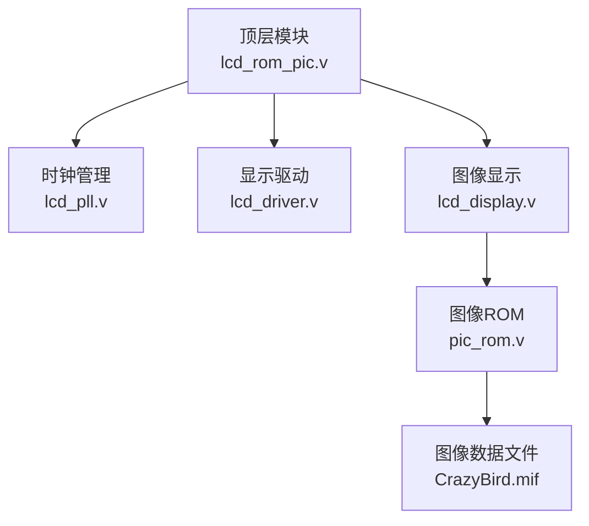
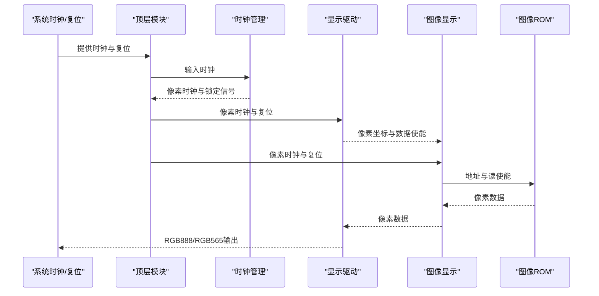
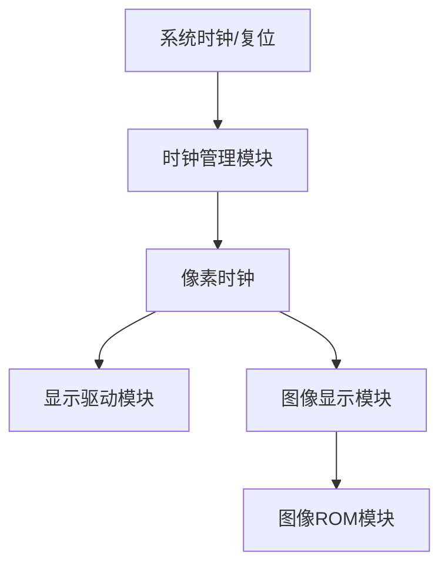
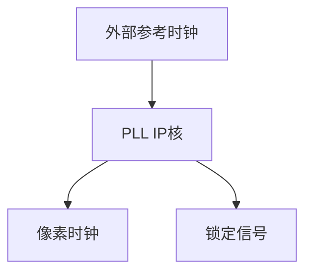
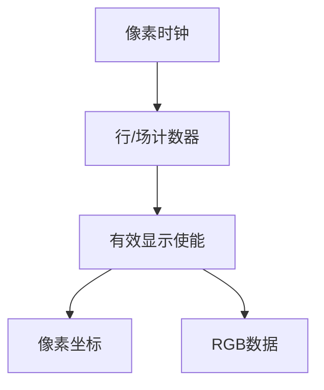
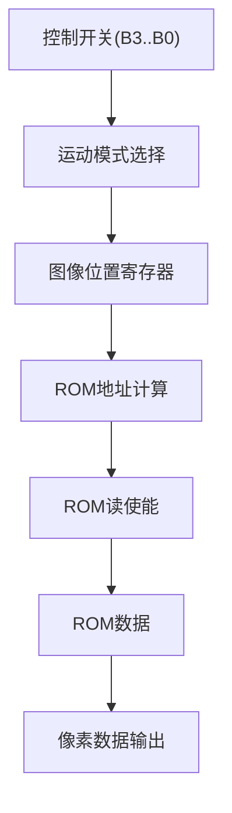
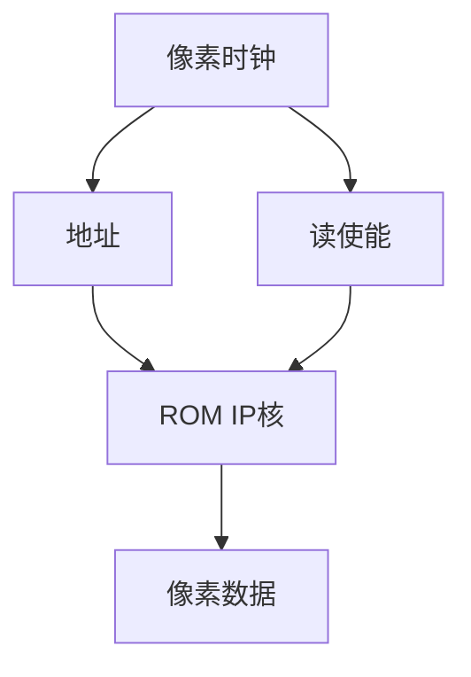
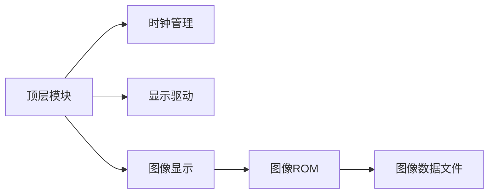

# 仿真验证

<cite>
**本文引用的文件**   
- [lcd_rom_pic.v](file://lcd_rom_pic.v)
- [lcd_display.v](file://lcd_display.v)
- [lcd_driver.v](file://lcd_driver.v)
- [pic_rom.v](file://pic_rom.v)
- [lcd_pll.v](file://lcd_pll.v)
- [lcd_pll_bb.v](file://lcd_pll_bb.v)
- [pic_rom_bb.v](file://pic_rom_bb.v)
- [CrazyBird.mif](file://CrazyBird.mif)
- [miqi.mif](file://miqi.mif)
- [miqi1.mif](file://miqi1.mif)
- [picture1.mif](file://picture1.mif)
- [lcd_display.txt](file://lcd_display.txt)
- [lcd_driver.txt](file://lcd_driver.txt)
- [lcd_rom_pic.txt](file://lcd_rom_pic.txt)
</cite>

## 目录
1. [引言](#引言)
2. [项目结构](#项目结构)
3. [核心组件](#核心组件)
4. [架构总览](#架构总览)
5. [详细组件分析](#详细组件分析)
6. [依赖分析](#依赖分析)
7. [性能考虑](#性能考虑)
8. [故障排查指南](#故障排查指南)
9. [结论](#结论)
10. [附录](#附录)

## 引言
本指南面向使用 ModelSim-Altera 对 LCD ROM PIC 项目进行功能仿真与时序仿真的工程师与学生。内容涵盖仿真环境配置、测试向量设计原则、仿真波形分析技巧；区分功能仿真与门级仿真；给出可执行的测试计划与验证策略（含边界条件与异常处理）；并总结仿真结果解读与问题定位方法。

## 项目结构
该项目采用自顶向下的模块化设计，顶层模块将时钟管理、显示驱动与图像数据读取串联起来，形成完整的 LCD 显示流水线。关键模块包括：
- 顶层模块：负责系统时钟、复位与各子模块互联
- 时钟管理模块：提供稳定的像素时钟
- 显示驱动模块：生成行/场同步、数据使能与像素坐标
- 图像显示模块：根据控制输入选择运动模式，从 ROM 读取像素数据并在屏幕上绘制
- ROM 模块：提供图像数据（MIF 文件）

图表来源
- [lcd_rom_pic.v:1-59](file://lcd_rom_pic.v#L1-L59)
- [lcd_pll.v:1-321](file://lcd_pll.v#L1-L321)
- [lcd_driver.v:1-97](file://lcd_driver.v#L1-L97)
- [lcd_display.v:1-199](file://lcd_display.v#L1-L199)
- [pic_rom.v:1-165](file://pic_rom.v#L1-L165)
- [CrazyBird.mif:1-800](file://CrazyBird.mif#L1-L800)

章节来源
- [lcd_rom_pic.v:1-59](file://lcd_rom_pic.v#L1-L59)
- [lcd_display.v:1-199](file://lcd_display.v#L1-L199)
- [lcd_driver.v:1-97](file://lcd_driver.v#L1-L97)
- [pic_rom.v:1-165](file://pic_rom.v#L1-L165)
- [CrazyBird.mif:1-800](file://CrazyBird.mif#L1-L800)

## 核心组件
- 顶层模块
  - 输入：系统时钟、系统复位、外部控制开关
  - 输出：LCD 控制信号、像素时钟、背光、复位等
  - 内部：时钟分频、复位同步、模块间信号传递
- 时钟管理模块
  - 将外部参考时钟转换为 LCD 像素时钟，提供锁定信号
- 显示驱动模块
  - 生成行/场同步、数据使能与像素坐标
  - 输出 RGB888 或 RGB565（取决于具体实例）
- 图像显示模块
  - 根据控制开关选择不同运动模式
  - 计算图像在屏幕上的位置，从 ROM 读取像素数据
- ROM 模块
  - 通过 MIF 文件初始化图像数据

章节来源
- [lcd_rom_pic.v:1-59](file://lcd_rom_pic.v#L1-L59)
- [lcd_pll.v:1-321](file://lcd_pll.v#L1-L321)
- [lcd_driver.v:1-97](file://lcd_driver.v#L1-L97)
- [lcd_display.v:1-199](file://lcd_display.v#L1-L199)
- [pic_rom.v:1-165](file://pic_rom.v#L1-L165)

## 架构总览
系统工作流程如下：
- 顶层模块接收系统时钟与复位，经由时钟管理模块生成像素时钟
- 显示驱动模块基于像素时钟生成行/场同步与数据使能，并输出像素坐标
- 图像显示模块根据控制输入决定图像运动方式，计算图像在屏幕上的起始位置
- 图像显示模块在像素坐标落入图像区域内时，从 ROM 读取对应像素数据并输出到 LCD 驱动模块
- LCD 驱动模块将像素数据与坐标组合，生成最终的 RGB888/RGB565 输出

图表来源
- [lcd_rom_pic.v:1-59](file://lcd_rom_pic.v#L1-L59)
- [lcd_pll.v:1-321](file://lcd_pll.v#L1-L321)
- [lcd_driver.v:1-97](file://lcd_driver.v#L1-L97)
- [lcd_display.v:1-199](file://lcd_display.v#L1-L199)
- [pic_rom.v:1-165](file://pic_rom.v#L1-L165)

## 详细组件分析

### 顶层模块（lcd_rom_pic.v）
- 负责系统时钟与复位的接入，以及各子模块的例化与互联
- 使用时钟管理模块提供的锁定信号作为内部复位的使能条件，确保在时钟稳定后再释放复位
- 将像素时钟传递给显示驱动与图像显示模块

图表来源
- [lcd_rom_pic.v:1-59](file://lcd_rom_pic.v#L1-L59)

章节来源
- [lcd_rom_pic.v:1-59](file://lcd_rom_pic.v#L1-L59)

### 时钟管理模块（lcd_pll.v）
- 将外部参考时钟转换为 LCD 像素时钟，并输出锁定信号
- 锁定信号用于同步复位释放，保证后续模块在稳定时钟下工作
- 模块为 IP 核例化，参数在文件中定义

图表来源
- [lcd_pll.v:1-321](file://lcd_pll.v#L1-L321)

章节来源
- [lcd_pll.v:1-321](file://lcd_pll.v#L1-L321)
- [lcd_pll_bb.v:1-211](file://lcd_pll_bb.v#L1-L211)

### 显示驱动模块（lcd_driver.v）
- 基于像素时钟生成行/场同步、数据使能与像素坐标
- 参数定义了行/场的时序参数，确保与目标 LCD 的时序匹配
- 输出 RGB888 或 RGB565（取决于具体实例）

图表来源
- [lcd_driver.v:1-97](file://lcd_driver.v#L1-L97)

章节来源
- [lcd_driver.v:1-97](file://lcd_driver.v#L1-L97)
- [lcd_driver.txt:1-97](file://lcd_driver.txt#L1-L97)

### 图像显示模块（lcd_display.v）
- 根据控制开关选择不同的运动模式（如左上45度移动、右移反弹、向下移动130像素往返、静态显示）
- 通过计数器与比较逻辑实现移动节拍（约60 px/s）
- 计算图像在屏幕上的位置，并在像素坐标落入图像区域内时从 ROM 读取像素数据
- 当图像位置变化时重置 ROM 地址，确保正确读取新位置的数据

图表来源
- [lcd_display.v:1-199](file://lcd_display.v#L1-L199)

章节来源
- [lcd_display.v:1-199](file://lcd_display.v#L1-L199)
- [lcd_display.txt:1-45](file://lcd_display.txt#L1-L45)

### 图像ROM模块（pic_rom.v）
- 例化 ROM IP 核，从 MIF 文件加载图像数据
- 通过地址与读使能信号从 ROM 中读取像素数据
- 支持 RGB888 与 RGB565（取决于具体实例）

图表来源
- [pic_rom.v:1-165](file://pic_rom.v#L1-L165)
- [CrazyBird.mif:1-800](file://CrazyBird.mif#L1-L800)

章节来源
- [pic_rom.v:1-165](file://pic_rom.v#L1-L165)
- [pic_rom_bb.v:1-116](file://pic_rom_bb.v#L1-L116)
- [CrazyBird.mif:1-800](file://CrazyBird.mif#L1-L800)

## 依赖分析
- 顶层模块依赖时钟管理、显示驱动与图像显示模块
- 图像显示模块依赖 ROM 模块与其数据文件
- 显示驱动模块依赖像素时钟与复位信号
- 时钟管理模块依赖外部参考时钟与锁定信号

图表来源
- [lcd_rom_pic.v:1-59](file://lcd_rom_pic.v#L1-L59)
- [lcd_display.v:1-199](file://lcd_display.v#L1-L199)
- [pic_rom.v:1-165](file://pic_rom.v#L1-L165)
- [CrazyBird.mif:1-800](file://CrazyBird.mif#L1-L800)

章节来源
- [lcd_rom_pic.v:1-59](file://lcd_rom_pic.v#L1-L59)
- [lcd_display.v:1-199](file://lcd_display.v#L1-L199)
- [pic_rom.v:1-165](file://pic_rom.v#L1-L165)
- [CrazyBird.mif:1-800](file://CrazyBird.mif#L1-L800)

## 性能考虑
- 时钟稳定性：在锁定信号有效之前不应释放复位，避免亚稳态导致的显示异常
- 时序裕量：显示驱动模块对像素时钟的敏感性较高，需确保时钟抖动与偏斜满足要求
- 数据路径延迟：ROM 读取存在单周期延迟，需在坐标有效前至少一个周期发出读使能
- 帧率控制：运动节拍通过计数器实现，需确保时钟频率与计数上限匹配以达到期望帧率

## 故障排查指南
- 无画面或花屏
  - 检查时钟管理模块的锁定信号是否稳定
  - 确认显示驱动模块的行/场参数与目标 LCD 匹配
  - 核对像素时钟频率与分辨率参数
- 图像不显示或显示位置错误
  - 检查图像显示模块的控制开关设置与运动模式
  - 确认图像位置寄存器与地址计算逻辑
  - 验证 ROM 地址重置逻辑在图像位置变化时生效
- 数据读取异常
  - 检查 ROM 读使能信号与像素坐标的有效范围
  - 确认 MIF 文件深度与宽度与 ROM IP 核配置一致
- 仿真波形分析要点
  - 观察像素时钟与行/场同步的相位关系
  - 检查数据使能与像素数据的时序关系
  - 关注坐标输出与数据有效窗口的匹配

章节来源
- [lcd_pll.v:1-321](file://lcd_pll.v#L1-L321)
- [lcd_driver.v:1-97](file://lcd_driver.v#L1-L97)
- [lcd_display.v:1-199](file://lcd_display.v#L1-L199)
- [pic_rom.v:1-165](file://pic_rom.v#L1-L165)
- [CrazyBird.mif:1-800](file://CrazyBird.mif#L1-L800)

## 结论
通过合理的仿真环境配置与严格的测试计划，可以高效验证 LCD ROM PIC 项目的功能与时序行为。建议优先进行功能仿真以验证控制逻辑与数据路径，再进行门级仿真以评估实际器件中的时序收敛情况。结合边界条件与异常处理测试，能够显著提升系统的鲁棒性与可靠性。

## 附录

### 仿真环境配置（ModelSim-Altera）
- 创建工程并添加源文件
  - 添加顶层模块与子模块文件
  - 添加 ROM 数据文件（CrazyBird.mif、miqi.mif、miqi1.mif、picture1.mif）
- 设置仿真库
  - 引入 altera_mf 库以支持 ROM 与 PLL IP 核
- 编译与仿真
  - 编译所有模块与测试平台
  - 运行仿真并观察关键信号波形

### 测试向量设计原则
- 时钟与复位
  - 提供稳定的系统时钟与复位序列，确保锁定信号稳定后再释放复位
- 控制输入
  - 覆盖所有控制开关组合，验证各运动模式的行为
- 边界条件
  - 测试图像移动到屏幕边缘与角落的情况
  - 验证图像位置变化时 ROM 地址重置逻辑
- 异常处理
  - 断电/上电时序异常
  - 时钟不稳定或锁定信号波动

### 仿真波形分析技巧
- 关注像素时钟与行/场同步的相位关系，确保在数据使能期间像素数据有效
- 检查坐标输出与数据有效窗口的匹配，避免数据提前或滞后
- 观察图像位置寄存器的变化轨迹，确认运动模式按预期切换

### 功能仿真与门级仿真的区别与使用场景
- 功能仿真
  - 使用 RTL 模型，验证算法与控制逻辑正确性
  - 适合早期开发阶段的功能验证与调试
- 门级仿真
  - 使用综合后的网表模型，包含工艺相关的延迟
  - 适合时序收敛验证与后仿真

### 仿真测试计划与验证策略
- 单元测试
  - 时钟管理模块：验证锁定信号与输出时钟频率
  - 显示驱动模块：验证行/场参数与时序关系
  - 图像显示模块：验证运动模式与地址计算
- 集成测试
  - 顶层模块：验证模块间互联与信号传递
  - ROM 数据：验证数据完整性与访问时序
- 边界条件测试
  - 图像移动至屏幕边缘与角落
  - 图像位置快速变化时的地址重置
- 异常情况处理
  - 时钟不稳定或锁定信号波动
  - 复位异常与上电时序异常