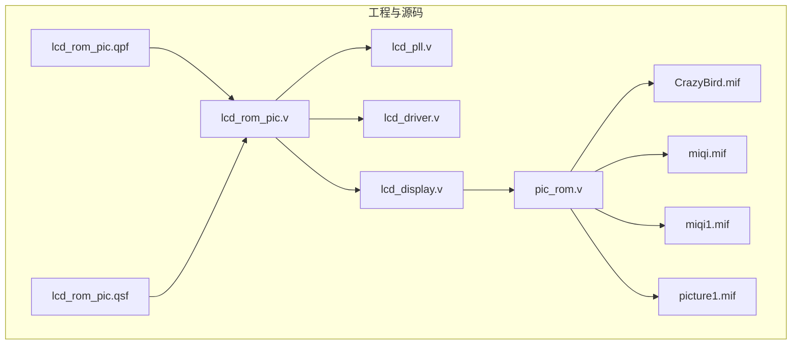
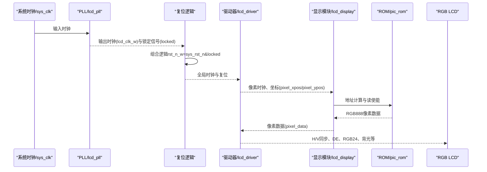
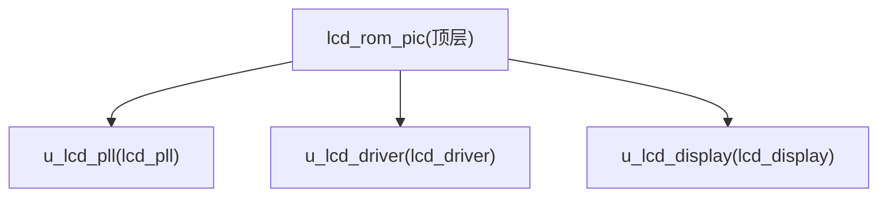
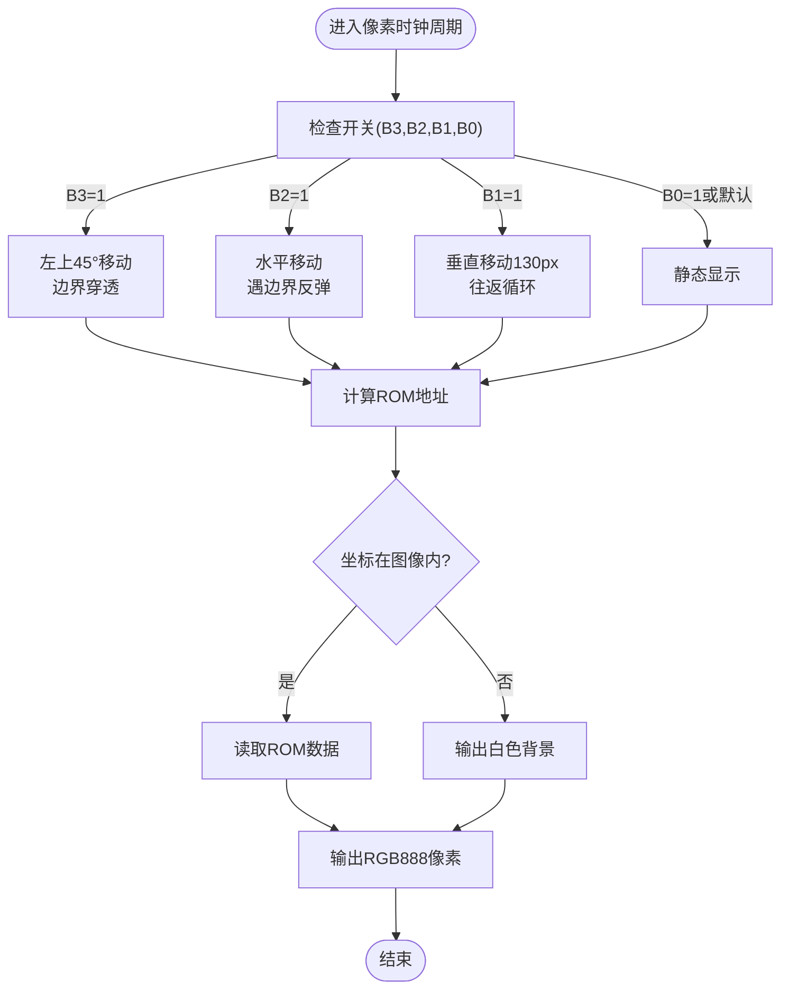
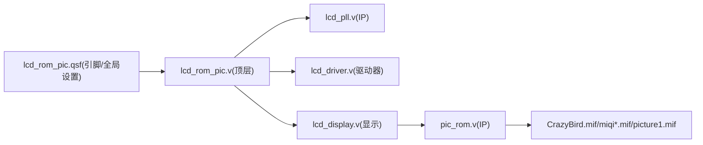

# 快速开始

<cite>
**本文引用的文件**
- [lcd_rom_pic.qpf](file://lcd_rom_pic.qpf)
- [lcd_rom_pic.qsf](file://lcd_rom_pic.qsf)
- [lcd_rom_pic.v](file://lcd_rom_pic.v)
- [lcd_driver.v](file://lcd_driver.v)
- [lcd_display.v](file://lcd_display.v)
- [lcd_pll.v](file://lcd_pll.v)
- [pic_rom.v](file://pic_rom.v)
- [CLAUDE.md](file://CLAUDE.md)
- [.gitignore](file://.gitignore)
- [CrazyBird.mif](file://CrazyBird.mif)
- [miqi.mif](file://miqi.mif)
- [miqi1.mif](file://miqi1.mif)
- [picture1.mif](file://picture1.mif)
</cite>

## 目录
1. [简介](#简介)
2. [项目结构](#项目结构)
3. [核心组件](#核心组件)
4. [架构总览](#架构总览)
5. [详细组件分析](#详细组件分析)
6. [依赖分析](#依赖分析)
7. [性能考虑](#性能考虑)
8. [故障排查指南](#故障排查指南)
9. [结论](#结论)
10. [附录](#附录)

## 简介
本指南面向初次接触本项目的开发者，目标是在Intel Quartus Prime开发环境中快速完成项目搭建、编译与首次下载到FPGA，实现800×480 RGB LCD上的图像显示与运动模式切换。文档覆盖以下内容：
- 开发工具安装与基础配置
- 项目导入与工程设置
- 引脚分配与约束
- 编译流程与生成编程文件
- 首次下载到硬件的操作步骤
- 常见问题与调试技巧

## 项目结构
该项目为基于Cyclone IV E系列器件的RGB LCD显示系统，顶层模块负责时钟管理、驱动时序生成与图像数据读取，包含以下关键文件：
- 工程文件：lcd_rom_pic.qpf（工程定义）、lcd_rom_pic.qsf（引脚与全局设置）
- 源码模块：lcd_rom_pic.v（顶层）、lcd_pll.v（PLL IP）、lcd_driver.v（时序与坐标生成）、lcd_display.v（图像与运动控制）、pic_rom.v（ROM IP）
- 数据文件：CrazyBird.mif（默认图像数据）、miqi.mif、miqi1.mif、picture1.mif（可选图像数据）
- 文档与忽略项：CLAUDE.md（项目说明）、.gitignore（构建产物忽略）

图表来源
- [lcd_rom_pic.qpf](file://lcd_rom_pic.qpf)
- [lcd_rom_pic.qsf](file://lcd_rom_pic.qsf)
- [lcd_rom_pic.v](file://lcd_rom_pic.v)
- [lcd_pll.v](file://lcd_pll.v)
- [lcd_driver.v](file://lcd_driver.v)
- [lcd_display.v](file://lcd_display.v)
- [pic_rom.v](file://pic_rom.v)
- [CrazyBird.mif](file://CrazyBird.mif)
- [miqi.mif](file://miqi.mif)
- [miqi1.mif](file://miqi1.mif)
- [picture1.mif](file://picture1.mif)

章节来源
- [lcd_rom_pic.qpf](file://lcd_rom_pic.qpf)
- [lcd_rom_pic.qsf](file://lcd_rom_pic.qsf)
- [CLAUDE.md](file://CLAUDE.md)

## 核心组件
- 顶层模块：负责系统时钟输入、复位、开关输入与LCD接口输出；内部例化PLL、驱动器与显示模块。
- 时钟管理：使用ALTPLL IP将外部时钟转换为约33.3 MHz的像素时钟，并在PLL锁定后释放全局复位。
- LCD驱动器：生成H/V同步、数据使能与像素坐标流，将像素数据在有效期内输出至RGB总线。
- 显示模块：根据开关状态选择运动模式，计算图像在屏幕中的位置，从ROM中读取RGB888像素数据并输出。
- ROM IP：1-Port ROM（altsyncram），初始化自MIF文件，按地址输出24位RGB像素。

章节来源
- [lcd_rom_pic.v](file://lcd_rom_pic.v)
- [lcd_pll.v](file://lcd_pll.v)
- [lcd_driver.v](file://lcd_driver.v)
- [lcd_display.v](file://lcd_display.v)
- [pic_rom.v](file://pic_rom.v)

## 架构总览
系统自外部时钟经PLL分频得到像素时钟，驱动LCD时序与坐标生成；显示模块根据开关输入选择运动模式，计算图像位置并在有效区域内从ROM读取像素数据，最终由驱动器在数据有效期间将像素数据送至RGB总线。

图表来源
- [lcd_rom_pic.v](file://lcd_rom_pic.v)
- [lcd_pll.v](file://lcd_pll.v)
- [lcd_driver.v](file://lcd_driver.v)
- [lcd_display.v](file://lcd_display.v)
- [pic_rom.v](file://pic_rom.v)

## 详细组件分析

### 顶层模块与模块层次
- 顶层模块将外部系统时钟与复位输入传递给PLL与显示模块；同时接收开关输入以控制运动模式。
- 顶层例化并连接PLL、驱动器与显示模块，形成完整的显示流水线。

图表来源
- [lcd_rom_pic.v](file://lcd_rom_pic.v)

章节来源
- [lcd_rom_pic.v](file://lcd_rom_pic.v)

### 时钟与复位（PLL与rst_n_w）
- 使用ALTPLL IP将外部时钟转换为约33.3 MHz像素时钟；仅在PLL锁定后释放全局复位，避免未稳定时序导致的异常。
- 顶层组合逻辑将外部复位与PLL锁定信号相与，生成稳定的rst_n_w供下游模块使用。

章节来源
- [lcd_pll.v](file://lcd_pll.v)
- [lcd_rom_pic.v](file://lcd_rom_pic.v)

### LCD驱动器（时序与坐标）
- 生成H/V同步、数据使能与像素坐标流；在有效区域内将像素数据直接输出至RGB总线。
- 参数定义了800×480分辨率的时序（行/场同步、前沿/后沿、显示窗口与总周期）。

章节来源
- [lcd_driver.v](file://lcd_driver.v)

### 显示模块（运动控制与ROM读取）
- 根据B3/B2/B1/B0开关选择运动模式（优先级：B3>B2>B1>B0），默认静态。
- 以约60 Hz步进（约555,000个像素时钟周期）驱动图像移动；支持左上45°穿透、水平反弹、垂直往返与静态显示。
- 在图像区域内计算ROM地址，从ROM读取RGB888像素数据；不在区域内时输出白色背景。

图表来源
- [lcd_display.v](file://lcd_display.v)

章节来源
- [lcd_display.v](file://lcd_display.v)

### ROM IP与图像数据
- ROM为1-Port（单端口）存储器，地址15位，数据24位（RGB888）。
- 默认初始化文件为CrazyBird.mif；亦可替换为miqi.mif、miqi1.mif或picture1.mif（需在ROM IP参数中更新初始化文件名）。

章节来源
- [pic_rom.v](file://pic_rom.v)
- [CrazyBird.mif](file://CrazyBird.mif)
- [miqi.mif](file://miqi.mif)
- [miqi1.mif](file://miqi1.mif)
- [picture1.mif](file://picture1.mif)

## 依赖分析
- 顶层模块依赖PLL、驱动器与显示模块；显示模块进一步依赖ROM IP与MIF数据文件。
- 引脚分配在QSF中集中定义，顶层实体名称在QSF中声明，工程输出目录与仿真工具也在QSF中配置。

图表来源
- [lcd_rom_pic.qsf](file://lcd_rom_pic.qsf)
- [lcd_rom_pic.v](file://lcd_rom_pic.v)
- [lcd_pll.v](file://lcd_pll.v)
- [lcd_driver.v](file://lcd_driver.v)
- [lcd_display.v](file://lcd_display.v)
- [pic_rom.v](file://pic_rom.v)
- [CrazyBird.mif](file://CrazyBird.mif)

章节来源
- [lcd_rom_pic.qsf](file://lcd_rom_pic.qsf)
- [lcd_rom_pic.v](file://lcd_rom_pic.v)

## 性能考虑
- 像素时钟频率约为33.3 MHz，分辨率为800×480，有效像素总数为384,000像素/场。
- 运动控制采用固定步进频率（约60 Hz），步进间隔约555,000像素时钟周期，保证视觉平滑。
- ROM读取存在1周期延迟，显示模块通过rom_valid与in_image_area配合，确保在有效区域内正确输出像素数据。

章节来源
- [lcd_driver.v](file://lcd_driver.v)
- [lcd_display.v](file://lcd_display.v)

## 故障排查指南
- 工具版本与兼容性
  - 工程最初在Quartus II 13.1创建，后续在Quartus Prime 18.1打开；建议使用18.1或更高版本以获得最佳兼容性。
- 编译失败或PLL未锁定
  - 确认外部时钟源与PLL参数匹配；检查QSF中的引脚分配与设备型号一致。
- 无图像或全白屏
  - 检查B0–B3开关输入是否正确；确认ROM初始化文件路径与内容；验证显示模块的图像位置参数与分辨率匹配。
- 画面撕裂或闪烁
  - 确保rst_n_w在PLL锁定后再释放；检查驱动器的DE与同步信号时序。
- 引脚冲突或未分配
  - 在QSF中核对所有LCD接口引脚与开关引脚均已分配；注意RGB总线跨Bank的情况。
- 构建产物清理
  - 使用.gitignore中列出的目录与文件类型进行清理，避免残留影响后续编译。

章节来源
- [CLAUDE.md](file://CLAUDE.md)
- [.gitignore](file://.gitignore)
- [lcd_pll.v](file://lcd_pll.v)
- [lcd_driver.v](file://lcd_driver.v)
- [lcd_display.v](file://lcd_display.v)

## 结论
通过本指南，您可以在Intel Quartus Prime中完成项目的导入、引脚分配、编译与下载，并在硬件上看到800×480 RGB LCD上的图像显示与多种运动模式。遇到问题时，可依据故障排查指南逐项定位并解决。

## 附录

### 安装与准备
- 安装Intel Quartus Prime（建议18.1或更高版本），并确保已安装目标器件的设备库。
- 准备目标开发板与RGB LCD接口，确认电源与背光供电正常。

### 导入项目
- 打开Quartus并选择“File → Open Project”，定位到工程文件lcd_rom_pic.qpf。
- 若提示升级，请接受升级建议以适配当前Quartus版本。

章节来源
- [CLAUDE.md](file://CLAUDE.md)
- [lcd_rom_pic.qpf](file://lcd_rom_pic.qpf)

### 引脚分配与约束
- 在QSF中完成所有LCD接口引脚与开关引脚的分配；顶层实体名称已在QSF中声明。
- 确认设备型号与工程一致，避免引脚与器件不匹配。

章节来源
- [lcd_rom_pic.qsf](file://lcd_rom_pic.qsf)

### 编译流程
- 建议使用命令行方式执行完整流程，便于自动化与重现：
  - 合成：quartus_map lcd_rom_pic
  - 布局布线：quartus_fit lcd_rom_pic
  - 生成编程文件：quartus_asm lcd_rom_pic
- 或使用图形界面的“Tools → Run Quartus Shell”执行quartus_sh --flow compile lcd_rom_pic。

章节来源
- [CLAUDE.md](file://CLAUDE.md)

### 首次下载到FPGA
- 在完成编译与编程文件生成后，使用Programmer工具加载.sof文件至目标器件。
- 确认下载线连接正确、目标器件供电正常，下载完成后观察LCD是否显示图像并可切换运动模式。

章节来源
- [CLAUDE.md](file://CLAUDE.md)

### 切换显示图像
- 默认ROM初始化文件为CrazyBird.mif；如需更换图像，请在ROM IP参数中将初始化文件名修改为miqi.mif、miqi1.mif或picture1.mif之一。
- 修改后重新编译并下载。

章节来源
- [pic_rom.v](file://pic_rom.v)
- [CrazyBird.mif](file://CrazyBird.mif)
- [miqi.mif](file://miqi.mif)
- [miqi1.mif](file://miqi1.mif)
- [picture1.mif](file://picture1.mif)