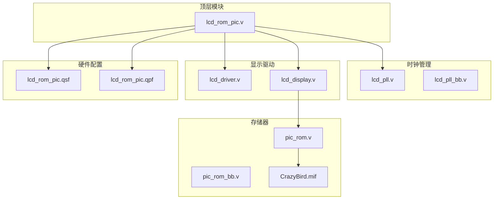
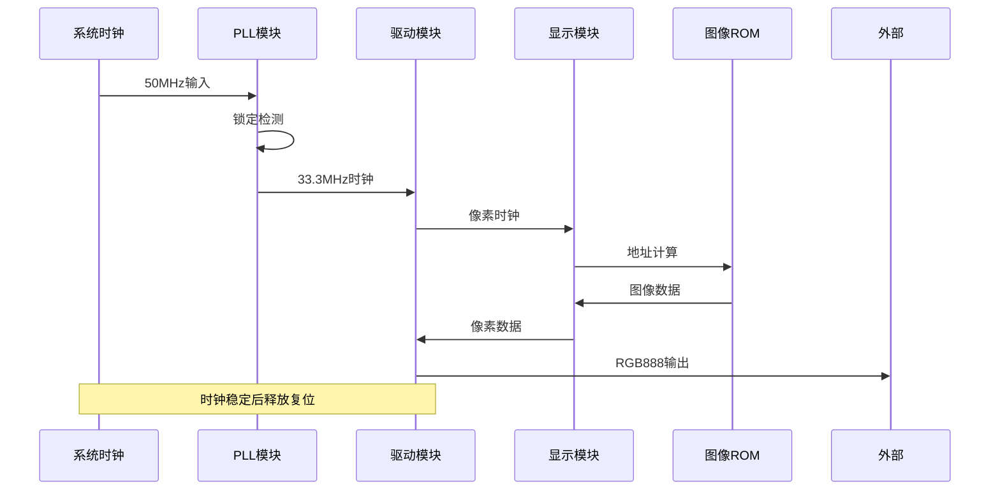
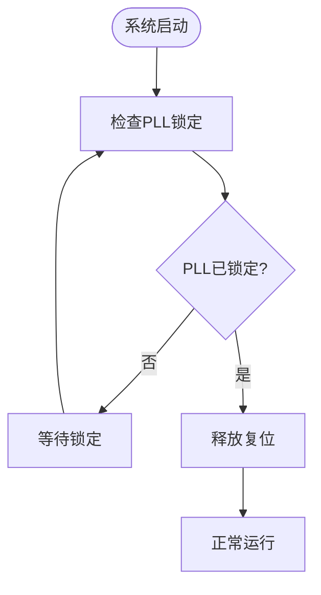
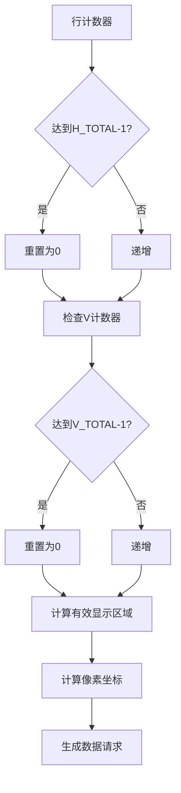
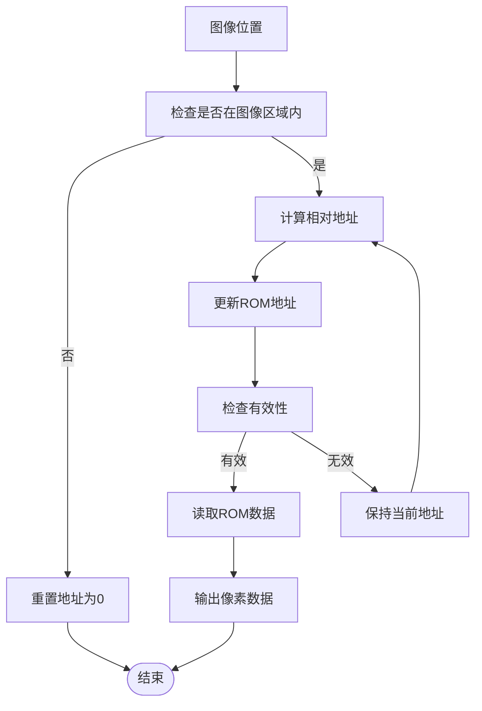
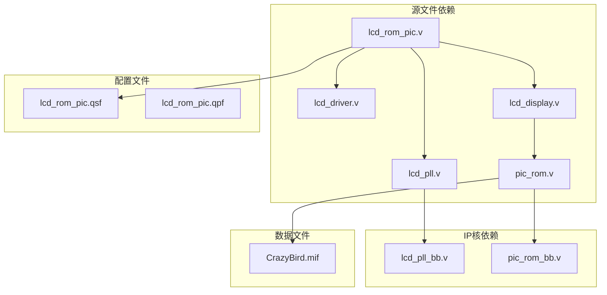

# 故障排除

<cite>
**本文档引用的文件**
- [lcd_display.v](file://lcd_display.v)
- [lcd_driver.v](file://lcd_driver.v)
- [lcd_pll.v](file://lcd_pll.v)
- [pic_rom.v](file://pic_rom.v)
- [lcd_rom_pic.v](file://lcd_rom_pic.v)
- [lcd_display.txt](file://lcd_display.txt)
- [lcd_driver.txt](file://lcd_driver.txt)
- [lcd_pll_bb.v](file://lcd_pll_bb.v)
- [pic_rom_bb.v](file://pic_rom_bb.v)
- [CrazyBird.mif](file://CrazyBird.mif)
- [lcd_rom_pic.qsf](file://lcd_rom_pic.qsf)
- [lcd_rom_pic.qpf](file://lcd_rom_pic.qpf)
</cite>

## 目录
1. [简介](#简介)
2. [项目结构](#项目结构)
3. [核心组件](#核心组件)
4. [架构概览](#架构概览)
5. [详细组件分析](#详细组件分析)
6. [依赖关系分析](#依赖关系分析)
7. [性能考虑](#性能考虑)
8. [故障排除指南](#故障排除指南)
9. [结论](#结论)

## 简介

本项目是一个基于FPGA的LCD显示器控制系统，实现了图像显示、时序控制和硬件接口管理。项目包含完整的时钟管理、显示驱动、图像处理和硬件连接配置。本文档提供了系统化的故障排除指南，涵盖编译错误、时序违例、仿真不通过、硬件调试困难等常见问题的诊断和修复方法。

## 项目结构

该项目采用模块化设计，主要包含以下核心模块：

**图表来源**
- [lcd_rom_pic.v:1-59](file://lcd_rom_pic.v#L1-L59)
- [lcd_pll.v:1-321](file://lcd_pll.v#L1-L321)
- [lcd_driver.v:1-97](file://lcd_driver.v#L1-L97)
- [lcd_display.v:1-199](file://lcd_display.v#L1-L199)

**章节来源**
- [lcd_rom_pic.v:1-59](file://lcd_rom_pic.v#L1-L59)
- [lcd_pll.v:1-321](file://lcd_pll.v#L1-L321)
- [lcd_driver.v:1-97](file://lcd_driver.v#L1-L97)
- [lcd_display.v:1-199](file://lcd_display.v#L1-L199)

## 核心组件

### 时钟管理系统
- **LCD_PLL**: 使用ALTERA的PLL IP核生成33.3MHz像素时钟
- **锁定机制**: 通过locked信号确保时钟稳定后再释放复位
- **频率配置**: 输入50MHz，倍频至33.3MHz输出

### 显示驱动系统
- **LCD_DRIVER**: 生成RGB888/RGB565时序信号
- **参数配置**: 支持800x480分辨率，1056x525总扫描周期
- **同步信号**: 生成HSYNC、VSYNC、DE等显示时序

### 图像处理系统
- **LCD_DISPLAY**: 实现图像位置控制和ROM数据读取
- **运动控制**: 支持多种运动模式（左上45度、右移反弹、上下移动、静态）
- **ROM接口**: 通过MIF文件加载图像数据

**章节来源**
- [lcd_pll.v:104-159](file://lcd_pll.v#L104-L159)
- [lcd_driver.v:20-31](file://lcd_driver.v#L20-L31)
- [lcd_display.v:10-19](file://lcd_display.v#L10-L19)

## 架构概览

**图表来源**
- [lcd_rom_pic.v:24-25](file://lcd_rom_pic.v#L24-L25)
- [lcd_pll.v:66-103](file://lcd_pll.v#L66-L103)
- [lcd_driver.v:73-94](file://lcd_driver.v#L73-L94)

## 详细组件分析

### 时钟管理模块分析

#### PLL配置参数
- **输入频率**: 50MHz
- **输出频率**: 33.3MHz
- **设备类型**: Cyclone IV E系列
- **锁定时间**: 通过locked信号监控

#### 时钟稳定性检查

**图表来源**
- [lcd_pll.v:66-103](file://lcd_pll.v#L66-L103)
- [lcd_rom_pic.v:24-25](file://lcd_rom_pic.v#L24-L25)

**章节来源**
- [lcd_pll.v:104-159](file://lcd_pll.v#L104-L159)
- [lcd_pll_bb.v:34-52](file://lcd_pll_bb.v#L34-L52)

### 显示驱动模块分析

#### 时序参数配置
- **水平参数**: H_SYNC=46, H_BACK=0, H_DISP=800, H_FRONT=210, H_TOTAL=1056
- **垂直参数**: V_SYNC=23, V_BACK=0, V_DISP=480, V_FRONT=22, V_TOTAL=525
- **像素时钟**: 33.3MHz

#### 坐标生成逻辑

**图表来源**
- [lcd_driver.v:73-94](file://lcd_driver.v#L73-L94)
- [lcd_driver.v:67-69](file://lcd_driver.v#L67-L69)

**章节来源**
- [lcd_driver.v:20-31](file://lcd_driver.v#L20-L31)
- [lcd_driver.v:67-69](file://lcd_driver.v#L67-L69)

### 图像显示模块分析

#### 运动控制算法
模块支持四种运动模式：
1. **左上45度移动**: 穿透边界
2. **右移反弹**: 遇边界反弹
3. **上下移动**: 130像素往复运动
4. **静态显示**: 固定位置

#### ROM地址计算

**图表来源**
- [lcd_display.v:134-177](file://lcd_display.v#L134-L177)
- [lcd_display.v:181-186](file://lcd_display.v#L181-L186)

**章节来源**
- [lcd_display.v:53-123](file://lcd_display.v#L53-L123)
- [lcd_display.v:155-186](file://lcd_display.v#L155-L186)

### ROM存储器分析

#### 存储器配置
- **容量**: 32,768字
- **数据宽度**: 24位（RGB888）
- **初始化文件**: CrazyBird.mif
- **地址宽度**: 15位

#### 数据格式
- **分辨率**: 140x170像素
- **总像素**: 23,800像素
- **数据格式**: RGB888（24位）

**章节来源**
- [pic_rom.v:85-99](file://pic_rom.v#L85-L99)
- [CrazyBird.mif:4-5](file://CrazyBird.mif#L4-L5)

## 依赖关系分析

**图表来源**
- [lcd_rom_pic.v:48-58](file://lcd_rom_pic.v#L48-L58)
- [pic_rom.v:61-84](file://pic_rom.v#L61-L84)

**章节来源**
- [lcd_rom_pic.qsf:92-96](file://lcd_rom_pic.qsf#L92-L96)
- [lcd_rom_pic.qsf:93](file://lcd_rom_pic.qsf#L93)

## 性能考虑

### 时序优化建议

1. **时钟域同步**
   - 确保PLL锁定后再释放复位信号
   - 使用两级触发器进行跨时钟域同步

2. **流水线设计**
   - 将ROM读取操作流水线化
   - 减少关键路径延迟

3. **资源利用优化**
   - 合理使用块RAM资源
   - 避免不必要的寄存器级联

### 功耗管理

1. **时钟门控**
   - 在空闲时关闭不需要的时钟
   - 使用低功耗模式

2. **电源管理**
   - 合理设置VCCIO电压
   - 优化I/O标准

## 故障排除指南

### 编译错误诊断

#### 常见编译错误类型

**1. 文件包含错误**
- **症状**: 编译时报找不到文件或模块定义
- **原因**: 源文件路径配置错误或文件名不匹配
- **解决方案**: 
  - 检查.qsf文件中的文件路径配置
  - 确认文件名大小写正确
  - 验证文件是否存在于指定路径

**2. 模块实例化错误**
- **症状**: 模块实例化语法错误
- **原因**: 端口映射不匹配或缺少端口
- **解决方案**:
  - 对照模块声明检查端口数量
  - 确认端口类型和方向匹配
  - 检查信号命名一致性

**3. 参数定义错误**
- **症状**: 参数未定义或类型不匹配
- **原因**: parameter定义错误或作用域问题
- **解决方案**:
  - 检查parameter声明位置
  - 确认参数值范围合理
  - 验证参数使用位置

**章节来源**
- [lcd_rom_pic.qsf:92-96](file://lcd_rom_pic.qsf#L92-L96)

### 时序违例诊断

#### 时钟域问题

**1. 锁定信号问题**
- **症状**: locked信号始终为0
- **诊断步骤**:
  1. 检查输入时钟频率是否正确
  2. 验证PLL配置参数
  3. 确认电源和地线连接
- **解决方案**:
  1. 调整PLL输入频率设置
  2. 检查时钟源稳定性
  3. 验证PCB布线质量

**2. 复位同步问题**
- **症状**: 复位释放时机不当导致系统不稳定
- **诊断步骤**:
  1. 检查rst_n_w信号生成逻辑
  2. 验证locked信号延迟
  3. 分析复位时序图
- **解决方案**:
  1. 确保PLL锁定后再释放复位
  2. 添加复位同步器
  3. 优化复位释放时序

**章节来源**
- [lcd_pll.v:66-103](file://lcd_pll.v#L66-L103)
- [lcd_rom_pic.v:24-25](file://lcd_rom_pic.v#L24-L25)

#### 时序收敛问题

**1. 延迟过长**
- **症状**: 设计无法在目标频率下工作
- **诊断步骤**:
  1. 分析关键路径延迟
  2. 检查组合逻辑深度
  3. 评估寄存器使用情况
- **解决方案**:
  1. 优化关键路径逻辑
  2. 添加流水线级
  3. 使用DSP块加速计算

**2. 时序余量不足**
- **症状**: 时序余量很小或为负值
- **诊断步骤**:
  1. 检查时钟树平衡
  2. 分析信号完整性
  3. 评估布线拥塞
- **解决方案**:
  1. 重新布局关键信号
  2. 优化时钟网络
  3. 调整约束条件

### 仿真不通过诊断

#### 显示时序仿真问题

**1. 像素时钟问题**
- **症状**: 仿真中像素时钟不正确
- **诊断步骤**:
  1. 检查lcd_clk信号频率
  2. 验证时钟分频系数
  3. 分析PLL输出波形
- **解决方案**:
  1. 调整PLL配置参数
  2. 检查时钟源连接
  3. 验证仿真时钟设置

**2. 坐标生成错误**
- **症状**: 像素坐标超出有效范围
- **诊断步骤**:
  1. 检查行计数器逻辑
  2. 验证列计数器状态
  3. 分析有效显示区域判断
- **解决方案**:
  1. 修正计数器边界条件
  2. 检查同步信号时序
  3. 调整参数配置

**章节来源**
- [lcd_driver.v:73-94](file://lcd_driver.v#L73-L94)
- [lcd_driver.v:67-69](file://lcd_driver.v#L67-L69)

#### 图像显示仿真问题

**1. ROM数据读取问题**
- **症状**: 图像数据输出异常
- **诊断步骤**:
  1. 检查ROM地址计算逻辑
  2. 验证地址边界条件
  3. 分析数据有效性信号
- **解决方案**:
  1. 修正地址计算公式
  2. 检查ROM初始化文件
  3. 验证数据格式匹配

**2. 运动控制仿真问题**
- **症状**: 图像运动轨迹不符合预期
- **诊断步骤**:
  1. 检查运动控制状态机
  2. 验证边界检测逻辑
  3. 分析方向控制信号
- **解决方案**:
  1. 修正运动控制算法
  2. 检查输入信号状态
  3. 调整运动参数

**章节来源**
- [lcd_display.v:155-186](file://lcd_display.v#L155-L186)
- [lcd_display.v:53-123](file://lcd_display.v#L53-L123)

### 硬件调试困难诊断

#### 硬件连接问题

**1. LCD显示异常**
- **症状**: 屏幕无显示或显示异常
- **诊断步骤**:
  1. 检查背光和复位信号
  2. 验证RGB数据线连接
  3. 测量同步信号时序
- **解决方案**:
  1. 确认背光供电正常
  2. 检查RGB数据线阻抗匹配
  3. 验证时序参数设置

**2. 时钟信号问题**
- **症状**: 显示时序混乱
- **诊断步骤**:
  1. 测量系统时钟频率
  2. 检查PLL输出信号
  3. 验证时钟完整性
- **解决方案**:
  1. 调整时钟源频率
  2. 检查PCB走线长度
  3. 优化时钟缓冲器

**章节来源**
- [lcd_driver.v:41-46](file://lcd_driver.v#L41-L46)
- [lcd_pll.v:104-159](file://lcd_pll.v#L104-L159)

#### 信号完整性问题

**1. 时序抖动**
- **症状**: 显示画面闪烁或撕裂
- **诊断步骤**:
  1. 测量时钟抖动
  2. 检查信号上升/下降时间
  3. 分析时序裕量
- **解决方案**:
  1. 优化时钟网络设计
  2. 改善PCB布线
  3. 使用时钟恢复电路

**2. 信号串扰**
- **症状**: 数据线间干扰导致显示错误
- **诊断步骤**:
  1. 测量串扰电压
  2. 检查差分阻抗
  3. 分析回流路径
- **解决方案**:
  1. 增加屏蔽层
  2. 优化阻抗控制
  3. 改善接地设计

### 最佳实践总结

#### 开发流程建议

**1. 版本控制**
- 使用Git管理代码版本
- 为每个功能模块创建独立分支
- 定期提交注释和变更说明

**2. 文档维护**
- 保持代码注释完整
- 更新设计文档
- 记录测试结果和问题解决过程

**3. 测试策略**
- 单元测试优先
- 逐步集成测试
- 硬件在环测试

#### 调试技巧

**1. 分层调试**
- 先验证顶层模块功能
- 再逐层深入到具体模块
- 最后定位到具体信号

**2. 信号观察**
- 使用示波器测量关键信号
- 通过逻辑分析仪捕获时序
- 利用仿真工具分析时序

**3. 问题定位**
- 从现象入手，逐步缩小范围
- 使用对比法验证假设
- 记录每次修改的影响

## 结论

本故障排除指南涵盖了LCD ROM PIC项目开发过程中的主要问题类型和解决方案。通过系统化的诊断流程和最佳实践，可以有效提高开发效率和产品质量。

关键要点包括：
- 建立完善的编译和仿真环境
- 重视时序收敛和信号完整性
- 采用分层调试策略
- 建立规范的开发和测试流程

建议在实际项目中结合具体的硬件平台和应用场景，进一步完善调试工具和测试方法，以获得更好的开发体验和产品性能。