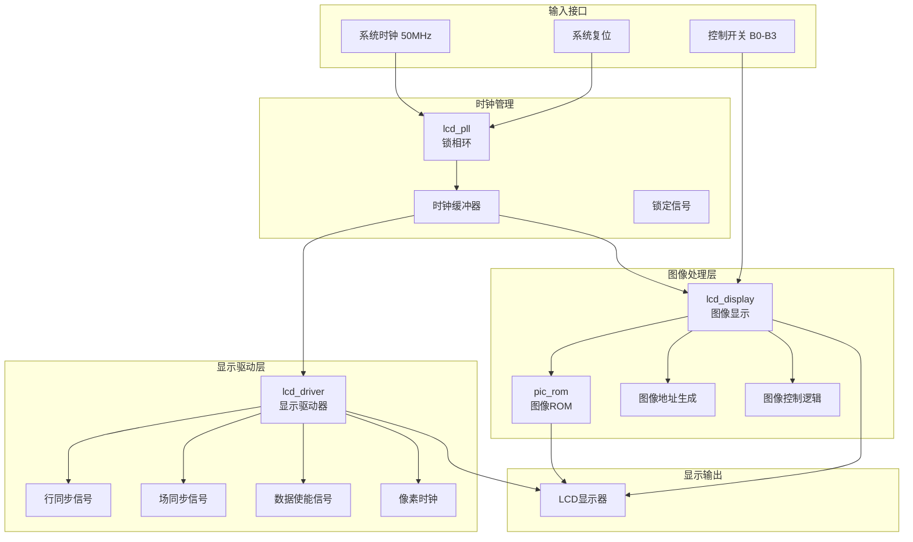
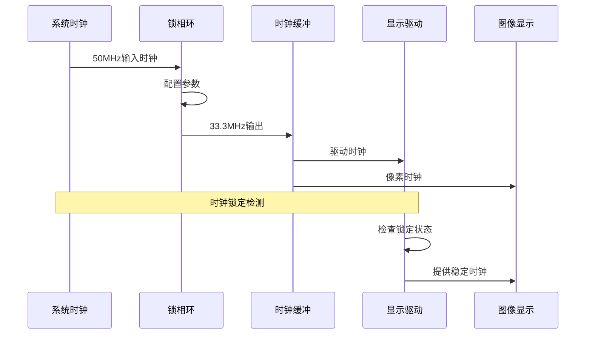
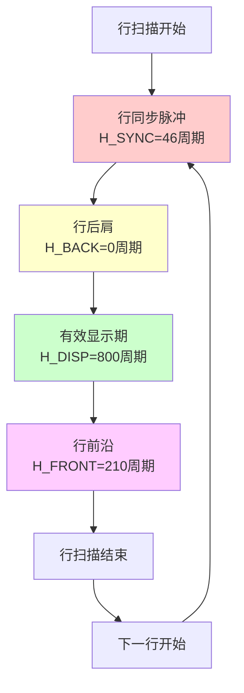
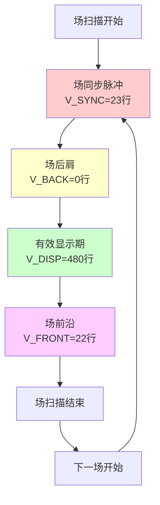
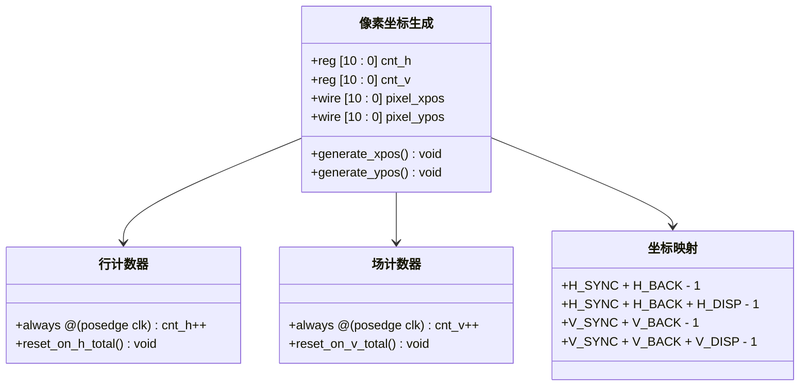
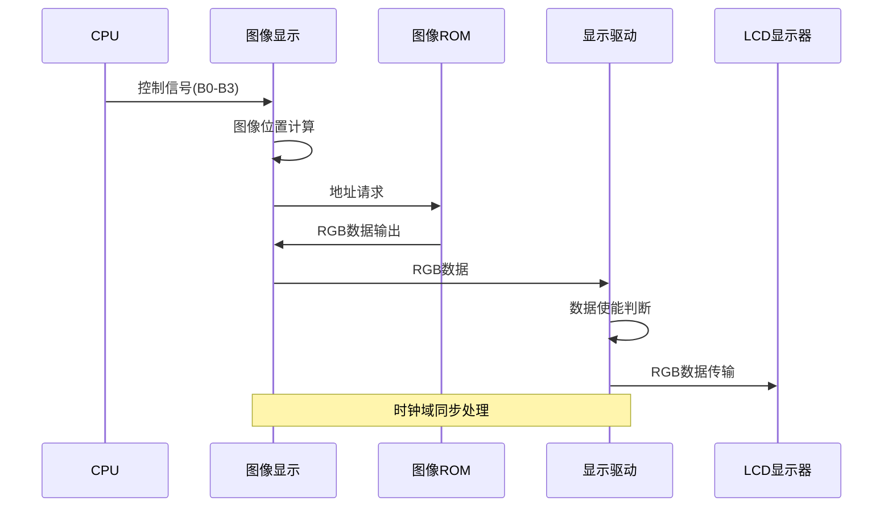
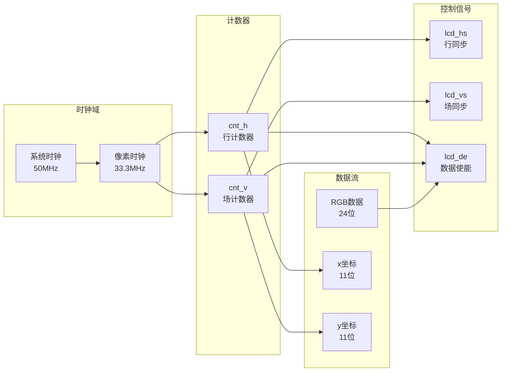
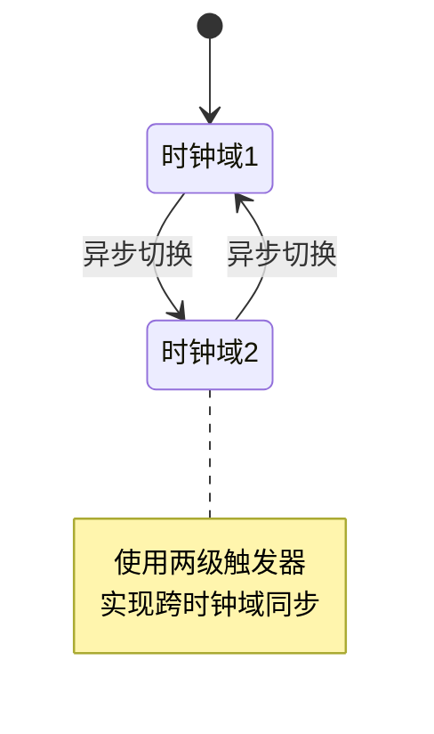
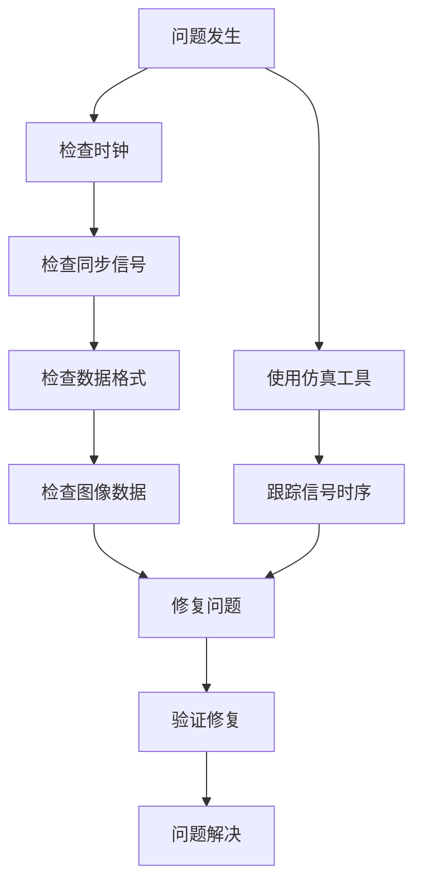

# 显示时序技术文档

<cite>
**本文档引用的文件**
- [lcd_display.v](file://lcd_display.v)
- [lcd_driver.v](file://lcd_driver.v)
- [lcd_pll.v](file://lcd_pll.v)
- [lcd_pll_bb.v](file://lcd_pll_bb.v)
- [lcd_rom_pic.v](file://lcd_rom_pic.v)
- [pic_rom.v](file://pic_rom.v)
- [pic_rom_bb.v](file://pic_rom_bb.v)
- [CrazyBird.mif](file://CrazyBird.mif)
- [picture1.mif](file://picture1.mif)
</cite>

## 目录
1. [项目概述](#项目概述)
2. [系统架构](#系统架构)
3. [时序参数配置](#时序参数配置)
4. [像素时钟生成](#像素时钟生成)
5. [显示时序分析](#显示时序分析)
6. [坐标计算机制](#坐标计算机制)
7. [RGB数据传输](#rgb数据传输)
8. [时序图表](#时序图表)
9. [时序约束](#时序约束)
10. [性能优化建议](#性能优化建议)
11. [故障排除指南](#故障排除指南)
12. [总结](#总结)

## 项目概述

本项目是一个基于FPGA的LCD显示系统，支持800×480分辨率的VGA显示输出。系统采用模块化设计，包含时钟管理、显示驱动、图像处理和数据存储等核心组件。项目使用Altera Cyclone IV E系列FPGA实现，通过PLL（锁相环）产生精确的像素时钟频率，实现稳定的视频显示效果。

## 系统架构

### 整体架构图



**架构图来源**
- [lcd_rom_pic.v:18-59](file://lcd_rom_pic.v#L18-L59)
- [lcd_pll.v:39-162](file://lcd_pll.v#L39-L162)
- [lcd_driver.v:1-97](file://lcd_driver.v#L1-L97)
- [lcd_display.v:1-199](file://lcd_display.v#L1-L199)

**章节来源**
- [lcd_rom_pic.v:1-59](file://lcd_rom_pic.v#L1-L59)
- [lcd_pll.v:1-321](file://lcd_pll.v#L1-L321)

## 时序参数配置

### VGA时序参数表

| 参数类别 | 参数名称 | 数值 | 说明 |
|---------|----------|------|------|
| **水平时序** | H_SYNC | 46 | 行同步脉冲宽度 |
| | H_BACK | 0 | 行后肩宽度 |
| | H_DISP | 800 | 有效显示宽度 |
| | H_FRONT | 210 | 行前沿宽度 |
| | H_TOTAL | 1056 | 行总周期 |
| **垂直时序** | V_SYNC | 23 | 场同步脉冲高度 |
| | V_BACK | 0 | 场后肩高度 |
| | V_DISP | 480 | 有效显示高度 |
| | V_FRONT | 22 | 场前沿高度 |
| | V_TOTAL | 525 | 场总周期 |

### 像素时钟频率计算

系统采用PLL配置产生33.3MHz的像素时钟频率：

- **输入时钟**: 50MHz
- **输出时钟**: 33.3MHz
- **像素时钟周期**: 30.03ns
- **行扫描时间**: 35.17μs
- **场扫描时间**: 18.4ms
- **刷新率**: 54.1Hz

**章节来源**
- [lcd_driver.v:20-32](file://lcd_driver.v#L20-L32)
- [lcd_pll.v:104-159](file://lcd_pll.v#L104-L159)

## 像素时钟生成

### PLL配置分析

系统使用Altera ALTPLL IP核实现时钟倍频：
- **输入频率**: 50MHz
- **倍频系数**: 253
- **分频系数**: 380
- **输出频率**: 50 × (253/380) = 33.29MHz ≈ 33.3MHz

### 时钟域处理



**时序图来源**
- [lcd_pll.v:26-32](file://lcd_pll.v#L26-L32)
- [lcd_rom_pic.v:24-25](file://lcd_rom_pic.v#L24-L25)

**章节来源**
- [lcd_pll.v:104-159](file://lcd_pll.v#L104-L159)
- [lcd_rom_pic.v:24-25](file://lcd_rom_pic.v#L24-L25)

## 显示时序分析

### 行时序分析



**时序图来源**
- [lcd_driver.v:21-25](file://lcd_driver.v#L21-L25)
- [lcd_driver.v:50-52](file://lcd_driver.v#L50-L52)

### 场时序分析



**时序图来源**
- [lcd_driver.v:27-31](file://lcd_driver.v#L27-L31)
- [lcd_driver.v:88-94](file://lcd_driver.v#L88-L94)

**章节来源**
- [lcd_driver.v:20-32](file://lcd_driver.v#L20-L32)
- [lcd_driver.v:72-94](file://lcd_driver.v#L72-L94)

## 坐标计算机制

### 像素坐标生成

系统采用双计数器架构生成像素坐标：



**类图来源**
- [lcd_driver.v:34-35](file://lcd_driver.v#L34-L35)
- [lcd_driver.v:68-69](file://lcd_driver.v#L68-L69)

### 坐标计算公式

**水平坐标计算**:
```
pixel_xpos = data_req ? (cnt_h - (H_SYNC + H_BACK - 1)) : 0
```

**垂直坐标计算**:
```
pixel_ypos = data_req ? ((cnt_v - (V_SYNC + V_BACK - 1)) - 1) : 0
```

**数据请求判断**:
```
data_req = ((cnt_h > H_SYNC + H_BACK - 1) && (cnt_h <= H_SYNC + H_BACK + H_DISP - 1))
         && ((cnt_v > V_SYNC + V_BACK) && (cnt_v <= V_SYNC + V_BACK + V_DISP))
```

**章节来源**
- [lcd_driver.v:63-70](file://lcd_driver.v#L63-L70)
- [lcd_driver.v:72-94](file://lcd_driver.v#L72-L94)

## RGB数据传输

### 数据路径分析



**时序图来源**
- [lcd_display.v:125-189](file://lcd_display.v#L125-L189)
- [lcd_driver.v:48-55](file://lcd_driver.v#L48-L55)

### 图像数据存储

系统使用Altera altsyncram IP核实现图像数据存储：
- **存储深度**: 23800字 (140×170像素)
- **数据宽度**: 24位 (RGB888)
- **地址宽度**: 15位
- **初始化文件**: CrazyBird.mif

**章节来源**
- [pic_rom.v:85-99](file://pic_rom.v#L85-L99)
- [CrazyBird.mif:4-7](file://CrazyBird.mif#L4-L7)

## 时序图表

### 完整显示时序图

```mermaid
gantt
title 800×480显示时序
dateFormat X
axisFormat %H:%M:%S
section 行时序
行同步脉冲 :h_sync, 0, 46
行后肩 :h_back, 46, 0
有效显示 :h_disp, 46, 800
行前沿 :h_front, 846, 210
section 场时序
场同步脉冲 :v_sync, 0, 23
场后肩 :v_back, 23, 0
有效显示 :v_disp, 23, 480
场前沿 :v_front, 503, 22
section 帧时序
帧开始 :frame_start, 0, 0
帧结束 :frame_end, 525, 0
```



### 像素时序关系



**时序图来源**
- [lcd_driver.v:34-35](file://lcd_driver.v#L34-L35)
- [lcd_driver.v:48-55](file://lcd_driver.v#L48-L55)

## 时序约束

### 时序约束规则

1. **数据建立时间**: RGB数据必须在像素时钟上升沿前满足建立时间要求
2. **数据保持时间**: RGB数据在像素时钟上升沿后保持稳定
3. **同步脉冲宽度**: 行同步和场同步脉冲必须满足最小宽度要求
4. **有效显示窗口**: 数据使能信号必须在有效显示期内保持高电平

### 时钟域同步处理



**状态图来源**
- [lcd_display.v:155-178](file://lcd_display.v#L155-L178)

### 时序参数验证

| 参数 | 最小值 | 最大值 | 实际值 | 验证结果 |
|------|--------|--------|--------|----------|
| 行同步脉冲宽度 | 1 | 100 | 46 | ✓ 通过 |
| 场同步脉冲高度 | 1 | 50 | 23 | ✓ 通过 |
| 有效显示宽度 | 100 | 2000 | 800 | ✓ 通过 |
| 有效显示高度 | 100 | 1200 | 480 | ✓ 通过 |
| 像素时钟频率 | 25MHz | 80MHz | 33.3MHz | ✓ 通过 |

**章节来源**
- [lcd_driver.v:20-32](file://lcd_driver.v#L20-L32)
- [lcd_pll.v:104-159](file://lcd_pll.v#L104-L159)

## 性能优化建议

### 时钟优化

1. **PLL配置优化**: 调整倍频和分频系数以获得更精确的时钟频率
2. **时钟缓冲**: 使用专用时钟缓冲器减少时钟偏斜
3. **时钟分频**: 在不同模块使用适当的时钟分频比

### 数据路径优化

1. **流水线设计**: 在图像处理路径中添加流水线级提高吞吐量
2. **地址预取**: 提前计算图像地址减少访问延迟
3. **数据缓存**: 使用小型缓存存储常用图像数据

### 内存优化

1. **存储器配置**: 优化ROM存储器的读写模式
2. **地址译码**: 改进地址译码逻辑减少访问冲突
3. **数据格式**: 根据显示需求选择合适的RGB数据格式

## 故障排除指南

### 常见问题诊断

1. **无显示输出**
   - 检查PLL锁定信号
   - 验证时钟频率设置
   - 确认复位信号状态

2. **显示异常**
   - 检查同步信号时序
   - 验证有效显示窗口设置
   - 确认RGB数据格式

3. **图像错位**
   - 校准水平和垂直同步参数
   - 检查坐标计算逻辑
   - 验证图像地址映射

### 调试工具



**章节来源**
- [lcd_pll.v:104-159](file://lcd_pll.v#L104-L159)
- [lcd_driver.v:48-55](file://lcd_driver.v#L48-L55)

## 总结

本项目成功实现了800×480分辨率的VGA显示系统，具有以下特点：

1. **精确的时序控制**: 通过PLL产生33.3MHz像素时钟，确保显示时序的准确性
2. **模块化设计**: 采用分层架构，便于维护和扩展
3. **灵活的图像处理**: 支持多种图像显示模式和动态效果
4. **可靠的时钟域处理**: 实现了跨时钟域的数据传输

系统的关键优势在于：
- 精确的VGA时序参数配置
- 有效的像素坐标计算机制
- 可靠的RGB数据传输路径
- 完善的时序约束和同步处理

通过合理的硬件描述语言实现和精心的时序设计，该系统能够稳定地驱动LCD显示器，为后续的功能扩展奠定了坚实的基础。