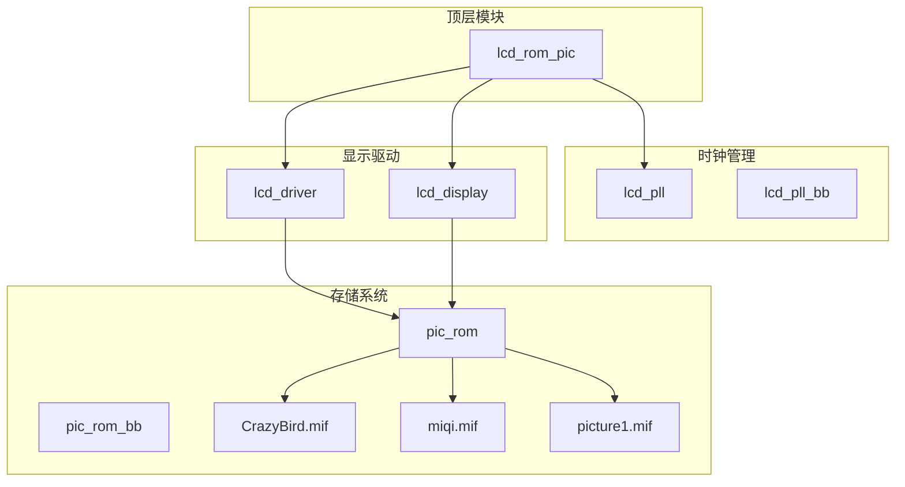
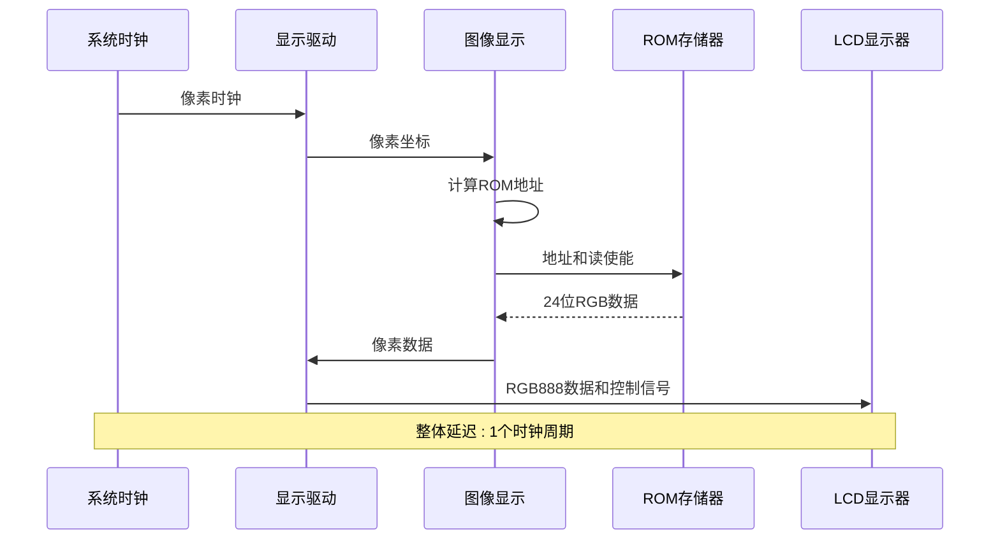
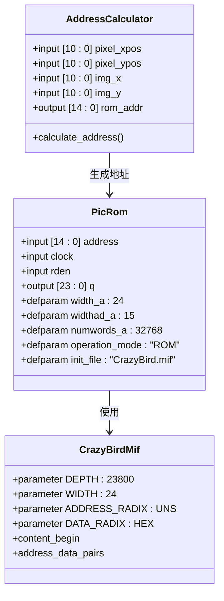
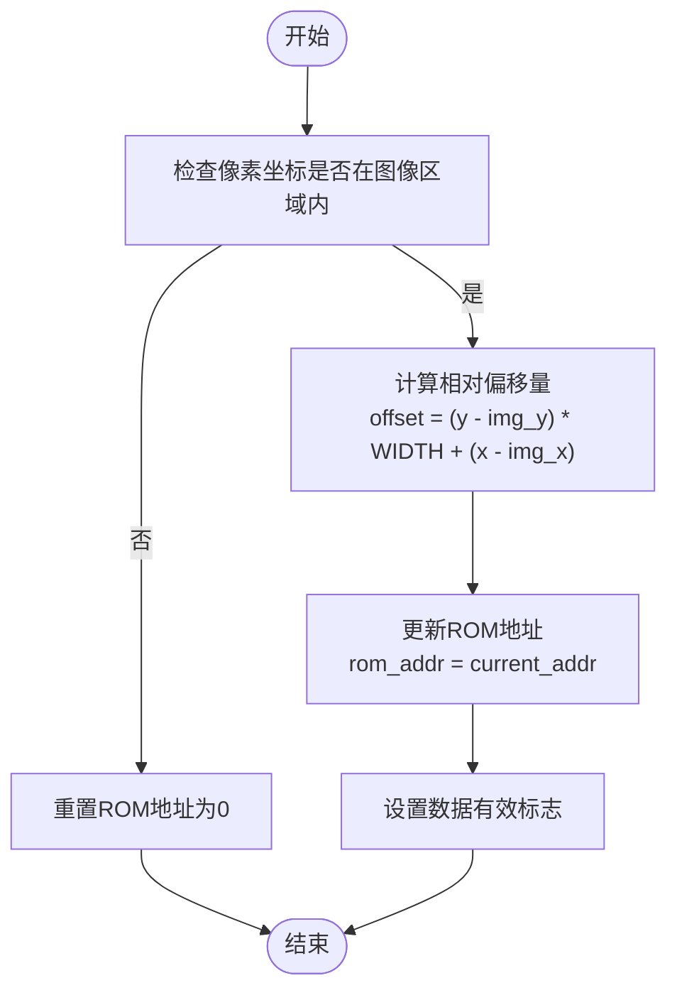
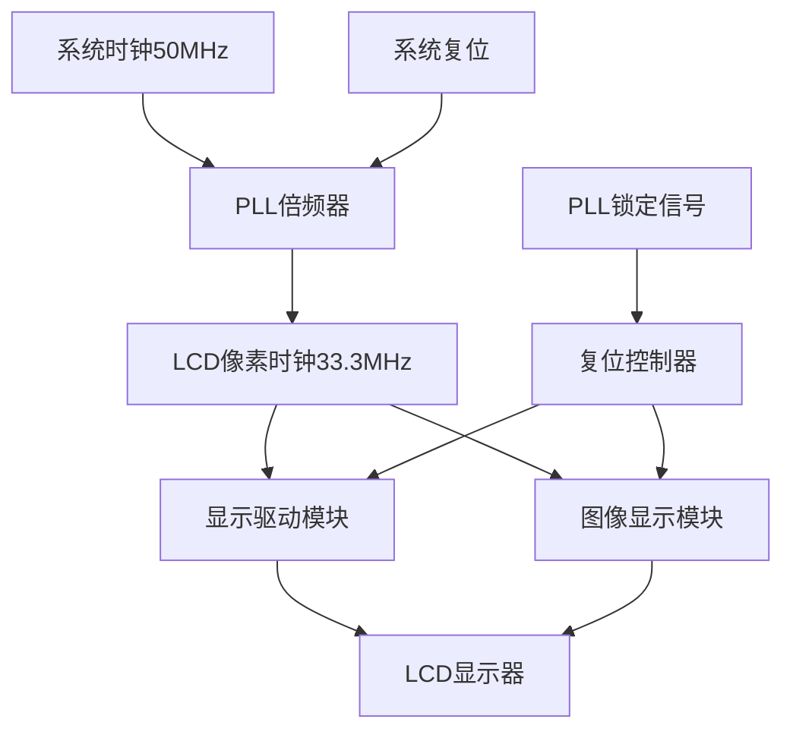
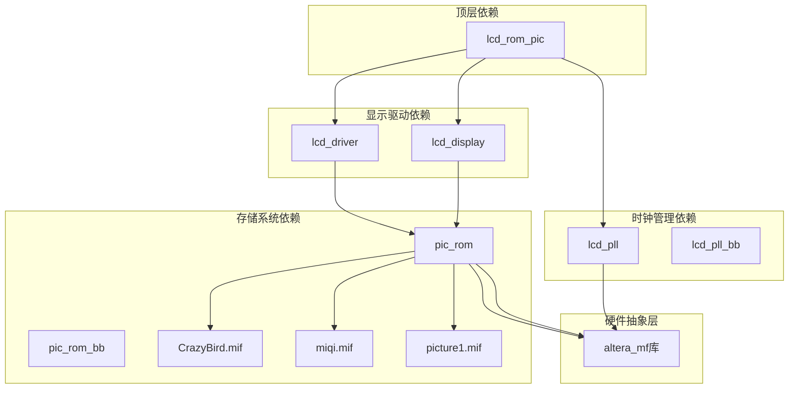
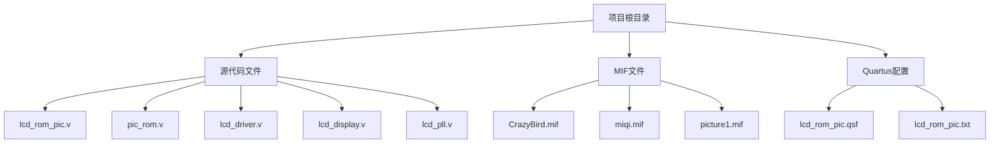

# ROM存储系统

<cite>
**本文档引用的文件**
- [lcd_rom_pic.v](file://lcd_rom_pic.v)
- [pic_rom.v](file://pic_rom.v)
- [CrazyBird.mif](file://CrazyBird.mif)
- [miqi.mif](file://miqi.mif)
- [picture1.mif](file://picture1.mif)
- [lcd_display.v](file://lcd_display.v)
- [lcd_driver.v](file://lcd_driver.v)
- [lcd_pll.v](file://lcd_pll.v)
- [lcd_pll_bb.v](file://lcd_pll_bb.v)
- [pic_rom_bb.v](file://pic_rom_bb.v)
- [lcd_rom_pic.qsf](file://lcd_rom_pic.qsf)
- [lcd_rom_pic.txt](file://lcd_rom_pic.txt)
- [lcd_display.txt](file://lcd_display.txt)
</cite>

## 目录
1. [引言](#引言)
2. [项目结构](#项目结构)
3. [核心组件](#核心组件)
4. [架构概览](#架构概览)
5. [详细组件分析](#详细组件分析)
6. [依赖关系分析](#依赖关系分析)
7. [性能考虑](#性能考虑)
8. [故障排除指南](#故障排除指南)
9. [结论](#结论)
10. [附录](#附录)

## 引言

本项目是一个基于ALTERA Cyclone IV E系列FPGA的ROM存储系统，专门用于LCD显示应用。该系统集成了ALTSYNCRAM IP核，实现了高效的图像数据存储和读取功能。项目采用模块化设计，包含时钟管理、显示驱动、图像处理和ROM存储等核心功能模块。

该ROM存储系统的主要特点包括：
- 支持多种图像格式（RGB888和RGB565）
- 可编程图像显示模式（静态、动态、反弹等）
- 高效的ROM地址管理和数据读取机制
- 灵活的配置参数和接口规范

## 项目结构

项目采用层次化模块设计，主要包含以下核心模块：

**图表来源**
- [lcd_rom_pic.v:1-59](file://lcd_rom_pic.v#L1-L59)
- [lcd_pll.v:1-321](file://lcd_pll.v#L1-L321)
- [lcd_driver.v:1-97](file://lcd_driver.v#L1-L97)
- [lcd_display.v:1-199](file://lcd_display.v#L1-L199)
- [pic_rom.v:1-165](file://pic_rom.v#L1-L165)

**章节来源**
- [lcd_rom_pic.v:1-59](file://lcd_rom_pic.v#L1-L59)
- [lcd_pll.v:1-321](file://lcd_pll.v#L1-L321)
- [lcd_driver.v:1-97](file://lcd_driver.v#L1-L97)
- [lcd_display.v:1-199](file://lcd_display.v#L1-L199)
- [pic_rom.v:1-165](file://pic_rom.v#L1-L165)

## 核心组件

### ALTSYNCRAM IP核配置

ALTSYNCRAM是ALTERA提供的同步RAM/ROM存储器宏单元，本项目中配置为ROM模式：

**存储器规格参数：**
- **操作模式**: ROM（只读存储器）
- **数据宽度**: 24位（支持RGB888格式）
- **地址宽度**: 15位（可寻址32,768个存储单元）
- **存储深度**: 32,768字（约32K）
- **时钟域**: 单时钟域
- **输出寄存器**: 未注册（直通输出）

**初始化文件配置：**
- **初始化文件**: CrazyBird.mif
- **文件格式**: MIF（Memory Initialization File）
- **数据布局**: 按端口A布局，地址连续存储

**章节来源**
- [pic_rom.v:85-99](file://pic_rom.v#L85-L99)
- [pic_rom.v:134-149](file://pic_rom.v#L134-L149)
- [pic_rom_bb.v:75-100](file://pic_rom_bb.v#L75-L100)

### 显示驱动模块

显示驱动模块负责生成标准VGA时序信号和像素坐标：

**显示参数：**
- **分辨率**: 800×480像素
- **行同步**: 46像素
- **行显示后沿**: 0像素
- **行显示前沿**: 210像素
- **行总周期**: 1056像素
- **场同步**: 23行
- **场显示后沿**: 0行
- **场显示前沿**: 22行
- **场总周期**: 525行

**时序特性：**
- **像素时钟频率**: 33.3 MHz
- **有效显示时间**: 23.8 μs
- **帧刷新率**: 60 Hz

**章节来源**
- [lcd_driver.v:20-32](file://lcd_driver.v#L20-L32)
- [lcd_driver.v:67-69](file://lcd_driver.v#L67-L69)

### 图像显示模块

图像显示模块实现了动态图像控制和ROM数据读取：

**图像规格：**
- **图像尺寸**: 140×170像素
- **总像素数**: 23,800像素
- **图像数据格式**: RGB888（24位）
- **存储格式**: 逐像素连续存储

**运动控制功能：**
- **静态显示模式**: 固定位置显示
- **反弹模式**: 遇边界反弹运动
- **垂直移动模式**: 上下往复移动130像素
- **45度穿透模式**: 左上45度运动，边界穿透

**章节来源**
- [lcd_display.v:10-19](file://lcd_display.v#L10-L19)
- [lcd_display.v:164-174](file://lcd_display.v#L164-L174)

## 架构概览

系统采用流水线式架构，实现了高效的图像数据读取和显示：

**图表来源**
- [lcd_display.v:180-186](file://lcd_display.v#L180-L186)
- [lcd_driver.v:48-55](file://lcd_driver.v#L48-L55)

**章节来源**
- [lcd_display.v:125-189](file://lcd_display.v#L125-L189)
- [lcd_driver.v:48-55](file://lcd_driver.v#L48-L55)

## 详细组件分析

### ROM存储器分析

ALTSYNCRAM IP核提供了高性能的存储解决方案：

**图表来源**
- [pic_rom.v:39-48](file://pic_rom.v#L39-L48)
- [CrazyBird.mif:4-7](file://CrazyBird.mif#L4-L7)
- [lcd_display.v:164-174](file://lcd_display.v#L164-L174)

#### 地址计算算法

地址计算采用线性映射方式：

**图表来源**
- [lcd_display.v:134-174](file://lcd_display.v#L134-L174)

**章节来源**
- [pic_rom.v:85-99](file://pic_rom.v#L85-L99)
- [CrazyBird.mif:9-23812](file://CrazyBird.mif#L9-L23812)
- [lcd_display.v:164-174](file://lcd_display.v#L164-L174)

### 时钟管理系统

时钟管理模块提供了精确的时序控制：

**图表来源**
- [lcd_pll.v:66-103](file://lcd_pll.v#L66-L103)
- [lcd_rom_pic.v:24-25](file://lcd_rom_pic.v#L24-L25)

**章节来源**
- [lcd_pll.v:104-159](file://lcd_pll.v#L104-L159)
- [lcd_pll_bb.v:34-52](file://lcd_pll_bb.v#L34-L52)
- [lcd_rom_pic.v:24-25](file://lcd_rom_pic.v#L24-L25)

### 显示接口规范

系统支持多种显示格式和接口标准：

**RGB888接口：**
- **数据宽度**: 24位（8位R + 8位G + 8位B）
- **时钟极性**: 高电平有效
- **同步信号**: 独立的HSYNC和VSYNC信号

**RGB565接口：**
- **数据宽度**: 16位（5位R + 6位G + 5位B）
- **兼容性**: 向后兼容RGB888
- **存储效率**: 50%的数据压缩

**章节来源**
- [lcd_driver.v:9-17](file://lcd_driver.v#L9-L17)
- [lcd_display.txt:13-17](file://lcd_display.txt#L13-L17)

## 依赖关系分析

系统模块间的依赖关系体现了清晰的层次化设计：

**图表来源**
- [pic_rom.v:11-13](file://pic_rom.v#L11-L13)
- [lcd_pll.v:11-13](file://lcd_pll.v#L11-L13)
- [pic_rom_bb.v:11-13](file://pic_rom_bb.v#L11-L13)

**章节来源**
- [pic_rom.v:11-13](file://pic_rom.v#L11-L13)
- [lcd_pll.v:11-13](file://lcd_pll.v#L11-L13)
- [pic_rom_bb.v:11-13](file://pic_rom_bb.v#L11-L13)

## 性能考虑

### 存储器性能优化

**访问延迟优化：**
- ROM输出为直通模式，无额外延迟
- 地址计算在像素时钟域内完成
- 数据有效信号提供精确的读取时机

**带宽利用：**
- 单时钟周期提供24位数据
- 33.3 MHz时钟频率提供800 Mbps带宽
- 适合800×480分辨率的全彩显示

**内存映射优化：**
- 15位地址总线支持32K字存储
- 实际图像仅使用23,800字，预留空间用于扩展
- 连续地址布局提高缓存效率

### 时序优化策略

**流水线设计：**
- 地址计算与数据读取并行进行
- 像素坐标生成与数据传输重叠
- 减少整体显示延迟

**资源利用率：**
- ALTSYNCRAM IP核优化的存储阵列
- 最小化的逻辑资源占用
- 高效的布线路径

## 故障排除指南

### 常见问题诊断

**显示异常问题：**
1. **黑屏或花屏**
   - 检查ROM初始化文件完整性
   - 验证地址计算逻辑正确性
   - 确认时钟信号稳定性

2. **图像位置错误**
   - 校验图像基座位置参数
   - 检查运动控制状态机
   - 验证像素坐标转换

**时钟相关问题：**
1. **PLL锁定失败**
   - 检查输入时钟频率
   - 验证PLL配置参数
   - 确认电源和地线连接

2. **显示时序错误**
   - 校验VGA参数设置
   - 检查同步信号极性
   - 验证像素时钟频率

### 调试建议

**仿真验证：**
- 创建测试平台验证ROM读取时序
- 仿真显示驱动模块的时序行为
- 验证不同运动模式的正确性

**硬件调试：**
- 使用示波器检查关键信号
- 验证ROM初始化文件加载
- 检查FPGA引脚配置

**章节来源**
- [lcd_display.v:53-123](file://lcd_display.v#L53-L123)
- [lcd_pll.v:104-159](file://lcd_pll.v#L104-L159)

## 结论

本ROM存储系统成功实现了基于ALTSYNCRAM IP核的高效图像存储和显示功能。系统具有以下优势：

**技术优势：**
- 基于成熟的ALTERA IP核，可靠性高
- 模块化设计便于维护和扩展
- 高效的存储器架构优化

**应用价值：**
- 支持多种显示格式和分辨率
- 灵活的图像控制功能
- 适用于嵌入式显示应用

**改进建议：**
- 增加多图像缓冲机制
- 实现动态图像切换功能
- 优化内存使用效率

该系统为LCD显示应用提供了一个完整、可靠的解决方案，具有良好的扩展性和实用性。

## 附录

### 配置参数参考表

| 参数名称 | 数值 | 描述 |
|---------|------|------|
| 设备型号 | EP4CE40U19A7 | FPGA器件型号 |
| 顶层实体 | lcd_rom_pic | 顶层模块名称 |
| 时钟频率 | 50 MHz | 系统输入时钟 |
| 像素时钟 | 33.3 MHz | LCD像素时钟 |
| 分辨率 | 800×480 | 显示分辨率 |
| 数据宽度 | 24位 | RGB888格式 |

### 文件组织结构

**图表来源**
- [lcd_rom_pic.v:1-59](file://lcd_rom_pic.v#L1-L59)
- [CrazyBird.mif:1-800](file://CrazyBird.mif#L1-L800)
- [lcd_rom_pic.qsf:39-97](file://lcd_rom_pic.qsf#L39-L97)