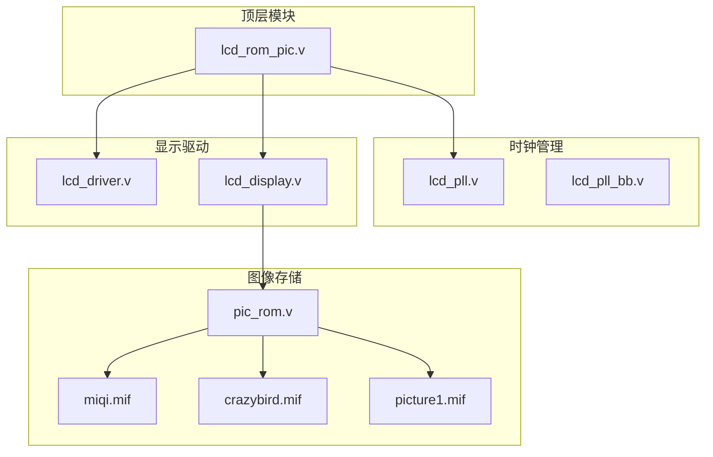
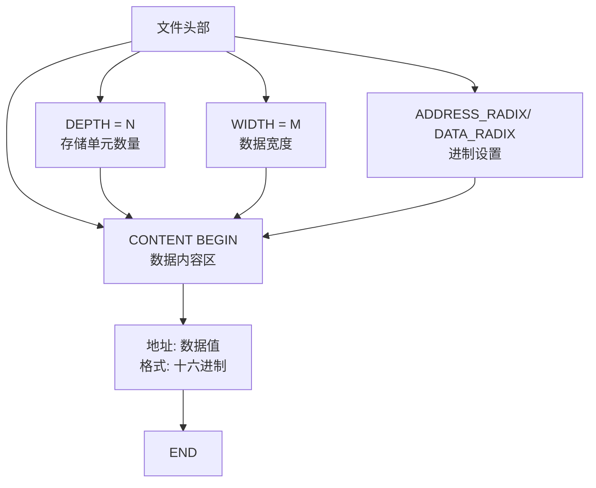
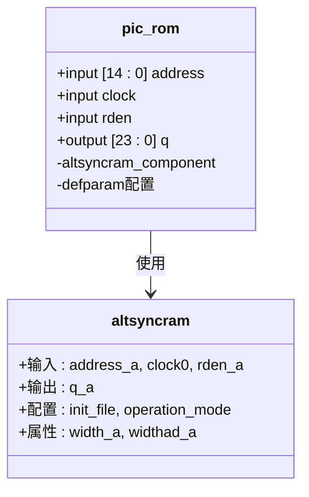
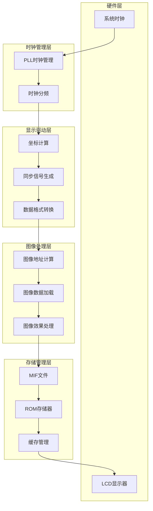
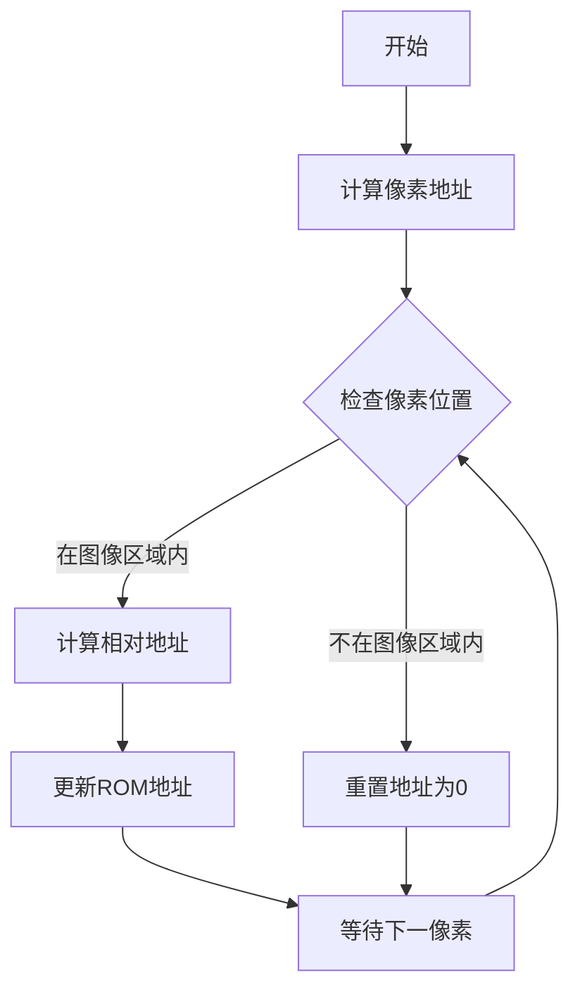
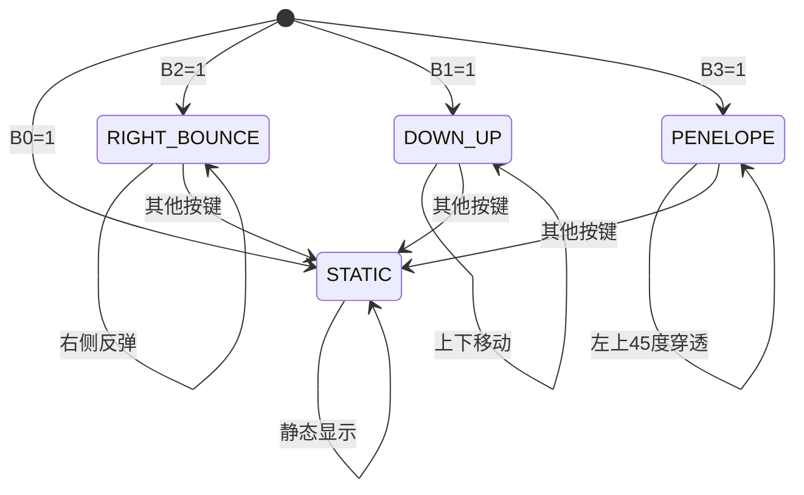
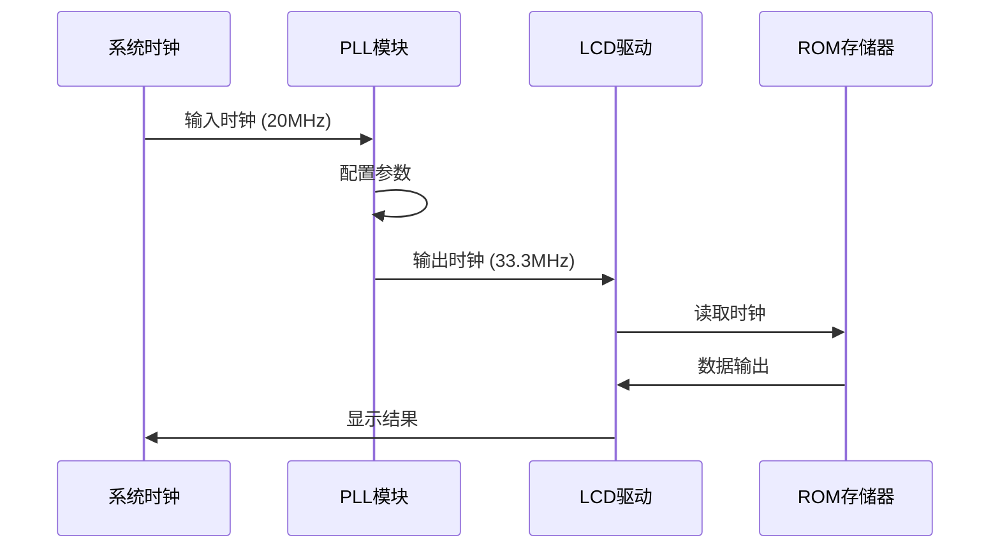
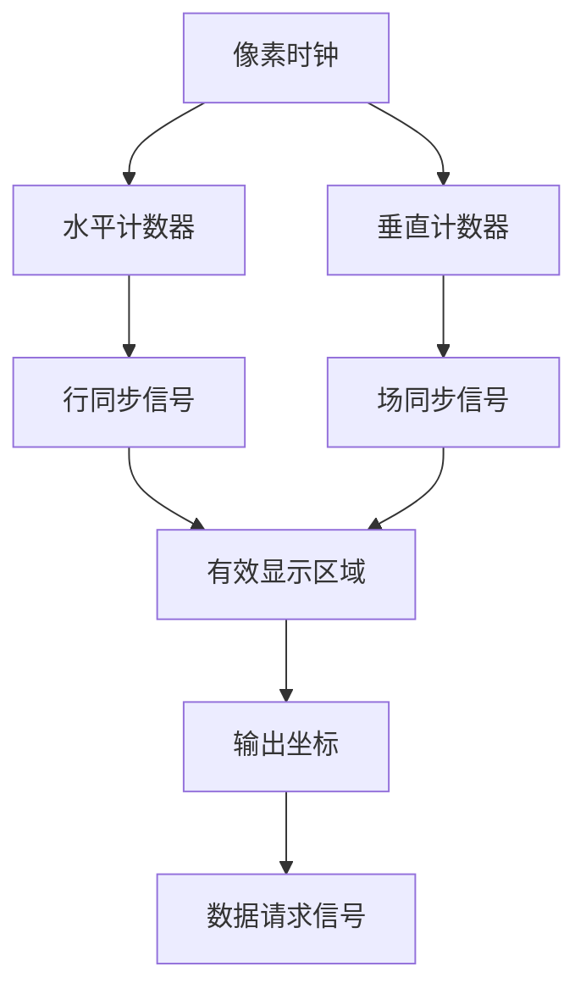
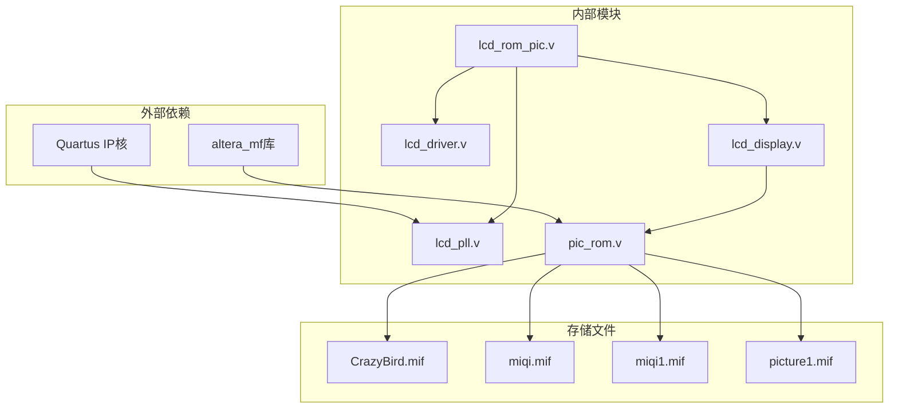
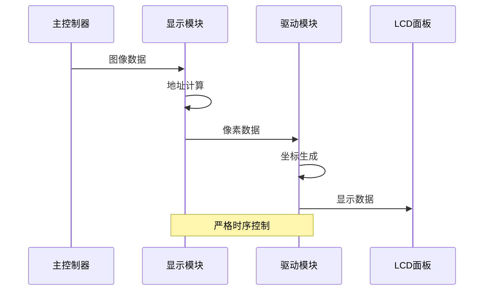

# 图像数据管理

<cite>
**本文档引用的文件**
- [CrazyBird.mif](file://CrazyBird.mif)
- [miqi.mif](file://miqi.mif)
- [miqi1.mif](file://miqi1.mif)
- [picture1.mif](file://picture1.mif)
- [pic_rom.v](file://pic_rom.v)
- [lcd_rom_pic.v](file://lcd_rom_pic.v)
- [lcd_display.v](file://lcd_display.v)
- [lcd_driver.v](file://lcd_driver.v)
- [lcd_pll.v](file://lcd_pll.v)
- [lcd_pll_bb.v](file://lcd_pll_bb.v)
- [lcd_display.txt](file://lcd_display.txt)
- [lcd_driver.txt](file://lcd_driver.txt)
</cite>

## 目录
1. [简介](#简介)
2. [项目结构](#项目结构)
3. [核心组件](#核心组件)
4. [架构概览](#架构概览)
5. [详细组件分析](#详细组件分析)
6. [依赖关系分析](#依赖关系分析)
7. [性能考虑](#性能考虑)
8. [故障排除指南](#故障排除指南)
9. [结论](#结论)

## 简介

本项目是一个基于FPGA的LCD图像显示系统，实现了140×170像素图像数据的存储、管理和实时显示功能。系统采用MIF（Memory Initialization File）格式存储图像数据，通过ROM模块进行高效访问，并支持多种图像显示模式和动态效果。

该系统的核心特点包括：
- 支持多种MIF格式的图像数据存储
- 实现140×170像素图像的精确地址映射
- 提供多种图像显示模式（静态、移动、反弹等）
- 集成PLL时钟管理系统
- 支持RGB888和RGB565色彩格式

## 项目结构

项目采用模块化设计，主要包含以下核心模块：



**图表来源**
- [lcd_rom_pic.v:1-59](file://lcd_rom_pic.v#L1-L59)
- [lcd_pll.v:1-321](file://lcd_pll.v#L1-L321)
- [lcd_driver.v:1-97](file://lcd_driver.v#L1-L97)
- [lcd_display.v:1-199](file://lcd_display.v#L1-L199)

**章节来源**
- [lcd_rom_pic.v:1-59](file://lcd_rom_pic.v#L1-L59)
- [lcd_pll.v:1-321](file://lcd_pll.v#L1-L321)

## 核心组件

### MIF文件格式系统

MIF（Memory Initialization File）是Altera提供的标准内存初始化文件格式，用于配置嵌入式存储器的内容。

#### 文件格式规范

每个MIF文件包含以下关键部分：



**图表来源**
- [CrazyBird.mif:1-10](file://CrazyBird.mif#L1-L10)
- [miqi.mif:1-10](file://miqi.mif#L1-L10)

#### 图像数据存储格式

系统支持多种图像数据存储格式：

| 文件类型 | 分辨率 | 数据宽度 | 存储容量 | 特殊用途 |
|---------|--------|----------|----------|----------|
| CrazyBird.mif | 140×170 | 24位 | 23,800字 | RGB888格式 |
| miqi.mif | 100×100 | 24位 | 10,000字 | 测试图像 |
| miqi1.mif | 100×100 | 16位 | 10,000字 | RGB565格式 |
| picture1.mif | 100×100 | 16位 | 10,000字 | RGB565格式 |

**章节来源**
- [CrazyBird.mif:4-7](file://CrazyBird.mif#L4-L7)
- [miqi.mif:4-7](file://miqi.mif#L4-L7)
- [miqi1.mif:4-7](file://miqi1.mif#L4-L7)
- [picture1.mif:4-7](file://picture1.mif#L4-L7)

### ROM存储器模块

pic_rom.v模块使用Altera的altsyncram IP核实现ROM功能：



**图表来源**
- [pic_rom.v:39-102](file://pic_rom.v#L39-L102)

**章节来源**
- [pic_rom.v:85-99](file://pic_rom.v#L85-L99)

## 架构概览

系统整体架构采用分层设计，从底层硬件抽象到高层应用逻辑：



**图表来源**
- [lcd_rom_pic.v:1-59](file://lcd_rom_pic.v#L1-L59)
- [lcd_display.v:125-199](file://lcd_display.v#L125-L199)

## 详细组件分析

### 图像数据存储与访问

#### 140×170像素图像存储结构

系统针对140×170像素图像采用了专门的存储和访问策略：



**图表来源**
- [lcd_display.v:154-178](file://lcd_display.v#L154-L178)

#### 地址映射算法

图像数据的地址映射遵循以下规则：

1. **全局坐标到图像坐标的转换**：
   ```
   图像内x坐标 = 像素x坐标 - 图像起始x坐标
   图像内y坐标 = 像素y坐标 - 图像起始y坐标
   ```

2. **线性地址计算**：
   ```
   ROM地址 = 图像内y坐标 × 图像宽度 + 图像内x坐标
   ```

3. **地址边界检查**：
   - 图像宽度：140像素
   - 图像高度：170像素
   - 总像素数：23,800像素

**章节来源**
- [lcd_display.v:164-174](file://lcd_display.v#L164-L174)

### 图像显示控制模块

#### 动态图像控制逻辑

系统提供了多种图像显示模式，通过B0-B3控制开关实现：



**图表来源**
- [lcd_display.v:60-123](file://lcd_display.v#L60-L123)

#### 运动控制参数

| 参数 | 数值 | 说明 |
|------|------|------|
| 显示分辨率 | 800×480 | LCD面板分辨率 |
| 图像尺寸 | 140×170 | 单个图像尺寸 |
| 图像总数 | 23,800 | 140×170=23,800 |
| 移动速度 | 60像素/秒 | 系统目标速度 |
| 时钟频率 | 33.3MHz | LCD驱动时钟 |
| 移动节拍 | 约555,000个时钟周期 | 33,300,000/60 |

**章节来源**
- [lcd_display.v:13-28](file://lcd_display.v#L13-L28)

### 时钟管理系统

#### PLL时钟配置

系统使用ALTERA的ALTPLL IP核实现精确的时钟管理：



**图表来源**
- [lcd_pll.v:66-103](file://lcd_pll.v#L66-L103)

**章节来源**
- [lcd_pll.v:104-159](file://lcd_pll.v#L104-L159)

### 显示驱动模块

#### 坐标生成与同步信号

lcd_driver模块负责生成精确的显示时序：



**图表来源**
- [lcd_driver.v:33-69](file://lcd_driver.v#L33-L69)

**章节来源**
- [lcd_driver.v:20-31](file://lcd_driver.v#L20-L31)

## 依赖关系分析

### 模块间依赖关系



**图表来源**
- [pic_rom.v:12-13](file://pic_rom.v#L12-L13)
- [lcd_pll.v:11-13](file://lcd_pll.v#L11-L13)

### 数据流依赖

系统中的数据流向遵循严格的时序要求：



**图表来源**
- [lcd_display.v:125-199](file://lcd_display.v#L125-L199)
- [lcd_driver.v:67-69](file://lcd_driver.v#L67-L69)

**章节来源**
- [lcd_display.v:125-199](file://lcd_display.v#L125-L199)
- [lcd_driver.v:67-69](file://lcd_driver.v#L67-L69)

## 性能考虑

### 存储器性能优化

#### ROM访问优化策略

1. **地址预计算**：在图像位置变化时立即重置地址，避免无效访问
2. **流水线设计**：利用ROM输出延迟，实现数据的有效传输
3. **缓存机制**：通过状态寄存器减少重复计算

#### 时钟频率优化

系统采用33.3MHz的时钟频率，平衡了以下因素：
- 显示质量：足够的像素时钟保证清晰显示
- 功耗控制：合理的时钟频率降低功耗
- 成本考虑：适中的频率便于实现和成本控制

### 内存使用效率

| 组件 | 内存占用 | 优化策略 |
|------|----------|----------|
| ROM存储器 | 32KB | 使用15位地址总线 |
| 图像缓冲 | 24位×23,800像素 | 直接地址映射 |
| 控制寄存器 | 若干 | 状态机精简设计 |
| 时序计数器 | 20位 | 精确控制移动节拍 |

## 故障排除指南

### 常见问题诊断

#### 图像显示异常

**问题症状**：图像显示不完整或位置错误
**可能原因**：
1. 地址计算错误
2. 坐标边界检查失败
3. 时钟同步问题

**解决步骤**：
1. 检查图像起始坐标设置
2. 验证地址映射算法
3. 确认时钟频率配置

#### 时钟同步问题

**问题症状**：显示闪烁或画面撕裂
**可能原因**：
1. PLL配置错误
2. 时序不匹配
3. 电源稳定性问题

**解决步骤**：
1. 检查PLL参数设置
2. 验证时序约束
3. 测试电源完整性

### 调试工具和方法

#### 仿真测试

建议使用Quartus的ModelSim进行仿真测试：
1. 创建测试平台文件
2. 生成激励信号
3. 观察波形输出
4. 验证功能正确性

#### 硬件调试

硬件调试时重点关注：
1. 时钟信号质量
2. 同步信号时序
3. 数据传输完整性
4. 电源纹波测量

**章节来源**
- [lcd_display.v:141-152](file://lcd_display.v#L141-L152)
- [lcd_driver.v:73-94](file://lcd_driver.v#L73-L94)

## 结论

本图像数据管理系统成功实现了140×170像素图像的高效存储和实时显示。系统的主要优势包括：

1. **模块化设计**：清晰的层次结构便于维护和扩展
2. **灵活的存储方案**：支持多种MIF格式和色彩深度
3. **精确的时序控制**：确保稳定的显示效果
4. **高效的地址映射**：优化的内存访问策略

系统的不足之处：
- 仅支持单个图像显示，多图像切换功能需要扩展
- 缺少图像压缩算法，存储空间可以进一步优化
- 动态效果相对简单，可增加更多视觉效果

未来改进方向：
1. 实现多图像切换机制
2. 添加图像压缩和解压功能
3. 增强动态效果处理能力
4. 优化内存使用效率

该系统为FPGA图像显示应用提供了良好的基础框架，可根据具体需求进行功能扩展和性能优化。