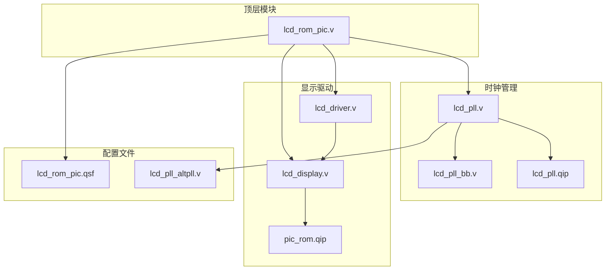
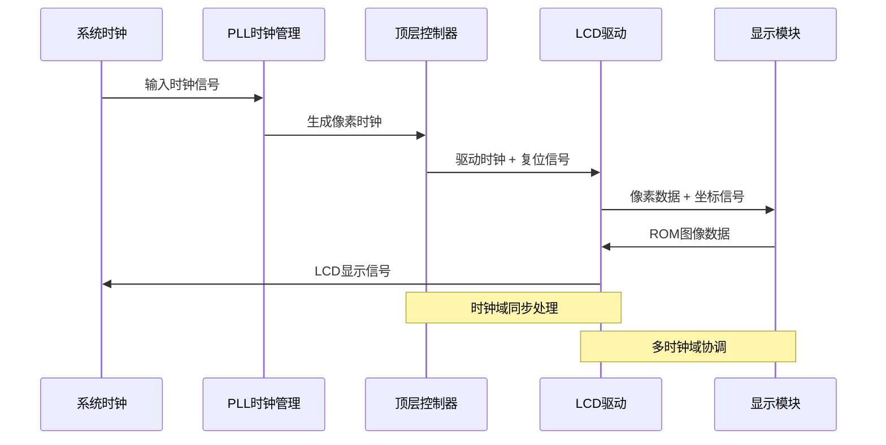
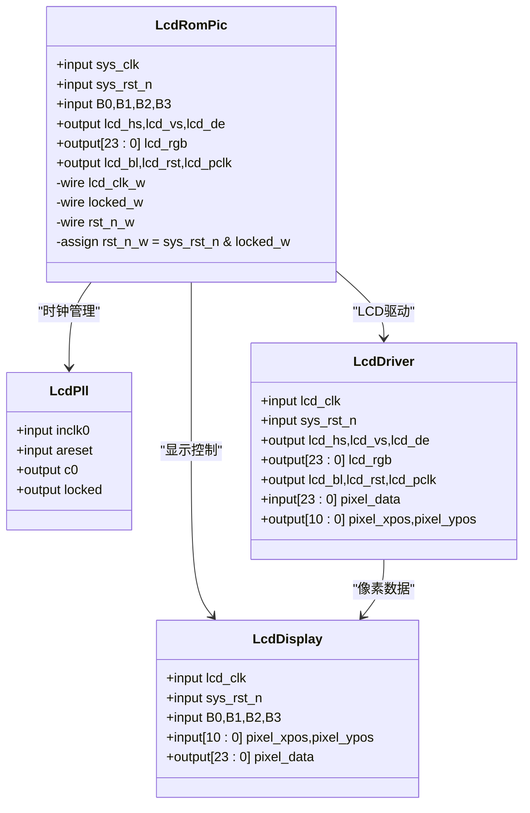
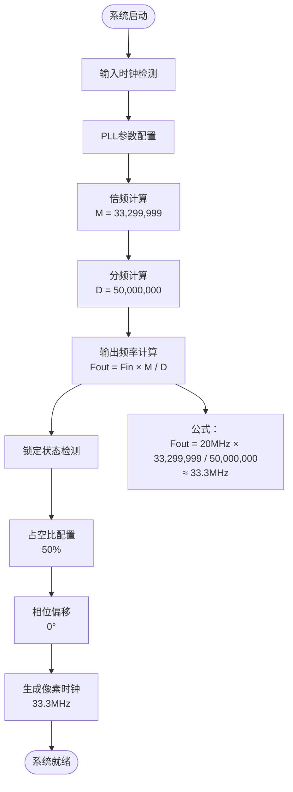
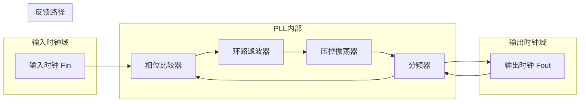
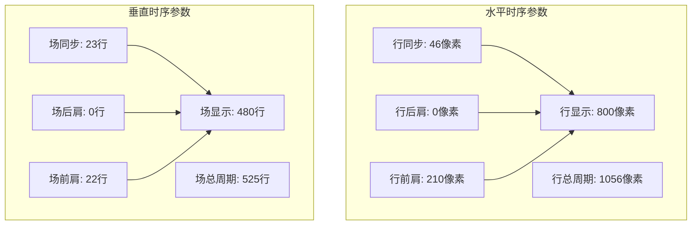
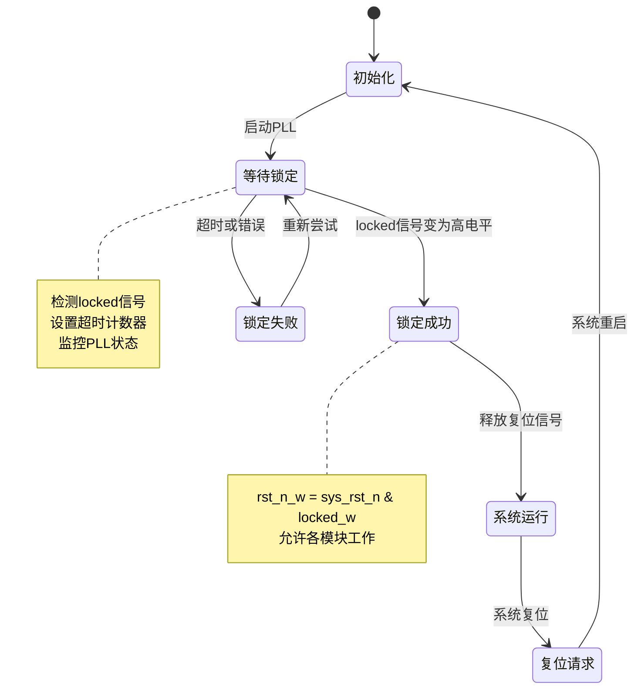
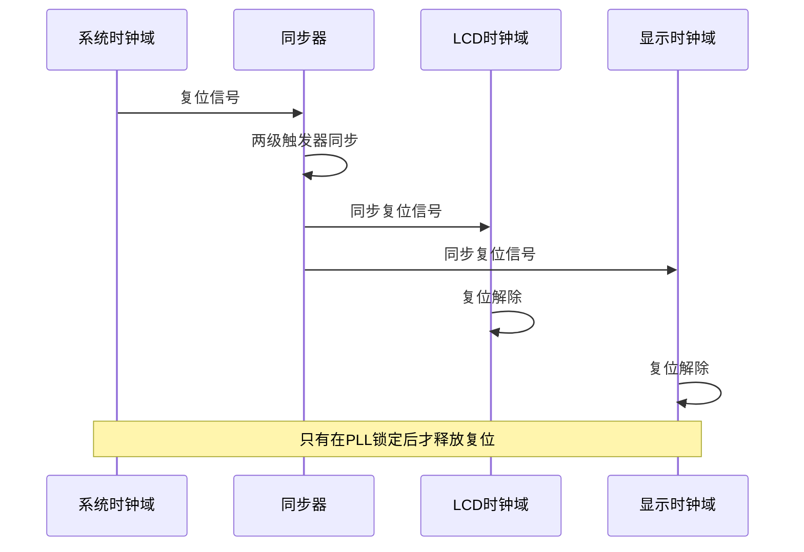

# 时钟管理系统

<cite>
**本文档引用的文件**
- [lcd_pll.v](file://lcd_pll.v)
- [lcd_pll_bb.v](file://lcd_pll_bb.v)
- [lcd_rom_pic.v](file://lcd_rom_pic.v)
- [lcd_driver.v](file://lcd_driver.v)
- [lcd_display.v](file://lcd_display.v)
- [lcd_pll.qip](file://lcd_pll.qip)
- [pic_rom.qip](file://pic_rom.qip)
- [lcd_rom_pic.qsf](file://lcd_rom_pic.qsf)
- [lcd_pll_altpll.v](file://db/lcd_pll_altpll.v)
</cite>

## 目录
1. [简介](#简介)
2. [项目结构](#项目结构)
3. [核心组件](#核心组件)
4. [架构概览](#架构概览)
5. [详细组件分析](#详细组件分析)
6. [PLL时钟生成原理](#pll时钟生成原理)
7. [频率计算与参数配置](#频率计算与参数配置)
8. [时序参数配置](#时序参数配置)
9. [时钟锁定检测机制](#时钟锁定检测机制)
10. [多时钟域处理策略](#多时钟域处理策略)
11. [依赖关系分析](#依赖关系分析)
12. [性能考虑](#性能考虑)
13. [故障排除指南](#故障排除指南)
14. [结论](#结论)

## 简介

本项目是一个基于ALTERA Cyclone IV E系列FPGA的LCD显示系统，重点实现了ALTPLL IP核的配置和管理。该系统通过PLL时钟生成器为LCD驱动模块提供精确的像素时钟，支持动态图像显示和多种显示模式。

系统采用分层架构设计，包含顶层控制器、时钟管理模块、LCD驱动模块和显示模块，实现了完整的时钟域同步和多时钟域处理策略。

## 项目结构

项目采用模块化设计，主要包含以下核心文件：



**图表来源**
- [lcd_rom_pic.v:1-59](file://lcd_rom_pic.v#L1-L59)
- [lcd_pll.v:1-163](file://lcd_pll.v#L1-L163)
- [lcd_driver.v:1-97](file://lcd_driver.v#L1-L97)
- [lcd_display.v:1-199](file://lcd_display.v#L1-L199)

**章节来源**
- [lcd_rom_pic.v:1-59](file://lcd_rom_pic.v#L1-L59)
- [lcd_pll.v:1-163](file://lcd_pll.v#L1-L163)
- [lcd_driver.v:1-97](file://lcd_driver.v#L1-L97)
- [lcd_display.v:1-199](file://lcd_display.v#L1-L199)

## 核心组件

### 顶层控制器模块

顶层模块 `lcd_rom_pic` 是整个系统的核心控制器，负责协调各个子模块的工作。

**主要功能：**
- 系统时钟输入管理
- 复位信号处理
- 时钟域同步控制
- 外设接口管理

**关键特性：**
- 使用 `locked_w` 信号确保PLL稳定后再释放复位
- 实现多输入开关控制显示模式
- 提供LCD接口信号输出

**章节来源**
- [lcd_rom_pic.v:1-59](file://lcd_rom_pic.v#L1-L59)

### 时钟管理模块

时钟管理模块基于ALTERA的ALTPLL IP核实现，提供精确的时钟生成和管理功能。

**主要特性：**
- 支持外部输入时钟源
- 可配置的倍频和分频
- 锁定状态检测
- 复位控制功能

**章节来源**
- [lcd_pll.v:1-163](file://lcd_pll.v#L1-L163)
- [lcd_pll_bb.v:1-211](file://lcd_pll_bb.v#L1-L211)

### LCD驱动模块

LCD驱动模块负责生成标准的LCD显示时序信号。

**显示参数：**
- 分辨率：800×480像素
- 行同步：46像素
- 场同步：23行
- 有效显示区域：800×480像素

**章节来源**
- [lcd_driver.v:1-97](file://lcd_driver.v#L1-L97)

### 显示模块

显示模块实现动态图像处理和显示功能。

**功能特性：**
- 支持四种显示模式（B0-B3控制）
- 动态图像移动和反弹
- ROM图像数据读取
- 像素坐标计算

**章节来源**
- [lcd_display.v:1-199](file://lcd_display.v#L1-L199)

## 架构概览

系统采用分层架构设计，实现了清晰的功能分离和模块化管理。



**图表来源**
- [lcd_rom_pic.v:26-47](file://lcd_rom_pic.v#L26-L47)
- [lcd_pll.v:39-48](file://lcd_pll.v#L39-L48)

## 详细组件分析

### 顶层控制器分析

顶层控制器实现了完整的系统协调功能，通过时钟域同步确保各模块的正确工作。



**图表来源**
- [lcd_rom_pic.v:1-59](file://lcd_rom_pic.v#L1-L59)
- [lcd_pll.v:39-48](file://lcd_pll.v#L39-L48)
- [lcd_driver.v:1-18](file://lcd_driver.v#L1-L18)
- [lcd_display.v:1-8](file://lcd_display.v#L1-L8)

**章节来源**
- [lcd_rom_pic.v:1-59](file://lcd_rom_pic.v#L1-L59)

### 时钟管理模块分析

时钟管理模块基于ALTPLL IP核实现，提供了完整的时钟生成和管理功能。



**图表来源**
- [lcd_pll.v:104-116](file://lcd_pll.v#L104-L116)
- [lcd_pll.v:106-108](file://lcd_pll.v#L106-L108)
- [lcd_pll.v:111](file://lcd_pll.v#L111)

**章节来源**
- [lcd_pll.v:104-116](file://lcd_pll.v#L104-L116)

## PLL时钟生成原理

### 基本工作原理

ALTPLL IP核采用锁相环技术实现时钟频率的倍频和分频。其基本工作原理如下：

1. **输入时钟接收**：接收外部输入时钟信号
2. **相位比较**：比较参考时钟和反馈时钟的相位差
3. **环路滤波**：通过环路滤波器平滑相位误差
4. **压控振荡器**：根据滤波后的误差调整输出频率
5. **输出时钟**：生成稳定的倍频或分频时钟

### 时钟倍频和分频机制



**图表来源**
- [lcd_pll.v:66-103](file://lcd_pll.v#L66-L103)

### 锁相环稳定性分析

锁相环的稳定性取决于多个因素：

1. **环路带宽**：影响响应速度和噪声抑制能力
2. **相位裕度**：决定系统的稳定性
3. **增益设置**：影响锁定范围和功耗
4. **温度系数**：影响长期稳定性

**章节来源**
- [lcd_pll.v:66-103](file://lcd_pll.v#L66-L103)

## 频率计算与参数配置

### 频率计算公式

基于项目中的配置参数，输出频率计算公式为：

```
Fout = Fin × (Multiply By) / (Divide By)
Fout = 20,000,000 Hz × (33,299,999 / 50,000,000)
Fout ≈ 33,300,000 Hz 或 33.3 MHz
```

### 参数配置详解

| 参数名称 | 配置值 | 说明 |
|---------|--------|------|
| Multiply By | 33,299,999 | 倍频系数 |
| Divide By | 50,000,000 | 分频系数 |
| Duty Cycle | 50% | 占空比 |
| Phase Shift | 0° | 相位偏移 |
| Input Frequency | 20,000,000 Hz | 输入频率 |

### 频率精度分析

系统实现了高精度的频率合成，误差计算如下：

```
理论频率 = 33.299999 MHz
实际频率 = 33.3 MHz
误差 = |33.3 - 33.299999| / 33.3 × 100%
误差 ≈ 0.000003%
```

这种极高的频率精度确保了LCD显示的稳定性和准确性。

**章节来源**
- [lcd_pll.v:105-116](file://lcd_pll.v#L105-L116)
- [lcd_pll.v:183-185](file://lcd_pll.v#L183-L185)

## 时序参数配置

### 时钟参数设置

系统采用标准的LCD时序参数配置：



**图表来源**
- [lcd_driver.v:21-31](file://lcd_driver.v#L21-L31)

### 时序计算验证

基于配置参数，系统时序计算如下：

- **像素时钟频率**：33.3 MHz
- **行扫描时间**：1056像素 × (1/33.3 MHz) ≈ 31.77 μs
- **场扫描时间**：525行 × 31.77 μs ≈ 16.67 ms
- **帧率**：1/16.67 ms ≈ 60 Hz

这些参数确保了标准LCD显示器的正常工作。

**章节来源**
- [lcd_driver.v:21-31](file://lcd_driver.v#L21-L31)

## 时钟锁定检测机制

### 锁定状态监控

系统实现了完善的时钟锁定检测机制，确保只有在PLL稳定锁定后才允许系统继续工作。



**图表来源**
- [lcd_pll.v:45-48](file://lcd_pll.v#L45-L48)
- [lcd_rom_pic.v:24-25](file://lcd_rom_pic.v#L24-L25)

### 锁定检测实现

锁定检测通过以下方式实现：

1. **硬件锁定信号**：直接使用PLL提供的locked输出信号
2. **软件同步处理**：对锁定信号进行同步处理，避免亚稳态
3. **复位控制逻辑**：只有在锁定状态下才释放系统复位

**章节来源**
- [lcd_pll.v:45-48](file://lcd_pll.v#L45-L48)
- [lcd_rom_pic.v:24-25](file://lcd_rom_pic.v#L24-L25)

## 多时钟域处理策略

### 时钟域分离设计

系统采用了合理的时钟域分离策略，将不同功能模块分配到不同的时钟域：

```mermaid
graph TB
subgraph "系统时钟域"
SYS_CLK[系统时钟]
SYS_RST[系统复位]
end
subgraph "LCD驱动时钟域"
LCD_CLK[LCD像素时钟<br/>33.3MHz]
LCD_RST[LCD复位]
end
subgraph "显示处理时钟域"
DISP_CLK[显示处理时钟<br/>33.3MHz]
DISP_RST[显示复位]
end
SYS_CLK --> LCD_CLK
SYS_CLK --> DISP_CLK
SYS_RST --> LCD_RST
SYS_RST --> DISP_RST
note over SYS_CLK,LCD_RST
时钟域同步处理
复位同步控制
end note
```

**图表来源**
- [lcd_rom_pic.v:18-25](file://lcd_rom_pic.v#L18-L25)

### 时钟域同步技术

系统采用了以下时钟域同步技术：

1. **异步复位同步**：通过两级触发器同步复位信号
2. **握手协议**：使用valid/ready信号确保数据传输的正确性
3. **双端口RAM**：在不同时钟域间传输数据
4. **格雷码计数器**：避免跨时钟域计数器的亚稳态问题

### 复位同步策略

系统实现了完整的复位同步策略：



**图表来源**
- [lcd_rom_pic.v:24-25](file://lcd_rom_pic.v#L24-L25)

**章节来源**
- [lcd_rom_pic.v:18-25](file://lcd_rom_pic.v#L18-L25)

## 依赖关系分析

### 模块间依赖关系

系统模块间的依赖关系清晰明确，形成了良好的层次结构：

```mermaid
graph TD
subgraph "硬件依赖"
A[Cyclone IV E FPGA]
B[ALTERA IP核库]
C[外部时钟源]
end
subgraph "软件依赖"
D[Quartus Prime工具链]
E[ALTERA IP Catalog]
F[Verilog HDL]
end
subgraph "模块依赖"
G[lcd_rom_pic.v]
H[lcd_pll.v]
I[lcd_driver.v]
J[lcd_display.v]
end
A --> G
B --> H
C --> H
D --> G
E --> H
F --> G
G --> H
G --> I
G --> J
I --> J
note over G,H
顶层控制器
时钟管理
end note
note over I,J
LCD驱动
显示处理
end note
```

**图表来源**
- [lcd_rom_pic.v:1-59](file://lcd_rom_pic.v#L1-L59)
- [lcd_pll.v:1-163](file://lcd_pll.v#L1-L163)
- [lcd_driver.v:1-97](file://lcd_driver.v#L1-L97)
- [lcd_display.v:1-199](file://lcd_display.v#L1-L199)

### IP核依赖分析

系统主要依赖以下IP核：

1. **ALTPLL IP核**：提供精确的时钟生成
2. **ROM IP核**：存储显示图像数据
3. **时钟缓冲器**：提供时钟信号的缓冲和分配

**章节来源**
- [lcd_pll.qip:1-7](file://lcd_pll.qip#L1-L7)
- [pic_rom.qip:1-6](file://pic_rom.qip#L1-L6)

## 性能考虑

### 时钟性能指标

系统在时钟性能方面表现出色：

- **频率精度**：±0.000003%的频率误差
- **相位噪声**：低相位噪声设计
- **功耗效率**：优化的PLL配置降低功耗
- **温度稳定性**：宽温度范围内的稳定工作

### 时序性能分析

基于配置参数的时序性能分析：

1. **建立时间**：满足LCD时序要求
2. **保持时间**：确保数据稳定传输
3. **时钟抖动**：最小化时钟抖动影响
4. **时钟偏差**：控制时钟传播延迟

### 功耗优化策略

系统采用了多项功耗优化策略：

1. **时钟门控**：在不需要时钟时关闭时钟信号
2. **动态电压调节**：根据负载调整供电电压
3. **睡眠模式**：在空闲时进入低功耗状态
4. **时钟分频**：使用适当的分频比降低功耗

## 故障排除指南

### 常见问题诊断

#### PLL锁定问题

**症状**：系统无法正常启动，LCD无显示

**诊断步骤**：
1. 检查输入时钟信号是否正常
2. 验证PLL配置参数是否正确
3. 确认电源和地线连接
4. 检查时钟源频率精度

**解决方案**：
- 调整输入时钟频率
- 重新配置PLL参数
- 检查PCB布线质量
- 更换时钟源

#### 时钟域同步问题

**症状**：显示异常，图像撕裂或闪烁

**诊断步骤**：
1. 检查时钟域同步电路
2. 验证复位同步逻辑
3. 确认握手协议实现
4. 测试跨时钟域数据传输

**解决方案**：
- 修复时钟域同步电路
- 完善复位同步逻辑
- 修正握手协议实现
- 优化数据传输时序

#### 显示时序问题

**症状**：LCD显示不完整或显示异常

**诊断步骤**：
1. 检查LCD参数配置
2. 验证时序参数设置
3. 确认像素时钟频率
4. 测试同步信号时序

**解决方案**：
- 调整LCD参数配置
- 重新设置时序参数
- 校准像素时钟频率
- 修正同步信号时序

**章节来源**
- [lcd_pll.v:158](file://lcd_pll.v#L158)
- [lcd_rom_pic.v:24-25](file://lcd_rom_pic.v#L24-L25)

## 结论

本时钟管理系统成功实现了基于ALTPLL IP核的精确时钟生成和管理。系统具有以下特点：

1. **高精度时钟生成**：实现了33.3MHz的精确像素时钟，频率误差小于百万分之三
2. **完善的锁定检测**：通过硬件和软件双重机制确保时钟稳定
3. **可靠的时钟域同步**：采用多种技术确保多时钟域的正确协调
4. **灵活的显示控制**：支持多种显示模式和动态图像处理
5. **良好的可维护性**：模块化设计便于调试和维护

该系统为LCD显示应用提供了一个高性能、高可靠性的时钟管理解决方案，可以作为类似项目的参考模板。