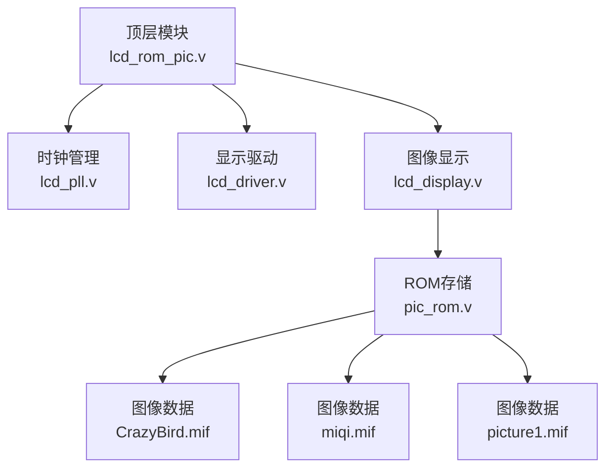
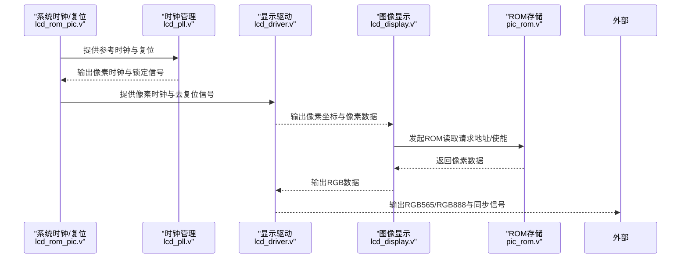
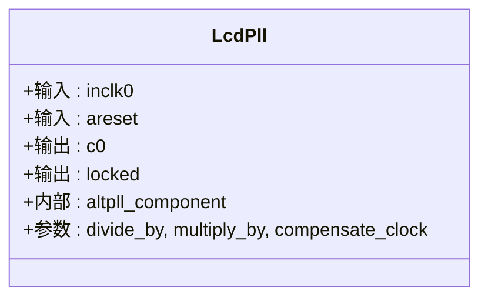
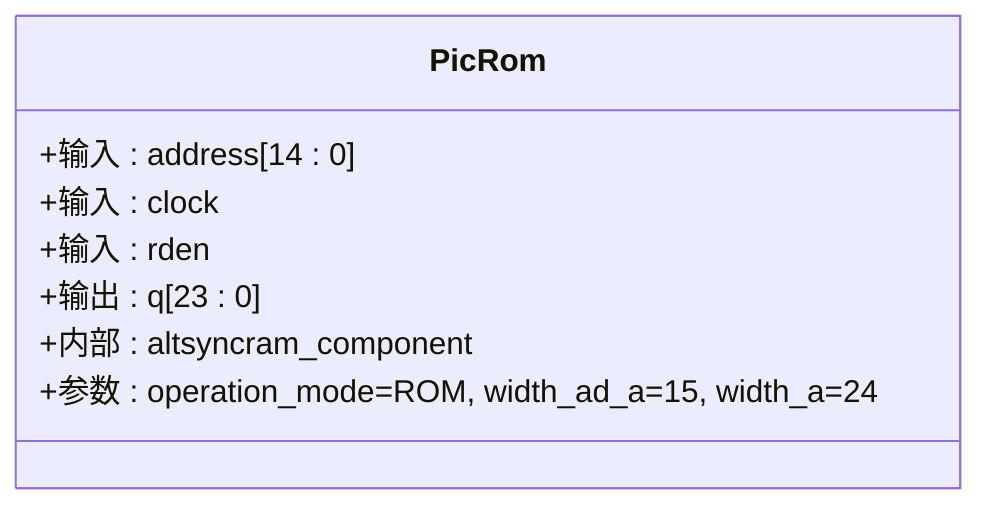
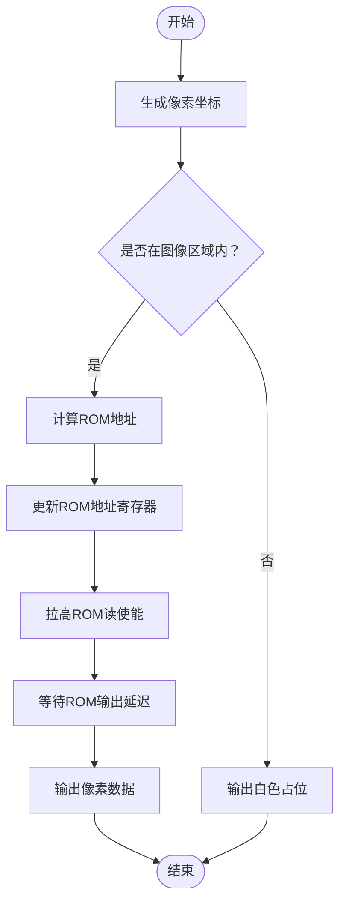
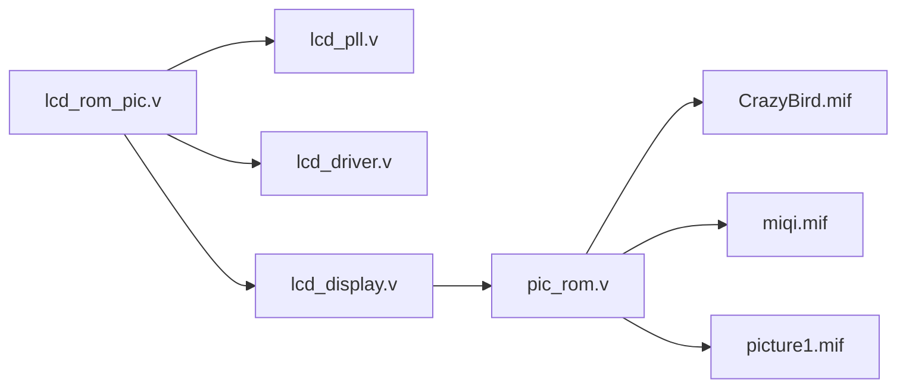

# 硬件组件

<cite>
**本文引用的文件**
- [lcd_pll.v](file://lcd_pll.v)
- [pic_rom.v](file://pic_rom.v)
- [lcd_display.v](file://lcd_display.v)
- [lcd_driver.v](file://lcd_driver.v)
- [lcd_rom_pic.v](file://lcd_rom_pic.v)
- [CrazyBird.mif](file://CrazyBird.mif)
- [miqi.mif](file://miqi.mif)
- [picture1.mif](file://picture1.mif)
- [lcd_pll_bb.v](file://lcd_pll_bb.v)
- [pic_rom_bb.v](file://pic_rom_bb.v)
- [lcd_rom_pic.qsf](file://lcd_rom_pic.qsf)
</cite>

## 目录
1. [引言](#引言)
2. [项目结构](#项目结构)
3. [核心组件](#核心组件)
4. [架构总览](#架构总览)
5. [详细组件分析](#详细组件分析)
6. [依赖关系分析](#依赖关系分析)
7. [性能考量](#性能考量)
8. [故障排查指南](#故障排查指南)
9. [结论](#结论)
10. [附录](#附录)

## 引言
本文件面向“LCD ROM 图片”项目中的硬件组件，系统性梳理并解释以下内容：
- 关键硬件IP核：ALTPLL时钟管理IP核与ALTSYNCRAM ROM IP核的配置、参数与实例化方法
- MIF文件格式与图像数据存储结构
- 硬件接口规范与电气特性映射
- 从顶层到子模块的数据流与控制流路径
- 性能参数与优化建议
- 常见问题定位与处理思路

## 项目结构
该项目采用自顶向下的模块化设计，顶层实体将时钟管理、显示驱动与图像ROM读取组合为完整的LCD显示系统。关键文件与职责如下：
- 顶层模块：lcd_rom_pic.v
- 时钟管理：lcd_pll.v（ALTPLL）、lcd_pll_bb.v（后端视图）
- 显示驱动：lcd_driver.v（生成RGB565像素数据与同步信号）
- 图像显示：lcd_display.v（基于ROM数据合成像素颜色）
- ROM存储：pic_rom.v（ALTSYNCRAM ROM模式）、pic_rom_bb.v（后端视图）
- 图像数据：CrazyBird.mif、miqi.mif、picture1.mif（不同位宽与尺寸）

**图表来源**
- [lcd_rom_pic.v:1-59](file://lcd_rom_pic.v#L1-L59)
- [lcd_pll.v:1-165](file://lcd_pll.v#L1-L165)
- [lcd_driver.v:1-97](file://lcd_driver.v#L1-L97)
- [lcd_display.v:1-199](file://lcd_display.v#L1-L199)
- [pic_rom.v:1-105](file://pic_rom.v#L1-L105)
- [CrazyBird.mif:1-800](file://CrazyBird.mif#L1-L800)
- [miqi.mif:1-800](file://miqi.mif#L1-L800)
- [picture1.mif:1-800](file://picture1.mif#L1-L800)

**章节来源**
- [lcd_rom_pic.v:1-59](file://lcd_rom_pic.v#L1-L59)
- [lcd_pll.v:1-165](file://lcd_pll.v#L1-L165)
- [lcd_driver.v:1-97](file://lcd_driver.v#L1-L97)
- [lcd_display.v:1-199](file://lcd_display.v#L1-L199)
- [pic_rom.v:1-105](file://pic_rom.v#L1-L105)

## 核心组件
本节聚焦两大硬件IP核与图像数据存储层，解释其功能、参数与集成方式。

- ALTPLL时钟管理IP核
  - 作用：将外部参考时钟转换为LCD驱动所需的像素时钟（约33.3 MHz）
  - 关键参数：输入频率、倍乘/分频比、补偿时钟选择、锁定输出等
  - 实例化：顶层模块通过lcd_pll.v例化并使用locked信号作为系统复位去使能条件
  - 参考定义：[lcd_pll.v:104-159](file://lcd_pll.v#L104-L159)

- ALTSYNCRAM ROM IP核
  - 作用：以只读模式从MIF初始化文件中按地址读取像素数据
  - 配置：操作模式为ROM、宽度与深度、初始化文件名、输出寄存器等
  - 实例化：lcd_display.v通过pic_rom.v例化ROM，提供24位RGB数据
  - 参考定义：[pic_rom.v:85-99](file://pic_rom.v#L85-L99)

**章节来源**
- [lcd_pll.v:104-159](file://lcd_pll.v#L104-L159)
- [pic_rom.v:85-99](file://pic_rom.v#L85-L99)

## 架构总览
系统工作流程：
- 顶层模块接收系统时钟与复位，经由PLL生成LCD像素时钟
- 显示驱动模块根据像素时钟生成行/场同步与像素坐标
- 图像显示模块根据坐标判断是否处于图像区域内，计算ROM地址并发起读取
- ROM模块按地址返回像素数据，最终驱动LCD屏幕显示

**图表来源**
- [lcd_rom_pic.v:26-58](file://lcd_rom_pic.v#L26-L58)
- [lcd_pll.v:66-103](file://lcd_pll.v#L66-L103)
- [lcd_driver.v:33-94](file://lcd_driver.v#L33-L94)
- [lcd_display.v:125-198](file://lcd_display.v#L125-L198)
- [pic_rom.v:61-84](file://pic_rom.v#L61-L84)

## 详细组件分析

### ALTPLL时钟管理IP核（lcd_pll.v）
- 参数要点
  - 输入频率与单位：参考定义中包含输入频率与单位字段
  - 倍乘/分频：通过divide_by与multiply_by参数确定输出频率
  - 补偿时钟：选择CLK0作为补偿时钟
  - 锁定输出：用于控制系统复位去使能
- 实例化要点
  - 使用areset与inclk0端口
  - 输出c0为像素时钟，locked指示PLL锁定状态
- 参考定义
  - 实例化端口与连线：[lcd_pll.v:66-103](file://lcd_pll.v#L66-L103)
  - 参数表：[lcd_pll.v:104-159](file://lcd_pll.v#L104-L159)
  - 顶层例化：[lcd_rom_pic.v:26-32](file://lcd_rom_pic.v#L26-L32)

**图表来源**
- [lcd_pll.v:39-103](file://lcd_pll.v#L39-L103)
- [lcd_pll.v:104-159](file://lcd_pll.v#L104-L159)

**章节来源**
- [lcd_pll.v:66-103](file://lcd_pll.v#L66-L103)
- [lcd_pll.v:104-159](file://lcd_pll.v#L104-L159)
- [lcd_rom_pic.v:26-32](file://lcd_rom_pic.v#L26-L32)

### ALTSYNCRAM ROM IP核（pic_rom.v）
- 功能与模式
  - 操作模式：ROM
  - 宽度与深度：地址宽度与数据宽度满足图像像素存储需求
  - 初始化文件：从MIF文件加载图像数据
- 实例化要点
  - 单端口读取：address、clock、rden、q
  - 输出寄存器：未注册（UNREGISTERED）
- 参考定义
  - 实例化端口与连线：[pic_rom.v:61-84](file://pic_rom.v#L61-L84)
  - 参数表：[pic_rom.v:85-99](file://pic_rom.v#L85-L99)
  - 顶层例化：[lcd_display.v:192-198](file://lcd_display.v#L192-L198)

**图表来源**
- [pic_rom.v:39-84](file://pic_rom.v#L39-L84)
- [pic_rom.v:85-99](file://pic_rom.v#L85-L99)

**章节来源**
- [pic_rom.v:61-84](file://pic_rom.v#L61-L84)
- [pic_rom.v:85-99](file://pic_rom.v#L85-L99)
- [lcd_display.v:192-198](file://lcd_display.v#L192-L198)

### 图像显示与坐标生成（lcd_display.v 与 lcd_driver.v）
- 坐标生成
  - 行/场计数器生成像素坐标，考虑有效显示窗口与提前一个时钟周期的要求
  - 有效显示范围由参数决定，输出像素坐标给显示模块
- 图像显示逻辑
  - 根据当前像素坐标判断是否处于图像区域内
  - 计算ROM地址（相对图像左上角），并生成读使能信号
  - ROM输出延迟一个时钟周期，通过valid信号同步
- 参考定义
  - 坐标生成与有效范围：[lcd_driver.v:20-94](file://lcd_driver.v#L20-L94)
  - 图像显示与ROM读取：[lcd_display.v:125-198](file://lcd_display.v#L125-L198)

**图表来源**
- [lcd_driver.v:63-69](file://lcd_driver.v#L63-L69)
- [lcd_display.v:133-186](file://lcd_display.v#L133-L186)

**章节来源**
- [lcd_driver.v:20-94](file://lcd_driver.v#L20-L94)
- [lcd_display.v:125-198](file://lcd_display.v#L125-L198)

### MIF文件格式与图像数据存储
- 文件格式
  - DEPTH：存储单元总数
  - WIDTH：每个存储单元的位宽
  - ADDRESS_RADIX：地址基数（无符号十进制）
  - DATA_RADIX：数据基数（十六进制）
  - CONTENT BEGIN...END：逐地址写入数据
- 图像数据结构
  - 项目包含三类MIF文件：
    - CrazyBird.mif：23800个条目，每个24位（RGB888）
    - miqi.mif：10000个条目，每个24位（RGB888）
    - picture1.mif：10000个条目，每个16位（RGB565）
  - 读取时需确保ROM地址空间与MIF条目数量匹配，避免越界访问
- 参考定义
  - CrazyBird.mif头段与示例：[CrazyBird.mif:1-800](file://CrazyBird.mif#L1-L800)
  - miqi.mif头段与示例：[miqi.mif:1-800](file://miqi.mif#L1-L800)
  - picture1.mif头段与示例：[picture1.mif:1-800](file://picture1.mif#L1-L800)
  - ROM参数与初始化文件：[pic_rom.v:89](file://pic_rom.v#L89)

**章节来源**
- [CrazyBird.mif:1-800](file://CrazyBird.mif#L1-L800)
- [miqi.mif:1-800](file://miqi.mif#L1-L800)
- [picture1.mif:1-800](file://picture1.mif#L1-L800)
- [pic_rom.v:89](file://pic_rom.v#L89)

## 依赖关系分析
- 顶层模块依赖时钟管理与显示驱动模块
- 显示驱动模块依赖像素时钟与复位信号
- 图像显示模块依赖驱动模块提供的坐标与像素数据
- ROM模块依赖显示模块提供的地址与读使能信号
- ROM模块依赖MIF文件中的图像数据

**图表来源**
- [lcd_rom_pic.v:26-58](file://lcd_rom_pic.v#L26-L58)
- [lcd_pll.v:66-103](file://lcd_pll.v#L66-L103)
- [lcd_driver.v:33-94](file://lcd_driver.v#L33-L94)
- [lcd_display.v:192-198](file://lcd_display.v#L192-L198)
- [pic_rom.v:61-84](file://pic_rom.v#L61-L84)
- [CrazyBird.mif:1](file://CrazyBird.mif#L1)
- [miqi.mif:1](file://miqi.mif#L1)
- [picture1.mif:1](file://picture1.mif#L1)

**章节来源**
- [lcd_rom_pic.v:26-58](file://lcd_rom_pic.v#L26-L58)
- [lcd_pll.v:66-103](file://lcd_pll.v#L66-L103)
- [lcd_driver.v:33-94](file://lcd_driver.v#L33-L94)
- [lcd_display.v:192-198](file://lcd_display.v#L192-L198)
- [pic_rom.v:61-84](file://pic_rom.v#L61-L84)

## 性能考量
- 时钟频率与稳定性
  - PLL输出频率需满足LCD像素时钟要求；锁定信号用于系统级去复位，避免未锁定时钟导致显示异常
- ROM访问时序
  - 读使能到数据有效的延迟需在显示模块中正确处理，避免画面撕裂或闪烁
- 地址计算与边界检查
  - 图像区域内地址计算应与ROM深度匹配，防止地址越界
- 数据位宽一致性
  - ROM输出位宽与驱动模块期望位宽（RGB565或RGB888）需一致，必要时进行格式转换

[本节为通用指导，无需特定文件引用]

## 故障排查指南
- PLL未锁定
  - 现象：locked为低电平，系统复位持续
  - 排查：检查输入频率设置、PLL参数与引脚约束
  - 参考：[lcd_pll.v:104-159](file://lcd_pll.v#L104-L159)，[lcd_rom_pic.v:25](file://lcd_rom_pic.v#L25)
- 显示花屏或黑屏
  - 现象：画面异常或无显示
  - 排查：确认像素时钟极性、有效显示窗口参数、坐标生成逻辑
  - 参考：[lcd_driver.v:20-94](file://lcd_driver.v#L20-L94)
- 图像错位或缺失
  - 现象：图像位置不正确或部分缺失
  - 排查：检查图像位置寄存器、地址计算公式、ROM深度与MIF条目数量
  - 参考：[lcd_display.v:125-198](file://lcd_display.v#L125-L198)，[pic_rom.v:89](file://pic_rom.v#L89)
- 数据位宽不匹配
  - 现象：颜色异常或显示异常
  - 排查：确认ROM输出位宽与驱动模块期望位宽一致
  - 参考：[pic_rom.v:98](file://pic_rom.v#L98)，[lcd_driver.v:9](file://lcd_driver.v#L9)

**章节来源**
- [lcd_pll.v:104-159](file://lcd_pll.v#L104-L159)
- [lcd_rom_pic.v:25](file://lcd_rom_pic.v#L25)
- [lcd_driver.v:20-94](file://lcd_driver.v#L20-L94)
- [lcd_display.v:125-198](file://lcd_display.v#L125-L198)
- [pic_rom.v:89](file://pic_rom.v#L89)
- [pic_rom.v:98](file://pic_rom.v#L98)

## 结论
本项目通过ALTPLL与时钟管理与ALTSYNCRAM ROM存储的协同，实现了稳定的LCD图像显示。关键在于：
- 正确配置PLL参数以获得目标像素时钟
- 精确计算ROM地址与边界检查，保证图像区域内的数据访问
- 统一数据位宽与格式，确保驱动模块正确接收像素数据
- 通过锁定信号与复位策略，提升系统启动与运行的可靠性

[本节为总结，无需特定文件引用]

## 附录

### 硬件接口规范与电气特性
- 设备族与器件型号
  - 设备族：Cyclone IV E
  - 器件型号：EP4CE40U19A7
- 顶层实体与工具版本
  - 顶层实体：lcd_rom_pic
  - Quartus版本：18.1.0 Lite Edition
- 引脚分配（示例）
  - LCD RGB数据线、背光、数据使能、行/场同步、像素时钟、复位等
  - 控制开关B0/B1/B2/B3引脚分配
- 参考定义
  - 设备与工具设置：[lcd_rom_pic.qsf:39-44](file://lcd_rom_pic.qsf#L39-L44)
  - 引脚分配：[lcd_rom_pic.qsf:53-91](file://lcd_rom_pic.qsf#L53-L91)

**章节来源**
- [lcd_rom_pic.qsf:39-44](file://lcd_rom_pic.qsf#L39-L44)
- [lcd_rom_pic.qsf:53-91](file://lcd_rom_pic.qsf#L53-L91)