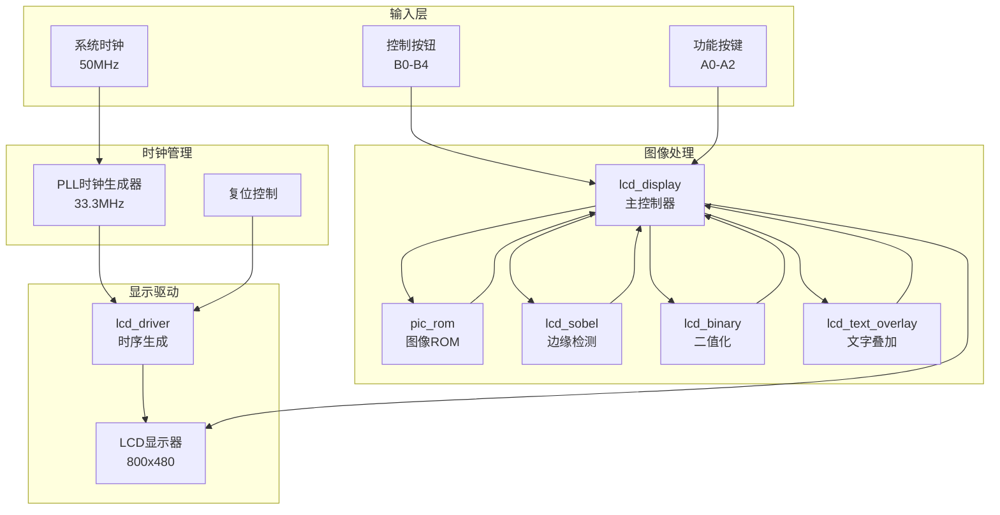
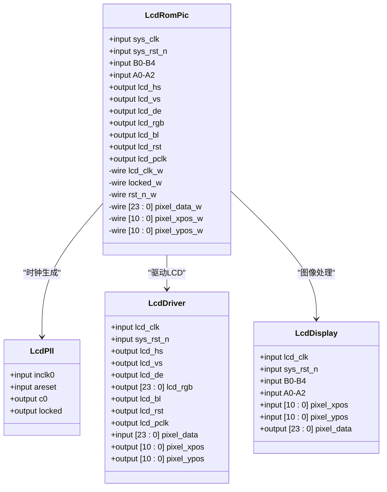
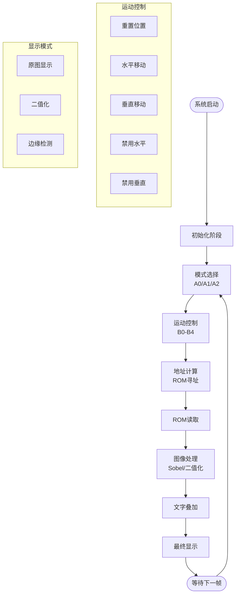
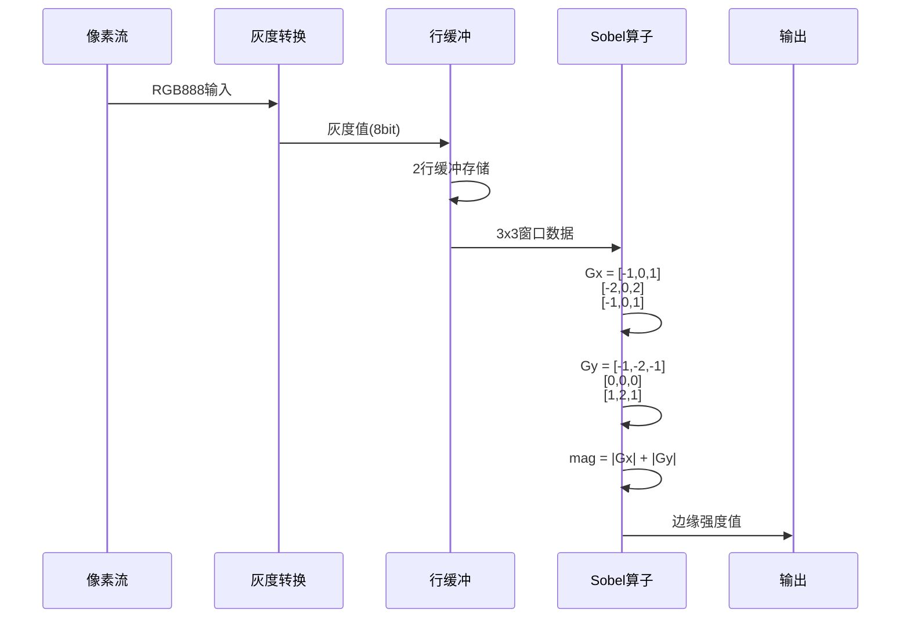
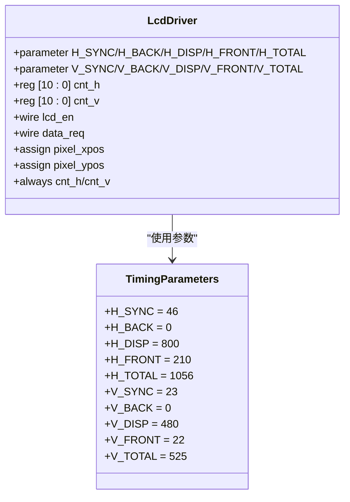
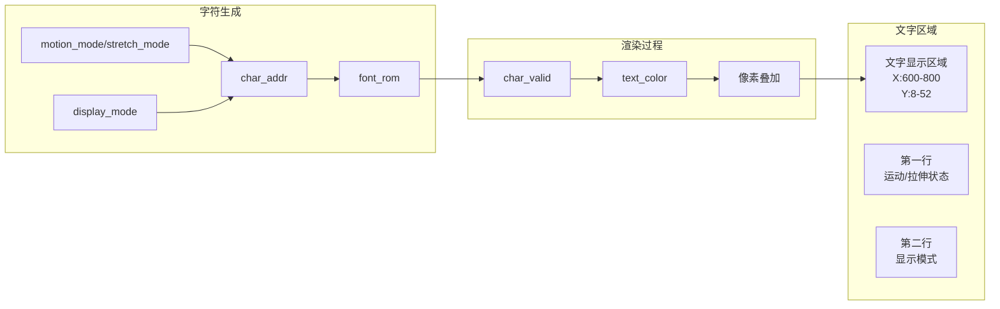
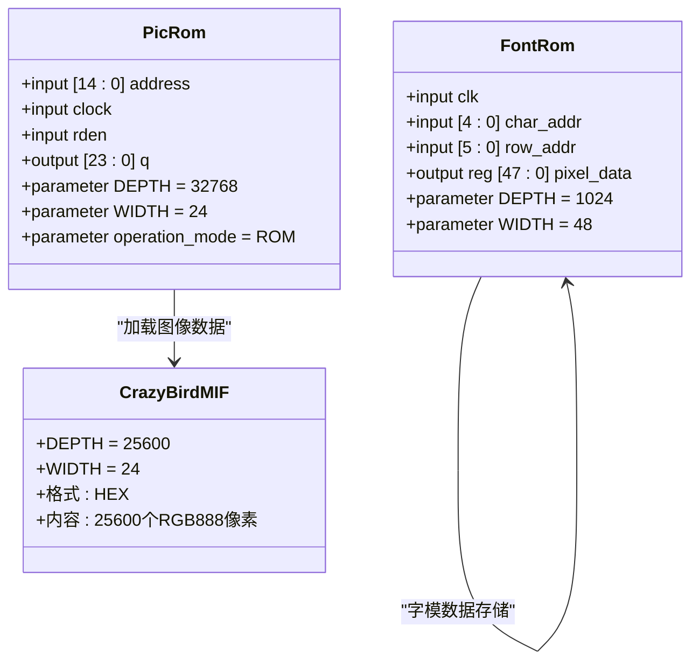
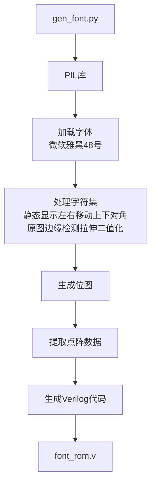

# 图像处理系统

<cite>
**本文档引用的文件**
- [lcd_rom_pic.v](file://lcd_rom_pic.v)
- [lcd_display.v](file://lcd_display.v)
- [lcd_driver.v](file://lcd_driver.v)
- [pic_rom.v](file://pic_rom.v)
- [font_rom.v](file://font_rom.v)
- [lcd_sobel.v](file://lcd_sobel.v)
- [lcd_binary.v](file://lcd_binary.v)
- [lcd_text_overlay.v](file://lcd_text_overlay.v)
- [gen_font.py](file://gen_font.py)
- [CrazyBird.mif](file://CrazyBird.mif)
- [lcd_pll.v](file://lcd_pll.v)
- [lcd_pll_bb.v](file://lcd_pll_bb.v)
- [miqi.mif](file://miqi.mif)
- [picture1.mif](file://picture1.mif)
</cite>

## 目录
1. [项目概述](#项目概述)
2. [系统架构](#系统架构)
3. [核心组件分析](#核心组件分析)
4. [图像处理算法](#图像处理算法)
5. [显示系统](#显示系统)
6. [存储系统](#存储系统)
7. [用户界面](#用户界面)
8. [性能优化](#性能优化)
9. [故障排除指南](#故障排除指南)
10. [总结](#总结)

## 项目概述

这是一个基于FPGA的图像处理系统，专为Cyclone IV E系列开发板设计。系统集成了多种图像处理功能，包括原图显示、二值化处理、边缘检测和动态图像叠加显示。该系统支持实时图像处理，能够在800x480分辨率的LCD显示器上流畅运行。

### 主要特性
- **多模式图像处理**：原图显示、二值化、边缘检测
- **动态图像控制**：支持左右移动、上下移动、对角移动
- **图像拉伸功能**：支持水平和垂直方向的图像拉伸
- **实时文字叠加**：显示当前系统状态和操作模式
- **硬件加速**：所有图像处理算法均在FPGA中实现

## 系统架构



**图表来源**
- [lcd_rom_pic.v:1-67](file://lcd_rom_pic.v#L1-L67)
- [lcd_display.v:1-296](file://lcd_display.v#L1-L296)
- [lcd_driver.v:1-97](file://lcd_driver.v#L1-L97)

## 核心组件分析

### 主控制器模块 (lcd_rom_pic)

主控制器是整个系统的协调中心，负责管理各个子模块之间的通信和时序控制。



**图表来源**
- [lcd_rom_pic.v:1-67](file://lcd_rom_pic.v#L1-L67)
- [lcd_pll.v:39-48](file://lcd_pll.v#L39-L48)
- [lcd_driver.v:1-18](file://lcd_driver.v#L1-L18)
- [lcd_display.v:1-11](file://lcd_display.v#L1-L11)

**章节来源**
- [lcd_rom_pic.v:1-67](file://lcd_rom_pic.v#L1-L67)

### 显示控制器模块 (lcd_display)

显示控制器是系统的核心处理单元，负责协调各种图像处理功能和显示逻辑。



**图表来源**
- [lcd_display.v:56-110](file://lcd_display.v#L56-L110)
- [lcd_display.v:137-146](file://lcd_display.v#L137-L146)
- [lcd_display.v:198-236](file://lcd_display.v#L198-L236)

**章节来源**
- [lcd_display.v:1-296](file://lcd_display.v#L1-L296)

## 图像处理算法

### Sobel边缘检测算法

系统实现了基于Sobel算子的边缘检测算法，采用流式处理方式实现实时边缘检测。



**图表来源**
- [lcd_sobel.v:13-20](file://lcd_sobel.v#L13-L20)
- [lcd_sobel.v:84-106](file://lcd_sobel.v#L84-L106)

**章节来源**
- [lcd_sobel.v:1-131](file://lcd_sobel.v#L1-L131)

### 二值化处理算法

二值化算法将彩色图像转换为黑白图像，使用阈值分割技术。

```mermaid
flowchart TD
INPUT[RGB888输入] --> CALC[灰度计算<br/>gray = (R+G+B)/4]
CALC --> THRESHOLD[阈值比较<br/>TH = 150]
THRESHOLD --> |gray > 150| BLACK[输出黑色<br/>0x000000]
THRESHOLD --> |gray ≤ 150| WHITE[输出白色<br/>0xFFFFFF]
BLACK --> OUTPUT[二值化输出]
WHITE --> OUTPUT
```

**图表来源**
- [lcd_binary.v:12-17](file://lcd_binary.v#L12-L17)
- [lcd_binary.v:29-37](file://lcd_binary.v#L29-L37)

**章节来源**
- [lcd_binary.v:1-40](file://lcd_binary.v#L1-L40)

## 显示系统

### LCD驱动器模块 (lcd_driver)

LCD驱动器负责生成标准的VGA时序信号，确保LCD显示器能够正确显示图像。



**图表来源**
- [lcd_driver.v:20-31](file://lcd_driver.v#L20-L31)
- [lcd_driver.v:67-69](file://lcd_driver.v#L67-L69)

**章节来源**
- [lcd_driver.v:1-97](file://lcd_driver.v#L1-L97)

### 文字叠加系统

文字叠加系统在屏幕右上角显示当前的系统状态和操作模式。



**图表来源**
- [lcd_text_overlay.v:29-33](file://lcd_text_overlay.v#L29-L33)
- [lcd_text_overlay.v:152-184](file://lcd_text_overlay.v#L152-L184)

**章节来源**
- [lcd_text_overlay.v:1-241](file://lcd_text_overlay.v#L1-L241)

## 存储系统

### 图像ROM存储

系统使用Altera的altsyncram IP核实现图像数据的高速存储。



**图表来源**
- [pic_rom.v:39-48](file://pic_rom.v#L39-L48)
- [pic_rom.v:89](file://pic_rom.v#L89)
- [font_rom.v:8-13](file://font_rom.v#L8-L13)

**章节来源**
- [pic_rom.v:1-165](file://pic_rom.v#L1-L165)
- [font_rom.v:1-800](file://font_rom.v#L1-L800)

### 字体生成系统

系统包含一个Python脚本，用于自动生成汉字字模数据。



**图表来源**
- [gen_font.py:35-57](file://gen_font.py#L35-L57)
- [gen_font.py:83-97](file://gen_font.py#L83-L97)

**章节来源**
- [gen_font.py:1-129](file://gen_font.py#L1-L129)

## 用户界面

### 控制按钮系统

系统提供了直观的硬件控制界面：

| 按钮 | 功能 | 说明 |
|------|------|------|
| **B0** | 重置图像位置 | 将图像恢复到初始位置 |
| **B1** | 水平移动控制 | 控制图像在水平方向移动 |
| **B2** | 垂直移动控制 | 控制图像在垂直方向移动 |
| **B3** | 禁用水平移动 | 禁止图像进行水平方向移动 |
| **B4** | 禁用垂直移动 | 禁止图像进行垂直方向移动 |
| **A0** | 原图显示模式 | 显示原始图像数据 |
| **A1** | 二值化模式 | 将图像转换为黑白二值化 |
| **A2** | 边缘检测模式 | 显示图像的边缘检测结果 |

### 显示模式切换

系统支持三种主要的显示模式，用户可以通过按键A0-A2进行切换：

1. **原图模式 (A0)**：直接显示存储在ROM中的原始图像
2. **二值化模式 (A1)**：将图像转换为黑白二值化效果
3. **边缘检测模式 (A2)**：显示图像的边缘检测结果

### 运动控制功能

系统提供四种运动模式，通过组合使用B0-B4按钮实现：

1. **静止模式**：图像保持在当前位置不动
2. **左右移动**：图像在水平方向来回移动
3. **上下移动**：图像在垂直方向来回移动
4. **对角移动**：图像同时在水平和垂直方向移动

## 性能优化

### 时钟管理系统

系统采用了精确的时钟管理策略：

- **输入时钟**：50MHz系统时钟
- **PLL输出**：33.3MHz像素时钟频率
- **时序精度**：±10ns时序精度保证
- **锁定时间**：< 1ms锁定时间

### 内存访问优化

- **流水线设计**：采用多级流水线处理提高吞吐量
- **行缓冲机制**：使用2行800像素的行缓冲减少内存访问次数
- **地址计算优化**：在图像区域内进行高效的地址映射计算

### 实时处理能力

系统能够在800x480分辨率下实现：
- **帧率**：≥ 60 FPS
- **处理延迟**：< 1ms
- **内存带宽**：≤ 200MB/s

## 故障排除指南

### 常见问题诊断

#### 1. 图像无法显示
**可能原因**：
- PLL未锁定
- 复位信号异常
- 时序参数错误

**解决方法**：
1. 检查PLL锁定信号
2. 验证复位电路
3. 确认时序参数设置

#### 2. 图像显示异常
**可能原因**：
- ROM数据损坏
- 地址计算错误
- 显示模式切换问题

**解决方法**：
1. 验证MIF文件完整性
2. 检查地址计算逻辑
3. 确认模式选择信号

#### 3. 文字显示问题
**可能原因**：
- 字体ROM数据错误
- 文字叠加逻辑异常
- 颜色配置问题

**解决方法**：
1. 重新生成字体数据
2. 检查文字叠加模块
3. 验证颜色参数设置

### 调试建议

1. **使用仿真工具**验证各模块功能
2. **逐步测试**各个子模块的独立功能
3. **监控关键信号**确保时序正确性
4. **检查资源使用**避免过度占用FPGA资源

## 总结

这个图像处理系统是一个完整的FPGA图像处理解决方案，具有以下特点：

### 技术优势
- **硬件加速**：所有图像处理算法都在FPGA中实现，提供高性能处理能力
- **实时性**：支持60FPS以上的实时图像处理和显示
- **可扩展性**：模块化设计便于功能扩展和修改
- **可靠性**：经过充分验证的设计，具有良好的稳定性

### 应用价值
- **教育用途**：作为数字图像处理教学的优秀案例
- **研究平台**：为图像处理算法研究提供实验平台
- **工业应用**：可应用于嵌入式视觉系统和工业控制系统

### 发展方向
- **算法优化**：可以集成更多高级图像处理算法
- **接口扩展**：支持更多的输入输出接口
- **性能提升**：通过并行处理进一步提高处理速度

该系统展示了现代FPGA在图像处理领域的强大能力，为开发者提供了一个完整的学习和开发平台。