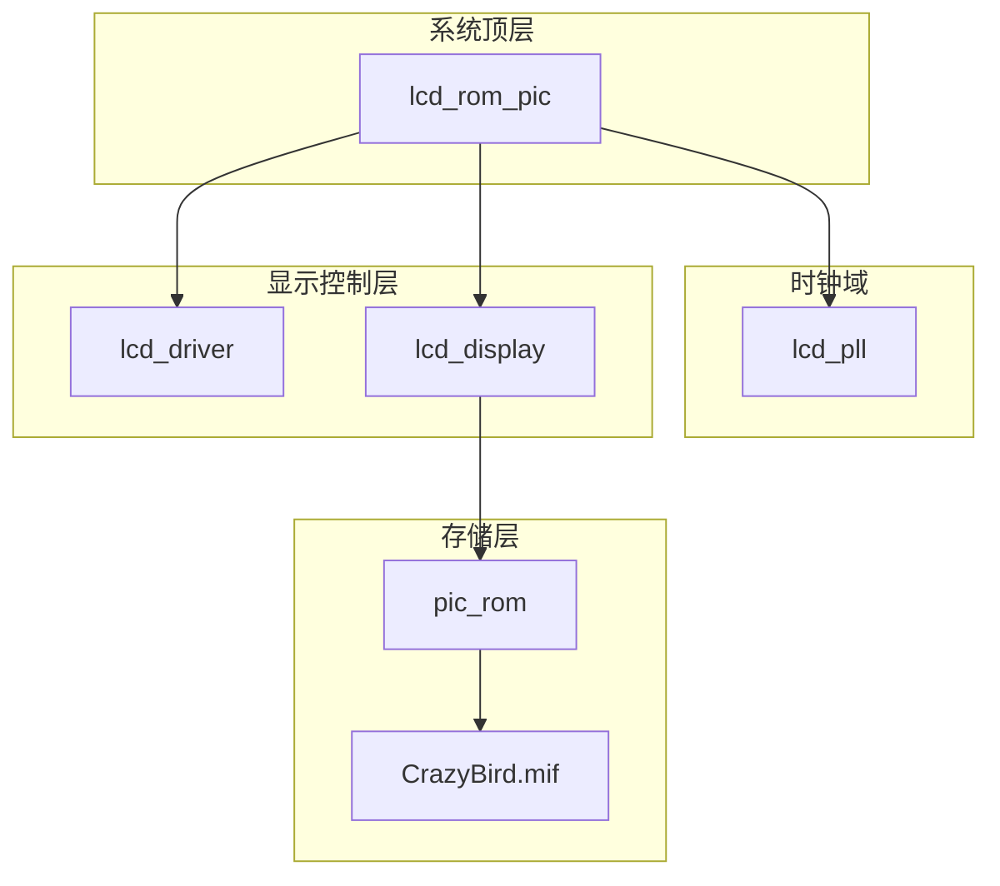
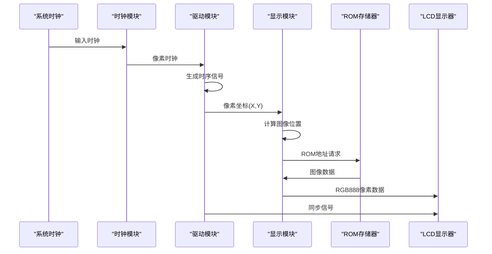
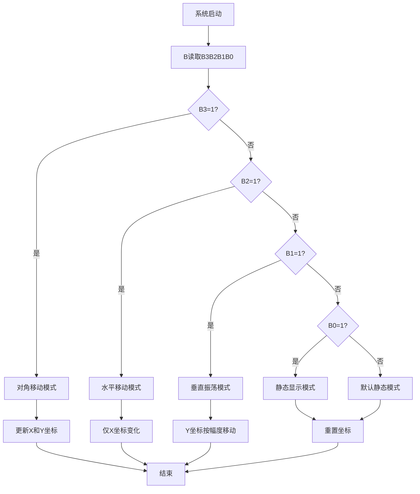
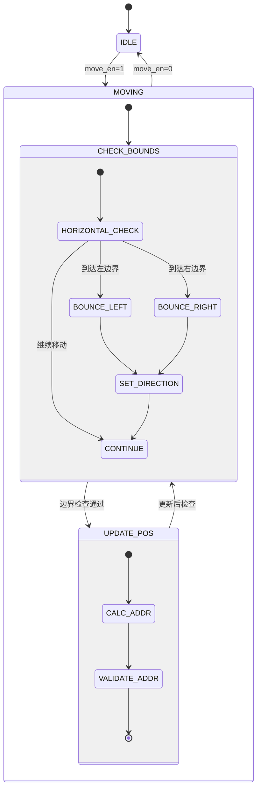
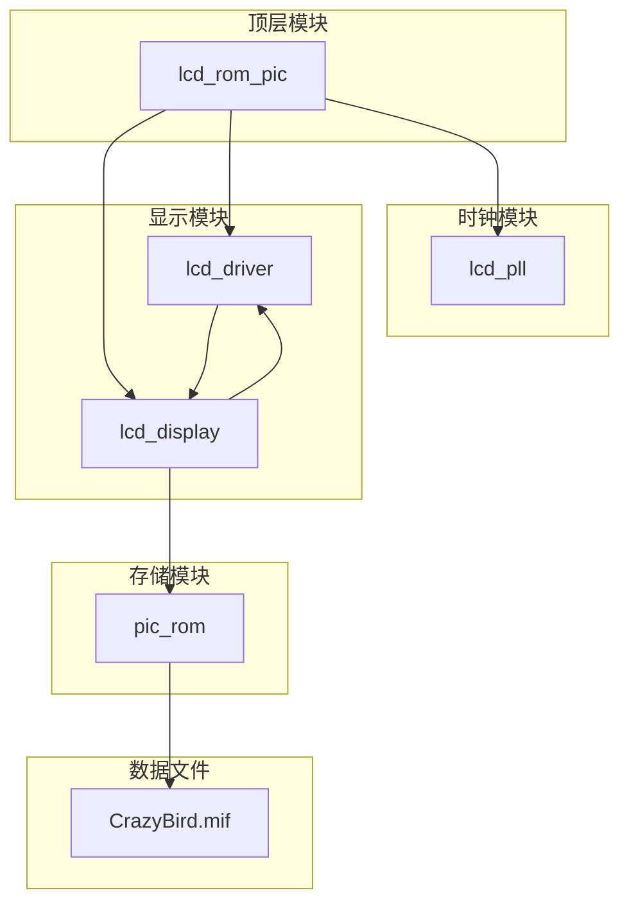

# 图像显示系统

<cite>
**本文档引用的文件**
- [lcd_rom_pic.v](file://lcd_rom_pic.v)
- [lcd_display.v](file://lcd_display.v)
- [lcd_driver.v](file://lcd_driver.v)
- [pic_rom.v](file://pic_rom.v)
- [lcd_pll.v](file://lcd_pll.v)
- [CrazyBird.mif](file://CrazyBird.mif)
- [lcd_display.txt](file://lcd_display.txt)
- [lcd_pll.txt](file://lcd_pll.txt)
</cite>

## 目录
1. [简介](#简介)
2. [项目结构](#项目结构)
3. [核心组件](#核心组件)
4. [架构总览](#架构总览)
5. [详细组件分析](#详细组件分析)
6. [依赖关系分析](#依赖关系分析)
7. [性能考虑](#性能考虑)
8. [故障排除指南](#故障排除指南)
9. [结论](#结论)

## 简介
本项目是一个基于FPGA的LCD图像显示控制系统，实现了静态显示、水平移动、垂直振荡和对角移动四种图像位置控制模式。系统通过硬件开关B0-B3进行模式选择，利用ROM存储图像数据，结合驱动模块生成RGB888像素流输出到LCD屏幕。项目采用流水线式设计，确保在33.3MHz像素时钟下实现稳定的图像渲染。

## 项目结构
项目采用模块化设计，主要包含以下核心模块：
- 主控制器模块：负责系统级协调和时钟管理
- 驱动模块：生成LCD时序信号和像素坐标
- 显示模块：实现图像位置控制和ROM数据读取
- ROM模块：存储图像数据的只读存储器
- 时钟模块：提供稳定的像素时钟



**图表来源**
- [lcd_rom_pic.v:1-59](file://lcd_rom_pic.v#L1-L59)
- [lcd_pll.v:1-321](file://lcd_pll.v#L1-L321)
- [lcd_driver.v:1-97](file://lcd_driver.v#L1-L97)
- [lcd_display.v:1-199](file://lcd_display.v#L1-L199)
- [pic_rom.v:1-165](file://pic_rom.v#L1-L165)

**章节来源**
- [lcd_rom_pic.v:1-59](file://lcd_rom_pic.v#L1-L59)
- [lcd_pll.v:1-321](file://lcd_pll.v#L1-L321)

## 核心组件
系统的核心组件包括四个主要模块，每个模块承担特定的功能职责：

### 主控制器模块 (lcd_rom_pic)
作为系统顶层模块，负责协调各个子模块的工作。该模块接收外部系统时钟和复位信号，通过PLL产生稳定的像素时钟，然后将时钟信号传递给驱动和显示模块。

### 驱动模块 (lcd_driver)
生成LCD显示器所需的时序信号，包括行同步信号(HS)、场同步信号(VS)、数据使能信号(DE)和像素时钟(PCLK)。同时计算当前像素点的(X,Y)坐标，为显示模块提供精确的坐标信息。

### 显示模块 (lcd_display)
实现图像位置控制算法的核心模块，包含运动控制状态机、ROM地址计算和图像数据读取功能。支持四种不同的显示模式，通过硬件开关B0-B3进行选择。

### ROM模块 (pic_rom)
使用Altera IP核实现的只读存储器，存储完整的图像数据。通过MIF文件格式加载图像内容，支持24位RGB数据输出。

**章节来源**
- [lcd_rom_pic.v:1-59](file://lcd_rom_pic.v#L1-L59)
- [lcd_driver.v:1-97](file://lcd_driver.v#L1-L97)
- [lcd_display.v:1-199](file://lcd_display.v#L1-L199)
- [pic_rom.v:1-165](file://pic_rom.v#L1-L165)

## 架构总览
系统采用分层架构设计，从底层硬件到高层控制逐层抽象：



**图表来源**
- [lcd_rom_pic.v:26-58](file://lcd_rom_pic.v#L26-L58)
- [lcd_driver.v:33-94](file://lcd_driver.v#L33-L94)
- [lcd_display.v:125-198](file://lcd_display.v#L125-L198)

系统工作流程：
1. **时钟生成**：PLL将输入时钟转换为33.3MHz的像素时钟
2. **时序生成**：驱动模块生成LCD所需的完整时序信号
3. **坐标计算**：驱动模块计算每个像素点的精确坐标
4. **图像渲染**：显示模块根据坐标判断是否在图像区域内
5. **数据读取**：在图像区域内从ROM读取对应像素数据
6. **显示输出**：将RGB数据输出到LCD显示器

**章节来源**
- [lcd_pll.v:66-103](file://lcd_pll.v#L66-L103)
- [lcd_driver.v:33-94](file://lcd_driver.v#L33-L94)
- [lcd_display.v:125-198](file://lcd_display.v#L125-L198)

## 详细组件分析

### 图像位置控制算法
显示模块实现了四种不同的图像位置控制模式，通过硬件开关B0-B3进行选择：

#### 模式选择机制


**图表来源**
- [lcd_display.v:60-122](file://lcd_display.v#L60-L122)

#### 运动控制状态机设计
系统使用20位计数器实现精确的运动节拍控制：



**图表来源**
- [lcd_display.v:33-46](file://lcd_display.v#L33-L46)
- [lcd_display.v:53-123](file://lcd_display.v#L53-L123)

#### 四种显示模式实现

**1. 静态显示模式 (B0=1)**
- 图像固定在初始位置(230, 150)
- X和Y方向寄存器重置为0
- 适用于需要固定显示图像的场景

**2. 水平移动模式 (B2=1)**
- 图像仅在X轴方向移动
- 遇到屏幕边界时反弹
- 实现左右往复运动效果
- 使用方向寄存器控制移动方向

**3. 垂直振荡模式 (B1=1)**
- 图像在Y轴方向按指定幅度(130像素)振荡
- 从起始位置向上移动130像素后反弹
- 实现上下往复运动效果
- 支持精确的运动幅度控制

**4. 对角移动模式 (B3=1)**
- 图像同时在X和Y轴方向移动
- 采用边界穿透方式，超出屏幕边缘时从对面出现
- 实现对角线运动效果

**章节来源**
- [lcd_display.v:60-122](file://lcd_display.v#L60-L122)
- [lcd_display.v:25-46](file://lcd_display.v#L25-L46)

### 硬件开关解码和模式选择
硬件开关B0-B3通过4位二进制编码实现模式选择：

| 开关组合 | 模式名称 | 功能描述 |
|---------|---------|----------|
| 1000 | 对角移动 | 图像同时在X和Y轴移动，边界穿透 |
| 0100 | 水平移动 | 图像仅在X轴移动，遇边界反弹 |
| 0010 | 垂直振荡 | 图像在Y轴按130像素幅度振荡 |
| 0001 | 静态显示 | 图像固定在初始位置 |
| 其他 | 默认静态 | 所有开关为0时的默认行为 |

模式选择采用casez语句实现，确保在所有情况下都有明确的分支处理。

**章节来源**
- [lcd_display.v:60-122](file://lcd_display.v#L60-L122)

### ROM地址计算和图像数据读取
图像数据存储在32KB的ROM中，支持23800个像素点的140×170分辨率图像：

#### 地址计算逻辑
```mermaid
flowchart TD
PIXEL[当前像素坐标] --> CHECK_AREA{是否在图像区域内?}
CHECK_AREA --> |否| RESET_ADDR[重置地址=0]
CHECK_AREA --> |是| CALC_ADDR[计算相对地址]
CALC_ADDR --> ADDR_FORMULA[地址=(Y-img_y)*WIDTH+(X-img_x)]
ADDR_FORMULA --> UPDATE_ADDR[更新ROM地址]
UPDATE_ADDR --> READ_ROM[读取ROM数据]
RESET_ADDR --> WAIT_PIXEL[等待下一像素]
READ_ROM --> VALIDATE_DATA[验证数据有效性]
VALIDATE_DATA --> OUTPUT_PIXEL[输出像素数据]
```

**图表来源**
- [lcd_display.v:134-177](file://lcd_display.v#L134-L177)

#### 边界处理机制
系统实现了智能的边界检测和处理：
- **图像位置变化检测**：通过比较当前和前一时刻的图像位置判断是否需要重置ROM地址
- **区域外处理**：当像素点不在图像区域内时，ROM地址重置为0，避免无效访问
- **地址一致性检查**：只有当计算的地址与当前地址不一致时才更新，减少不必要的ROM访问

#### 数据有效性控制
ROM数据的有效性通过rom_valid信号控制：
- 当像素点位于图像区域内时，rom_valid置高
- ROM数据在下一个时钟周期变为有效
- 无效区域输出白色背景

**章节来源**
- [lcd_display.v:125-198](file://lcd_display.v#L125-L198)
- [CrazyBird.mif:4-5](file://CrazyBird.mif#L4-L5)

### 时钟管理和同步
系统采用PLL模块实现精确的时钟管理：

#### 时钟参数配置
- **输入时钟**：20MHz
- **输出时钟**：33.3MHz (实际配置为33.299999MHz)
- **锁定信号**：用于同步复位操作
- **复位策略**：等待PLL锁定后再释放系统复位

#### 时序同步
驱动模块实现了精确的时序同步：
- **坐标提前**：像素坐标在有效期内提前一个时钟周期输出
- **数据使能**：根据显示窗口范围生成DE信号
- **RGB输出**：在数据使能期间输出RGB数据

**章节来源**
- [lcd_pll.v:104-159](file://lcd_pll.v#L104-L159)
- [lcd_driver.v:63-69](file://lcd_driver.v#L63-L69)

## 依赖关系分析



**图表来源**
- [lcd_rom_pic.v:26-58](file://lcd_rom_pic.v#L26-L58)
- [pic_rom.v:89-124](file://pic_rom.v#L89-L124)

### 模块间依赖关系
1. **lcd_rom_pic** 是系统顶层，依赖所有子模块
2. **lcd_pll** 为整个系统提供时钟源
3. **lcd_driver** 和 **lcd_display** 彼此独立，通过像素坐标接口通信
4. **pic_rom** 依赖MIF文件中的图像数据
5. **lcd_display** 同时依赖驱动模块提供的坐标信息和ROM模块的数据输出

### 数据流依赖
- 像素坐标从驱动模块流向显示模块
- 图像数据从ROM模块流向显示模块
- 控制信号从显示模块流向ROM模块
- 同步信号从驱动模块流向显示器

**章节来源**
- [lcd_rom_pic.v:1-59](file://lcd_rom_pic.v#L1-L59)
- [pic_rom.v:89-124](file://pic_rom.v#L89-L124)

## 性能考虑
系统在设计时充分考虑了性能优化：

### 时钟频率优化
- 使用33.3MHz像素时钟确保足够的像素吞吐量
- 通过PLL精确配置时钟参数，避免时序问题
- 采用流水线设计减少关键路径延迟

### 内存访问优化
- 智能地址缓存机制，避免重复的ROM访问
- 区域外快速跳过，减少无效数据传输
- 地址一致性检查确保数据正确性

### 时序优化
- 坐标提前输出机制确保RGB数据在有效期内到达
- 数据使能信号精确控制显示窗口
- 多级流水线设计提高整体吞吐量

## 故障排除指南

### 常见问题诊断
1. **图像不显示**
   - 检查PLL锁定信号是否有效
   - 验证复位信号时序
   - 确认ROM数据文件加载正确

2. **图像位置异常**
   - 检查硬件开关B0-B3连接
   - 验证运动控制计数器设置
   - 确认边界检测逻辑正常

3. **显示闪烁或撕裂**
   - 检查时序信号完整性
   - 验证数据使能信号
   - 确认像素时钟稳定性

### 调试方法
1. **仿真验证**
   - 使用Quartus仿真工具验证各模块功能
   - 创建测试向量验证不同模式下的行为
   - 分析时序图确认信号时序

2. **硬件调试**
   - 使用逻辑分析仪观察关键信号
   - 检查LCD时序信号质量
   - 验证像素数据正确性

3. **性能监控**
   - 监控ROM访问频率
   - 分析系统资源利用率
   - 评估时序余量

**章节来源**
- [lcd_display.v:134-177](file://lcd_display.v#L134-L177)
- [lcd_driver.v:63-69](file://lcd_driver.v#L63-L69)

## 结论
本图像显示控制系统实现了完整的LCD图像渲染功能，具有以下特点：

1. **模块化设计**：清晰的层次结构便于维护和扩展
2. **灵活的控制模式**：支持多种图像显示模式满足不同应用需求
3. **高效的内存访问**：智能的地址缓存和边界检测机制
4. **精确的时序控制**：确保RGB数据的正确输出
5. **良好的可扩展性**：模块化设计便于添加新功能

系统通过硬件开关实现简单直观的模式选择，通过ROM存储实现高效的图像数据管理，在保证性能的同时提供了良好的用户体验。该设计为后续的功能扩展和性能优化奠定了坚实的基础。