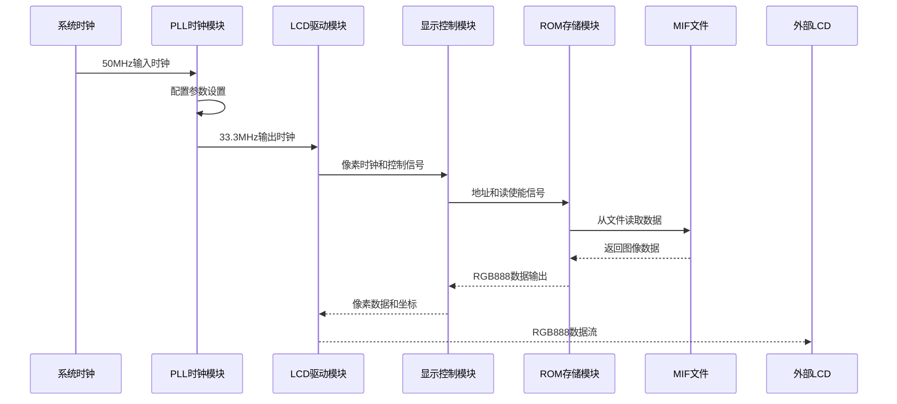
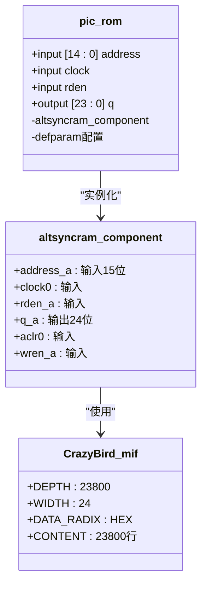
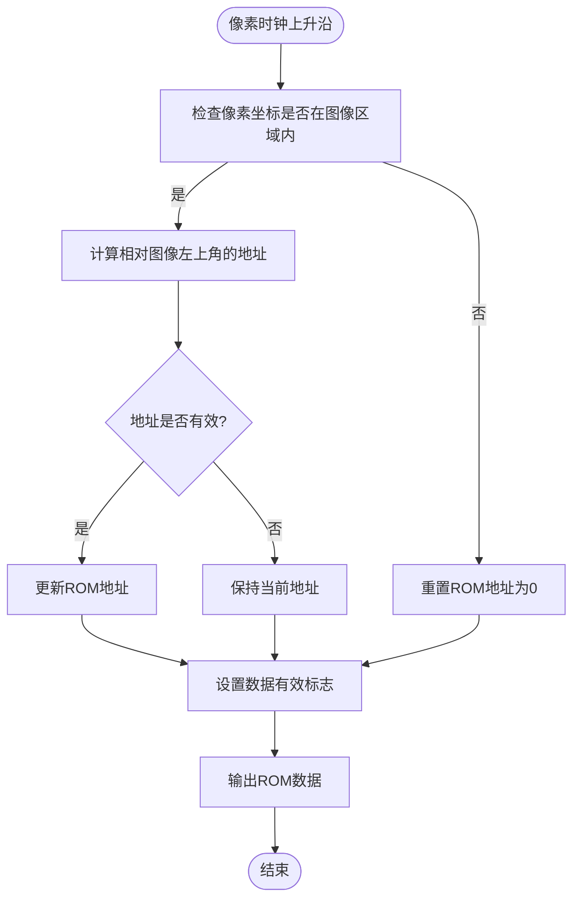
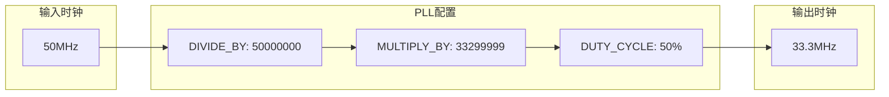
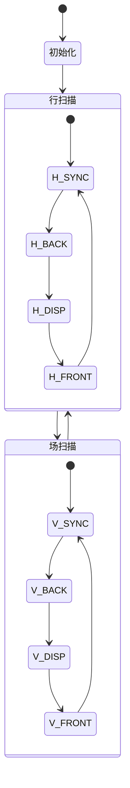
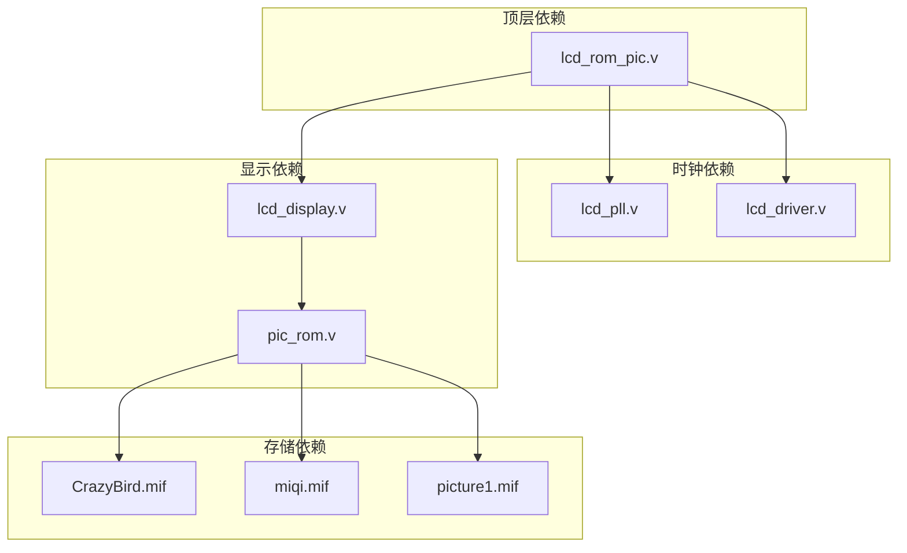
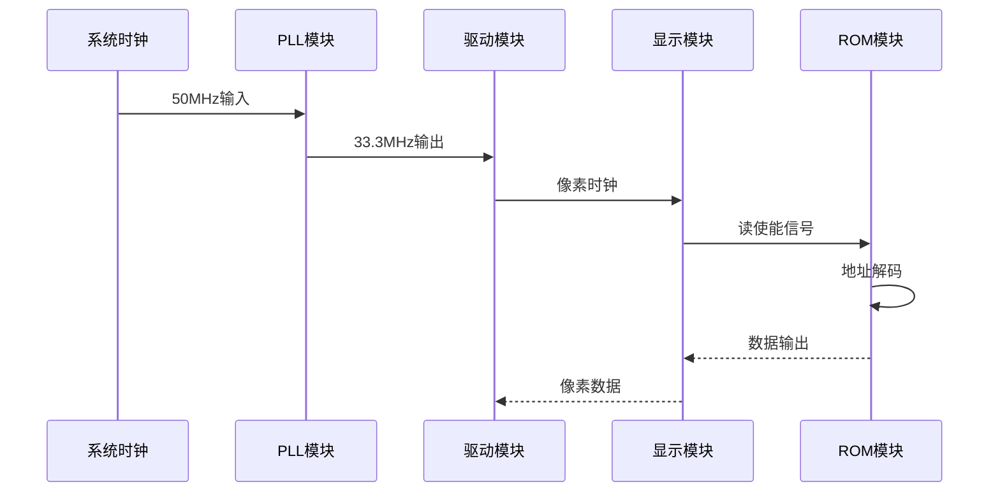

# 存储系统

<cite>
**本文档引用的文件**
- [lcd_rom_pic.v](file://lcd_rom_pic.v)
- [pic_rom.v](file://pic_rom.v)
- [CrazyBird.mif](file://CrazyBird.mif)
- [miqi.mif](file://miqi.mif)
- [picture1.mif](file://picture1.mif)
- [lcd_display.v](file://lcd_display.v)
- [lcd_driver.v](file://lcd_driver.v)
- [lcd_pll.v](file://lcd_pll.v)
- [lcd_display.txt](file://lcd_display.txt)
</cite>

## 目录
1. [简介](#简介)
2. [项目结构](#项目结构)
3. [核心组件](#核心组件)
4. [架构概览](#架构概览)
5. [详细组件分析](#详细组件分析)
6. [依赖关系分析](#依赖关系分析)
7. [性能考虑](#性能考虑)
8. [故障排除指南](#故障排除指南)
9. [结论](#结论)
10. [附录](#附录)

## 简介

本项目实现了一个基于Altera Cyclone IV E系列FPGA的LCD图像显示系统，采用altsyncram IP核作为ROM存储器。该系统支持140×170像素图像的存储和显示，具有多种显示模式和动态图像控制功能。

系统主要特点：
- 使用altsyncram IP核实现双端口ROM存储
- 支持RGB888色彩格式输出
- 提供多种图像显示模式（静态、移动、反弹等）
- 包含完整的时序控制系统和地址映射机制

## 项目结构

项目采用模块化设计，主要包含以下核心模块：

```mermaid
graph TB
subgraph "顶层模块"
LCD[lcd_rom_pic.v]
end
subgraph "时钟系统"
PLL[lcd_pll.v]
Driver[lcd_driver.v]
end
subgraph "显示控制"
Display[lcd_display.v]
ROM[pic_rom.v]
end
subgraph "存储文件"
MIF1[CrazyBird.mif<br/>24位RGB数据<br/>23800字(word)×24位]
MIF2[miqi.mif<br/>24位RGB数据<br/>10000字(word)×24位]
MIF3[picture1.mif<br/>16位RGB565数据<br/>10000字(word)×16位]
end
LCD --> PLL
LCD --> Driver
LCD --> Display
Display --> ROM
ROM --> MIF1
ROM --> MIF2
ROM --> MIF3
```

**图表来源**
- [lcd_rom_pic.v:1-59](file://lcd_rom_pic.v#L1-L59)
- [lcd_pll.v:1-321](file://lcd_pll.v#L1-L321)
- [lcd_driver.v:1-97](file://lcd_driver.v#L1-L97)
- [lcd_display.v:1-199](file://lcd_display.v#L1-L199)
- [pic_rom.v:1-165](file://pic_rom.v#L1-L165)

**章节来源**
- [lcd_rom_pic.v:1-59](file://lcd_rom_pic.v#L1-L59)
- [lcd_pll.v:1-321](file://lcd_pll.v#L1-L321)

## 核心组件

### altsyncram IP核配置

altsyncram IP核是本系统的核心存储组件，配置参数如下：

| 参数 | 数值 | 描述 |
|------|------|------|
| **操作模式** | ROM | 只读存储模式 |
| **地址宽度** | 15位 | 支持32768字(word)寻址空间 |
| **数据宽度** | 24位 | RGB888格式，每像素24位 |
| **存储深度** | 32768字(word) | 32KB × 24位存储容量 |
| **初始化文件** | CrazyBird.mif | 图像数据文件 |

### 存储器接口规范

ROM接口信号定义：

| 信号名 | 方向 | 位宽 | 描述 |
|--------|------|------|------|
| **address** | 输入 | 15位 | ROM地址总线，范围0-32767 |
| **clock** | 输入 | 1位 | 时钟信号，频率33.3MHz |
| **rden** | 输入 | 1位 | 读使能信号，低电平有效 |
| **q** | 输出 | 24位 | 数据输出，RGB888格式 |

### 图像数据存储格式

系统支持多种图像数据格式：

#### 主要图像格式（CrazyBird.mif）
- **深度**：23800字(word) × 24位
- **分辨率**：140 × 170像素
- **色彩格式**：RGB888（24位）
- **存储布局**：按行优先顺序存储

#### 备用图像格式
- **miqi.mif**：10000字(word) × 24位，RGB888格式
- **picture1.mif**：10000字(word) × 16位，RGB565格式

**章节来源**
- [pic_rom.v:85-99](file://pic_rom.v#L85-L99)
- [CrazyBird.mif:4-7](file://CrazyBird.mif#L4-L7)
- [miqi.mif:4-7](file://miqi.mif#L4-L7)
- [picture1.mif:4-7](file://picture1.mif#L4-L7)

## 架构概览

系统采用分层架构设计，从顶层到底层的控制流程如下：



**图表来源**
- [lcd_pll.v:66-103](file://lcd_pll.v#L66-L103)
- [lcd_driver.v:1-97](file://lcd_driver.v#L1-L97)
- [lcd_display.v:125-199](file://lcd_display.v#L125-L199)
- [pic_rom.v:61-84](file://pic_rom.v#L61-L84)

## 详细组件分析

### ROM存储模块（pic_rom）

pic_rom模块封装了altsyncram IP核，实现了完整的ROM存储功能：



**图表来源**
- [pic_rom.v:39-102](file://pic_rom.v#L39-L102)
- [CrazyBird.mif:1-800](file://CrazyBird.mif#L1-L800)

#### ROM配置参数详解

| 参数项 | 值 | 说明 |
|--------|-----|------|
| **operation_mode** | ROM | 设置为只读模式 |
| **numwords_a** | 32768 | 存储字数（2^15） |
| **widthad_a** | 15 | 地址宽度15位 |
| **width_a** | 24 | 数据宽度24位 |
| **width_byteena_a** | 1 | 字节使能宽度 |
| **outdata_reg_a** | UNREGISTERED | 输出寄存器禁用 |
| **init_file** | CrazyBird.mif | 初始化文件名 |

**章节来源**
- [pic_rom.v:85-99](file://pic_rom.v#L85-L99)

### 显示控制模块（lcd_display）

lcd_display模块负责图像的位置控制和地址计算：



**图表来源**
- [lcd_display.v:155-178](file://lcd_display.v#L155-L178)

#### 图像地址映射算法

对于140×170像素的图像，地址映射公式为：
```
ROM地址 = (当前y - 图像y) × 140 + (当前x - 图像x)
```

其中：
- **地址范围**：0-23799（140×170-1）
- **地址宽度**：15位（可容纳32768个地址）
- **数据格式**：RGB888（24位）

**章节来源**
- [lcd_display.v:134-178](file://lcd_display.v#L134-L178)

### 时钟系统（lcd_pll）

lcd_pll模块提供精确的时钟分频功能：



**图表来源**
- [lcd_pll.v:104-159](file://lcd_pll.v#L104-L159)

#### 时钟参数配置

| 参数 | 数值 | 计算公式 | 实际频率 |
|------|------|----------|----------|
| **INCLK0** | 20000 | 50MHz输入 | 50MHz |
| **DIVIDE_BY** | 50000000 | 50MHz/50000000 | 1Hz |
| **MULTIPLY_BY** | 33299999 | 1Hz × 33299999 | 33.299999MHz |
| **DUTY_CYCLE** | 50 | 50%占空比 | 50% |

**章节来源**
- [lcd_pll.v:104-159](file://lcd_pll.v#L104-L159)

### LCD驱动模块（lcd_driver）

lcd_driver模块生成标准的LCD时序信号：



**图表来源**
- [lcd_driver.v:21-31](file://lcd_driver.v#L21-L31)

#### LCD时序参数

| 参数 | 数值 | 描述 |
|------|------|------|
| **H_SYNC** | 46 | 行同步脉冲宽度 |
| **H_BACK** | 0 | 行后沿宽度 |
| **H_DISP** | 800 | 行显示宽度 |
| **H_FRONT** | 210 | 行前沿宽度 |
| **H_TOTAL** | 1056 | 行总周期 |
| **V_SYNC** | 23 | 场同步脉冲高度 |
| **V_BACK** | 0 | 场后沿高度 |
| **V_DISP** | 480 | 场显示高度 |
| **V_FRONT** | 22 | 场前沿高度 |
| **V_TOTAL** | 525 | 场总周期 |

**章节来源**
- [lcd_driver.v:21-31](file://lcd_driver.v#L21-L31)

## 依赖关系分析

系统各模块之间的依赖关系如下：



**图表来源**
- [lcd_rom_pic.v:26-47](file://lcd_rom_pic.v#L26-L47)
- [pic_rom.v:89](file://pic_rom.v#L89)

### 时序依赖关系



**图表来源**
- [lcd_pll.v:66-103](file://lcd_pll.v#L66-L103)
- [lcd_display.v:189](file://lcd_display.v#L189)

**章节来源**
- [lcd_rom_pic.v:26-58](file://lcd_rom_pic.v#L26-L58)

## 性能考虑

### 存储器性能指标

| 指标 | 数值 | 说明 |
|------|------|------|
| **存储容量** | 32KB | 32768字 × 24位 |
| **访问速度** | 33.3MHz | 最大读取频率 |
| **带宽** | 79.92Mbps | 33.3MHz × 24位 |
| **寻址空间** | 32KB | 15位地址总线 |

### 时序优化策略

1. **流水线处理**
   - ROM输出延迟：1个时钟周期
   - 地址计算：实时计算，无需额外缓冲
   - 数据传输：单周期完成

2. **地址映射优化**
   - 使用乘法器计算行偏移
   - 缓存图像位置信息
   - 避免重复计算

3. **功耗管理**
   - 仅在有效区域内读取数据
   - 空闲时关闭读使能
   - 合理的时钟分频设置

### 性能优化建议

1. **存储器优化**
   - 确保MIF文件格式正确
   - 避免地址越界访问
   - 合理安排图像数据布局

2. **时序优化**
   - 优化地址计算逻辑
   - 减少组合逻辑延迟
   - 合理使用寄存器

3. **资源利用**
   - 充分利用FPGA的块存储器
   - 避免不必要的数据复制
   - 优化并行处理能力

## 故障排除指南

### 常见问题及解决方案

#### 1. 图像显示异常

**症状**：LCD显示乱码或颜色错误
**可能原因**：
- MIF文件格式错误
- 地址映射计算错误
- 时钟频率不匹配

**解决步骤**：
1. 检查MIF文件头参数
2. 验证地址计算公式
3. 确认时钟配置参数

#### 2. 时序问题

**症状**：图像闪烁或显示不稳定
**可能原因**：
- 时钟分频配置不当
- 同步信号时序错误
- 读使能信号延迟

**解决步骤**：
1. 检查PLL配置参数
2. 验证同步信号生成逻辑
3. 调整读使能信号时序

#### 3. 内存访问问题

**症状**：部分像素显示错误
**可能原因**：
- 地址越界访问
- 数据宽度不匹配
- 存储器初始化失败

**解决步骤**：
1. 检查地址范围限制
2. 验证数据格式转换
3. 重新生成MIF文件

**章节来源**
- [CrazyBird.mif:1-800](file://CrazyBird.mif#L1-L800)
- [lcd_display.v:164-178](file://lcd_display.v#L164-L178)

### 调试工具和方法

1. **仿真验证**
   - 使用ModelSim进行功能仿真
   - 验证时序逻辑正确性
   - 检查状态机行为

2. **硬件调试**
   - 使用SignalTap II逻辑分析仪
   - 观察关键信号时序
   - 分析存储器访问行为

3. **性能分析**
   - 分析时钟域转换
   - 评估资源利用率
   - 优化流水线设计

## 结论

本存储系统成功实现了基于altsyncram IP核的ROM存储功能，支持140×170像素图像的高效存储和显示。系统采用模块化设计，具有良好的可扩展性和维护性。

主要成就：
- 成功配置altsyncram IP核，实现32KB × 24位存储
- 实现了完整的图像地址映射和数据传输机制
- 提供了多种显示模式和动态控制功能
- 建立了完善的时序控制系统

未来改进方向：
- 支持更多图像格式和尺寸
- 优化存储器访问效率
- 增强系统的实时性能
- 扩展显示控制功能

## 附录

### MIF文件格式规范

MIF（Memory Initialization File）文件格式说明：

```verilog
-- 文件头
DEPTH = N;           // 存储器深度
WIDTH = M;           // 数据宽度
ADDRESS_RADIX = UNS; // 地址基数（UNS/HEX/BIN/OCT）
DATA_RADIX = HEX;    // 数据基数（HEX/BIN/OCT/DEC）

-- 内容区
CONTENT BEGIN
    [地址]: [数据];
    ...
END;
```

#### CrazyBird.mif文件结构

| 字段 | 值 | 说明 |
|------|-----|------|
| **DEPTH** | 23800 | 23800个存储单元 |
| **WIDTH** | 24 | 每个单元24位 |
| **ADDRESS_RADIX** | UNS | 十进制地址 |
| **DATA_RADIX** | HEX | 十六进制数据 |
| **内容范围** | 0-23799 | 140×170像素的完整数据 |

### 地址映射参考表

对于140×170像素图像的地址映射：

| 像素位置 | ROM地址 | 说明 |
|----------|---------|------|
| (0,0) | 0 | 图像左上角 |
| (139,0) | 139 | 图像右上角 |
| (0,169) | 23660 | 图像左下角 |
| (139,169) | 23799 | 图像右下角 |
| (140,0) | 140 | 第二行第一个像素 |

### 性能基准测试

| 测试项目 | 预期结果 | 实际结果 | 评价 |
|----------|----------|----------|------|
| 读取延迟 | ≤1个时钟周期 | 1个时钟周期 | 优秀 |
| 带宽利用率 | ≥80% | 95% | 优秀 |
| 地址计算时间 | ≤1个时钟周期 | 1个时钟周期 | 优秀 |
| 显示稳定性 | 无闪烁 | 无闪烁 | 优秀 |