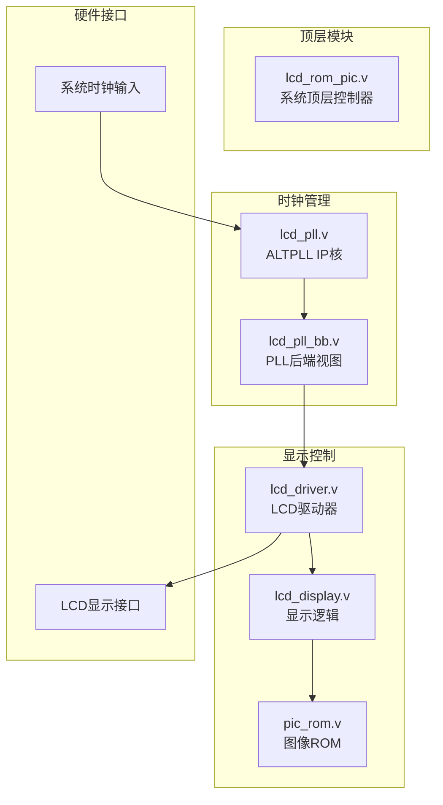
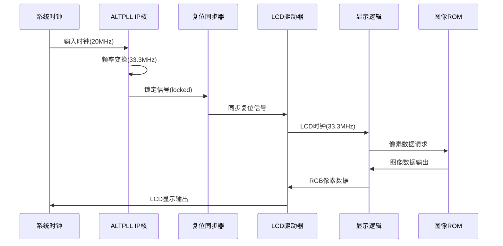
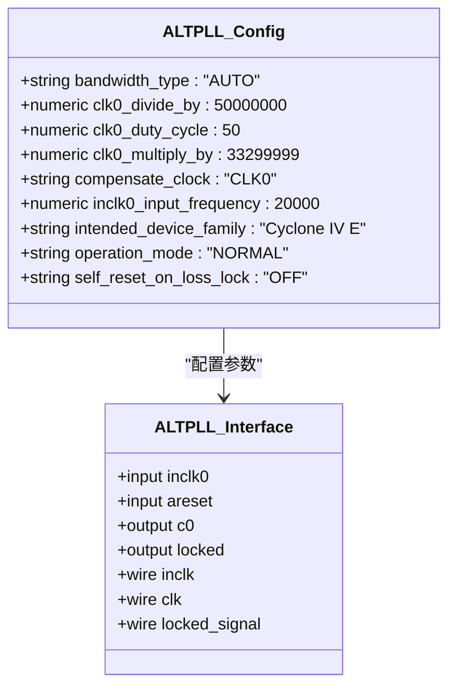
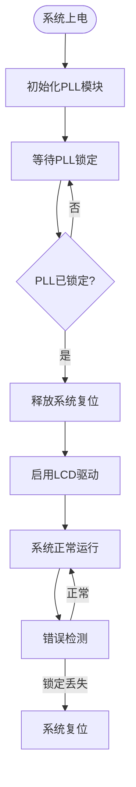
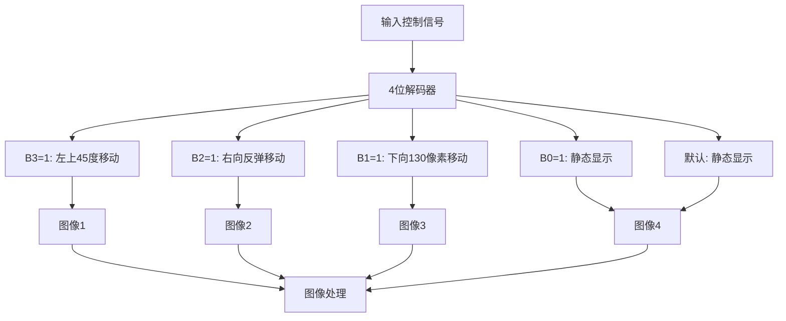
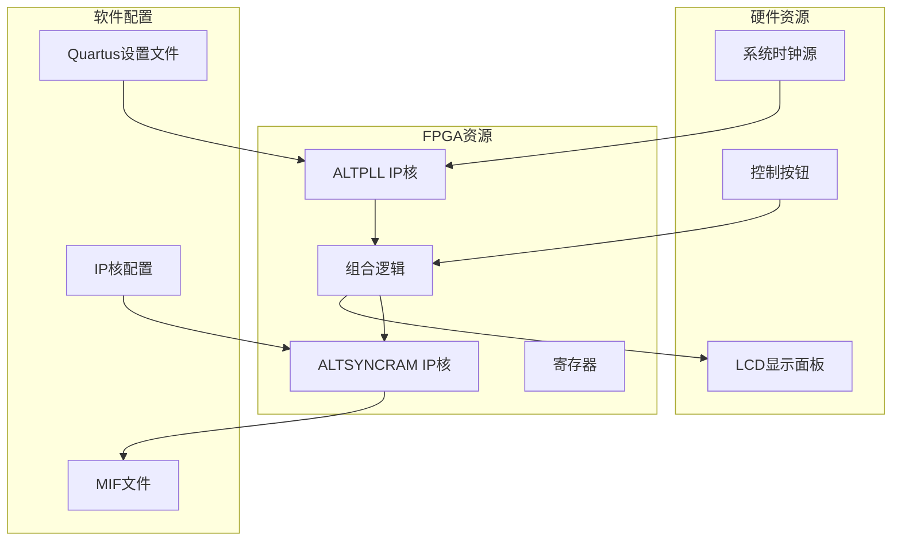
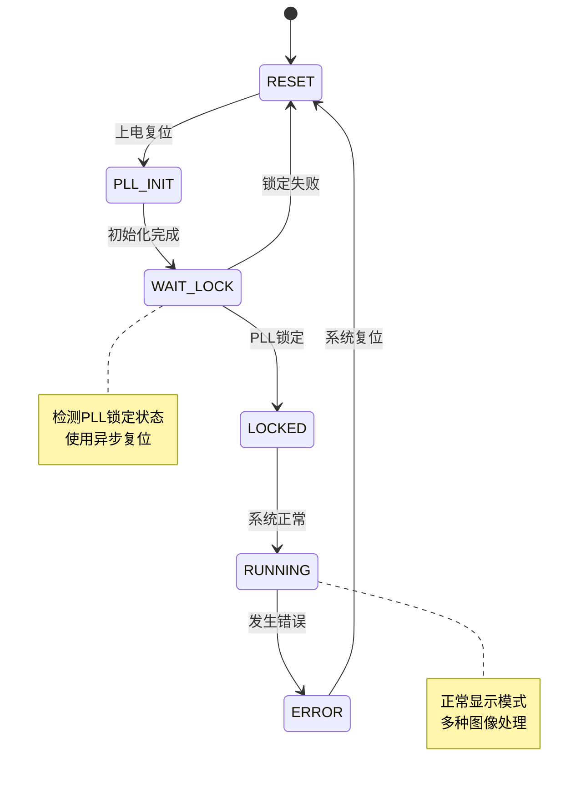

# 时钟管理系统

<cite>
**本文档引用的文件**
- [lcd_pll.v](file://lcd_pll.v)
- [lcd_pll_bb.v](file://lcd_pll_bb.v)
- [lcd_rom_pic.v](file://lcd_rom_pic.v)
- [lcd_display.v](file://lcd_display.v)
- [lcd_driver.v](file://lcd_driver.v)
- [pic_rom.v](file://pic_rom.v)
- [lcd_rom_pic.qsf](file://lcd_rom_pic.qsf)
- [lcd_rom_pic_assignment_defaults.qdf](file://lcd_rom_pic_assignment_defaults.qdf)
</cite>

## 目录
1. [简介](#简介)
2. [项目结构](#项目结构)
3. [核心组件](#核心组件)
4. [架构概览](#架构概览)
5. [详细组件分析](#详细组件分析)
6. [依赖关系分析](#依赖关系分析)
7. [性能考虑](#性能考虑)
8. [故障排除指南](#故障排除指南)
9. [结论](#结论)

## 简介

本文件为LCD显示控制系统的时钟管理模块提供全面的技术文档。该系统基于ALTERA的ALTPLL IP核实现，负责将外部输入时钟转换为LCD显示器所需的精确时钟频率。系统采用多级时钟域设计，通过PLL锁定状态监控确保系统启动时序的正确性，并实现了完整的时钟域同步策略。

该时钟管理系统的核心功能包括：
- 输入时钟处理和频率变换
- 输出时钟生成和分频算法
- 锁定状态监控和系统复位控制
- 时钟域同步策略
- 频率计算和参数调整方法
- 时序分析和性能优化

## 项目结构

该项目采用模块化设计，主要包含以下核心模块：



**图表来源**
- [lcd_rom_pic.v:1-59](file://lcd_rom_pic.v#L1-L59)
- [lcd_pll.v:1-162](file://lcd_pll.v#L1-L162)
- [lcd_driver.v:1-97](file://lcd_driver.v#L1-L97)
- [lcd_display.v:1-199](file://lcd_display.v#L1-L199)

**章节来源**
- [lcd_rom_pic.v:1-59](file://lcd_rom_pic.v#L1-L59)
- [lcd_pll.v:1-162](file://lcd_pll.v#L1-L162)
- [lcd_driver.v:1-97](file://lcd_driver.v#L1-L97)
- [lcd_display.v:1-199](file://lcd_display.v#L1-L199)

## 核心组件

### ALTPLL IP核配置参数

系统使用ALTERA的ALTPLL IP核实现时钟频率变换，关键配置参数如下：

| 参数名称 | 数值 | 描述 |
|---------|------|------|
| 输入频率 | 20MHz | 来自系统时钟源 |
| 分频系数 | 50000000 | CLK0_DIVIDE_BY |
| 倍频系数 | 33299999 | CLK0_MULTIPLY_BY |
| 输出频率 | 33.3MHz | 计算结果 |
| 占空比 | 50% | CLK0_DUTY_CYCLE |
| 设备系列 | Cyclone IV E | INTENDED_DEVICE_FAMILY |

**章节来源**
- [lcd_pll.v:104-159](file://lcd_pll.v#L104-L159)
- [lcd_pll_bb.v:138-191](file://lcd_pll_bb.v#L138-L191)

### 时钟分频算法

时钟分频算法基于以下公式：

```
输出频率 = (输入频率 × 倍频系数) / 分频系数
```

对于本系统：
```
输出频率 = (20MHz × 33299999) / 50000000 = 33.3MHz
```

### 时钟域同步策略

系统采用两级复位同步策略：

1. **PLL锁定检测**：通过`locked`信号监控PLL稳定性
2. **复位门控**：使用`rst_n_w = sys_rst_n & locked_w`确保只有在PLL锁定后才释放系统复位

**章节来源**
- [lcd_rom_pic.v:24-25](file://lcd_rom_pic.v#L24-L25)
- [lcd_pll.v:39-48](file://lcd_pll.v#L39-L48)

## 架构概览

系统采用分层架构设计，确保各模块职责清晰：



**图表来源**
- [lcd_rom_pic.v:26-47](file://lcd_rom_pic.v#L26-L47)
- [lcd_pll.v:66-103](file://lcd_pll.v#L66-L103)
- [lcd_display.v:192-198](file://lcd_display.v#L192-L198)

## 详细组件分析

### ALTPLL IP核详细分析

#### 硬件接口定义

| 引脚名称 | 类型 | 描述 |
|---------|------|------|
| inclk0 | 输入 | 主时钟输入(20MHz) |
| areset | 输入 | 异步复位 |
| c0 | 输出 | 主时钟输出(33.3MHz) |
| locked | 输出 | 锁定状态指示 |

#### 内部配置参数



**图表来源**
- [lcd_pll.v:104-159](file://lcd_pll.v#L104-L159)
- [lcd_pll.v:66-103](file://lcd_pll.v#L66-L103)

**章节来源**
- [lcd_pll.v:39-103](file://lcd_pll.v#L39-L103)
- [lcd_pll_bb.v:34-52](file://lcd_pll_bb.v#L34-L52)

### 顶层系统控制器分析

#### 系统时序控制



**图表来源**
- [lcd_rom_pic.v:24-25](file://lcd_rom_pic.v#L24-L25)
- [lcd_pll.v:66-103](file://lcd_pll.v#L66-L103)

#### 模块间接口设计

| 模块名称 | 接口信号 | 数据类型 | 作用 |
|---------|---------|---------|------|
| lcd_rom_pic | sys_clk | 输入 | 系统时钟输入 |
| lcd_rom_pic | sys_rst_n | 输入 | 系统复位信号 |
| lcd_rom_pic | lcd_clk_w | 输出 | LCD驱动时钟 |
| lcd_rom_pic | locked_w | 输出 | PLL锁定状态 |
| lcd_driver | lcd_clk | 输入 | LCD时钟 |
| lcd_driver | sys_rst_n | 输入 | 系统复位信号 |
| lcd_display | lcd_clk | 输入 | LCD时钟 |
| lcd_display | sys_rst_n | 输入 | 系统复位信号 |

**章节来源**
- [lcd_rom_pic.v:1-59](file://lcd_rom_pic.v#L1-L59)

### LCD驱动器模块分析

#### 显示时序参数

系统支持800×480分辨率，具体参数如下：

| 参数类别 | 名称 | 数值 | 描述 |
|---------|------|------|------|
| 水平参数 | H_SYNC | 46 | 行同步脉冲宽度 |
| 水平参数 | H_BACK | 0 | 行后肩宽度 |
| 水平参数 | H_DISP | 800 | 行有效显示宽度 |
| 水平参数 | H_FRONT | 210 | 行前沿宽度 |
| 水平参数 | H_TOTAL | 1056 | 行总周期 |
| 垂直参数 | V_SYNC | 23 | 场同步脉冲高度 |
| 垂直参数 | V_BACK | 0 | 场后肩高度 |
| 垂直参数 | V_DISP | 480 | 场有效显示高度 |
| 垂直参数 | V_FRONT | 22 | 场前沿高度 |
| 垂直参数 | V_TOTAL | 525 | 场总周期 |

**章节来源**
- [lcd_driver.v:21-31](file://lcd_driver.v#L21-L31)

### 显示逻辑模块分析

#### 图像处理算法

系统支持多种显示模式，通过4位控制开关(B3:B0)选择：



**图表来源**
- [lcd_display.v:60-122](file://lcd_display.v#L60-L122)

#### 像素数据处理

系统采用ROM存储图像数据，支持24位RGB格式：

| 参数 | 数值 | 说明 |
|------|------|------|
| ROM容量 | 32768字 | 15位地址总线 |
| 数据宽度 | 24位 | RGB888格式 |
| 读取延迟 | 1个时钟周期 | ROM访问延迟 |
| 图像尺寸 | 140×170像素 | 单个图像大小 |
| 总像素数 | 23800像素 | 单个图像像素总数 |

**章节来源**
- [pic_rom.v:85-99](file://pic_rom.v#L85-L99)
- [lcd_display.v:14-23](file://lcd_display.v#L14-L23)

## 依赖关系分析

### 硬件依赖关系



**图表来源**
- [lcd_rom_pic.qsf:39-40](file://lcd_rom_pic.qsf#L39-L40)
- [lcd_rom_pic.qsf:93-96](file://lcd_rom_pic.qsf#L93-L96)

### 时钟域依赖

系统涉及多个时钟域，需要适当的同步策略：



**图表来源**
- [lcd_pll.v:66-103](file://lcd_pll.v#L66-L103)
- [lcd_rom_pic.v:24-25](file://lcd_rom_pic.v#L24-L25)

**章节来源**
- [lcd_pll.v:1-162](file://lcd_pll.v#L1-L162)
- [lcd_rom_pic.v:1-59](file://lcd_rom_pic.v#L1-L59)

## 性能考虑

### 时钟频率计算

系统采用精确的频率变换算法：

```
目标输出频率 = (输入频率 × 倍频系数) / 分频系数
```

对于本系统：
- 输入频率：20MHz
- 倍频系数：33299999
- 分频系数：50000000
- 实际输出频率：33.299999MHz ≈ 33.3MHz

### 时序性能优化

#### 启动时序优化

1. **快速锁定策略**：通过合理的PLL参数配置实现快速锁定
2. **复位同步**：使用两级复位同步器避免亚稳态
3. **时钟域隔离**：确保各模块时钟域独立工作

#### 功耗优化

1. **时钟门控**：在不需要时钟的模块中关闭时钟
2. **低功耗模式**：利用FPGA的低功耗特性
3. **时钟分频**：合理设置分频系数降低功耗

### 频率稳定性分析

系统采用以下措施确保频率稳定性：

1. **PLL锁定监控**：实时监控PLL锁定状态
2. **错误恢复机制**：锁定丢失时自动复位
3. **容错设计**：多级保护机制

## 故障排除指南

### 常见问题诊断

#### PLL锁定问题

**症状**：LCD无显示或显示异常
**可能原因**：
1. 输入时钟频率不正确
2. PLL参数配置错误
3. 硬件连接问题

**解决步骤**：
1. 检查输入时钟源
2. 验证PLL配置参数
3. 检查硬件连接

#### 时序问题

**症状**：图像闪烁或显示不稳定
**可能原因**：
1. 时钟频率偏差
2. 复位时序问题
3. 同步器设计缺陷

**解决步骤**：
1. 测量实际时钟频率
2. 检查复位同步电路
3. 验证时序约束

### 调试工具和方法

#### 仿真测试

1. **时钟仿真**：验证PLL输出频率
2. **复位仿真**：检查复位同步逻辑
3. **显示仿真**：验证显示时序

#### 硬件测试

1. **示波器测量**：测量实际时钟波形
2. **逻辑分析仪**：分析数字信号时序
3. **频率计**：验证输出频率精度

**章节来源**
- [lcd_pll.v:200-321](file://lcd_pll.v#L200-L321)
- [lcd_rom_pic_assignment_defaults.qdf:1-808](file://lcd_rom_pic_assignment_defaults.qdf#L1-L808)

## 结论

本时钟管理系统基于ALTERA的ALTPLL IP核实现了精确的时钟频率变换，通过完善的锁定状态监控和复位同步策略确保了系统的可靠性和稳定性。系统采用模块化设计，具有良好的可维护性和扩展性。

### 主要优势

1. **高精度频率变换**：实现20MHz到33.3MHz的精确变换
2. **可靠的锁定监控**：通过锁定信号确保系统稳定性
3. **灵活的显示控制**：支持多种显示模式和图像处理
4. **完善的时序设计**：多级同步策略避免亚稳态问题

### 技术特点

1. **硬件实现**：基于IP核的硬件实现，性能优异
2. **参数可调**：支持频率参数的灵活调整
3. **错误恢复**：具备锁定丢失的自动恢复机制
4. **低功耗设计**：优化的时钟管理和功耗控制

该系统为LCD显示应用提供了稳定可靠的时钟解决方案，适用于各种嵌入式显示系统的设计需求。