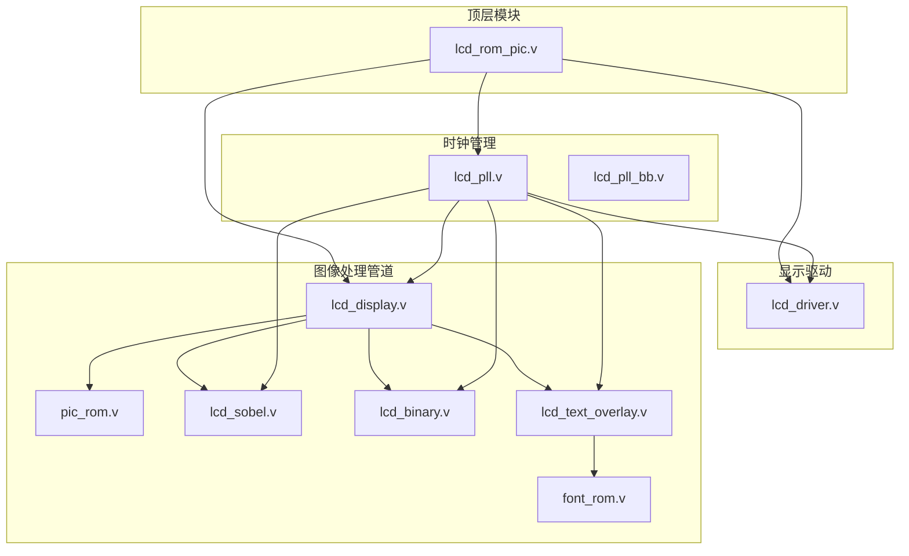
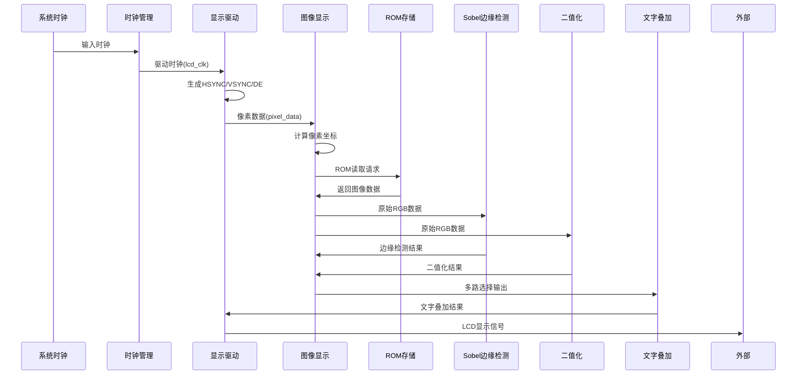
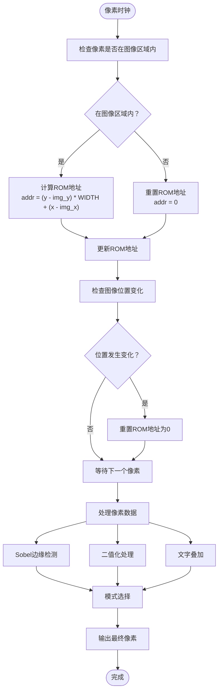
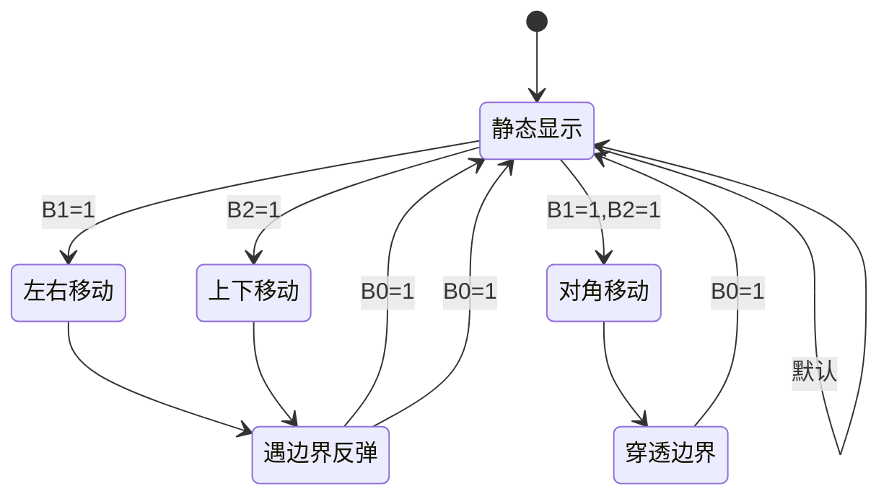
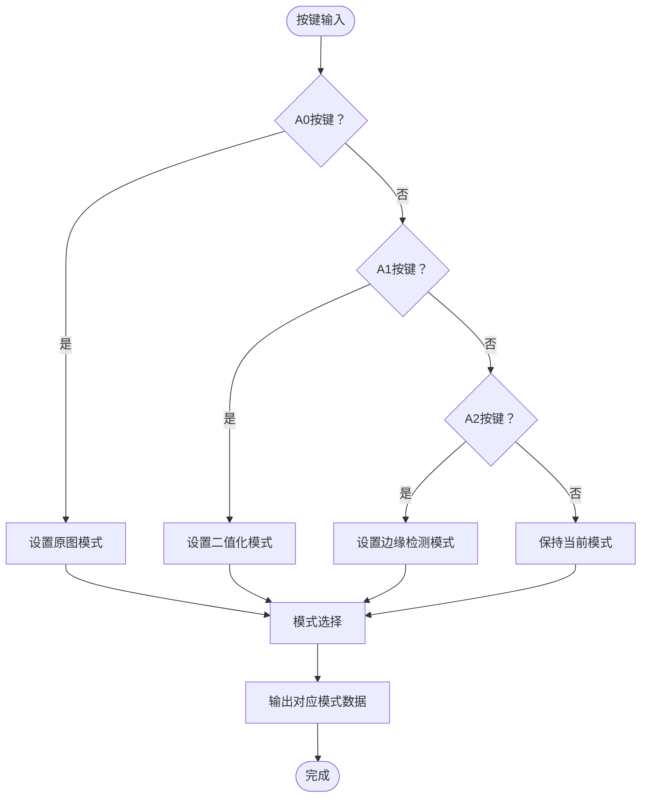
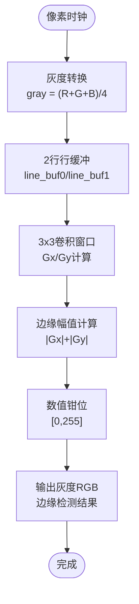
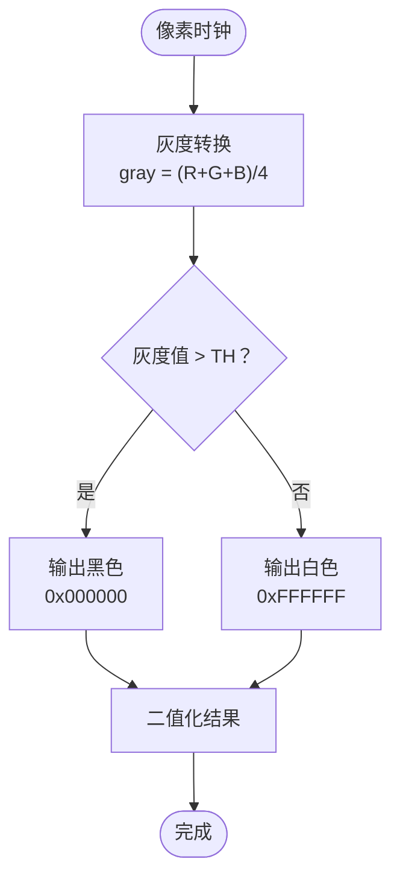
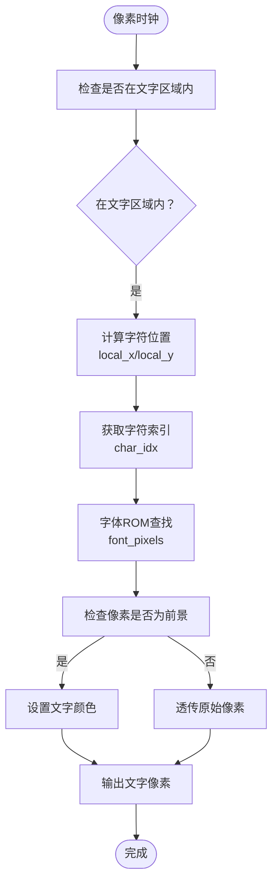
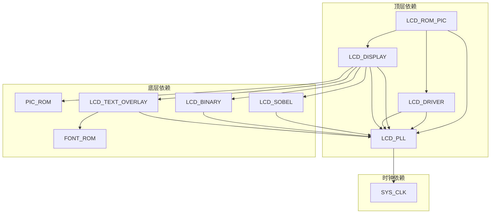
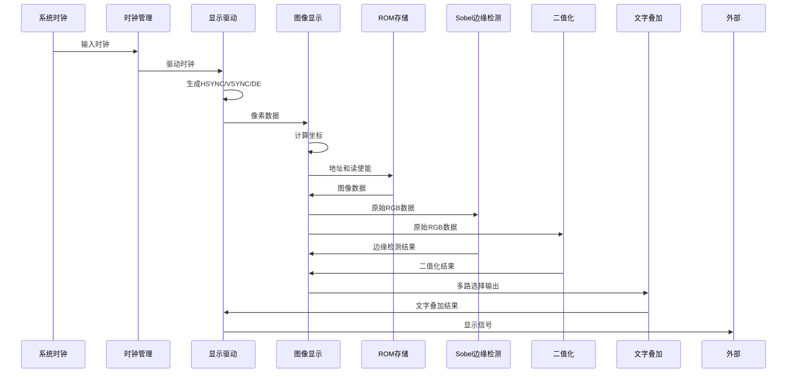

# 显示驱动系统

<cite>
**本文档引用的文件**
- [lcd_rom_pic.v](file://lcd_rom_pic.v)
- [lcd_driver.v](file://lcd_driver.v)
- [lcd_display.v](file://lcd_display.v)
- [pic_rom.v](file://pic_rom.v)
- [lcd_pll.v](file://lcd_pll.v)
- [lcd_pll_bb.v](file://lcd_pll_bb.v)
- [lcd_sobel.v](file://lcd_sobel.v)
- [lcd_binary.v](file://lcd_binary.v)
- [lcd_text_overlay.v](file://lcd_text_overlay.v)
- [font_rom.v](file://font_rom.v)
- [lcd_rom_pic.qsf](file://lcd_rom_pic.qsf)
- [lcd_display.txt](file://lcd_display.txt)
- [lcd_driver.txt](file://lcd_driver.txt)
</cite>

## 更新摘要
**变更内容**
- 新增Sobel边缘检测模块，支持实时流式边缘检测
- 新增二值化处理模块，支持动态阈值二值化
- 新增文字叠加模块，支持屏幕右上角模式显示
- 扩展显示模式选择，支持原图、二值化、边缘检测三种模式
- 集成字体ROM存储，支持48x48点阵汉字显示

## 目录
1. [简介](#简介)
2. [项目结构](#项目结构)
3. [核心组件](#核心组件)
4. [架构总览](#架构总览)
5. [详细组件分析](#详细组件分析)
6. [依赖关系分析](#依赖关系分析)
7. [性能考虑](#性能考虑)
8. [故障排除指南](#故障排除指南)
9. [结论](#结论)
10. [附录](#附录)

## 简介
本项目是一个基于FPGA的LCD显示驱动系统，实现了完整的RGB888显示时序生成与像素数据输出。系统包含时钟管理、显示驱动、图像显示与ROM存储等核心模块，支持动态图像显示、坐标计算、边界检测、实时边缘检测、二值化处理和文字叠加功能。本文档将深入解析LCD时序生成逻辑、像素坐标计算算法以及RGB数据输出格式与时序要求。

## 项目结构
项目采用模块化设计，主要包含以下文件：
- 主控制器模块：lcd_rom_pic.v
- 显示驱动模块：lcd_driver.v
- 图像显示模块：lcd_display.v
- ROM存储模块：pic_rom.v
- 时钟管理模块：lcd_pll.v、lcd_pll_bb.v
- 图像处理模块：lcd_sobel.v、lcd_binary.v
- 文字叠加模块：lcd_text_overlay.v
- 字体存储模块：font_rom.v
- 配置文件：lcd_rom_pic.qsf
- 测试版本：lcd_display.txt、lcd_driver.txt

**图表来源**
- [lcd_rom_pic.v:1-67](file://lcd_rom_pic.v#L1-L67)
- [lcd_display.v:258-294](file://lcd_display.v#L258-L294)

## 核心组件
系统由七个核心模块组成，每个模块承担特定功能：

### 时钟管理模块
- **功能**：提供稳定的像素时钟，频率为33.3MHz
- **实现**：使用ALTERA的ALTPLL IP核，通过配置参数实现精确的时钟分频
- **特点**：支持锁定状态监控，确保时钟稳定后再释放复位信号

### 显示驱动模块
- **功能**：生成LCD显示时序信号
- **输出信号**：hsync、vsync、de、rgb888数据
- **时序参数**：支持800x480分辨率，具体参数见时序表

### 图像显示模块
- **功能**：处理动态图像显示和坐标计算，集成图像处理管道
- **特性**：支持多种运动模式，包括碰撞检测、边界反弹等
- **存储**：使用ROM存储图像数据
- **处理能力**：支持原图、二值化、边缘检测三种显示模式

### 图像处理模块
- **Sobel边缘检测**：实时流式Sobel边缘检测，使用2行行缓冲+3x3窗口
- **二值化处理**：基于灰度值的动态阈值二值化
- **文字叠加**：屏幕右上角模式文字显示，支持48x48点阵汉字

### 主控制器模块
- **功能**：协调各模块工作，管理整体系统时序
- **接口**：提供用户控制输入，连接外部显示设备

**章节来源**
- [lcd_pll.v:104-162](file://lcd_pll.v#L104-L162)
- [lcd_driver.v:20-32](file://lcd_driver.v#L20-L32)
- [lcd_display.v:10-28](file://lcd_display.v#L10-L28)
- [lcd_sobel.v:13-131](file://lcd_sobel.v#L13-L131)
- [lcd_binary.v:12-40](file://lcd_binary.v#L12-L40)
- [lcd_text_overlay.v:14-241](file://lcd_text_overlay.v#L14-L241)

## 架构总览
系统采用分层架构设计，从顶层到底层的信号流向如下：

**图表来源**
- [lcd_rom_pic.v:26-66](file://lcd_rom_pic.v#L26-L66)
- [lcd_display.v:258-294](file://lcd_display.v#L258-L294)

## 详细组件分析

### 显示驱动模块分析

#### 时序生成逻辑
显示驱动模块通过双计数器架构生成精确的显示时序：

**图表来源**
- [lcd_driver.v:72-94](file://lcd_driver.v#L72-L94)
- [lcd_driver.v:48-55](file://lcd_driver.v#L48-L55)

#### 像素坐标计算算法
像素坐标计算采用提前一个时钟周期的策略：

**图表来源**
- [lcd_driver.v:63-70](file://lcd_driver.v#L63-L70)

#### RGB888数据输出格式
RGB888格式的数据传输具有以下特点：
- **数据宽度**：24位RGB数据
- **传输方式**：同步串行传输
- **采样时机**：在DE信号有效期间采样
- **颜色深度**：每通道8位，支持16777216种颜色

**章节来源**
- [lcd_driver.v:48-55](file://lcd_driver.v#L48-L55)
- [lcd_driver.v:67-70](file://lcd_driver.v#L67-L70)

### 图像显示模块分析

#### 图像处理管道架构
图像显示模块集成了完整的图像处理管道：

**图表来源**
- [lcd_display.v:175-178](file://lcd_display.v#L175-L178)
- [lcd_display.v:258-294](file://lcd_display.v#L258-L294)

#### 运动控制算法
系统支持四种不同的运动模式：

**图表来源**
- [lcd_display.v:68-110](file://lcd_display.v#L68-L110)

#### 像素时序控制
像素时序控制通过计数器实现精确的时间管理：

**图表来源**
- [lcd_display.v:36-49](file://lcd_display.v#L36-L49)

#### 显示模式选择机制
系统支持三种显示模式的动态切换：

**图表来源**
- [lcd_display.v:137-146](file://lcd_display.v#L137-L146)

**章节来源**
- [lcd_display.v:175-178](file://lcd_display.v#L175-L178)
- [lcd_display.v:68-110](file://lcd_display.v#L68-L110)
- [lcd_display.v:36-49](file://lcd_display.v#L36-L49)
- [lcd_display.v:137-146](file://lcd_display.v#L137-L146)

### Sobel边缘检测模块分析

#### 流式Sobel边缘检测算法
Sobel边缘检测模块实现了高效的流式处理：

**图表来源**
- [lcd_sobel.v:28-128](file://lcd_sobel.v#L28-L128)

#### 硬件实现特点
- **流式处理**：使用2行行缓冲实现流式3x3窗口处理
- **硬件优化**：使用移位操作替代除法，提高处理效率
- **实时性**：每个像素仅需1个时钟周期处理
- **资源利用**：推断的块RAM实现行缓冲存储

**章节来源**
- [lcd_sobel.v:28-128](file://lcd_sobel.v#L28-L128)

### 二值化处理模块分析

#### 二值化算法实现
二值化模块提供了简单的阈值处理：

**图表来源**
- [lcd_binary.v:29-37](file://lcd_binary.v#L29-L37)

#### 参数配置
- **阈值设置**：TH = 150（降低阈值使输出更均衡）
- **处理方式**：基于灰度值的简单阈值比较
- **输出格式**：保持RGB888格式，仅调整亮度值

**章节来源**
- [lcd_binary.v:29-37](file://lcd_binary.v#L29-L37)

### 文字叠加模块分析

#### 文字叠加架构
文字叠加模块实现了屏幕右上角的文字显示：

**图表来源**
- [lcd_text_overlay.v:55-238](file://lcd_text_overlay.v#L55-L238)

#### 文字布局设计
- **位置设置**：右上角起始点(600,8)，支持4字*50px=200px宽度
- **字体规格**：48x48点阵汉字，字符间距2px
- **动态显示**：根据当前模式自动显示相应文字
- **颜色适配**：原图模式显示黑色，二值化/边缘检测模式显示白色

**章节来源**
- [lcd_text_overlay.v:55-238](file://lcd_text_overlay.v#L55-L238)

### ROM存储模块分析

#### 存储器配置
ROM模块配置了专门的存储参数：
- **存储容量**：32768字(word)
- **数据宽度**：24位(RGB888)
- **地址宽度**：15位
- **存储类型**：只读存储器(ROM)

#### 数据访问时序
ROM数据访问具有固定的时序特性：
- **读取延迟**：从发出读使能信号到数据有效存在一个时钟周期的延迟
- **地址计算**：基于相对图像位置的线性地址映射
- **数据输出**：无寄存器输出，直接从存储器读取

**章节来源**
- [pic_rom.v:85-99](file://pic_rom.v#L85-L99)
- [pic_rom.v:150-157](file://pic_rom.v#L150-L157)

## 依赖关系分析

### 模块间依赖关系
系统模块间的依赖关系清晰明确：

**图表来源**
- [lcd_rom_pic.v:26-66](file://lcd_rom_pic.v#L26-L66)

### 信号流向分析
信号在系统中的流向遵循严格的时序要求：

**图表来源**
- [lcd_driver.v:48-55](file://lcd_driver.v#L48-L55)
- [lcd_display.v:258-294](file://lcd_display.v#L258-L294)

**章节来源**
- [lcd_rom_pic.v:26-66](file://lcd_rom_pic.v#L26-L66)
- [lcd_driver.v:48-55](file://lcd_driver.v#L48-L55)
- [lcd_display.v:258-294](file://lcd_display.v#L258-L294)

## 性能考虑

### 时钟频率优化
- **像素时钟频率**：33.3MHz，满足800x480@60Hz的显示需求
- **时钟稳定性**：通过PLL锁定信号确保时钟稳定
- **功耗考虑**：使用最低必要的时钟频率以降低功耗

### 内存访问优化
- **地址计算**：采用线性地址映射，减少计算复杂度
- **数据预取**：通过提前一个时钟周期输出坐标实现数据预取
- **存储器带宽**：24位数据宽度，支持高速数据传输

### 图像处理优化
- **流水线设计**：多级流水线处理提高吞吐量
- **并行处理**：同时处理多个像素的坐标计算和图像处理
- **缓冲机制**：适当的寄存器缓冲减少信号竞争
- **硬件优化**：使用移位操作替代除法，提高处理效率

### 时序优化策略
- **流水线设计**：多级流水线处理提高吞吐量
- **并行处理**：同时处理多个像素的坐标计算
- **缓冲机制**：适当的寄存器缓冲减少信号竞争

## 故障排除指南

### 常见问题诊断

#### 显示异常问题
1. **无显示信号**
   - 检查HSYNC/VSYNC信号是否正确生成
   - 验证DE信号的有效性
   - 确认RGB数据在DE有效期间输出

2. **图像偏移或错位**
   - 检查像素坐标计算的起始偏移量
   - 验证行计数器和场计数器的同步
   - 确认时序参数配置的正确性

3. **颜色异常**
   - 检查RGB数据的位宽和格式
   - 验证颜色通道的排列顺序
   - 确认数据采样时机的准确性

#### 图像处理问题
1. **边缘检测异常**
   - 检查Sobel模块的输入数据是否正确
   - 验证行缓冲的写入和读取时序
   - 确认卷积计算的硬件实现

2. **二值化效果不佳**
   - 调整二值化阈值参数
   - 检查灰度转换的精度
   - 验证阈值比较逻辑

3. **文字显示问题**
   - 检查文字区域的坐标计算
   - 验证字体ROM的地址映射
   - 确认文字颜色的动态切换

#### 时钟相关问题
1. **时钟不稳定**
   - 检查PLL锁定信号状态
   - 验证输入时钟频率
   - 确认复位信号的时序

2. **时序错误**
   - 分析HSYNC脉冲宽度
   - 检查VSYNC脉冲的时序
   - 验证DE信号的延迟

**章节来源**
- [lcd_driver.v:48-55](file://lcd_driver.v#L48-L55)
- [lcd_pll.v:104-162](file://lcd_pll.v#L104-L162)
- [lcd_sobel.v:28-128](file://lcd_sobel.v#L28-L128)
- [lcd_binary.v:29-37](file://lcd_binary.v#L29-L37)
- [lcd_text_overlay.v:55-238](file://lcd_text_overlay.v#L55-L238)

## 结论
本LCD显示驱动系统通过精心设计的模块化架构和精确的时序控制，实现了高质量的RGB888显示输出。系统的主要优势包括：

1. **精确的时序控制**：通过双计数器架构实现稳定的显示时序
2. **灵活的坐标计算**：支持多种运动模式和边界检测机制
3. **高效的内存管理**：优化的ROM访问和地址计算
4. **可靠的时钟管理**：稳定的PLL时钟生成和锁定监控
5. **实时图像处理**：集成Sobel边缘检测和二值化处理
6. **智能文字叠加**：动态模式显示和48x48点阵汉字支持

该系统为开发者提供了完整的显示驱动解决方案，具有良好的可扩展性和调试便利性。新增的图像处理功能进一步增强了系统的实用性，为各种视觉应用提供了强大的技术支持。

## 附录

### 时序参数表

#### 显示时序参数
| 参数名称 | 数值 | 单位 | 说明 |
|---------|------|------|------|
| H_SYNC | 46 | 像素 | 行同步脉冲宽度 |
| H_BACK | 0 | 像素 | 行后沿长度 |
| H_DISP | 800 | 像素 | 行有效显示宽度 |
| H_FRONT | 210 | 像素 | 行前沿长度 |
| H_TOTAL | 1056 | 像素 | 行扫描周期 |
| V_SYNC | 23 | 行 | 场同步脉冲高度 |
| V_BACK | 0 | 行 | 场后沿高度 |
| V_DISP | 480 | 行 | 场有效显示高度 |
| V_FRONT | 22 | 行 | 场前沿高度 |
| V_TOTAL | 525 | 行 | 场扫描周期 |

#### 像素时序参数
| 参数名称 | 数值 | 单位 | 说明 |
|---------|------|------|------|
| 像素时钟频率 | 33.3 | MHz | 像素采样时钟 |
| 帧率 | 60 | Hz | 显示刷新频率 |
| 帧周期 | 16.67 | ms | 完整场的显示时间 |
| 行周期 | 20.11 | ms | 单行显示时间 |
| 像素周期 | 30.03 | ns | 单像素采样间隔 |

#### 像素坐标参数
| 参数名称 | 数值 | 单位 | 说明 |
|---------|------|------|------|
| X坐标范围 | 0-799 | 像素 | 水平显示范围 |
| Y坐标范围 | 0-479 | 像素 | 垂直显示范围 |
| 原点位置 | (0,0) | 像素 | 左上角坐标原点 |
| 坐标偏移 | -1 | 像素 | Y坐标额外偏移 |

### RGB888数据格式
- **数据宽度**：24位
- **颜色分量**：R(8位)、G(8位)、B(8位)
- **数据范围**：0-255
- **颜色深度**：16,777,216色
- **传输方式**：同步串行传输
- **采样时机**：DE信号有效期间

### 图像处理参数
#### Sobel边缘检测
- **处理方式**：流式3x3卷积
- **行缓冲**：2行×800像素
- **处理延迟**：1个时钟周期
- **输出格式**：灰度RGB

#### 二值化处理
- **阈值设置**：150
- **处理方式**：灰度阈值比较
- **输出颜色**：黑色(0x000000)/白色(0xFFFFFF)
- **处理延迟**：1个时钟周期

### 文字叠加参数
#### 文字布局
- **位置**：右上角(600,8)
- **字体**：48x48点阵
- **字符间距**：2像素
- **显示宽度**：200像素(4字符×50像素)

#### 支持字符
- **运动模式**：静态显示、左右移动、上下移动、对角移动
- **显示模式**：原图、二值化、边缘检测
- **拉伸模式**：左右拉伸、上下拉伸

### 运动模式参数
| 模式名称 | 控制信号 | 运动方向 | 边界处理 | 速度控制 |
|---------|---------|---------|---------|---------|
| 静态显示 | B0=1 | 无移动 | 无 | 无 |
| 左右移动 | B1=1 | 右侧 | 遇边界反弹 | 60像素/秒 |
| 上下移动 | B2=1 | 下方 | 遇边界反弹 | 60像素/秒 |
| 对角移动 | B1=1,B2=1 | 左上 | 穿透边界 | 60像素/秒 |
| 左右拉伸 | B3=1 | 全屏 | 全屏显示 | 无 |
| 上下拉伸 | B4=1 | 全屏 | 全屏显示 | 无 |

### 显示模式参数
| 模式名称 | 按键控制 | 处理算法 | 输出效果 | 应用场景 |
|---------|---------|---------|---------|---------|
| 原图显示 | A0 | 直通处理 | 原始彩色图像 | 基础显示 |
| 二值化显示 | A1 | 灰度阈值 | 黑白二值图像 | 简化视觉 |
| 边缘检测 | A2 | Sobel卷积 | 边缘增强图像 | 图像分析 |