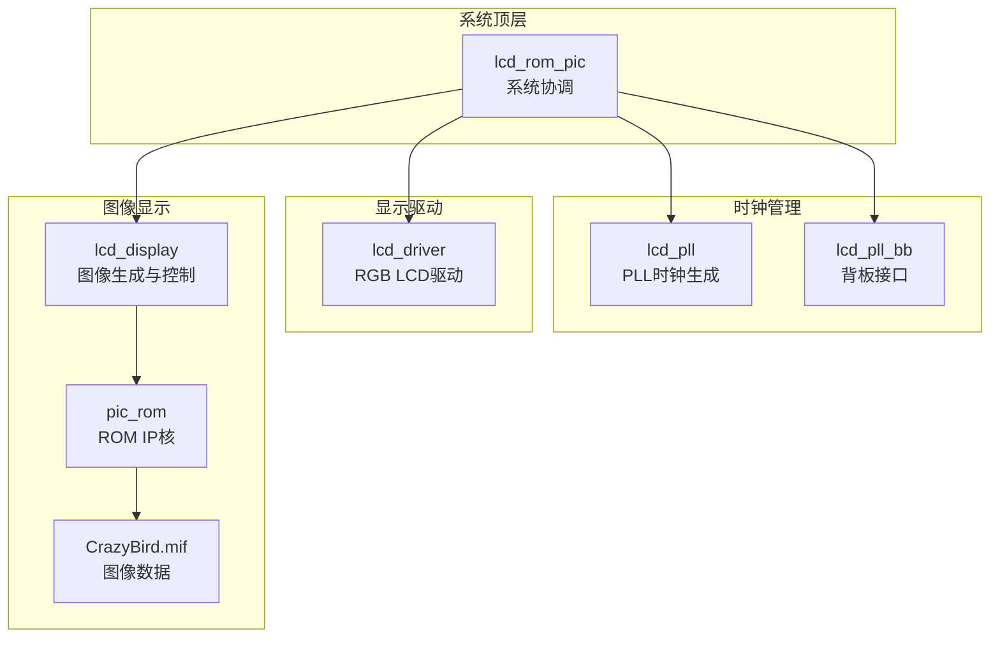
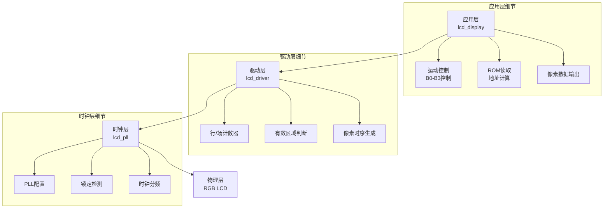
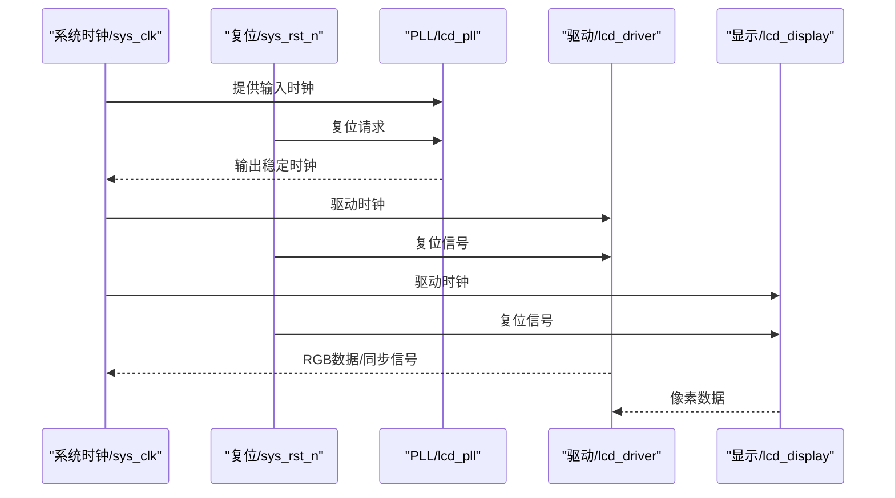
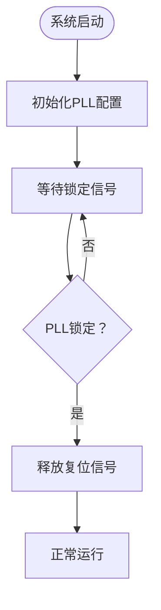
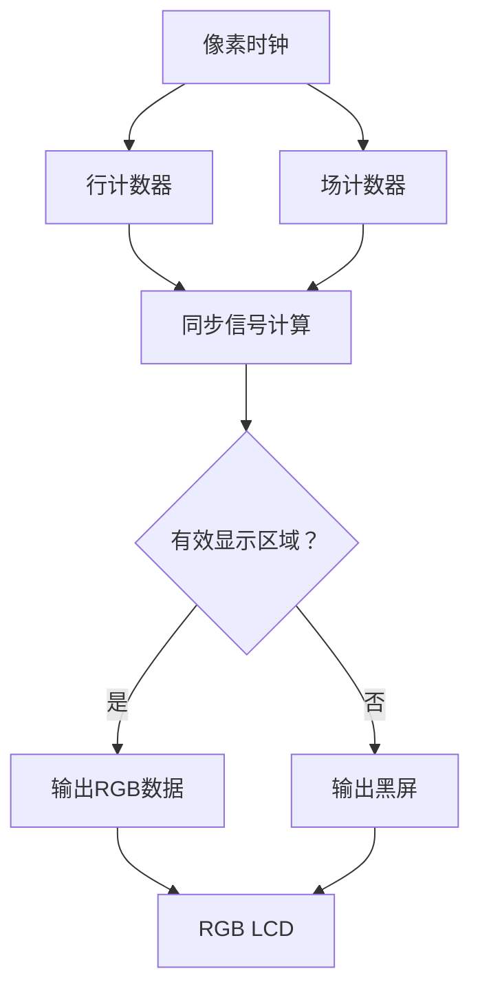
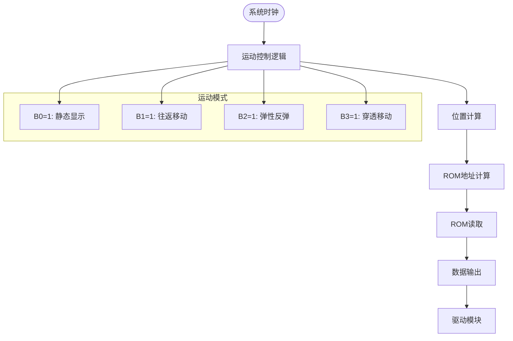
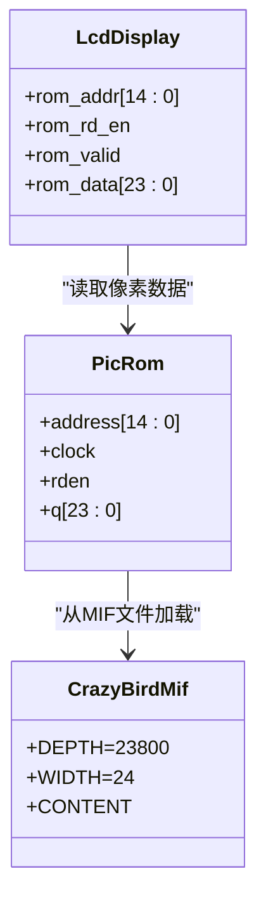
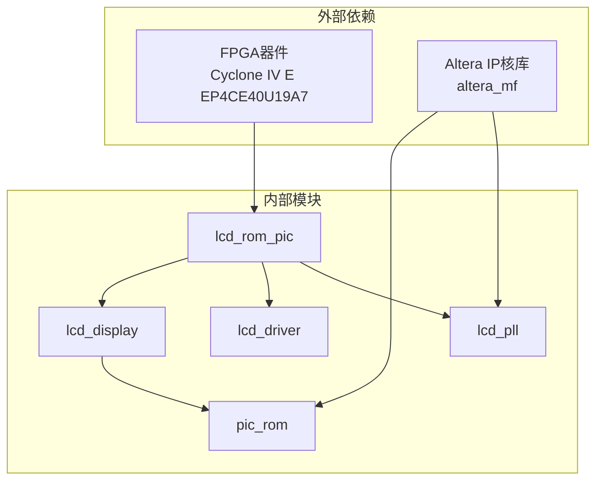

# 系统架构

<cite>
**本文引用的文件**
- [lcd_rom_pic.v](file://lcd_rom_pic.v)
- [lcd_driver.v](file://lcd_driver.v)
- [lcd_display.v](file://lcd_display.v)
- [pic_rom.v](file://pic_rom.v)
- [lcd_pll.v](file://lcd_pll.v)
- [lcd_pll_bb.v](file://lcd_pll_bb.v)
- [CrazyBird.mif](file://CrazyBird.mif)
- [lcd_rom_pic.qsf](file://lcd_rom_pic.qsf)
- [lcd_rom_pic.qpf](file://lcd_rom_pic.qpf)
</cite>

## 目录
1. [简介](#简介)
2. [项目结构](#项目结构)
3. [核心组件](#核心组件)
4. [架构总览](#架构总览)
5. [详细组件分析](#详细组件分析)
6. [依赖关系分析](#依赖关系分析)
7. [性能考量](#性能考量)
8. [故障排查指南](#故障排查指南)
9. [结论](#结论)
10. [附录](#附录)

## 简介
本项目为基于FPGA的LCD显示控制系统，采用分层架构设计，实现从系统时钟到LCD屏幕的完整显示链路。系统以顶层模块lcd_rom_pic为核心，通过时钟管理、显示驱动、图像显示和存储四个主要子系统协同工作，支持动态图像在RGB LCD屏幕上的显示与控制。系统具备良好的模块化特性，便于扩展与维护。

## 项目结构
项目采用按功能域划分的模块化组织方式：
- 顶层模块：lcd_rom_pic，负责系统级协调与信号路由
- 时钟管理：lcd_pll（PLL）、lcd_pll_bb（背板）
- 显示驱动：lcd_driver（RGB LCD驱动）
- 图像显示：lcd_display（图像生成与控制）
- 存储系统：pic_rom（ROM IP核）+ MIF图像数据文件

**图表来源**
- [lcd_rom_pic.v:1-59](file://lcd_rom_pic.v#L1-L59)
- [lcd_pll.v:1-321](file://lcd_pll.v#L1-L321)
- [lcd_pll_bb.v:1-211](file://lcd_pll_bb.v#L1-L211)
- [lcd_driver.v:1-97](file://lcd_driver.v#L1-L97)
- [lcd_display.v:1-199](file://lcd_display.v#L1-L199)
- [pic_rom.v:1-165](file://pic_rom.v#L1-L165)
- [CrazyBird.mif:1-800](file://CrazyBird.mif#L1-L800)

**章节来源**
- [lcd_rom_pic.v:1-59](file://lcd_rom_pic.v#L1-L59)
- [lcd_pll.v:1-321](file://lcd_pll.v#L1-L321)
- [lcd_driver.v:1-97](file://lcd_driver.v#L1-L97)
- [lcd_display.v:1-199](file://lcd_display.v#L1-L199)
- [pic_rom.v:1-165](file://pic_rom.v#L1-L165)
- [CrazyBird.mif:1-800](file://CrazyBird.mif#L1-L800)

## 核心组件
系统围绕以下核心组件构建：
- 顶层协调模块：负责输入输出端口映射、时钟与复位信号处理、模块实例化与互联
- 时钟管理模块：提供稳定的LCD驱动时钟，确保显示时序正确性
- 显示驱动模块：生成RGB LCD所需的同步信号、数据使能和像素数据
- 图像显示模块：控制图像位置、运动逻辑、ROM读取与数据输出
- 存储系统：使用Altera IP核的同步ROM，存储完整的图像数据

**章节来源**
- [lcd_rom_pic.v:1-59](file://lcd_rom_pic.v#L1-L59)
- [lcd_pll.v:1-321](file://lcd_pll.v#L1-L321)
- [lcd_driver.v:1-97](file://lcd_driver.v#L1-L97)
- [lcd_display.v:1-199](file://lcd_display.v#L1-L199)
- [pic_rom.v:1-165](file://pic_rom.v#L1-L165)

## 架构总览
系统采用分层架构模式，自顶向下分为四层：
- 应用层：lcd_display（图像控制与生成）
- 驱动层：lcd_driver（RGB LCD接口适配）
- 时钟层：lcd_pll（频率合成与时序基准）
- 物理层：实际LCD硬件接口

**图表来源**
- [lcd_display.v:1-199](file://lcd_display.v#L1-L199)
- [lcd_driver.v:1-97](file://lcd_driver.v#L1-L97)
- [lcd_pll.v:1-321](file://lcd_pll.v#L1-L321)

## 详细组件分析

### 顶层模块：lcd_rom_pic
顶层模块作为系统协调中心，承担以下职责：
- 输入输出端口定义与映射
- 时钟与复位信号处理
- 子模块实例化与互联
- 系统级信号分配

**图表来源**
- [lcd_rom_pic.v:26-58](file://lcd_rom_pic.v#L26-L58)

**章节来源**
- [lcd_rom_pic.v:1-59](file://lcd_rom_pic.v#L1-L59)

### 时钟管理系统
时钟管理采用Altera的PLL IP核，实现精确的频率合成与时序基准：
- 输入时钟：20MHz（来自系统晶振）
- 输出时钟：约33.3MHz（满足800×480@60Hz的像素时序）
- 锁定检测：确保时钟稳定后再释放复位
- 时钟分频：为各模块提供合适的时钟频率

**图表来源**
- [lcd_pll.v:104-159](file://lcd_pll.v#L104-L159)
- [lcd_pll_bb.v:34-52](file://lcd_pll_bb.v#L34-L52)

**章节来源**
- [lcd_pll.v:1-321](file://lcd_pll.v#L1-L321)
- [lcd_pll_bb.v:1-211](file://lcd_pll_bb.v#L1-L211)

### 显示驱动系统
显示驱动模块负责生成RGB LCD所需的完整时序：
- 行同步信号（HSYNC）
- 场同步信号（VSYNC）
- 数据使能信号（DE）
- RGB数据总线（24位RGB888）
- 像素时钟（PCLK）

**图表来源**
- [lcd_driver.v:34-94](file://lcd_driver.v#L34-L94)

**章节来源**
- [lcd_driver.v:1-97](file://lcd_driver.v#L1-L97)

### 图像显示系统
图像显示模块实现动态图像控制与ROM数据读取：
- 运动控制：通过B0-B3开关选择不同运动模式
- 位置控制：动态调整图像在屏幕中的位置
- ROM读取：根据当前位置计算ROM地址并读取像素数据
- 数据输出：将ROM数据转换为RGB格式输出给驱动模块

**图表来源**
- [lcd_display.v:30-123](file://lcd_display.v#L30-L123)
- [lcd_display.v:125-198](file://lcd_display.v#L125-L198)

**章节来源**
- [lcd_display.v:1-199](file://lcd_display.v#L1-L199)

### 存储系统
存储系统采用Altera的同步ROM IP核，存储完整的图像数据：
- 数据宽度：24位（RGB888）
- 地址深度：15位（32768个地址）
- 图像尺寸：140×170像素（23800像素）
- 数据源：CrazyBird.mif文件

**图表来源**
- [pic_rom.v:39-102](file://pic_rom.v#L39-L102)
- [CrazyBird.mif:4-800](file://CrazyBird.mif#L4-L800)

**章节来源**
- [pic_rom.v:1-165](file://pic_rom.v#L1-L165)
- [CrazyBird.mif:1-23812](file://CrazyBird.mif#L1-L23812)

## 依赖关系分析

**图表来源**
- [lcd_rom_pic.qsf:39-44](file://lcd_rom_pic.qsf#L39-L44)
- [lcd_pll.v:13-13](file://lcd_pll.v#L13-L13)
- [pic_rom.v:12-12](file://pic_rom.v#L12-L12)

**章节来源**
- [lcd_rom_pic.qsf:1-97](file://lcd_rom_pic.qsf#L1-L97)
- [lcd_pll.v:1-321](file://lcd_pll.v#L1-L321)
- [pic_rom.v:1-165](file://pic_rom.v#L1-L165)

## 性能考量
- 时序性能：PLL输出频率精度高，满足RGB LCD的严格时序要求
- 带宽利用：ROM数据总线宽度与LCD像素数据宽度匹配，避免数据搬运开销
- 控制延迟：运动控制采用独立计数器，响应速度快
- 资源占用：模块化设计便于资源优化与复用

## 故障排查指南
- 时钟问题：检查PLL锁定信号，确认输入时钟频率与配置匹配
- 显示异常：验证行/场计数器参数，检查有效显示区域判断逻辑
- 图像错位：检查ROM地址计算公式，确认图像位置寄存器更新逻辑
- 数据无效：验证ROM读使能信号，检查数据有效性标志位

**章节来源**
- [lcd_pll.v:104-159](file://lcd_pll.v#L104-L159)
- [lcd_driver.v:20-31](file://lcd_driver.v#L20-L31)
- [lcd_display.v:133-186](file://lcd_display.v#L133-L186)

## 结论
本LCD显示控制系统采用清晰的分层架构设计，通过顶层协调模块实现各子系统的有机整合。系统具备良好的模块化特性，便于扩展新的显示模式与图像内容。时钟管理、显示驱动、图像控制和存储系统的协同工作，为RGB LCD提供了完整的显示解决方案。

## 附录

### 系统配置要点
- 设备类型：Cyclone IV E系列EP4CE40U19A7
- 最高工作频率：约33.3MHz
- 显示分辨率：800×480像素
- 像素格式：RGB888
- 图像尺寸：140×170像素

### 接口规范
- RGB数据总线：24位（RGB888）
- 像素时钟：33.3MHz
- 同步信号：HSYNC、VSYNC、DE
- 控制开关：B0-B3（4位）

**章节来源**
- [lcd_rom_pic.qsf:39-44](file://lcd_rom_pic.qsf#L39-L44)
- [lcd_driver.v:20-31](file://lcd_driver.v#L20-L31)
- [lcd_display.v:10-20](file://lcd_display.v#L10-L20)