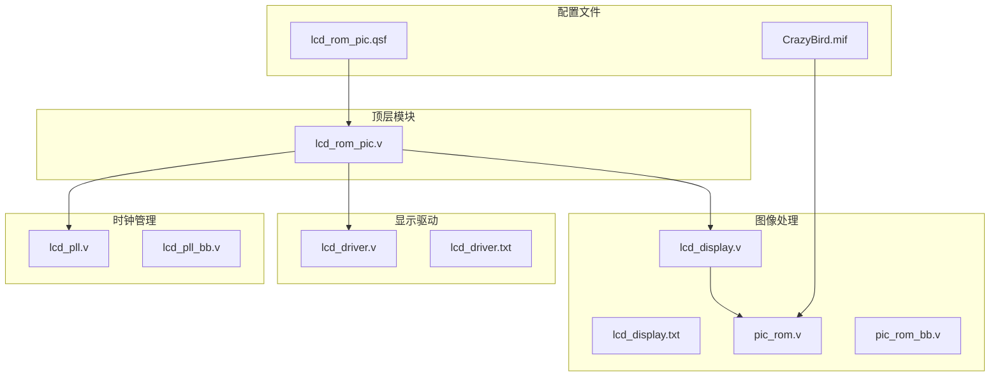
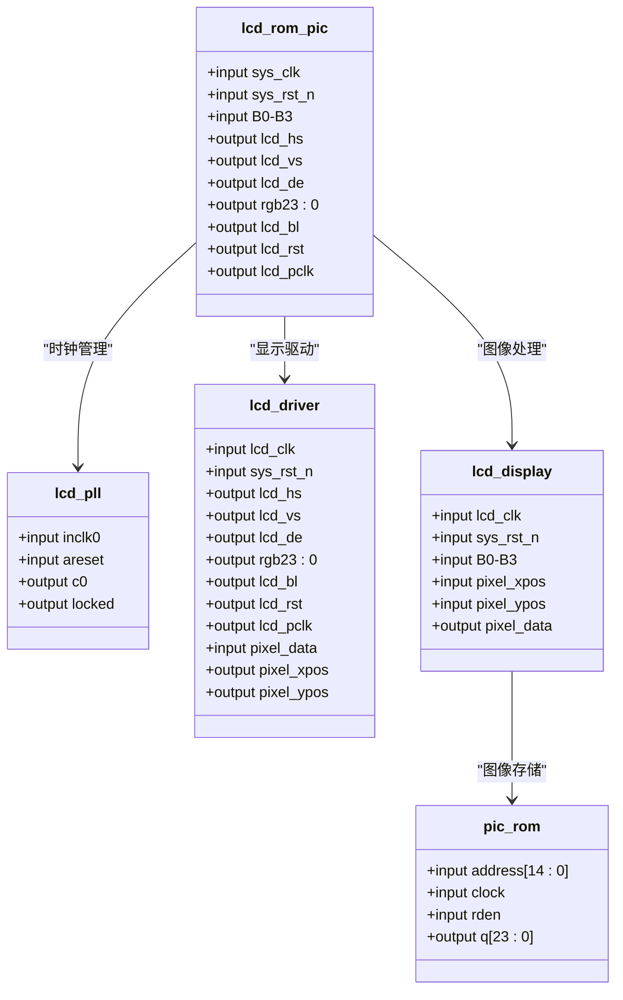
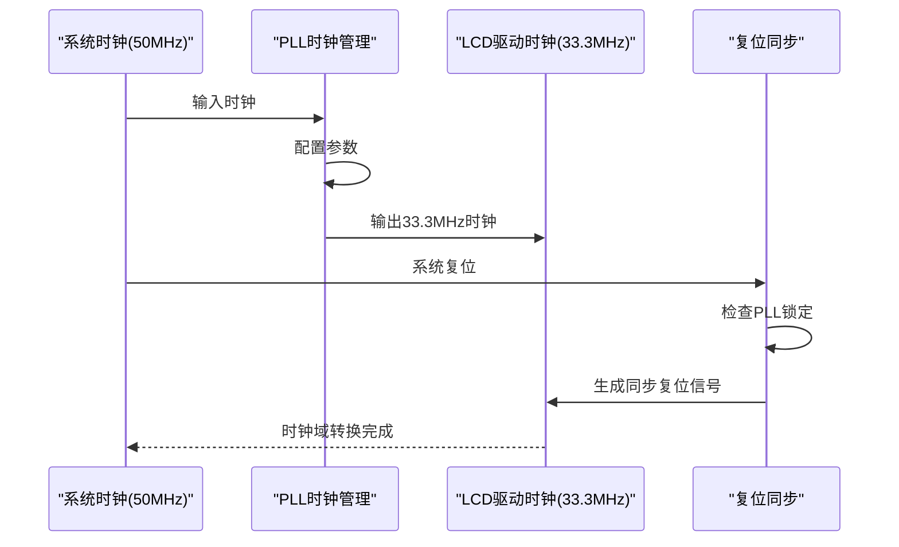
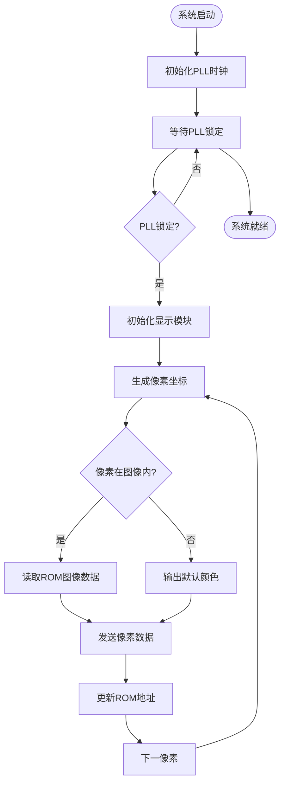
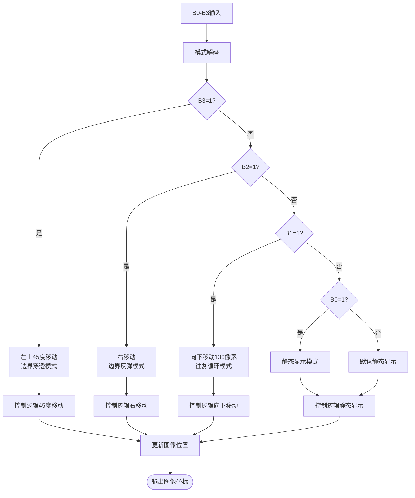
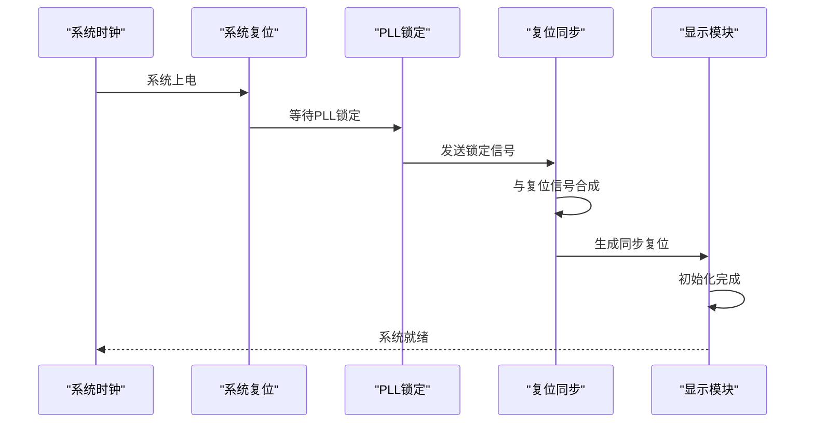
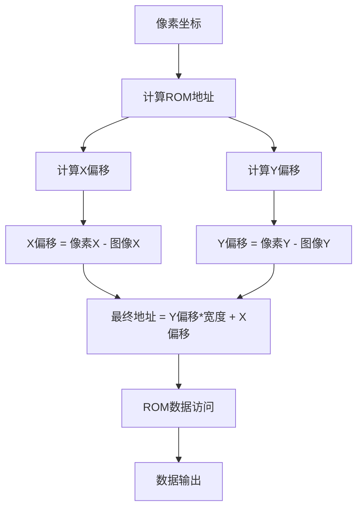
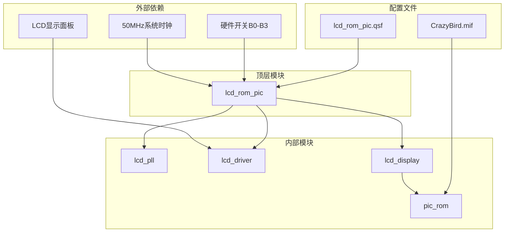
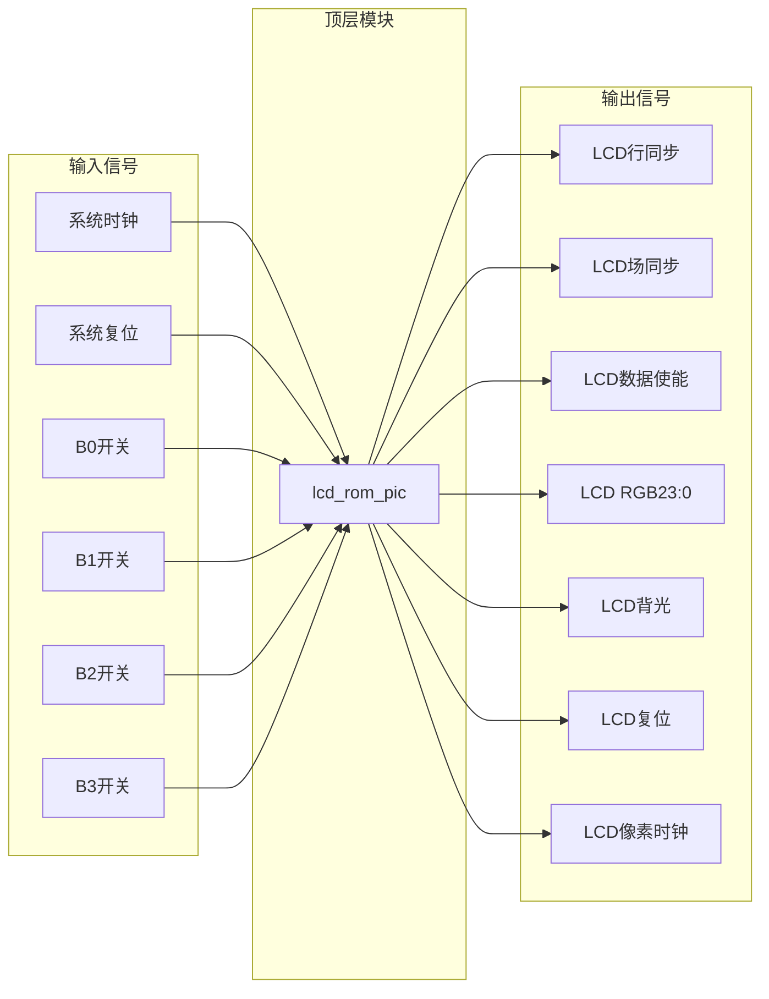

# 顶层模块设计

<cite>
**本文档引用的文件**
- [lcd_rom_pic.v](file://lcd_rom_pic.v)
- [lcd_pll.v](file://lcd_pll.v)
- [lcd_driver.v](file://lcd_driver.v)
- [lcd_display.v](file://lcd_display.v)
- [pic_rom.v](file://pic_rom.v)
- [lcd_pll_bb.v](file://lcd_pll_bb.v)
- [pic_rom_bb.v](file://pic_rom_bb.v)
- [lcd_rom_pic.qsf](file://lcd_rom_pic.qsf)
- [CrazyBird.mif](file://CrazyBird.mif)
</cite>

## 目录
1. [简介](#简介)
2. [项目结构](#项目结构)
3. [核心组件](#核心组件)
4. [架构概览](#架构概览)
5. [详细组件分析](#详细组件分析)
6. [依赖关系分析](#依赖关系分析)
7. [性能考虑](#性能考虑)
8. [故障排除指南](#故障排除指南)
9. [结论](#结论)

## 简介

LCD_ROM_PIC是一个基于FPGA的LCD显示控制系统顶层模块，负责协调多个子模块实现完整的显示功能。该系统采用模块化设计，通过PLL时钟管理、显示驱动和图像处理三个主要层次实现高性能的LCD显示控制。

系统支持多种显示模式，包括静态显示、左右移动、上下移动和左上45度移动等模式，通过硬件开关B0-B3进行模式选择。整个系统运行在33.3MHz的像素时钟频率下，分辨率为800×480像素。

## 项目结构

该项目采用分层模块化架构，包含以下主要文件：

**图表来源**
- [lcd_rom_pic.v:1-59](file://lcd_rom_pic.v#L1-L59)
- [lcd_pll.v:1-321](file://lcd_pll.v#L1-L321)
- [lcd_driver.v:1-97](file://lcd_driver.v#L1-L97)
- [lcd_display.v:1-199](file://lcd_display.v#L1-L199)
- [pic_rom.v:1-165](file://pic_rom.v#L1-L165)

**章节来源**
- [lcd_rom_pic.v:1-59](file://lcd_rom_pic.v#L1-L59)
- [lcd_pll.v:1-321](file://lcd_pll.v#L1-L321)
- [lcd_driver.v:1-97](file://lcd_driver.v#L1-L97)
- [lcd_display.v:1-199](file://lcd_display.v#L1-L199)
- [pic_rom.v:1-165](file://pic_rom.v#L1-L165)

## 核心组件

### 顶层模块接口定义

顶层模块`lcd_rom_pic`定义了完整的系统接口，包括输入输出端口和内部信号连接：

**输入端口：**
- `sys_clk`: 系统时钟输入（50MHz）
- `sys_rst_n`: 系统复位信号（低电平有效）
- `B0-B3`: 硬件开关输入，用于模式选择

**输出端口：**
- `lcd_hs`: LCD行同步信号
- `lcd_vs`: LCD场同步信号  
- `lcd_de`: LCD数据使能信号
- `lcd_rgb[23:0]`: RGB888颜色数据输出
- `lcd_bl`: LCD背光控制信号
- `lcd_rst`: LCD复位信号
- `lcd_pclk`: LCD像素时钟

**内部信号：**
- `lcd_clk_w`: LCD驱动时钟（33.3MHz）
- `locked_w`: PLL锁定信号
- `rst_n_w`: 同步复位信号
- `pixel_data_w[23:0]`: 像素数据
- `pixel_xpos_w[10:0]`: 像素X坐标
- `pixel_ypos_w[10:0]`: 像素Y坐标

**章节来源**
- [lcd_rom_pic.v:1-15](file://lcd_rom_pic.v#L1-L15)
- [lcd_rom_pic.v:18-25](file://lcd_rom_pic.v#L18-L25)

### 模块实例化关系

顶层模块通过实例化三个主要子模块实现完整的显示功能：

**图表来源**
- [lcd_rom_pic.v:26-58](file://lcd_rom_pic.v#L26-L58)
- [lcd_pll.v:39-48](file://lcd_pll.v#L39-L48)
- [lcd_driver.v:1-18](file://lcd_driver.v#L1-L18)
- [lcd_display.v:1-8](file://lcd_display.v#L1-L8)
- [pic_rom.v:39-48](file://pic_rom.v#L39-L48)

**章节来源**
- [lcd_rom_pic.v:26-58](file://lcd_rom_pic.v#L26-L58)

## 架构概览

### 系统时钟域管理

系统采用两级时钟域管理策略，确保各模块在正确的时钟域下工作：

**图表来源**
- [lcd_pll.v:104-159](file://lcd_pll.v#L104-L159)
- [lcd_rom_pic.v:24-25](file://lcd_rom_pic.v#L24-L25)

### 显示控制流程

系统采用流水线式显示控制，通过精确的时序控制实现高质量的图像显示：

**图表来源**
- [lcd_display.v:134-186](file://lcd_display.v#L134-L186)
- [lcd_driver.v:68-69](file://lcd_driver.v#L68-L69)

**章节来源**
- [lcd_pll.v:104-159](file://lcd_pll.v#L104-L159)
- [lcd_display.v:134-186](file://lcd_display.v#L134-L186)
- [lcd_driver.v:68-69](file://lcd_driver.v#L68-L69)

## 详细组件分析

### 硬件开关控制逻辑

硬件开关B0-B3提供了四种不同的显示模式选择，通过4位二进制编码实现：

**图表来源**
- [lcd_display.v:60-122](file://lcd_display.v#L60-L122)

#### 模式详细说明

**模式0 (B3=1): 左上45度移动，边界穿透**
- 图像以45度角向左上方移动
- 穿透屏幕边界后从另一侧重新出现
- 适用于动态背景效果

**模式1 (B2=1): 右移动，边界反弹**
- 图像向右移动至右边界后反弹向左
- 在设定区域内往返移动
- 适用于简单的动画效果

**模式2 (B1=1): 向下移动130像素，往复循环**
- 图像垂直向下移动130像素后反弹向上
- 形成上下往复的循环运动
- 适用于垂直滚动效果

**模式3 (B0=1): 静态显示**
- 图像保持在初始位置不动
- 适用于静态内容展示

**默认模式: 静态显示**
- 当所有开关均为0时，默认为静态显示
- 提供系统安全状态

**章节来源**
- [lcd_display.v:60-122](file://lcd_display.v#L60-L122)

### 时钟域管理策略

系统采用PLL时钟管理实现精确的时序控制：

#### PLL配置参数

| 参数 | 数值 | 描述 |
|------|------|------|
| 输入频率 | 50MHz | 系统主时钟 |
| 输出频率 | 33.3MHz | LCD像素时钟 |
| 分频比 | 50000000/33299999 | 精确频率控制 |
| 占空比 | 50% | 方波输出 |
| 锁定时间 | < 1ms | 快速锁定 |

#### 复位同步机制

系统采用两级复位同步策略确保时序正确性：

**图表来源**
- [lcd_rom_pic.v:24-25](file://lcd_rom_pic.v#L24-L25)

**章节来源**
- [lcd_pll.v:104-159](file://lcd_pll.v#L104-L159)
- [lcd_rom_pic.v:24-25](file://lcd_rom_pic.v#L24-L25)

### 图像存储与访问

系统使用片上ROM存储图像数据，支持24位RGB格式：

#### ROM配置规格

| 参数 | 规格 | 描述 |
|------|------|------|
| 容量 | 32,768字 | 支持最大15位地址 |
| 数据宽度 | 24位 | RGB888格式 |
| 访问模式 | ROM模式 | 只读存储 |
| 时钟频率 | ≤ 200MHz | 支持高速访问 |
| 初始化文件 | CrazyBird.mif | 图像数据文件 |

#### 图像数据格式

图像数据采用24位RGB888格式存储：
- Red: 8位 (MSB)
- Green: 8位 (中间)
- Blue: 8位 (LSB)

#### 地址计算逻辑

**图表来源**
- [lcd_display.v:163-174](file://lcd_display.v#L163-L174)

**章节来源**
- [pic_rom.v:85-99](file://pic_rom.v#L85-L99)
- [lcd_display.v:163-174](file://lcd_display.v#L163-L174)

## 依赖关系分析

### 模块间依赖关系

**图表来源**
- [lcd_rom_pic.v:1-59](file://lcd_rom_pic.v#L1-L59)
- [lcd_pll.v:39-48](file://lcd_pll.v#L39-L48)
- [lcd_driver.v:1-18](file://lcd_driver.v#L1-L18)
- [lcd_display.v:1-8](file://lcd_display.v#L1-L8)
- [pic_rom.v:39-48](file://pic_rom.v#L39-L48)

### 信号流向图

**图表来源**
- [lcd_rom_pic.v:1-15](file://lcd_rom_pic.v#L1-L15)
- [lcd_rom_pic.v:8-14](file://lcd_rom_pic.v#L8-L14)

**章节来源**
- [lcd_rom_pic.v:1-59](file://lcd_rom_pic.v#L1-L59)

## 性能考虑

### 时序性能

系统在33.3MHz时钟频率下运行，每个像素时钟周期内完成完整的显示操作：

- **像素时钟频率**: 33.3MHz
- **像素时钟周期**: ~30.03ns
- **总像素数**: 800×480 = 384,000像素/帧
- **帧率**: ~33.3帧/秒
- **刷新时间**: ~30ms/帧

### 内存访问优化

系统采用流水线式内存访问策略：
- **地址计算**: 在像素有效期内完成
- **数据读取**: 1个时钟周期延迟
- **数据传输**: 同步到LCD时序
- **地址重置**: 图像位置变化时重置

### 功耗管理

- **背光控制**: 通过`lcd_bl`信号控制
- **时钟门控**: 仅在有效显示期间工作
- **静态功耗**: 系统处于睡眠模式时降低功耗

## 故障排除指南

### 常见问题诊断

**问题1: LCD无显示**
- 检查`lcd_hs`和`lcd_vs`信号是否正常
- 验证`lcd_de`信号的有效性
- 确认`lcd_rgb`数据是否在有效期内

**问题2: 图像显示异常**
- 检查`pixel_xpos`和`pixel_ypos`坐标范围
- 验证ROM地址计算逻辑
- 确认图像数据格式匹配

**问题3: 模式切换无效**
- 检查硬件开关B0-B3连接
- 验证模式解码逻辑
- 确认复位信号同步

### 调试建议

1. **时序分析**: 使用示波器检查关键信号时序
2. **逻辑分析仪**: 观察像素时钟和数据传输
3. **仿真验证**: 在Quartus中进行功能仿真
4. **硬件测试**: 逐步验证各模块功能

**章节来源**
- [lcd_driver.v:48-55](file://lcd_driver.v#L48-L55)
- [lcd_display.v:134-135](file://lcd_display.v#L134-L135)

## 结论

LCD_ROM_PIC顶层模块成功实现了完整的LCD显示控制系统，具有以下特点：

### 设计优势

1. **模块化架构**: 清晰的分层设计便于维护和扩展
2. **精确时序控制**: 通过PLL实现稳定的时钟管理
3. **灵活模式选择**: 硬件开关提供多种显示模式
4. **高效资源利用**: 优化的内存访问策略

### 技术特色

- **多模式显示**: 支持静态、动态、反弹等多种显示效果
- **精确坐标控制**: 11位精度的像素坐标定位
- **快速响应**: 33.3帧/秒的刷新率
- **低功耗设计**: 智能时钟管理和背光控制

### 应用价值

该系统为嵌入式显示应用提供了完整的解决方案，适用于：
- 工业控制面板显示
- 便携式设备界面
- 教育演示系统
- 嵌入式多媒体应用

通过合理的模块划分和时序控制，系统实现了高性能、低功耗的LCD显示功能，为后续的功能扩展奠定了良好的基础。