# 运动控制系统技术文档

<cite>
**本文档引用的文件**
- [lcd_rom_pic.v](file://lcd_rom_pic.v)
- [lcd_display.v](file://lcd_display.v)
- [lcd_driver.v](file://lcd_driver.v)
- [pic_rom.v](file://pic_rom.v)
- [lcd_pll.v](file://lcd_pll.v)
- [CrazyBird.mif](file://CrazyBird.mif)
- [miqi.mif](file://miqi.mif)
- [picture1.mif](file://picture1.mif)
- [lcd_display.txt](file://lcd_display.txt)
- [lcd_driver.txt](file://lcd_driver.txt)
</cite>

## 目录
1. [项目概述](#项目概述)
2. [系统架构](#系统架构)
3. [核心组件分析](#核心组件分析)
4. [运动控制算法详解](#运动控制算法详解)
5. [显示模式实现原理](#显示模式实现原理)
6. [速度控制机制](#速度控制机制)
7. [边界处理逻辑](#边界处理逻辑)
8. [拨码开关输入处理](#拨码开关输入处理)
9. [定时器配置与坐标变换](#定时器配置与坐标变换)
10. [状态机设计与时序分析](#状态机设计与时序分析)
11. [性能优化建议](#性能优化建议)
12. [故障排除指南](#故障排除指南)

## 项目概述

本项目是一个基于FPGA的运动控制系统，实现了四种不同的显示模式：静态显示、垂直振荡、水平移动和对角移动。系统采用模块化设计，通过拨码开关实现模式选择，支持精确的速度控制和边界处理逻辑。

## 系统架构

系统采用分层架构设计，主要包含以下层次：

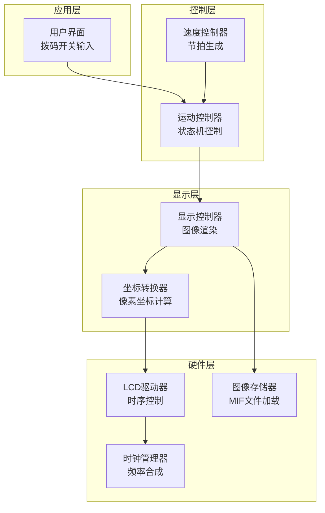

**图表来源**
- [lcd_rom_pic.v:1-59](file://lcd_rom_pic.v#L1-L59)
- [lcd_display.v:1-199](file://lcd_display.v#L1-L199)
- [lcd_driver.v:1-97](file://lcd_driver.v#L1-L97)

## 核心组件分析

### 主控制器模块

主控制器模块负责协调整个系统的运行，包含时钟管理和模块间通信。

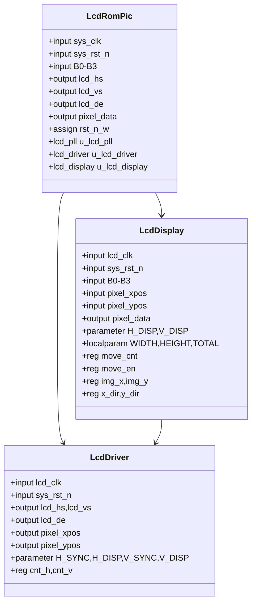

**图表来源**
- [lcd_rom_pic.v:1-59](file://lcd_rom_pic.v#L1-L59)
- [lcd_display.v:1-199](file://lcd_display.v#L1-L199)
- [lcd_driver.v:1-97](file://lcd_driver.v#L1-L97)

**章节来源**
- [lcd_rom_pic.v:1-59](file://lcd_rom_pic.v#L1-L59)
- [lcd_display.v:1-199](file://lcd_display.v#L1-L199)
- [lcd_driver.v:1-97](file://lcd_driver.v#L1-L97)

## 运动控制算法详解

### 运动节拍生成算法

系统使用计数器实现精确的运动节拍控制：

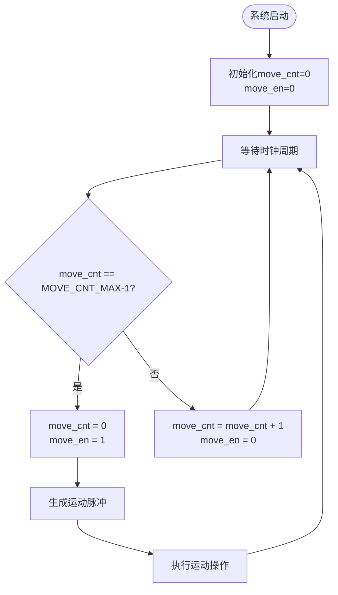

**图表来源**
- [lcd_display.v:33-46](file://lcd_display.v#L33-L46)

### 运动参数计算

系统采用参数化设计，支持灵活的运动参数配置：

- **基础位置参数**：POS_X_BASE = 230, POS_Y_BASE = 150
- **图像尺寸参数**：WIDTH = 140, HEIGHT = 170, TOTAL = 23800
- **速度控制参数**：MOVE_CNT_MAX = 555,000 (对应60 px/s)
- **颜色参数**：YELLOW = 0xFFFF00, RED = 0xFF0000, WHITE = 0xFFFFFF

**章节来源**
- [lcd_display.v:10-28](file://lcd_display.v#L10-L28)

## 显示模式实现原理

### 静态显示模式

静态显示模式是最简单的模式，图像保持在初始位置不变。

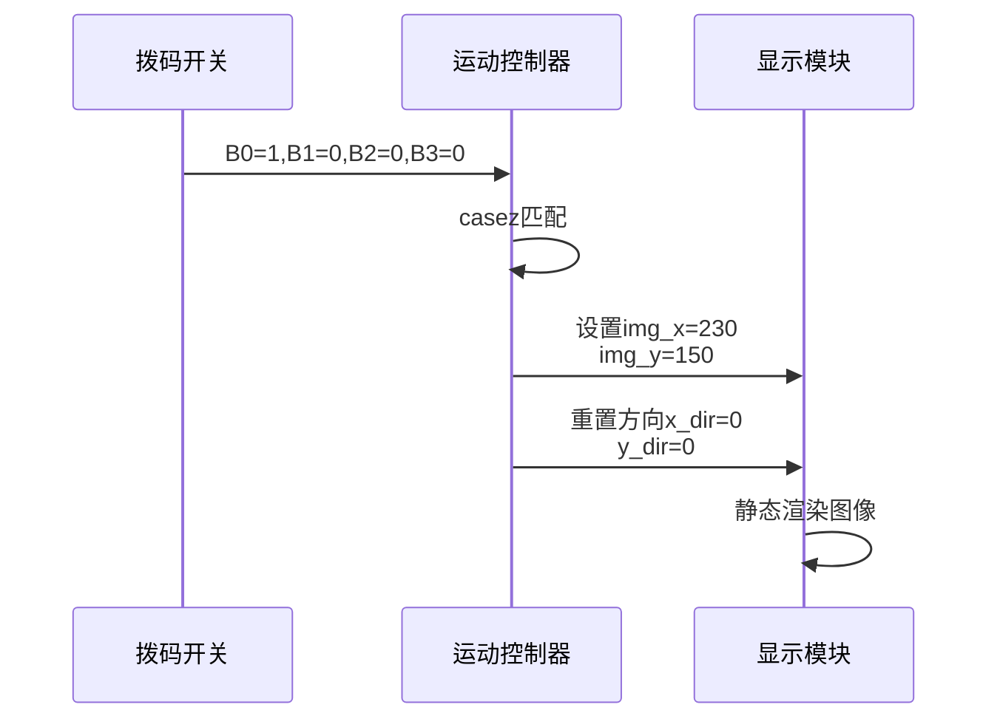

**图表来源**
- [lcd_display.v:109-114](file://lcd_display.v#L109-L114)

### 垂直振荡模式

垂直振荡模式实现图像在垂直方向上的往复运动，距离为130像素。

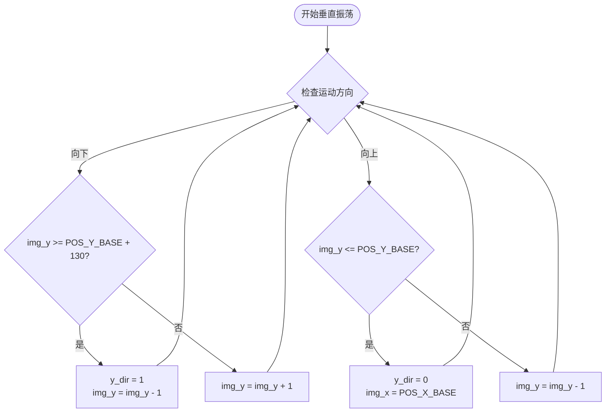

**图表来源**
- [lcd_display.v:88-107](file://lcd_display.v#L88-L107)

### 水平移动模式

水平移动模式实现图像在水平方向上的连续移动，遇到边界时反弹。

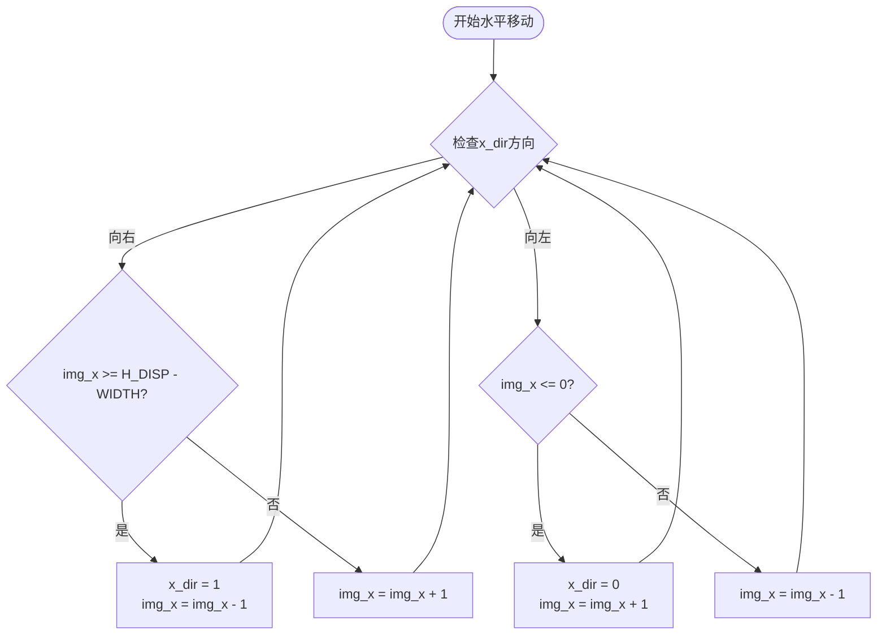

**图表来源**
- [lcd_display.v:67-86](file://lcd_display.v#L67-L86)

### 对角移动模式

对角移动模式实现图像同时在水平和垂直方向上的移动，支持边界穿透。

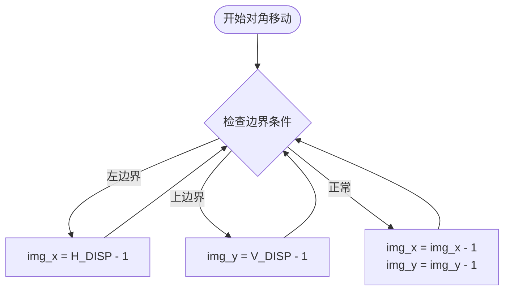

**图表来源**
- [lcd_display.v:61-65](file://lcd_display.v#L61-L65)

**章节来源**
- [lcd_display.v:60-123](file://lcd_display.v#L60-L123)

## 速度控制机制

### 时钟频率与速度关系

系统采用33.3MHz的像素时钟频率，通过计数器实现精确的速度控制：

- **时钟频率**：33,300,000 Hz
- **目标速度**：60 像素/秒
- **节拍周期**：33,300,000 ÷ 60 = 555,000 个时钟周期
- **计数器宽度**：20位 (0 到 555,000-1)

### 速度调节算法

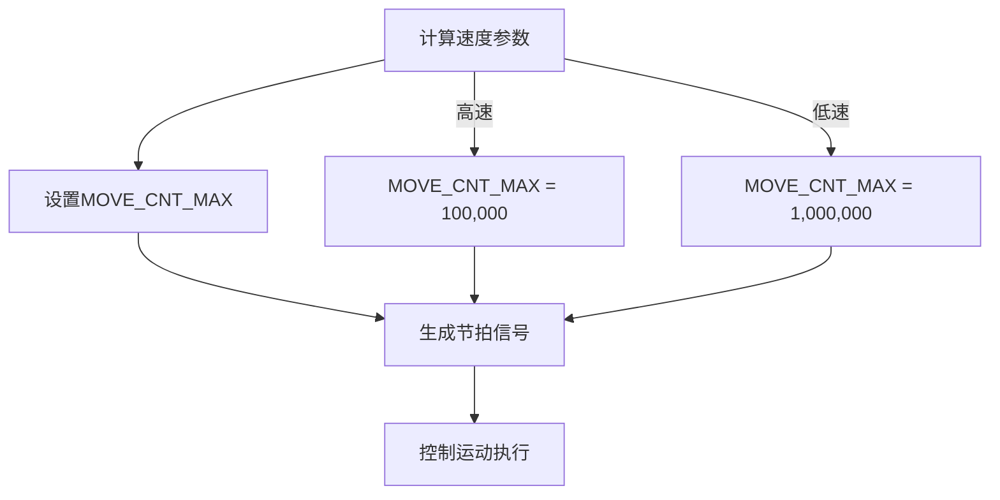

**图表来源**
- [lcd_display.v:26-46](file://lcd_display.v#L26-L46)

**章节来源**
- [lcd_display.v:26-46](file://lcd_display.v#L26-L46)

## 边界处理逻辑

### 边界检测机制

系统实现了多种边界处理策略：

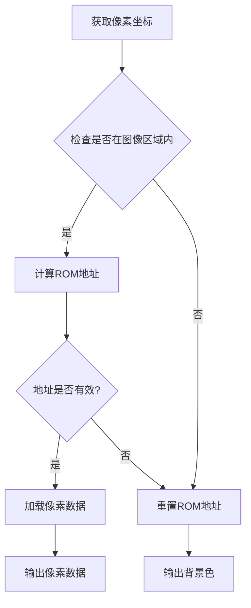

**图表来源**
- [lcd_display.v:134-186](file://lcd_display.v#L134-L186)

### 边界反弹算法

水平移动模式中的边界反弹逻辑：

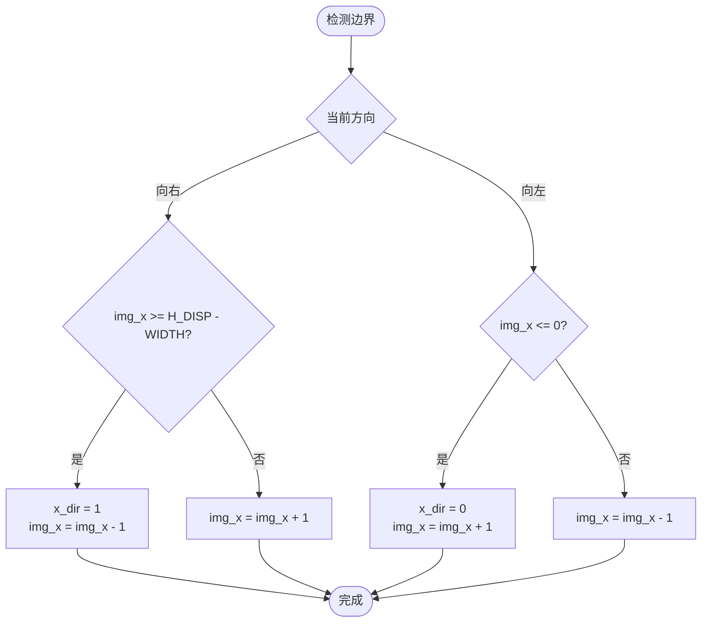

**图表来源**
- [lcd_display.v:69-83](file://lcd_display.v#L69-L83)

**章节来源**
- [lcd_display.v:134-186](file://lcd_display.v#L134-L186)

## 拨码开关输入处理

### 输入优先级控制

系统通过4位拨码开关实现模式选择，采用优先级编码方式：

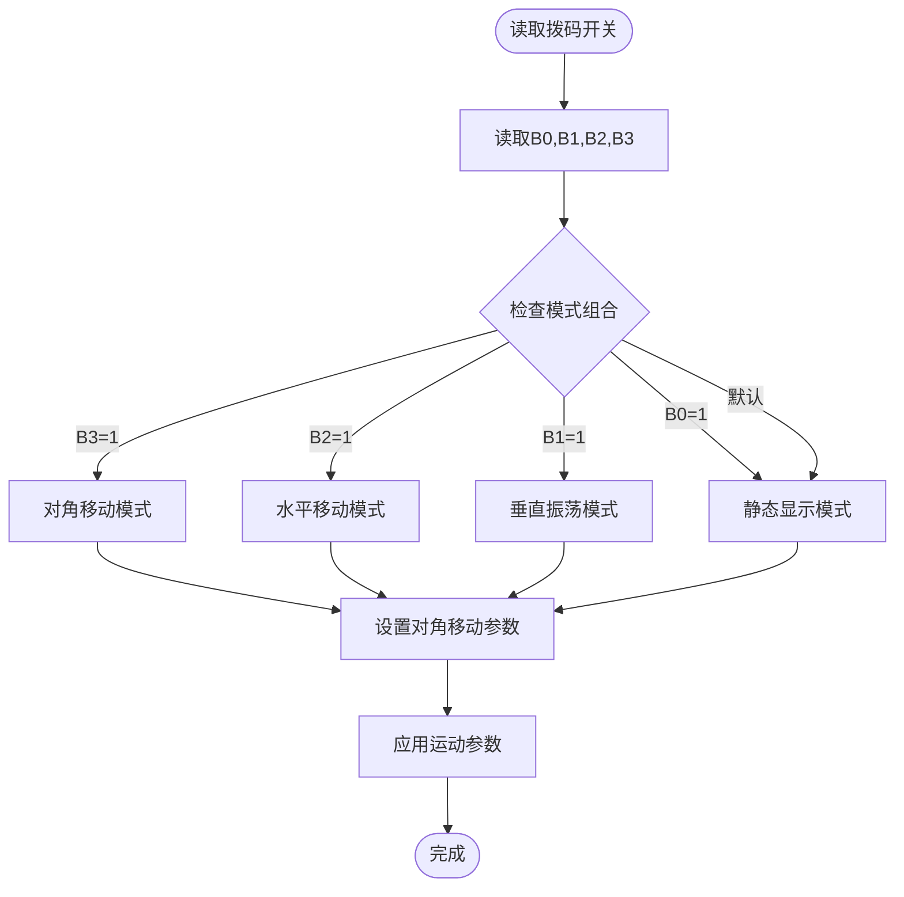

**图表来源**
- [lcd_display.v:60-123](file://lcd_display.v#L60-L123)

### 模式切换逻辑

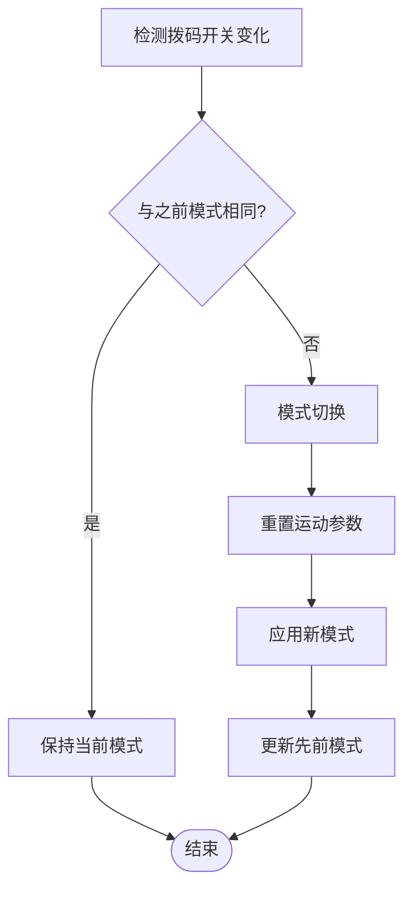

**图表来源**
- [lcd_display.v:109-123](file://lcd_display.v#L109-L123)

**章节来源**
- [lcd_display.v:60-123](file://lcd_display.v#L60-L123)

## 定时器配置与坐标变换

### LCD时序配置

系统采用标准VGA时序参数：

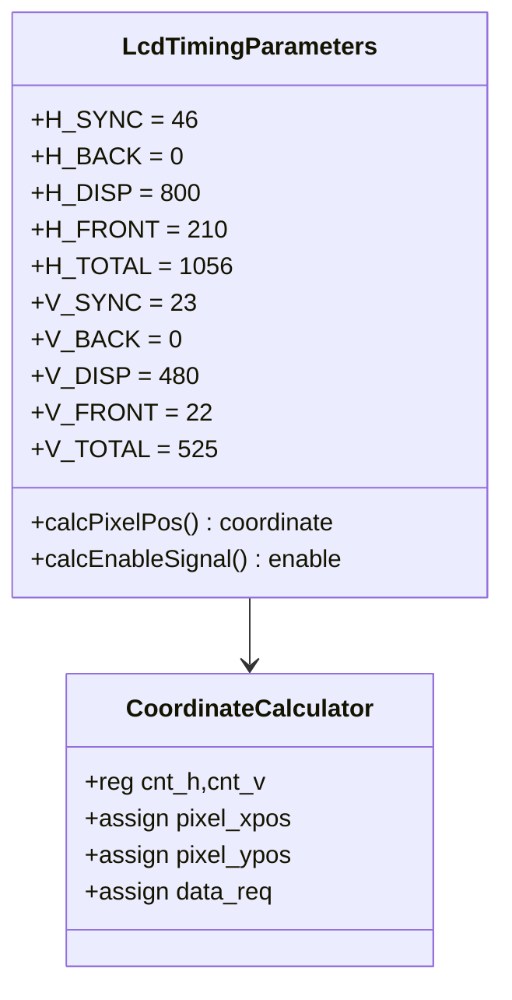

**图表来源**
- [lcd_driver.v:21-31](file://lcd_driver.v#L21-L31)
- [lcd_driver.v:67-69](file://lcd_driver.v#L67-L69)

### 坐标变换过程

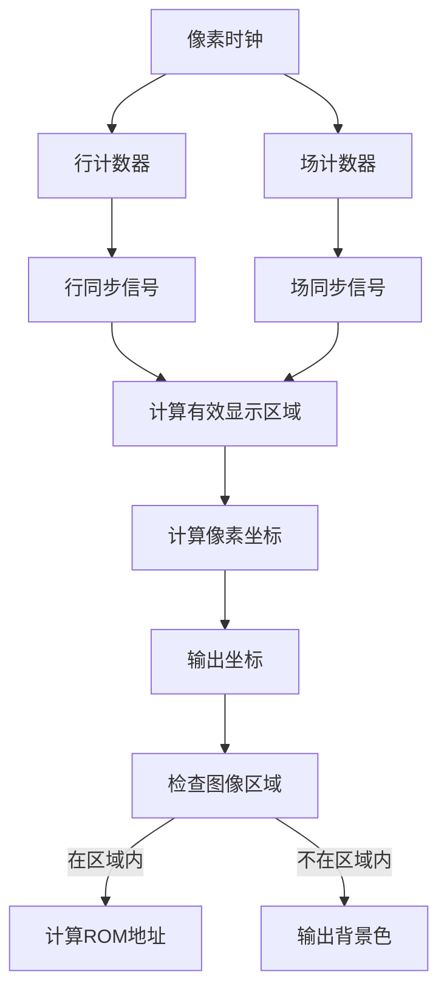

**图表来源**
- [lcd_driver.v:72-94](file://lcd_driver.v#L72-L94)

**章节来源**
- [lcd_driver.v:21-94](file://lcd_driver.v#L21-L94)

## 状态机设计与时序分析

### 运动控制状态机

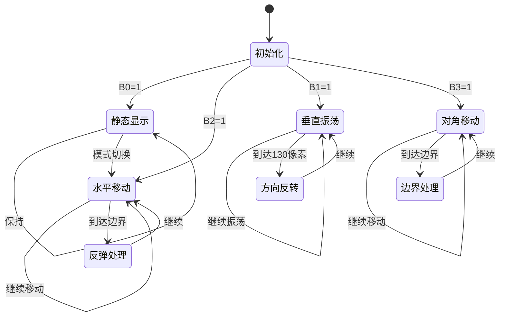

### 时序分析

系统采用流水线设计，确保像素数据的正确传输：

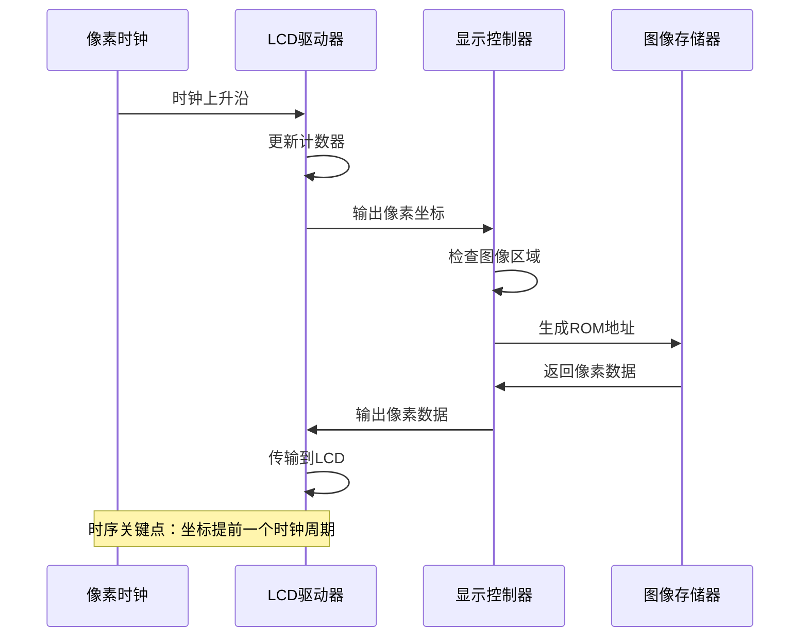

**图表来源**
- [lcd_driver.v:63-69](file://lcd_driver.v#L63-L69)

**章节来源**
- [lcd_display.v:137-152](file://lcd_display.v#L137-L152)
- [lcd_driver.v:63-69](file://lcd_driver.v#L63-L69)

## 性能优化建议

### 内存访问优化

1. **地址重置策略**：当图像位置改变时重置ROM地址，避免无效访问
2. **条件访问**：仅在图像区域内进行ROM访问，提高效率
3. **流水线设计**：利用ROM的单周期延迟特性，实现数据流水线

### 时钟域优化

1. **PLL配置**：使用ALTERA IP核实现精确的时钟频率合成
2. **时序裕量**：确保数据传输满足建立和保持时间要求
3. **时钟分频**：合理配置时钟分频比，平衡性能和功耗

### 代码结构优化

1. **参数化设计**：使用parameter和localparam统一管理常量
2. **模块化设计**：清晰的功能模块划分，便于维护和扩展
3. **注释规范**：详细的代码注释，便于理解和调试

## 故障排除指南

### 常见问题诊断

1. **图像不显示**
   - 检查拨码开关设置是否正确
   - 验证ROM文件加载是否成功
   - 确认时钟信号是否正常

2. **运动异常**
   - 检查运动参数配置
   - 验证边界处理逻辑
   - 确认时序是否正确

3. **显示闪烁**
   - 检查时钟频率配置
   - 验证同步信号生成
   - 确认像素数据传输时序

### 调试工具使用

1. **仿真验证**：使用ModelSim进行功能仿真
2. **时序分析**：利用Quartus进行时序约束分析
3. **硬件调试**：通过JTAG接口进行在线调试

### 性能监控

1. **资源利用率**：监控FPGA资源使用情况
2. **时钟频率**：验证实际工作频率
3. **功耗分析**：评估系统功耗表现

---

**章节来源**
- [lcd_display.v:137-152](file://lcd_display.v#L137-L152)
- [lcd_driver.v:63-69](file://lcd_driver.v#L63-L69)