# 运动控制系统技术文档

<cite>
**本文档引用的文件**
- [lcd_display.v](file://lcd_display.v)
- [lcd_rom_pic.v](file://lcd_rom_pic.v)
- [lcd_driver.v](file://lcd_driver.v)
- [pic_rom.v](file://pic_rom.v)
- [lcd_pll.v](file://lcd_pll.v)
- [lcd_sobel.v](file://lcd_sobel.v)
- [lcd_binary.v](file://lcd_binary.v)
- [lcd_text_overlay.v](file://lcd_text_overlay.v)
- [font_rom.v](file://font_rom.v)
- [CrazyBird.mif](file://CrazyBird.mif)
- [miqi.mif](file://miqi.mif)
- [picture1.mif](file://picture1.mif)
- [lcd_display.txt](file://lcd_display.txt)
- [lcd_driver.txt](file://lcd_driver.txt)
</cite>

## 更新摘要
**变更内容**
- 拨码开关从4位扩展到5位(B0-B4)，新增B4用于垂直拉伸控制
- 新增A0-A2按键，实现原图、二值化、边缘检测三种显示模式切换
- 增强运动控制算法，支持独立的水平和垂直运动控制
- 改进边界处理逻辑，实现更精确的碰撞检测和反弹机制
- 添加实时文字叠加显示功能，显示当前运动模式和功能状态
- 优化图像拉伸功能，支持独立的水平和垂直拉伸控制

## 目录
1. [项目概述](#项目概述)
2. [系统架构](#系统架构)
3. [核心组件分析](#核心组件分析)
4. [运动控制算法详解](#运动控制算法详解)
5. [显示模式实现原理](#显示模式实现原理)
6. [速度控制机制](#速度控制机制)
7. [边界处理逻辑](#边界处理逻辑)
8. [拨码开关输入处理](#拨码开关输入处理)
9. [定时器配置与坐标变换](#定时器配置与坐标变换)
10. [状态机设计与时序分析](#状态机设计与时序分析)
11. [性能优化建议](#性能优化建议)
12. [故障排除指南](#故障排除指南)

## 项目概述

本项目是一个基于FPGA的高级运动控制系统，实现了多种复杂的显示模式和运动控制功能。系统采用模块化设计，通过5位拨码开关(B0-B4)和3位按键(A0-A2)实现智能模式选择，支持精确的速度控制、边界检测、碰撞处理和实时文字叠加显示。

## 系统架构

系统采用分层架构设计，主要包含以下层次：

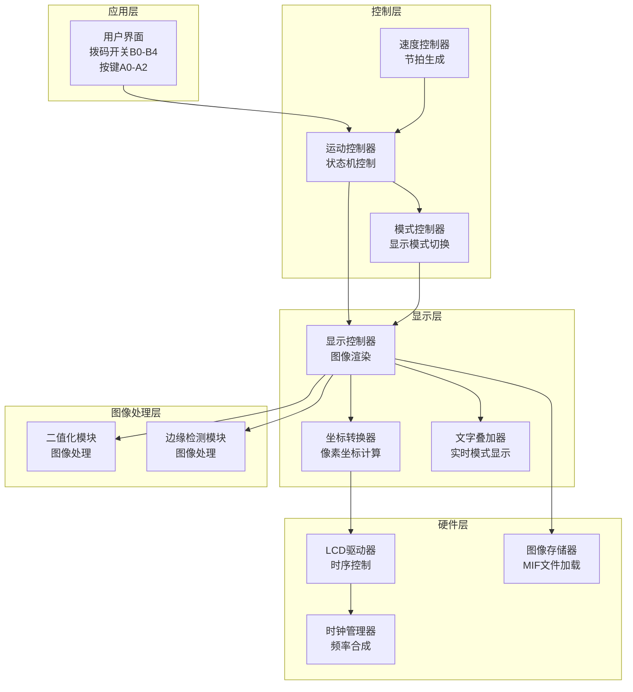

**图表来源**
- [lcd_rom_pic.v:1-67](file://lcd_rom_pic.v#L1-L67)
- [lcd_display.v:1-296](file://lcd_display.v#L1-L296)
- [lcd_driver.v:1-97](file://lcd_driver.v#L1-L97)

## 核心组件分析

### 主控制器模块

主控制器模块负责协调整个系统的运行，包含时钟管理和模块间通信。

**图表来源**
- [lcd_rom_pic.v:1-67](file://lcd_rom_pic.v#L1-L67)
- [lcd_display.v:1-296](file://lcd_display.v#L1-L296)
- [lcd_driver.v:1-97](file://lcd_driver.v#L1-L97)

**章节来源**
- [lcd_rom_pic.v:1-67](file://lcd_rom_pic.v#L1-L67)
- [lcd_display.v:1-296](file://lcd_display.v#L1-L296)
- [lcd_driver.v:1-97](file://lcd_driver.v#L1-L97)

## 运动控制算法详解

### 增强的运动节拍生成算法

系统使用改进的计数器实现精确的运动节拍控制：

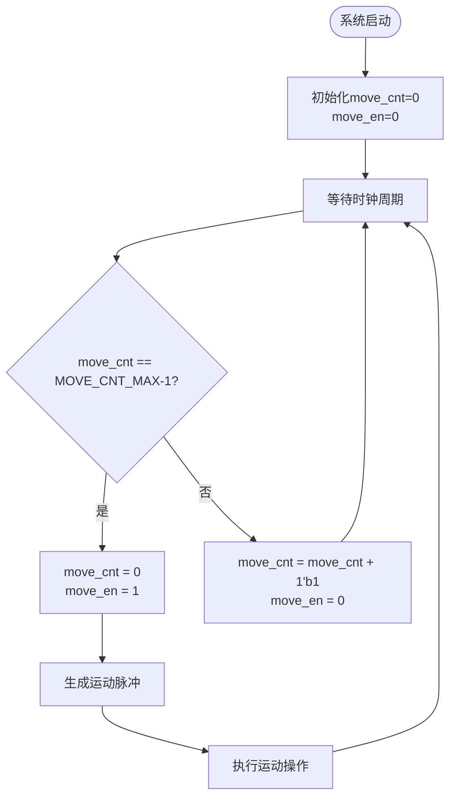

**图表来源**
- [lcd_display.v:36-49](file://lcd_display.v#L36-L49)

### 独立运动控制算法

系统实现了独立的水平和垂直运动控制：

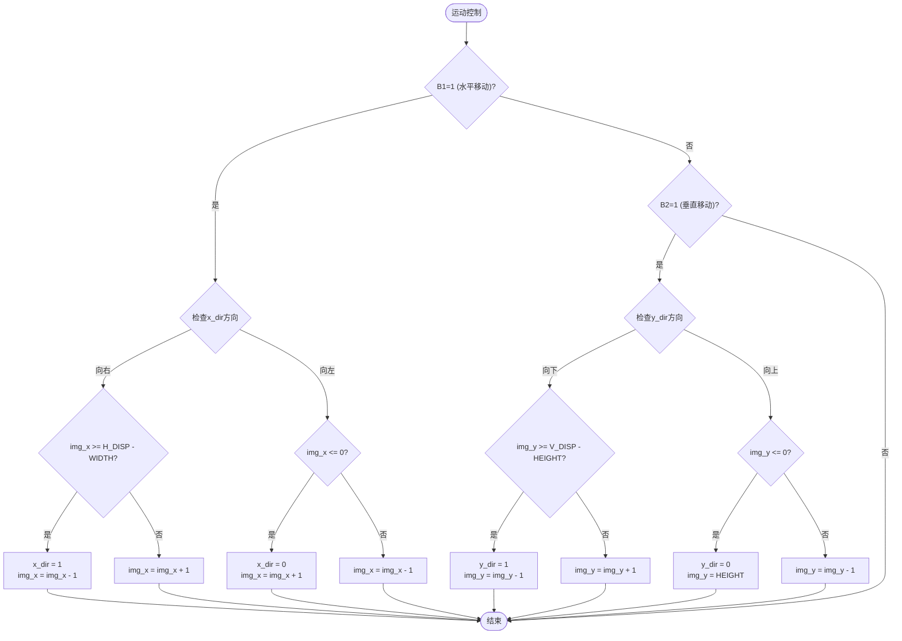

**图表来源**
- [lcd_display.v:68-110](file://lcd_display.v#L68-L110)

**章节来源**
- [lcd_display.v:36-110](file://lcd_display.v#L36-L110)

## 显示模式实现原理

### 原图显示模式

原图显示模式直接输出ROM中的原始图像数据。

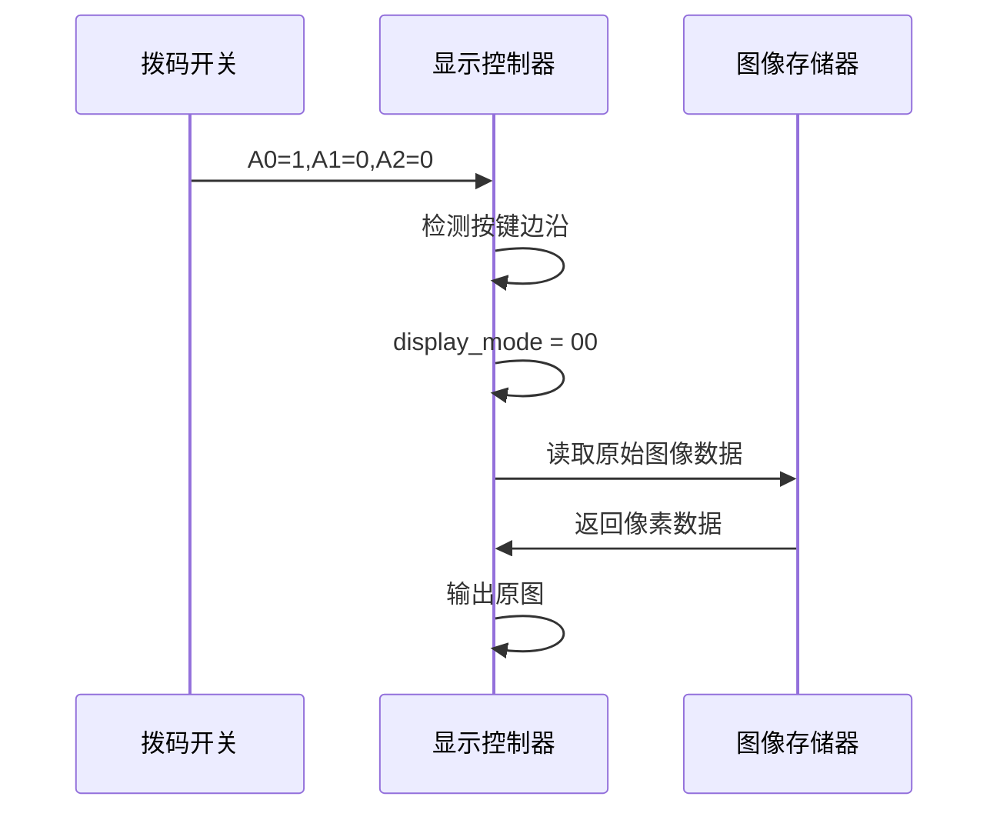

**图表来源**
- [lcd_display.v:137-146](file://lcd_display.v#L137-L146)

### 二值化显示模式

二值化显示模式将图像转换为黑白二值图像。

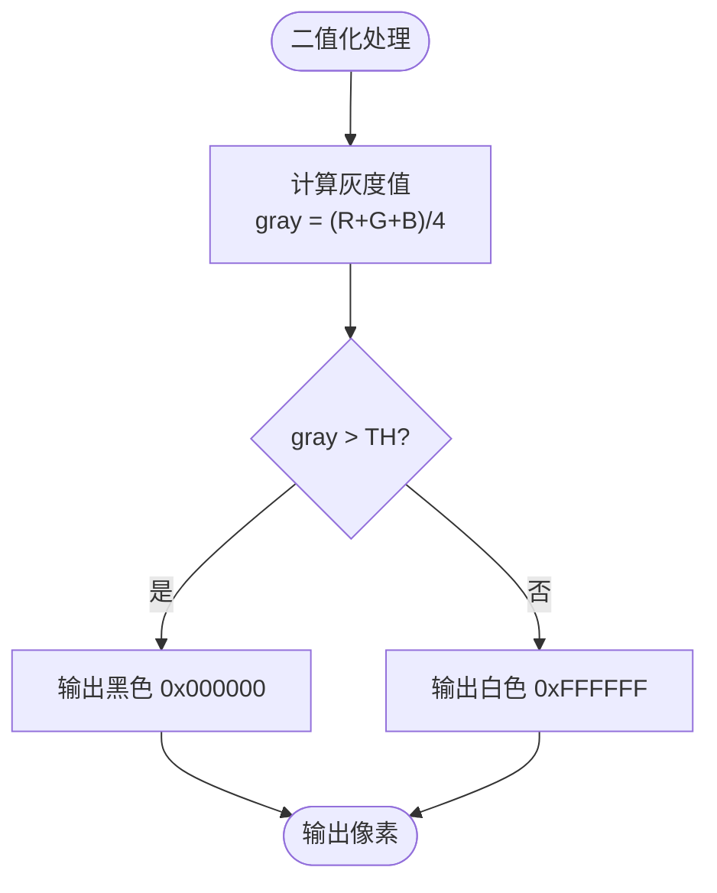

**图表来源**
- [lcd_binary.v:30-37](file://lcd_binary.v#L30-L37)

### 边缘检测显示模式

边缘检测显示模式使用Sobel算子检测图像边缘。

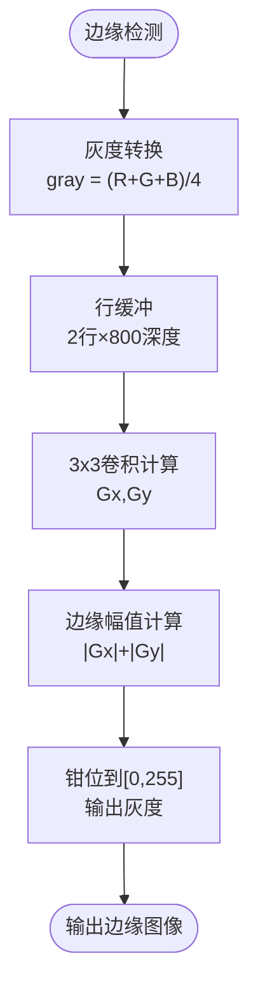

**图表来源**
- [lcd_sobel.v:84-126](file://lcd_sobel.v#L84-L126)

**章节来源**
- [lcd_display.v:112-174](file://lcd_display.v#L112-L174)
- [lcd_binary.v:12-40](file://lcd_binary.v#L12-L40)
- [lcd_sobel.v:13-131](file://lcd_sobel.v#L13-L131)

## 速度控制机制

### 时钟频率与速度关系

系统采用33.3MHz的像素时钟频率，通过计数器实现精确的速度控制：

- **时钟频率**：33,300,000 Hz
- **目标速度**：60 像素/秒
- **节拍周期**：33,300,000 ÷ 60 = 555,000 个时钟周期
- **计数器宽度**：20位 (0 到 555,000-1)

### 速度调节算法

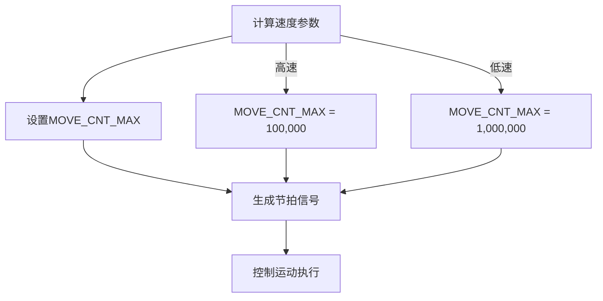

**图表来源**
- [lcd_display.v:29-49](file://lcd_display.v#L29-L49)

**章节来源**
- [lcd_display.v:29-49](file://lcd_display.v#L29-L49)

## 边界处理逻辑

### 增强的边界检测机制

系统实现了多种边界处理策略，包括独立的水平和垂直边界检测：

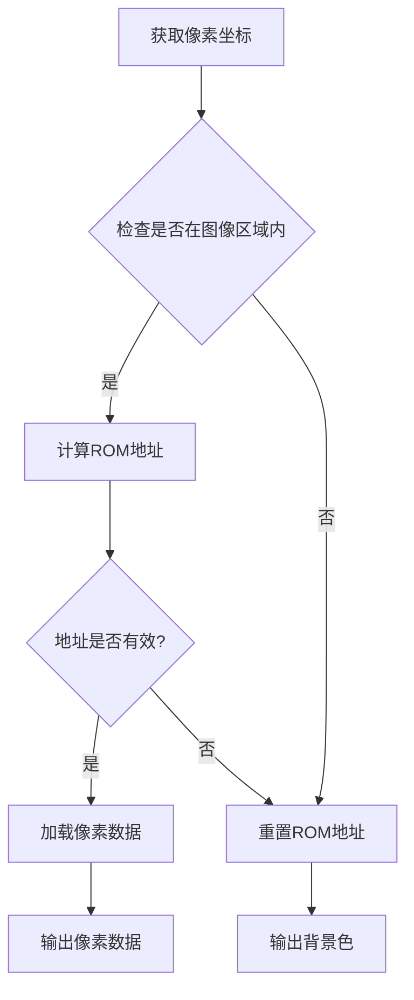

**图表来源**
- [lcd_display.v:177-186](file://lcd_display.v#L177-L186)

### 独立边界反弹算法

系统实现了独立的水平和垂直边界反弹逻辑：

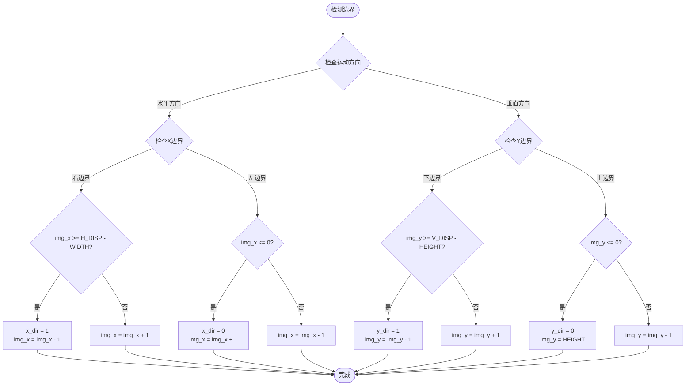

**图表来源**
- [lcd_display.v:68-110](file://lcd_display.v#L68-L110)

**章节来源**
- [lcd_display.v:177-236](file://lcd_display.v#L177-L236)

## 拨码开关输入处理

### 增强的输入优先级控制

系统通过5位拨码开关实现智能模式选择，采用优先级编码方式：

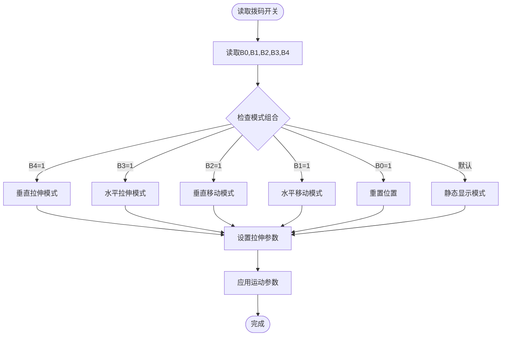

**图表来源**
- [lcd_display.v:62-110](file://lcd_display.v#L62-L110)

### 实时按键切换逻辑

系统实现了按键边沿检测和模式切换功能：

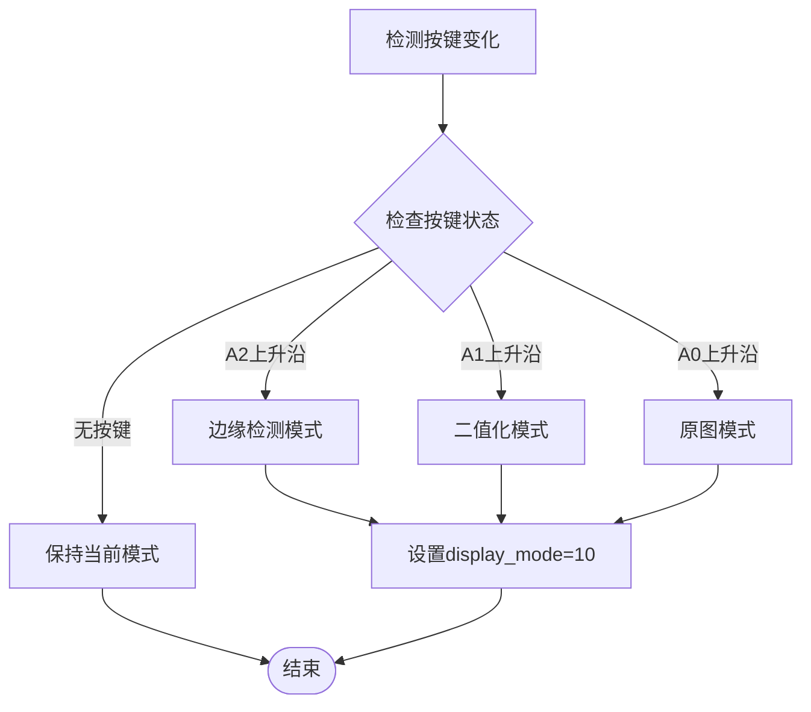

**图表来源**
- [lcd_display.v:117-146](file://lcd_display.v#L117-L146)

**章节来源**
- [lcd_display.v:62-146](file://lcd_display.v#L62-L146)

## 定时器配置与坐标变换

### LCD时序配置

系统采用标准VGA时序参数：

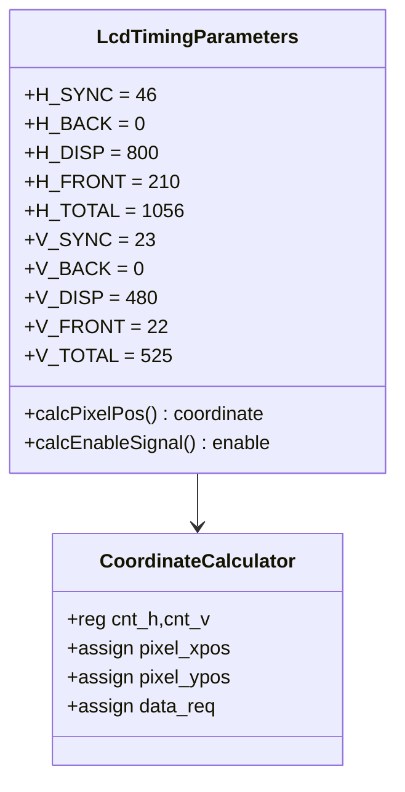

**图表来源**
- [lcd_driver.v:21-31](file://lcd_driver.v#L21-L31)
- [lcd_driver.v:67-69](file://lcd_driver.v#L67-L69)

### 增强的坐标变换过程

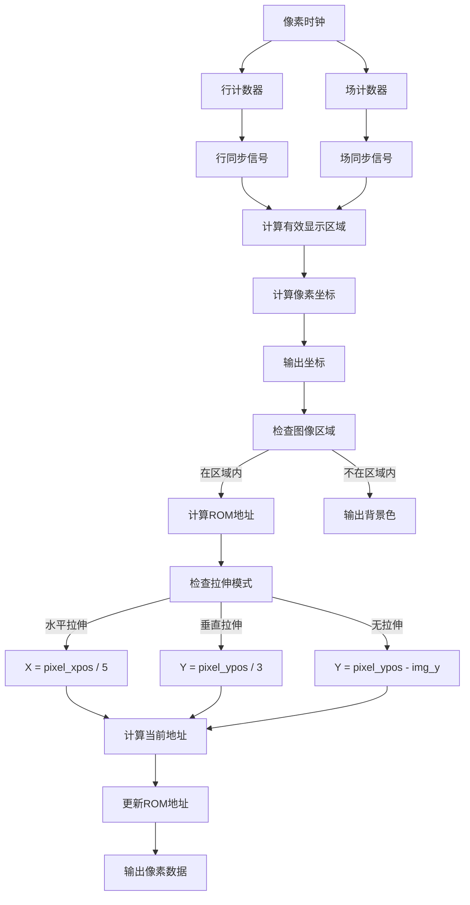

**图表来源**
- [lcd_driver.v:72-94](file://lcd_driver.v#L72-L94)

**章节来源**
- [lcd_driver.v:21-94](file://lcd_driver.v#L21-L94)

## 状态机设计与时序分析

### 增强的运动控制状态机

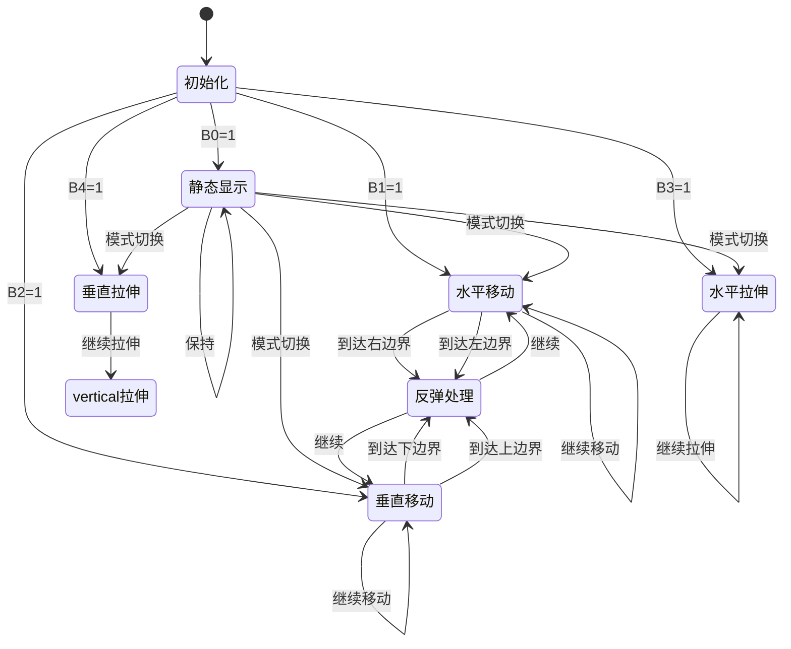

### 时序分析

系统采用流水线设计，确保像素数据的正确传输：

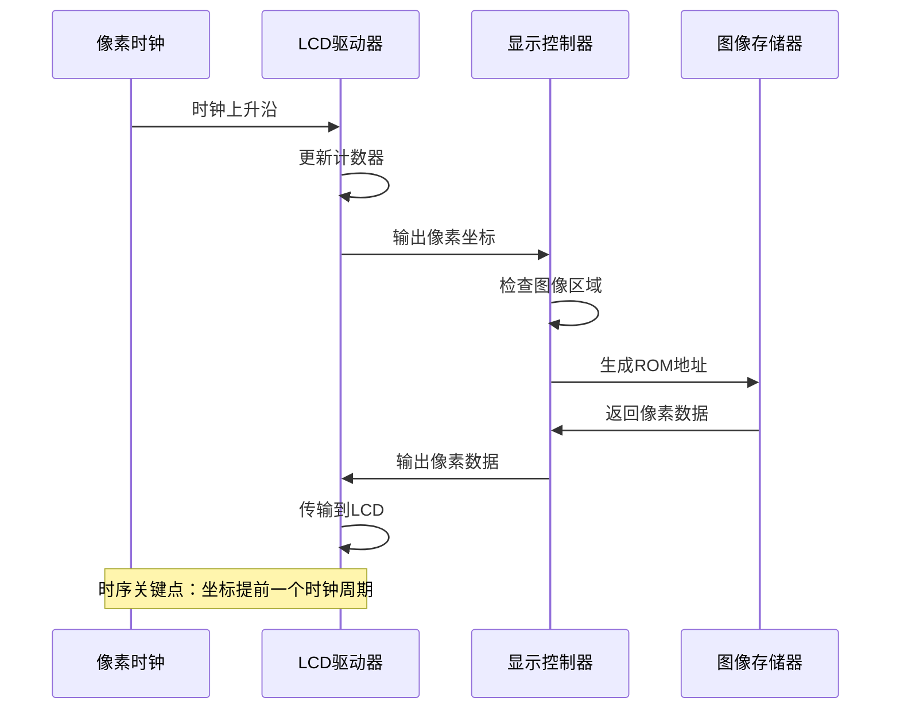

**图表来源**
- [lcd_driver.v:63-69](file://lcd_driver.v#L63-L69)

**章节来源**
- [lcd_display.v:184-236](file://lcd_display.v#L184-L236)
- [lcd_driver.v:63-69](file://lcd_driver.v#L63-L69)

## 性能优化建议

### 内存访问优化

1. **地址重置策略**：当图像位置改变时重置ROM地址，避免无效访问
2. **条件访问**：仅在图像区域内进行ROM访问，提高效率
3. **流水线设计**：利用ROM的单周期延迟特性，实现数据流水线
4. **拉伸优化**：使用位移操作替代除法运算，提高拉伸计算效率

### 时钟域优化

1. **PLL配置**：使用ALTERA IP核实现精确的时钟频率合成
2. **时序裕量**：确保数据传输满足建立和保持时间要求
3. **时钟分频**：合理配置时钟分频比，平衡性能和功耗

### 代码结构优化

1. **参数化设计**：使用parameter和localparam统一管理常量
2. **模块化设计**：清晰的功能模块划分，便于维护和扩展
3. **注释规范**：详细的代码注释，便于理解和调试
4. **状态机优化**：使用case语句实现高效的模式切换

## 故障排除指南

### 常见问题诊断

1. **图像不显示**
   - 检查拨码开关设置是否正确
   - 验证ROM文件加载是否成功
   - 确认时钟信号是否正常
   - 检查按键A0-A2是否正常工作

2. **运动异常**
   - 检查运动参数配置
   - 验证边界处理逻辑
   - 确认时序是否正确
   - 检查B3/B4拉伸功能是否冲突

3. **显示闪烁**
   - 检查时钟频率配置
   - 验证同步信号生成
   - 确认像素数据传输时序
   - 检查文字叠加功能是否影响显示

4. **按键无响应**
   - 检查按键边沿检测电路
   - 验证模式切换逻辑
   - 确认display_mode寄存器状态

### 调试工具使用

1. **仿真验证**：使用ModelSim进行功能仿真
2. **时序分析**：利用Quartus进行时序约束分析
3. **硬件调试**：通过JTAG接口进行在线调试
4. **逻辑分析仪**：使用外部设备观察信号时序

### 性能监控

1. **资源利用率**：监控FPGA资源使用情况
2. **时钟频率**：验证实际工作频率
3. **功耗分析**：评估系统功耗表现
4. **显示刷新率**：测量实际帧率表现

---

**章节来源**
- [lcd_display.v:184-236](file://lcd_display.v#L184-L236)
- [lcd_driver.v:63-69](file://lcd_driver.v#L63-L69)
- [lcd_text_overlay.v:14-241](file://lcd_text_overlay.v#L14-L241)