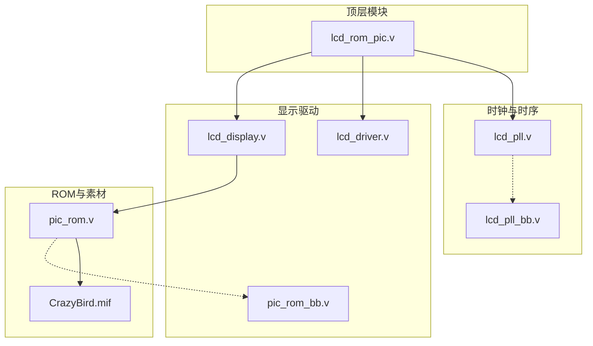
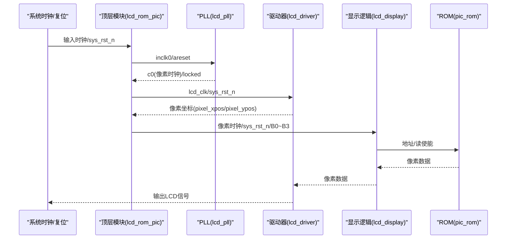
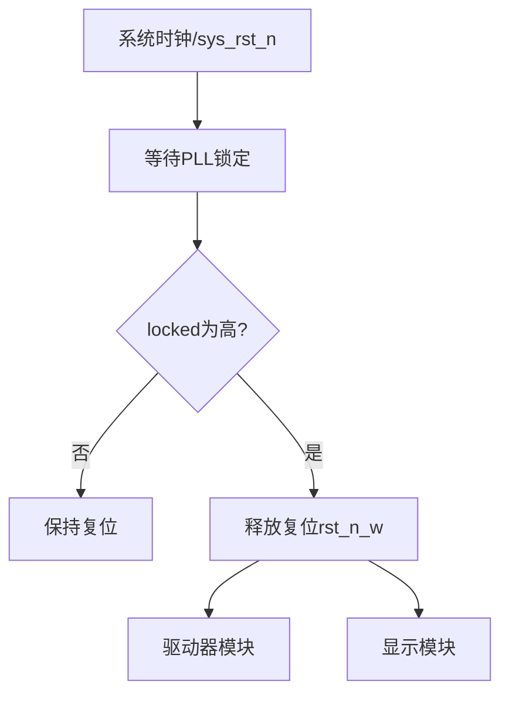
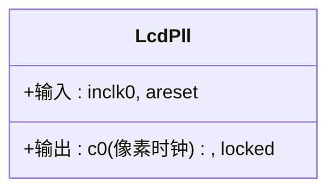
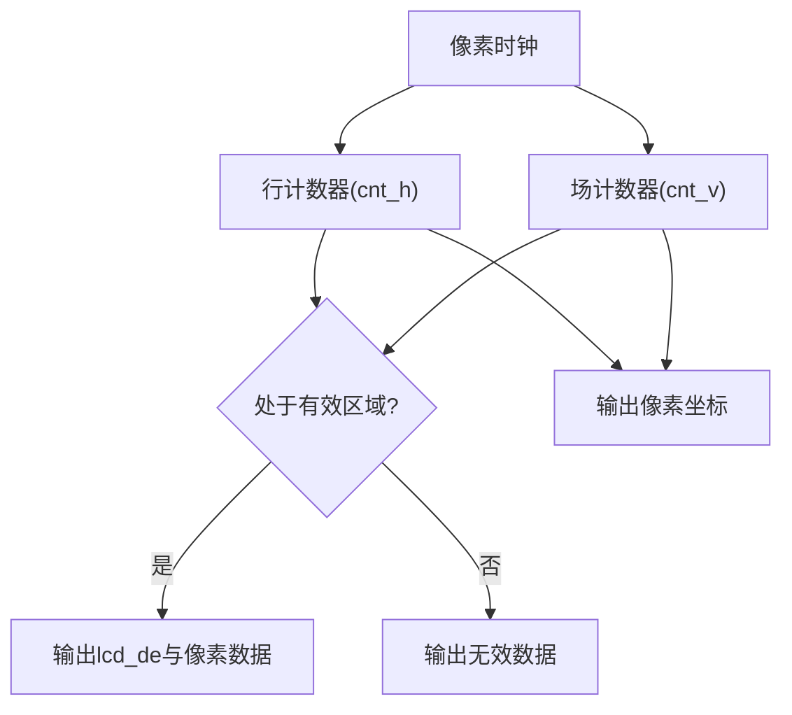
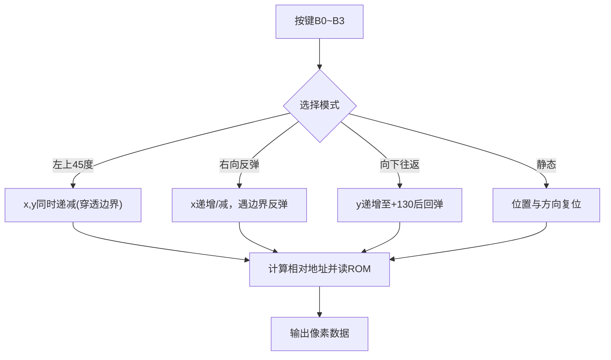
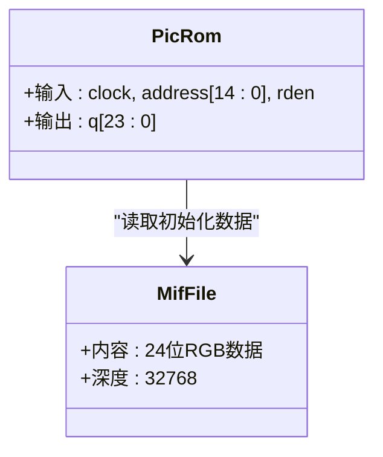
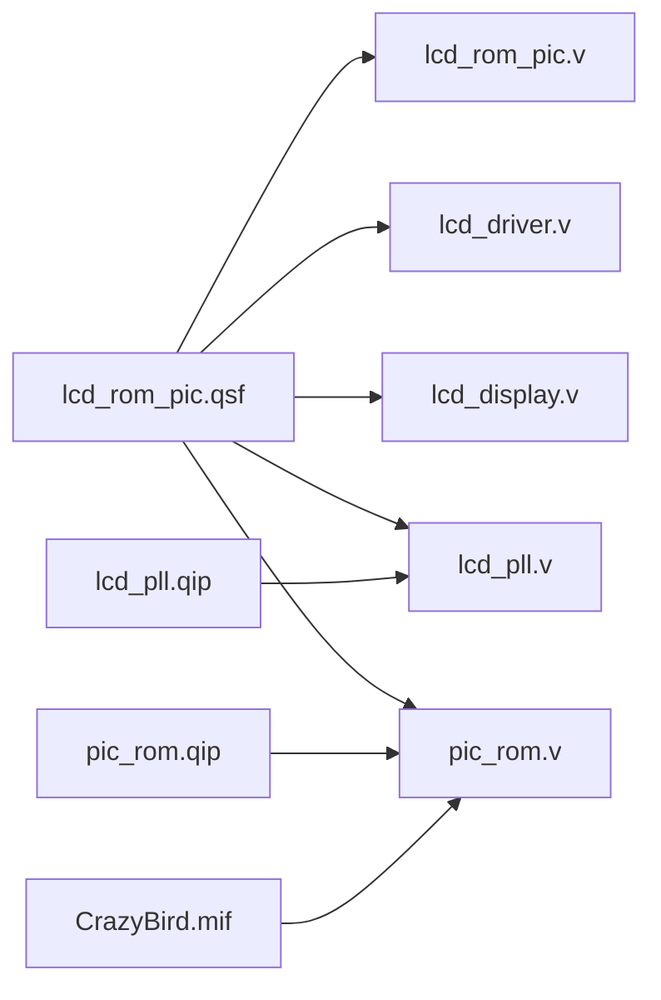

# 开发工具链

<cite>
**本文引用的文件**
- [lcd_rom_pic.qpf](file://lcd_rom_pic.qpf)
- [lcd_rom_pic.qsf](file://lcd_rom_pic.qsf)
- [lcd_rom_pic.v](file://lcd_rom_pic.v)
- [lcd_display.v](file://lcd_display.v)
- [lcd_driver.v](file://lcd_driver.v)
- [lcd_pll.v](file://lcd_pll.v)
- [pic_rom.v](file://pic_rom.v)
- [lcd_pll_bb.v](file://lcd_pll_bb.v)
- [pic_rom_bb.v](file://pic_rom_bb.v)
- [lcd_pll.qip](file://lcd_pll.qip)
- [pic_rom.qip](file://pic_rom.qip)
- [CrazyBird.mif](file://CrazyBird.mif)
- [lcd_display.txt](file://lcd_display.txt)
- [lcd_driver.txt](file://lcd_driver.txt)
- [lcd_rom_pic.txt](file://lcd_rom_pic.txt)
</cite>

## 目录
1. [简介](#简介)
2. [项目结构](#项目结构)
3. [核心组件](#核心组件)
4. [架构总览](#架构总览)
5. [详细组件分析](#详细组件分析)
6. [依赖分析](#依赖分析)
7. [性能考虑](#性能考虑)
8. [故障排查指南](#故障排查指南)
9. [结论](#结论)
10. [附录](#附录)

## 简介
本指南面向使用 Intel Quartus Prime 18.1 Lite 与 ModelSim-Altera 的 FPGA 开发者，围绕 LCD ROM PIC 项目提供从工具安装、项目配置到编译、综合、布局布线与仿真的完整流程说明。文档同时解析项目配置文件（.qpf、.qsf、.qip）的结构与作用，帮助开发者快速上手并稳定开展开发与调试工作。

## 项目结构
该项目采用 Verilog HDL 设计，顶层模块负责系统时钟、复位与 I/O 引脚分配；子模块分别实现时钟管理（PLL）、显示驱动（驱动器与显示逻辑）、以及图像数据 ROM 读取。项目还包含若干文本版示例文件，便于理解接口与时序。

图表来源
- [lcd_rom_pic.v:1-59](file://lcd_rom_pic.v#L1-L59)
- [lcd_pll.v:1-321](file://lcd_pll.v#L1-L321)
- [lcd_driver.v:1-97](file://lcd_driver.v#L1-L97)
- [lcd_display.v:1-199](file://lcd_display.v#L1-L199)
- [pic_rom.v:1-165](file://pic_rom.v#L1-L165)
- [CrazyBird.mif:1-200](file://CrazyBird.mif#L1-L200)

章节来源
- [lcd_rom_pic.v:1-59](file://lcd_rom_pic.v#L1-L59)
- [lcd_display.v:1-199](file://lcd_display.v#L1-L199)
- [lcd_driver.v:1-97](file://lcd_driver.v#L1-L97)
- [lcd_pll.v:1-321](file://lcd_pll.v#L1-L321)
- [pic_rom.v:1-165](file://pic_rom.v#L1-L165)
- [CrazyBird.mif:1-200](file://CrazyBird.mif#L1-L200)

## 核心组件
- 顶层模块：负责系统输入、复位、按键控制与 LCD 接口输出，协调时钟、驱动与显示模块。
- 时钟管理：基于 PLL 将外部时钟变换为 LCD 驱动所需的像素时钟，并提供锁定信号用于复位释放。
- 显示驱动：生成行/场同步、数据使能与像素坐标，将像素数据送至 LCD 屏幕。
- 显示逻辑：根据按键状态控制图像运动模式，从 ROM 中读取像素数据并在指定区域内合成显示。
- ROM IP：以 24 位 RGB 数据形式存储图像素材，按地址输出像素颜色。

章节来源
- [lcd_rom_pic.v:1-59](file://lcd_rom_pic.v#L1-L59)
- [lcd_pll.v:1-321](file://lcd_pll.v#L1-L321)
- [lcd_driver.v:1-97](file://lcd_driver.v#L1-L97)
- [lcd_display.v:1-199](file://lcd_display.v#L1-L199)
- [pic_rom.v:1-165](file://pic_rom.v#L1-L165)

## 架构总览
系统以顶层模块为中心，通过 PLL 提供稳定的像素时钟，驱动器模块生成同步信号与像素坐标，显示模块根据按键状态选择运动模式并从 ROM 读取图像数据，最终输出到 LCD 屏幕。

图表来源
- [lcd_rom_pic.v:1-59](file://lcd_rom_pic.v#L1-L59)
- [lcd_pll.v:1-321](file://lcd_pll.v#L1-L321)
- [lcd_driver.v:1-97](file://lcd_driver.v#L1-L97)
- [lcd_display.v:1-199](file://lcd_display.v#L1-L199)
- [pic_rom.v:1-165](file://pic_rom.v#L1-L165)

## 详细组件分析

### 顶层模块（lcd_rom_pic）
- 输入：系统时钟、系统复位、按键 B0~B3。
- 输出：LCD 同步信号、数据使能、RGB888 数据、背光、复位与像素时钟。
- 控制逻辑：等待 PLL 锁定后释放复位，协调驱动与显示模块。

图表来源
- [lcd_rom_pic.v:24-26](file://lcd_rom_pic.v#L24-L26)

章节来源
- [lcd_rom_pic.v:1-59](file://lcd_rom_pic.v#L1-L59)

### 时钟管理（lcd_pll）
- 使用 PLL IP 生成像素时钟，配置输入频率、倍乘/分频参数与目标频率。
- 输出：像素时钟与锁定信号，用于复位释放与后续模块时序。

图表来源
- [lcd_pll.v:39-48](file://lcd_pll.v#L39-L48)

章节来源
- [lcd_pll.v:1-321](file://lcd_pll.v#L1-L321)
- [lcd_pll_bb.v:1-211](file://lcd_pll_bb.v#L1-L211)
- [lcd_pll.qip:1-7](file://lcd_pll.qip#L1-L7)

### 显示驱动（lcd_driver）
- 生成行/场同步、数据使能与像素坐标。
- 将像素数据在有效区域内输出到 LCD。

图表来源
- [lcd_driver.v:34-69](file://lcd_driver.v#L34-L69)

章节来源
- [lcd_driver.v:1-97](file://lcd_driver.v#L1-L97)
- [lcd_driver.txt:1-97](file://lcd_driver.txt#L1-L97)

### 显示逻辑（lcd_display）
- 根据按键状态选择运动模式：左上45度穿透、右向反弹、向下130像素往返、静态显示。
- 从 ROM 读取图像数据，按坐标合成像素颜色。

图表来源
- [lcd_display.v:60-122](file://lcd_display.v#L60-L122)
- [lcd_display.v:155-178](file://lcd_display.v#L155-L178)

章节来源
- [lcd_display.v:1-199](file://lcd_display.v#L1-L199)
- [pic_rom.v:1-165](file://pic_rom.v#L1-L165)
- [CrazyBird.mif:1-200](file://CrazyBird.mif#L1-L200)

### ROM IP（pic_rom）
- 以 24 位 RGB 数据存储图像素材，按地址输出像素颜色。
- 初始化文件为 CrazyBird.mif，深度与宽度由配置决定。

图表来源
- [pic_rom.v:39-48](file://pic_rom.v#L39-L48)
- [CrazyBird.mif:4-5](file://CrazyBird.mif#L4-L5)

章节来源
- [pic_rom.v:1-165](file://pic_rom.v#L1-L165)
- [pic_rom_bb.v:1-116](file://pic_rom_bb.v#L1-L116)
- [pic_rom.qip:1-6](file://pic_rom.qip#L1-L6)
- [CrazyBird.mif:1-200](file://CrazyBird.mif#L1-L200)

### 文本示例（对比参考）
- lcd_display.txt 与 lcd_driver.txt 提供了 RGB565 接口版本的简化实现，便于理解坐标生成与像素数据格式。
- lcd_rom_pic.txt 展示了 VGA 版本的顶层模块结构，可作为移植参考。

章节来源
- [lcd_display.txt:1-45](file://lcd_display.txt#L1-L45)
- [lcd_driver.txt:1-97](file://lcd_driver.txt#L1-L97)
- [lcd_rom_pic.txt:1-57](file://lcd_rom_pic.txt#L1-L57)

## 依赖分析
- 顶层模块依赖时钟管理、驱动与显示模块。
- 显示模块依赖 ROM IP，ROM IP 依赖初始化文件。
- QSF/QPF/QIP 文件定义了设备、引脚分配、EDA 工具与 IP 模块路径。

图表来源
- [lcd_rom_pic.qsf:92-97](file://lcd_rom_pic.qsf#L92-L97)
- [lcd_pll.qip:1-7](file://lcd_pll.qip#L1-L7)
- [pic_rom.qip:1-6](file://pic_rom.qip#L1-L6)

章节来源
- [lcd_rom_pic.qsf:39-97](file://lcd_rom_pic.qsf#L39-L97)
- [lcd_pll.qip:1-7](file://lcd_pll.qip#L1-L7)
- [pic_rom.qip:1-6](file://pic_rom.qip#L1-L6)

## 性能考虑
- 时钟频率与分辨率：像素时钟需满足 LCD 分辨率与刷新率需求，PLL 参数应保证输出频率稳定。
- 地址计算与延迟：ROM 读取存在组合延迟，需在显示模块中正确处理读使能与地址更新时机。
- 像素合成：在有效区域内按坐标计算 ROM 地址，避免越界访问与重复读取。

## 故障排查指南
- 无图像或花屏
  - 检查 PLL 是否锁定，确认复位释放条件。
  - 核对驱动模块的有效区域判断与像素坐标生成。
- 坐标错位或图像偏移
  - 检查像素坐标计算中的偏移常量与有效区域边界。
- ROM 数据异常
  - 确认初始化文件路径与深度/宽度设置一致。
  - 检查按键模式选择分支与地址重置逻辑。

章节来源
- [lcd_pll.v:104-159](file://lcd_pll.v#L104-L159)
- [lcd_driver.v:50-69](file://lcd_driver.v#L50-L69)
- [lcd_display.v:134-178](file://lcd_display.v#L134-L178)
- [pic_rom.v:85-99](file://pic_rom.v#L85-L99)

## 结论
本项目通过清晰的模块划分与稳定的时钟管理，实现了基于按键控制的动态图像显示。借助 Quartus 与 ModelSim 的配置文件与仿真工具，开发者可以高效完成从设计到验证的全流程工作。

## 附录

### 配置文件格式与用途
- .qpf（Quartus Project File）
  - 项目元信息与版本记录，包含 Quartus 版本、创建时间与修订信息。
- .qsf（Quartus Settings File）
  - 项目设置与全局赋值，包括器件型号、顶层实体、EDA 工具、输出目录、引脚分配与文件包含。
- .qip（Quartus IP File）
  - IP 模块声明与源文件路径，用于加载 PLL 与 ROM IP 及其后缀文件。

章节来源
- [lcd_rom_pic.qpf:19-32](file://lcd_rom_pic.qpf#L19-L32)
- [lcd_rom_pic.qsf:39-51](file://lcd_rom_pic.qsf#L39-L51)
- [lcd_pll.qip:1-7](file://lcd_pll.qip#L1-L7)
- [pic_rom.qip:1-6](file://pic_rom.qip#L1-L6)

### 工具链使用要点
- Quartus Prime 18.1 Lite
  - 打开项目：使用 .qpf 文件启动工程。
  - 编译流程：设置顶层实体、引脚分配与 EDA 工具，执行“Start Compilation”完成综合、布局布线与比特流生成。
  - 仿真准备：在 .qsf 中设置 EDA 工具为 ModelSim-Altera，仿真格式为 Verilog HDL。
- ModelSim-Altera
  - 在 Quartus 中启动仿真，自动加载仿真库与顶层测试平台。
  - 运行仿真：设置仿真时间与波形查看，观察 LCD 时序与像素数据。

章节来源
- [lcd_rom_pic.qsf:50-51](file://lcd_rom_pic.qsf#L50-L51)
- [lcd_rom_pic.qsf:92-97](file://lcd_rom_pic.qsf#L92-L97)