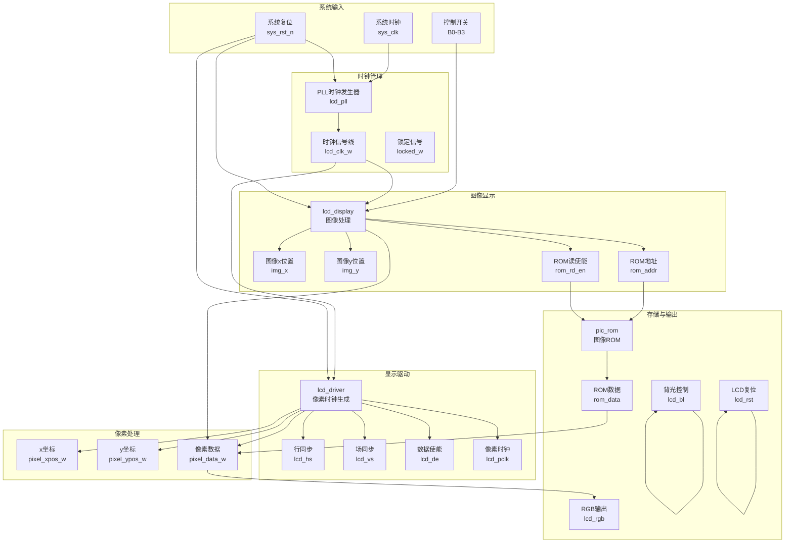
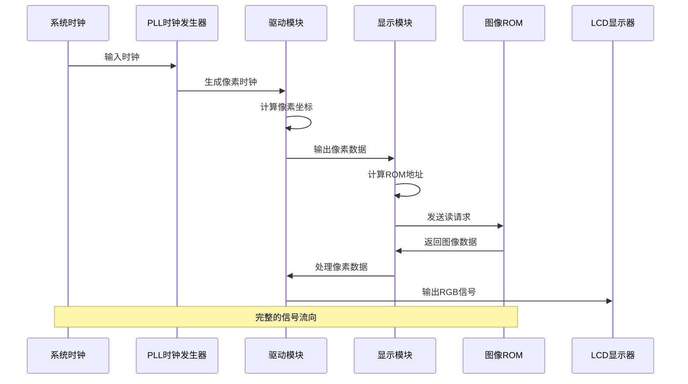
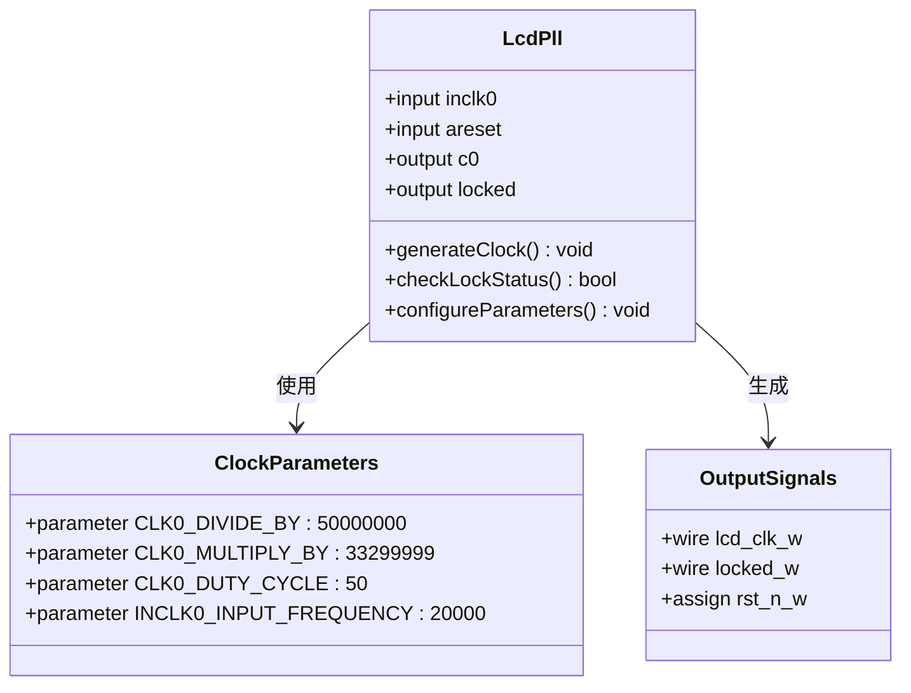
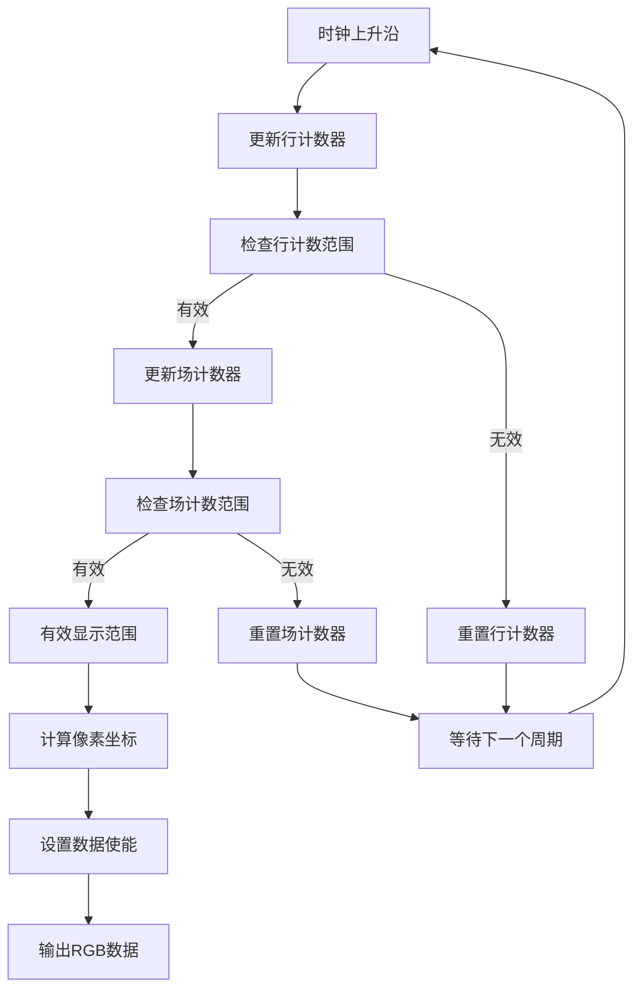
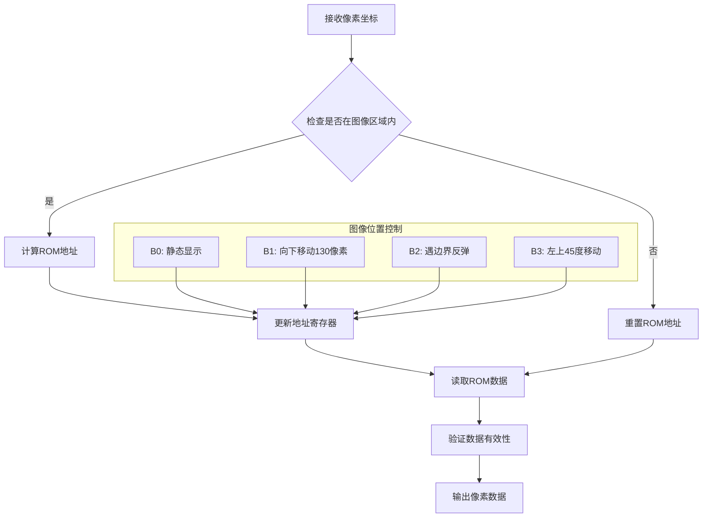
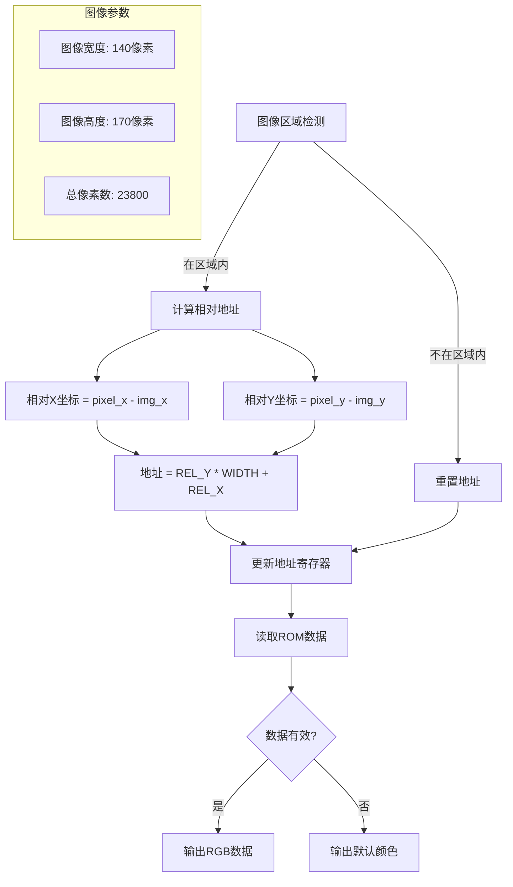
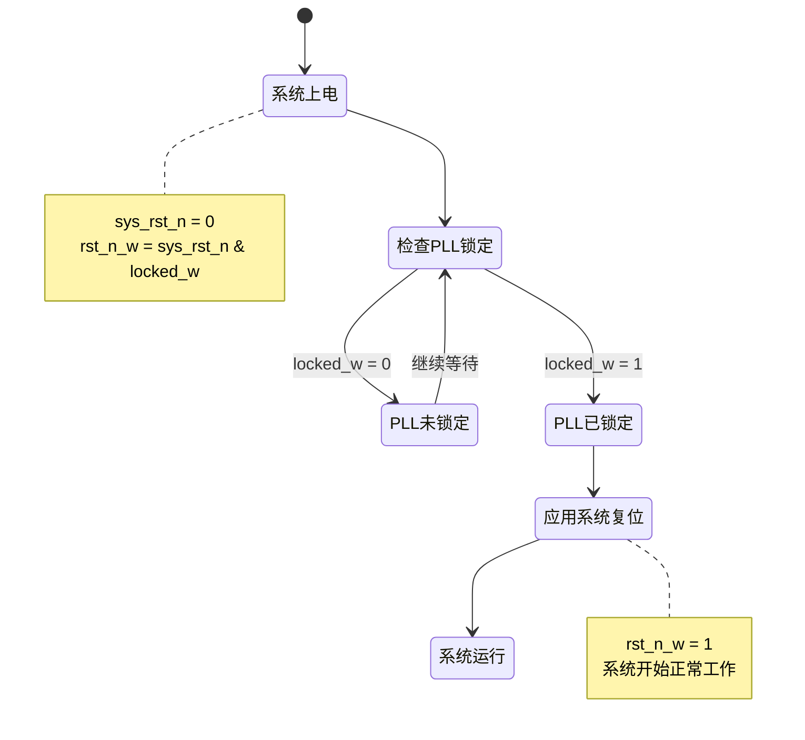

# 信号流向分析

<cite>
**本文档引用的文件**
- [lcd_rom_pic.v](file://lcd_rom_pic.v)
- [lcd_driver.v](file://lcd_driver.v)
- [lcd_display.v](file://lcd_display.v)
- [pic_rom.v](file://pic_rom.v)
- [lcd_pll.v](file://lcd_pll.v)
- [CrazyBird.mif](file://CrazyBird.mif)
- [lcd_pll_bb.v](file://lcd_pll_bb.v)
- [pic_rom_bb.v](file://pic_rom_bb.v)
</cite>

## 目录
1. [简介](#简介)
2. [项目结构](#项目结构)
3. [核心组件](#核心组件)
4. [架构概览](#架构概览)
5. [详细组件分析](#详细组件分析)
6. [信号时序分析](#信号时序分析)
7. [像素坐标系统](#像素坐标系统)
8. [ROM地址计算](#rom地址计算)
9. [时序约束与延迟](#时序约束与延迟)
10. [故障排除指南](#故障排除指南)
11. [结论](#结论)

## 简介

本项目是一个基于FPGA的LCD图像显示系统，实现了从系统时钟输入到LCD显示输出的完整信号流程。系统采用PLL时钟管理、像素坐标计算、ROM图像存储和RGB输出的完整链路，支持动态图像显示和多种显示模式。

## 项目结构

项目采用模块化设计，主要包含以下核心模块：



**图表来源**
- [lcd_rom_pic.v:1-59](file://lcd_rom_pic.v#L1-L59)
- [lcd_driver.v:1-97](file://lcd_driver.v#L1-L97)
- [lcd_display.v:1-199](file://lcd_display.v#L1-L199)

**章节来源**
- [lcd_rom_pic.v:1-59](file://lcd_rom_pic.v#L1-L59)
- [lcd_driver.v:1-97](file://lcd_driver.v#L1-L97)
- [lcd_display.v:1-199](file://lcd_display.v#L1-L199)

## 核心组件

### 主控制器模块 (lcd_rom_pic)

主模块作为系统的核心协调器，负责：
- 系统时钟输入处理
- PLL时钟生成和锁定信号管理
- 复位信号的时序控制
- 各子模块间的信号路由

### 驱动模块 (lcd_driver)

驱动模块实现：
- 像素时钟生成和管理
- 显示时序参数配置
- 像素坐标计算
- RGB数据输出控制

### 显示模块 (lcd_display)

显示模块负责：
- 图像位置控制和运动算法
- ROM地址计算
- 图像数据读取和处理
- 多种显示模式支持

### ROM模块 (pic_rom)

ROM模块提供：
- 图像数据存储
- 地址译码和数据读取
- 与显示模块的接口

**章节来源**
- [lcd_rom_pic.v:1-59](file://lcd_rom_pic.v#L1-L59)
- [lcd_driver.v:1-97](file://lcd_driver.v#L1-L97)
- [lcd_display.v:1-199](file://lcd_display.v#L1-L199)
- [pic_rom.v:1-165](file://pic_rom.v#L1-L165)

## 架构概览

系统采用流水线式架构，各模块间通过标准接口连接：



**图表来源**
- [lcd_rom_pic.v:26-47](file://lcd_rom_pic.v#L26-L47)
- [lcd_driver.v:68-69](file://lcd_driver.v#L68-L69)
- [lcd_display.v:163-177](file://lcd_display.v#L163-L177)

## 详细组件分析

### PLL时钟管理系统

PLL模块负责将输入时钟转换为LCD所需的像素时钟频率：



**图表来源**
- [lcd_pll.v:105-159](file://lcd_pll.v#L105-L159)
- [lcd_pll.v:39-48](file://lcd_pll.v#L39-L48)

PLL配置特点：
- 输入频率：20MHz
- 输出频率：约33.3MHz
- 分频比：约1.67
- 占空比：50%

**章节来源**
- [lcd_pll.v:105-159](file://lcd_pll.v#L105-L159)
- [lcd_pll.v:39-48](file://lcd_pll.v#L39-L48)

### 驱动模块功能分析

驱动模块实现完整的显示时序控制：



**图表来源**
- [lcd_driver.v:73-94](file://lcd_driver.v#L73-L94)
- [lcd_driver.v:68-69](file://lcd_driver.v#L68-L69)

**章节来源**
- [lcd_driver.v:73-94](file://lcd_driver.v#L73-L94)
- [lcd_driver.v:68-69](file://lcd_driver.v#L68-L69)

### 显示模块算法分析

显示模块实现复杂的图像处理和地址计算：



**图表来源**
- [lcd_display.v:134-135](file://lcd_display.v#L134-L135)
- [lcd_display.v:163-177](file://lcd_display.v#L163-L177)

**章节来源**
- [lcd_display.v:134-135](file://lcd_display.v#L134-L135)
- [lcd_display.v:163-177](file://lcd_display.v#L163-L177)

## 信号时序分析

### 像素时钟时序

系统采用单像素时钟驱动方式，时钟频率为约33.3MHz：

```mermaid
gantt
title 像素时钟时序图
dateFormat X
axisFormat %s
section 像素时钟周期
周期1 :0, 30ns
周期2 :30, 30ns
周期3 :60, 30ns
周期4 :90, 30ns
section 显示时序
行同步 :100, 10ns
场同步 :200, 5ns
数据使能 :120, 240ns
```



### 显示参数配置

系统采用标准VGA时序参数：

| 参数 | 值 | 描述 |
|------|-----|------|
| H_SYNC | 46 | 行同步脉冲宽度 |
| H_BACK | 0 | 行后肩 |
| H_DISP | 800 | 有效显示宽度 |
| H_FRONT | 210 | 行前沿 |
| H_TOTAL | 1056 | 行总周期 |
| V_SYNC | 23 | 场同步脉冲宽度 |
| V_BACK | 0 | 场后肩 |
| V_DISP | 480 | 有效显示高度 |
| V_FRONT | 22 | 场前沿 |
| V_TOTAL | 525 | 场总周期 |

### 时序关系说明

1. **像素时钟 (lcd_pclk)**: 33.3MHz，用于驱动整个显示系统
2. **行同步 (lcd_hs)**: 在每个行周期开始时产生同步脉冲
3. **场同步 (lcd_vs)**: 在每个场周期开始时产生同步脉冲
4. **数据使能 (lcd_de)**: 在有效显示期间使能数据传输
5. **像素数据 (lcd_rgb)**: 在数据使能期间输出RGB数据

**章节来源**
- [lcd_driver.v:21-31](file://lcd_driver.v#L21-L31)
- [lcd_driver.v:48-55](file://lcd_driver.v#L48-L55)

## 像素坐标系统

### 坐标系统设计

系统采用11位坐标系统，支持800x480分辨率：

```mermaid
graph TB
subgraph "坐标系统"
ORIGIN[原点<br/>(0,0)]
subgraph "X轴方向"
X0[0]
X400[400]
X800[800]
end
subgraph "Y轴方向"
Y0[0]
Y240[240]
Y480[480]
end
ORIGIN --> X0
ORIGIN --> Y0
end
subgraph "有效显示区域"
AREA[800x480像素]
AREA --> ORIGIN
end
```

**图表来源**
- [lcd_driver.v:68-69](file://lcd_driver.v#L68-L69)

### 坐标计算逻辑

坐标计算采用提前一个时钟周期的策略：

```mermaid
flowchart TD
START[时钟上升沿] --> UPDATE_H[更新行计数器]
UPDATE_H --> CHECK_H_RANGE{检查行计数范围}
CHECK_H_RANGE --> |有效| CALC_X[计算X坐标]
CHECK_H_RANGE --> |无效| CALC_Y[计算Y坐标]
CALC_X --> SET_DATA_REQ[设置数据请求]
CALC_Y --> SET_DATA_REQ
SET_DATA_REQ --> OUTPUT_COORD[输出坐标]
subgraph "坐标计算公式"
X_COORD[X = cnt_h - (H_SYNC + H_BACK - 1)]
Y_COORD[Y = cnt_v - (V_SYNC + V_BACK - 1) - 1]
end
OUTPUT_COORD --> X_COORD
OUTPUT_COORD --> Y_COORD
```

**图表来源**
- [lcd_driver.v:68-69](file://lcd_driver.v#L68-L69)
- [lcd_driver.v:63-65](file://lcd_driver.v#L63-L65)

**章节来源**
- [lcd_driver.v:68-69](file://lcd_driver.v#L68-L69)
- [lcd_driver.v:63-65](file://lcd_driver.v#L63-L65)

## ROM地址计算

### 地址映射机制

系统使用15位地址空间存储24位RGB数据，支持2^15 = 32768个地址：



**图表来源**
- [lcd_display.v:163-177](file://lcd_display.v#L163-L177)
- [lcd_display.v:167](file://lcd_display.v#L167)

### 地址计算公式

地址计算采用线性映射方式：

```
rom_addr = (pixel_ypos - img_y) × WIDTH + (pixel_xpos - img_x)
```

其中：
- WIDTH = 140（图像宽度）
- HEIGHT = 170（图像高度）
- TOTAL = 23800（总像素数）

**章节来源**
- [lcd_display.v:163-177](file://lcd_display.v#L163-L177)
- [CrazyBird.mif:4-5](file://CrazyBird.mif#L4-L5)

## 时序约束与延迟

### 复位时序控制

系统采用PLL锁定信号参与复位控制，确保时钟稳定后再启动显示：



**图表来源**
- [lcd_rom_pic.v:24-25](file://lcd_rom_pic.v#L24-L25)

### 时序延迟分析

系统中的关键时序延迟：

1. **ROM读取延迟**: 1个时钟周期
   - 从发出读使能到数据有效输出
   - 在显示模块中通过rom_valid寄存器实现

2. **坐标提前延迟**: 1个时钟周期
   - 驱动模块中data_req信号提前1个周期
   - 确保像素数据在有效显示期内正确输出

3. **PLL锁定时间**: 几百微秒到几毫秒
   - 等待PLL达到稳定状态
   - 避免启动时的显示异常

**章节来源**
- [lcd_display.v:180-186](file://lcd_display.v#L180-L186)
- [lcd_driver.v:63-65](file://lcd_driver.v#L63-L65)
- [lcd_rom_pic.v:24-25](file://lcd_rom_pic.v#L24-L25)

## 故障排除指南

### 常见问题诊断

1. **无显示输出**
   - 检查sys_rst_n信号是否有效
   - 验证PLL锁定信号(locked_w)状态
   - 确认lcd_clk_w时钟是否正常

2. **显示闪烁或不稳定**
   - 检查像素时钟频率是否正确
   - 验证数据使能(lcd_de)时序
   - 确认坐标计算逻辑

3. **图像显示异常**
   - 检查ROM地址计算是否正确
   - 验证图像位置寄存器(img_x, img_y)
   - 确认控制开关(B0-B3)设置

### 调试建议

1. **时序分析**
   - 使用示波器观察关键信号时序
   - 检查PLL锁定时间和稳定性
   - 验证像素时钟相位关系

2. **功能验证**
   - 测试静态显示模式(B0=1)
   - 验证运动控制功能
   - 检查边界条件处理

**章节来源**
- [lcd_rom_pic.v:24-25](file://lcd_rom_pic.v#L24-L25)
- [lcd_display.v:60-123](file://lcd_display.v#L60-L123)

## 结论

LCD_ROM_PIC项目展示了完整的数字显示系统设计，具有以下特点：

1. **模块化设计**: 各功能模块职责明确，接口清晰
2. **时序精确**: 严格的时序控制确保显示质量
3. **可扩展性**: 支持多种显示模式和控制方式
4. **可靠性**: PLL锁定机制保证系统稳定性

该系统为FPGA显示应用提供了良好的参考架构，适用于各种嵌入式显示场景。