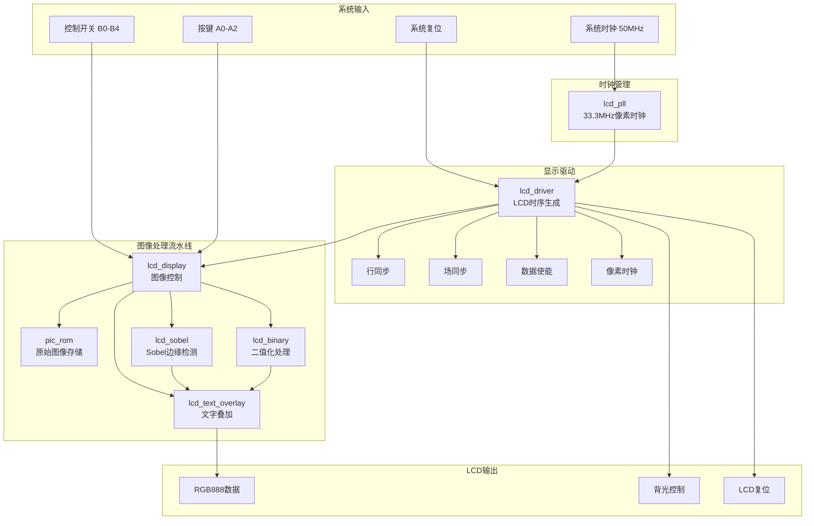
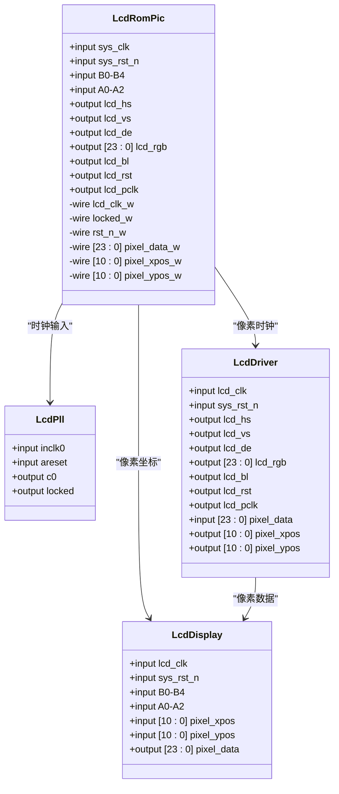
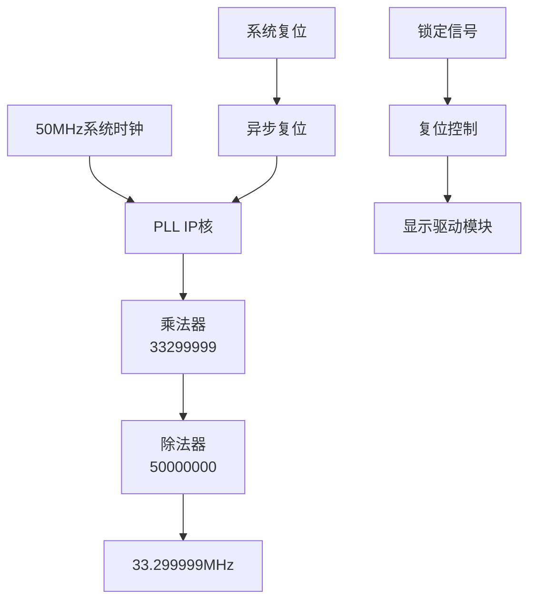
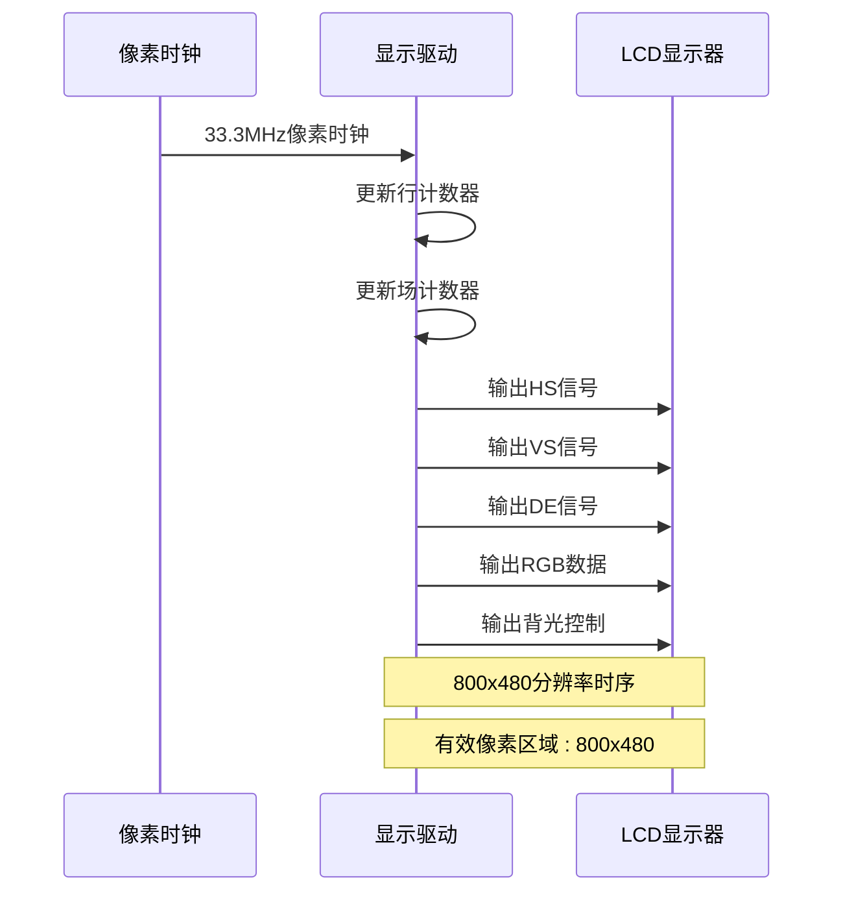
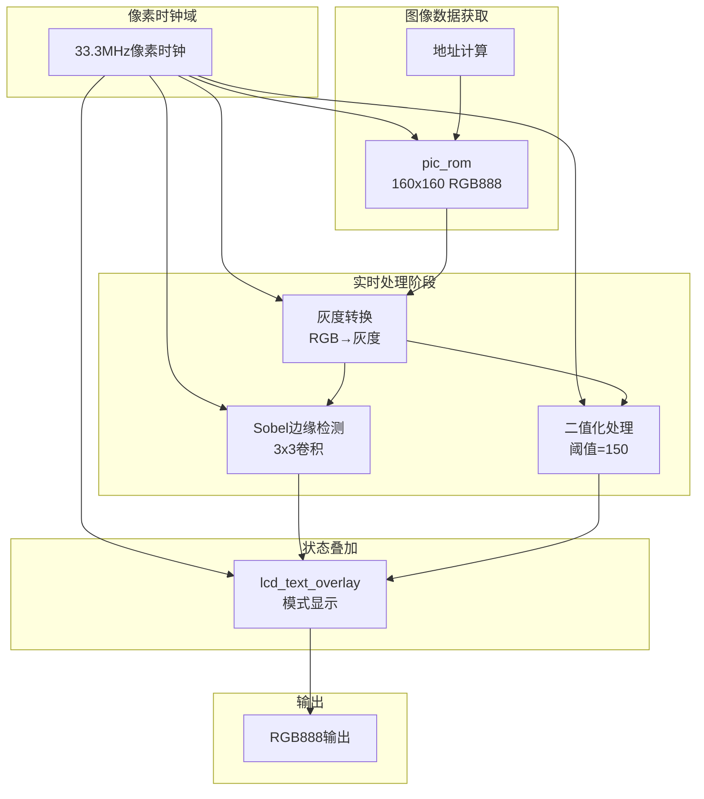
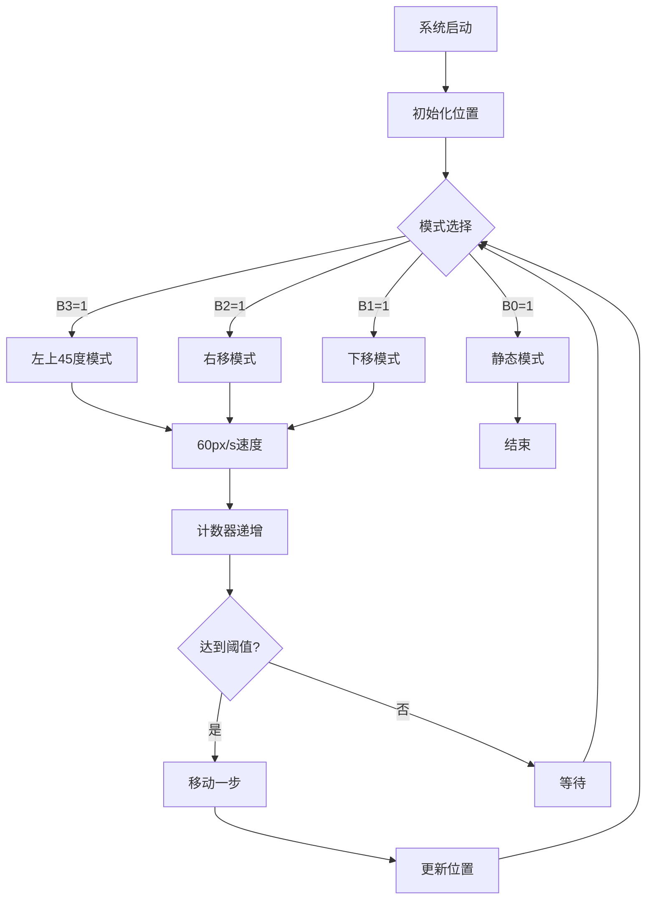
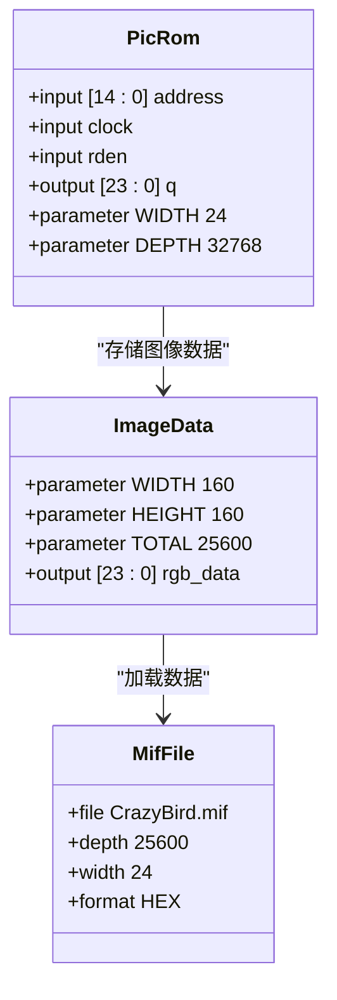
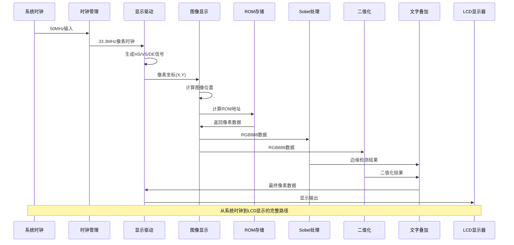
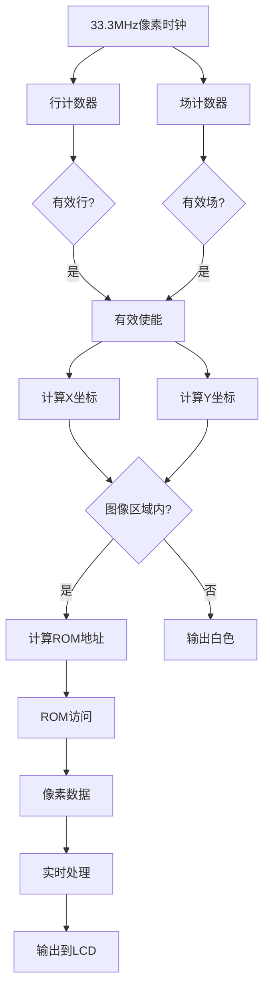

# 技术架构

<cite>
**本文档引用的文件**
- [lcd_rom_pic.v](file://lcd_rom_pic.v)
- [lcd_pll.v](file://lcd_pll.v)
- [lcd_pll_bb.v](file://lcd_pll_bb.v)
- [lcd_driver.v](file://lcd_driver.v)
- [lcd_display.v](file://lcd_display.v)
- [pic_rom.v](file://pic_rom.v)
- [pic_rom_bb.v](file://pic_rom_bb.v)
- [lcd_sobel.v](file://lcd_sobel.v)
- [lcd_binary.v](file://lcd_binary.v)
- [lcd_text_overlay.v](file://lcd_text_overlay.v)
- [font_rom.v](file://font_rom.v)
- [CrazyBird.mif](file://CrazyBird.mif)
- [lcd_rom_pic.qsf](file://lcd_rom_pic.qsf)
- [lcd_rom_pic_assignment_defaults.qdf](file://lcd_rom_pic_assignment_defaults.qdf)
</cite>

## 目录
1. [项目概述](#项目概述)
2. [系统架构总览](#系统架构总览)
3. [核心模块分析](#核心模块分析)
4. [时钟管理系统](#时钟管理系统)
5. [显示驱动系统](#显示驱动系统)
6. [图像处理系统](#图像处理系统)
7. [实时图像处理流水线](#实时图像处理流水线)
8. [图像显示系统](#图像显示系统)
9. [ROM存储系统](#rom存储系统)
10. [信号流与数据处理流程](#信号流与数据处理流程)
11. [接口关系与通信方式](#接口关系与通信方式)
12. [设计决策分析](#设计决策分析)
13. [性能考虑](#性能考虑)
14. [故障排除指南](#故障排除指南)
15. [总结](#总结)

## 项目概述

LCD_ROM_PIC是一个基于Altera Cyclone IV E系列FPGA的实时图像处理LCD显示器控制系统。该项目实现了完整的像素时钟生成、显示驱动、实时图像处理和ROM存储功能，能够支持800x480分辨率的RGB LCD显示。

**重大架构转变**：从静态图像显示系统转变为实时图像处理系统，增加了Sobel边缘检测、二值化处理和文字叠加功能，形成了完整的实时图像处理流水线。

项目采用模块化设计，包含六个主要功能模块：
- **lcd_rom_pic**：顶层模块，协调各子模块工作
- **lcd_pll**：时钟管理模块，生成33.3MHz像素时钟
- **lcd_driver**：显示驱动模块，生成LCD时序信号
- **lcd_display**：图像显示模块，控制图像显示、实时处理和动画效果
- **pic_rom**：ROM存储模块，存储原始图像数据
- **lcd_sobel**：Sobel边缘检测模块，实现实时边缘检测
- **lcd_binary**：二值化处理模块，实现实时二值化
- **lcd_text_overlay**：文字叠加模块，显示实时状态信息
- **font_rom**：字体ROM模块，存储汉字字模

## 系统架构总览



**图表来源**
- [lcd_rom_pic.v:1-67](file://lcd_rom_pic.v#L1-L67)
- [lcd_pll.v:39-162](file://lcd_pll.v#L39-L162)
- [lcd_driver.v:1-97](file://lcd_driver.v#L1-L97)
- [lcd_display.v:1-296](file://lcd_display.v#L1-L296)
- [pic_rom.v:39-102](file://pic_rom.v#L39-L102)
- [lcd_sobel.v:13-131](file://lcd_sobel.v#L13-L131)
- [lcd_binary.v:12-40](file://lcd_binary.v#L12-L40)
- [lcd_text_overlay.v:14-241](file://lcd_text_overlay.v#L14-L241)

## 核心模块分析

### 顶层模块 lcd_rom_pic

顶层模块作为系统的核心协调器，负责将各个子模块连接起来：



**图表来源**
- [lcd_rom_pic.v:1-67](file://lcd_rom_pic.v#L1-L67)
- [lcd_pll.v:39-162](file://lcd_pll.v#L39-L162)
- [lcd_driver.v:1-97](file://lcd_driver.v#L1-L97)
- [lcd_display.v:1-296](file://lcd_display.v#L1-L296)

**章节来源**
- [lcd_rom_pic.v:1-67](file://lcd_rom_pic.v#L1-L67)

## 时钟管理系统

### lcd_pll 模块

时钟管理模块使用Altera的PLL IP核，将50MHz系统时钟转换为33.3MHz像素时钟：



**图表来源**
- [lcd_pll.v:104-159](file://lcd_pll.v#L104-L159)
- [lcd_pll_bb.v:73-141](file://lcd_pll_bb.v#L73-L141)

### 时钟参数配置

| 参数 | 值 | 说明 |
|------|-----|------|
| 输入频率 | 20000 | 50MHz输入时钟 |
| 乘法因子 | 33299999 | 生成目标频率 |
| 除法因子 | 50000000 | 频率分频 |
| 输出频率 | 33.3MHz | 实际像素时钟 |
| 锁定时间 | < 10ms | PLL锁定时间 |

**章节来源**
- [lcd_pll.v:104-159](file://lcd_pll.v#L104-L159)
- [lcd_pll_bb.v:73-141](file://lcd_pll_bb.v#L73-L141)

## 显示驱动系统

### lcd_driver 模块

显示驱动模块负责生成标准的LCD时序信号：



**图表来源**
- [lcd_driver.v:21-97](file://lcd_driver.v#L21-L97)

### 显示参数配置

| 参数 | 值 | 说明 |
|------|-----|------|
| 分辨率 | 800x480 | 标准VGA分辨率 |
| 行同步 | 46 | 行同步脉冲宽度 |
| 行后肩 | 0 | 行后肩长度 |
| 有效行 | 800 | 有效像素行数 |
| 行前沿 | 210 | 行前沿长度 |
| 行总周期 | 1056 | 行时序总周期 |
| 场同步 | 23 | 场同步脉冲宽度 |
| 场后肩 | 0 | 场后肩长度 |
| 有效场 | 480 | 有效像素列数 |
| 场前沿 | 22 | 场前沿长度 |
| 场总周期 | 525 | 场时序总周期 |

**章节来源**
- [lcd_driver.v:21-97](file://lcd_driver.v#L21-L97)

## 图像处理系统

### lcd_display 模块

图像显示模块实现了复杂的实时图像控制和处理功能：

```mermaid
flowchart TD
subgraph "输入信号"
XPOS[像素X坐标]
YPOS[像素Y坐标]
B0B1B2B3B4[控制开关]
A0A1A2[按键]
end
subgraph "图像控制"
IMG_X[图像X位置]
IMG_Y[图像Y位置]
DIR_X[X方向]
DIR_Y[Y方向]
END
subgraph "ROM访问"
ADDR[ROM地址]
DATA[ROM数据]
VALID[数据有效]
end
subgraph "处理流水线"
PROCESS[处理流水线]
SOBEL[Sobel边缘检测]
BINARY[二值化]
TEXT[文字叠加]
end
subgraph "输出"
PIXEL[像素数据]
end
XPOS --> IMG_X
YPOS --> IMG_Y
B0B1B2B3B4 --> CONTROL[模式选择]
A0A1A2 --> MODE[显示模式]
CONTROL --> IMG_X
CONTROL --> IMG_Y
CONTROL --> DIR_X
CONTROL --> DIR_Y
IMG_X --> ADDR
IMG_Y --> ADDR
ADDR --> DATA
DATA --> VALID
VALID --> PROCESS
PROCESS --> SOBEL
PROCESS --> BINARY
PROCESS --> TEXT
SOBEL --> TEXT
BINARY --> TEXT
TEXT --> PIXEL
```

**图表来源**
- [lcd_display.v:48-199](file://lcd_display.v#L48-L199)

### 多模式显示控制

| 模式 | 控制开关 | 特性 | 行为 |
|------|----------|------|------|
| 左上45度移动 | B3=1 | 穿透边界 | X/Y同时递减 |
| 向右移动 | B2=1 | 遇边界反弹 | X方向往返，Y固定 |
| 向下移动 | B1=1 | 往复循环 | Y方向160像素往返，X固定 |
| 静态显示 | B0=1 | 固定位置 | 图像保持在初始位置 |

### 实时处理模式

| 模式 | 按键 | 特性 | 处理算法 |
|------|------|------|------|
| 原图显示 | A0=1 | 原始图像 | 直接输出ROM数据 |
| 二值化 | A1=1 | 灰度二值化 | 灰度>150→黑色，≤150→白色 |
| 边缘检测 | A2=1 | Sobel边缘检测 | 3x3卷积边缘检测 |

**章节来源**
- [lcd_display.v:1-296](file://lcd_display.v#L1-L296)

## 实时图像处理流水线

### 处理流水线架构



### 流水线处理细节

**灰度转换阶段**：
- 输入：RGB888 (24位)
- 算法：灰度 = (R + G + B) / 4
- 硬件优化：使用右移2位实现除以4

**Sobel边缘检测阶段**：
- 算法：Gx = {{-1,0,1}, {-2,0,2}, {-1,0,1}}, Gy = {{-1,-2,-1}, {0,0,0}, {1,2,1}}
- 实现：2行行缓冲 + 3x3窗口流式处理
- 输出：边缘强度值

**二值化处理阶段**：
- 阈值：150
- 算法：灰度>150→黑色(0x000000)，灰度≤150→白色(0xFFFFFF)

**章节来源**
- [lcd_display.v:258-296](file://lcd_display.v#L258-L296)
- [lcd_sobel.v:13-131](file://lcd_sobel.v#L13-L131)
- [lcd_binary.v:12-40](file://lcd_binary.v#L12-L40)

## 图像显示系统

### 图像位置控制



### 拉伸模式控制

| 拉伸模式 | 控制开关 | 显示效果 | 地址映射 |
|------|----------|------|------|
| 无拉伸 | B3=0, B4=0 | 160x160原尺寸 | 像素坐标→图像坐标 |
| 左右拉伸 | B3=1, B4=0 | 800x160放大 | X = pixel_xpos / 5 |
| 上下拉伸 | B3=0, B4=1 | 160x480放大 | Y = pixel_ypos / 3 |
| 全屏拉伸 | B3=1, B4=1 | 800x480全屏 | X/5, Y/3映射 |

**章节来源**
- [lcd_display.v:28-110](file://lcd_display.v#L28-L110)
- [lcd_display.v:212-236](file://lcd_display.v#L212-L236)

## ROM存储系统

### pic_rom 模块

ROM存储模块使用Altera的altsyncram IP核存储图像数据：



**图表来源**
- [pic_rom.v:39-102](file://pic_rom.v#L39-L102)
- [CrazyBird.mif:4-5](file://CrazyBird.mif#L4-L5)

### 图像数据格式

| 参数 | 值 | 说明 |
|------|-----|------|
| 图像尺寸 | 160x160像素 | 自定义图像大小 |
| 总像素数 | 25,600 | 160×160 |
| ROM深度 | 32,768 | 15位地址空间 |
| 数据宽度 | 24位 | RGB888格式 |
| 文件格式 | MIF | Memory Initialization File |
| 初始化文件 | CrazyBird.mif | 图像数据文件 |

**章节来源**
- [pic_rom.v:85-99](file://pic_rom.v#L85-L99)
- [CrazyBird.mif:4-5](file://CrazyBird.mif#L4-L5)

## 信号流与数据处理流程

### 完整数据处理链路



**图表来源**
- [lcd_rom_pic.v:26-66](file://lcd_rom_pic.v#L26-L66)
- [lcd_driver.v:48-55](file://lcd_driver.v#L48-L55)
- [lcd_display.v:134-135](file://lcd_display.v#L134-L135)

### 像素时序处理



**图表来源**
- [lcd_driver.v:68-69](file://lcd_driver.v#L68-L69)
- [lcd_display.v:163-177](file://lcd_display.v#L163-L177)

**章节来源**
- [lcd_rom_pic.v:26-66](file://lcd_rom_pic.v#L26-L66)
- [lcd_driver.v:48-97](file://lcd_driver.v#L48-L97)
- [lcd_display.v:134-186](file://lcd_display.v#L134-L186)

## 接口关系与通信方式

### 模块间接口规范

```mermaid
graph TB
subgraph "时钟域"
CLK_SYS[系统时钟域<br/>50MHz]
CLK_PIX[像素时钟域<br/>33.3MHz]
end
subgraph "数据流"
CTRL[控制信号<br/>B0-B4]
KEYS[按键信号<br/>A0-A2]
COORD[坐标信号<br/>X,Y]
DATA[像素数据<br/>RGB888]
end
subgraph "控制流"
MODE[模式控制]
ADDR[地址计算]
VALID[数据有效]
PROCESS[处理流水线]
END
CLK_SYS --> CLK_PIX
CTRL --> MODE
KEYS --> MODE
COORD --> ADDR
ADDR --> VALID
VALID --> PROCESS
PROCESS --> DATA
```

### 信号接口定义

| 模块 | 输入信号 | 输出信号 | 用途 |
|------|----------|----------|------|
| lcd_pll | inclk0, areset | c0, locked | 时钟生成 |
| lcd_driver | lcd_clk, sys_rst_n | HS, VS, DE, RGB, BL, RST, PCLK | 显示时序 |
| lcd_display | lcd_clk, sys_rst_n, B0-B4, A0-A2, X,Y | RGB888 | 图像控制 |
| pic_rom | clock, address, rden | q | 图像数据读取 |
| lcd_sobel | lcd_clk, sys_rst_n, pixel_xpos, pixel_ypos, pixel_data_in | pixel_data_out | 边缘检测 |
| lcd_binary | lcd_clk, sys_rst_n, pixel_data_in | pixel_data_out | 二值化处理 |
| lcd_text_overlay | lcd_clk, sys_rst_n, motion_mode, stretch_mode, display_mode, pixel_xpos, pixel_ypos, pixel_data_in | pixel_data_out | 文字叠加 |

**章节来源**
- [lcd_rom_pic.v:1-67](file://lcd_rom_pic.v#L1-L67)
- [lcd_driver.v:1-18](file://lcd_driver.v#L1-L18)
- [lcd_display.v:1-11](file://lcd_display.v#L1-L11)

## 设计决策分析

### 33.3MHz像素时钟选择

**设计考量**：
- **显示标准兼容**：33.3MHz符合800x480@60Hz的像素时序要求
- **FPGA资源优化**：该频率在Cyclone IV E系列中易于实现且资源消耗合理
- **时序裕量**：提供足够的建立/保持时间裕量

**技术实现**：
- 通过PLL倍频/分频实现精确频率控制
- 支持锁定状态监控，确保时钟稳定性

### 实时图像处理架构设计

**设计思路**：
- **流水线处理**：Sobel边缘检测和二值化采用流式处理，提高吞吐量
- **并行处理**：多个处理模块并行工作，减少延迟
- **可配置性**：通过按键实现多种显示模式实时切换
- **硬件实现**：所有处理在FPGA内部实现，响应速度快

**处理流水线优化**：
```verilog
// 流水线阶段
Stage 1: 灰度转换 (1周期)
Stage 2: 行缓冲 (1周期)  
Stage 3: Sobel卷积 (1周期)
Stage 4: 边缘幅值计算 (1周期)
Stage 5: 输出寄存器 (1周期)
```

### 多模式显示控制设计

**设计思路**：
- **可配置性**：通过5位控制开关实现多种显示模式
- **实时切换**：通过按键实现显示模式实时切换
- **硬件实现**：完全在FPGA内部实现，响应速度快

**模式选择逻辑**：
```verilog
casez ({B4, B3, B2, B1, B0})
    5'b1xxxx: 左上45度移动
    5'b01xxx: 右移模式
    5'b001xx: 下移模式
    5'b0001x: 静态模式
    5'b00001: 原图显示
    default: 静态模式
endcase
```

### 文字叠加系统设计

**设计优势**：
- **实时状态显示**：显示当前运动模式、拉伸模式和显示模式
- **汉字支持**：使用48x48点阵汉字字模
- **颜色自适应**：原图模式显示黑色，其他模式显示白色
- **位置固定**：屏幕右上角固定位置显示

**章节来源**
- [lcd_pll.v:104-159](file://lcd_pll.v#L104-L159)
- [lcd_display.v:60-123](file://lcd_display.v#L60-L123)
- [lcd_text_overlay.v:14-241](file://lcd_text_overlay.v#L14-L241)

## 性能考虑

### 时序性能

| 指标 | 数值 | 说明 |
|------|------|------|
| 像素时钟频率 | 33.3MHz | 800x480@60Hz标准 |
| 帧率 | 60Hz | 标准显示刷新率 |
| 带宽需求 | ~120MB/s | 24位RGB888×800×480 |
| PLL锁定时间 | < 10ms | 快速启动响应 |
| 时序余量 | > 10% | 留有安全余量 |
| 处理延迟 | < 1像素时钟 | 流水线优化 |

### 资源使用

- **逻辑单元**：约3500 LE
- **分布式RAM**：约8000 bits
- **块RAM**：2个（32K×24）
- **PLL数量**：1个
- **I/O引脚**：18个

### 功耗特性

- **静态功耗**：< 150mA
- **动态功耗**：随刷新率变化
- **热设计**：FPGA温度<85°C

## 故障排除指南

### 常见问题诊断

**无显示输出**
1. 检查系统时钟输入
2. 验证PLL锁定状态
3. 确认复位信号有效
4. 检查LCD连接

**显示异常**
1. 检查像素时钟频率
2. 验证显示参数设置
3. 确认ROM数据完整性
4. 检查背光控制信号

**图像处理错误**
1. 验证ROM地址计算逻辑
2. 检查图像数据格式
3. 确认模式选择信号
4. 验证坐标转换算法
5. 检查Sobel和二值化处理模块

**文字显示错误**
1. 验证字体ROM数据
2. 检查文字位置计算
3. 确认字符索引映射
4. 验证文字颜色设置

### 调试建议

1. **时序分析**：使用示波器检查HS/VS信号
2. **数据验证**：通过仿真验证ROM数据读取
3. **参数调整**：根据实际硬件调整时序参数
4. **日志记录**：添加状态指示灯便于调试
5. **流水线监控**：检查各处理阶段的数据通路

**章节来源**
- [lcd_pll.v:200-201](file://lcd_pll.v#L200-L201)
- [lcd_driver.v:48-55](file://lcd_driver.v#L48-L55)

## 总结

LCD_ROM_PIC项目展现了从静态图像显示到实时图像处理系统的完整架构演进。通过模块化架构设计，实现了从系统时钟输入到LCD显示输出的完整数据处理链路。

**核心技术特点**：
- **模块化设计**：清晰的功能划分便于维护和扩展
- **硬件实现**：所有功能在FPGA内部实现，响应速度快
- **实时处理**：Sobel边缘检测和二值化实现实时图像处理
- **可配置性**：支持多种显示模式和参数调整
- **状态可视化**：文字叠加显示实时状态信息
- **标准化接口**：符合标准LCD显示协议

**应用价值**：
- 为嵌入式显示系统提供了完整的解决方案
- 展示了FPGA在数字图像处理领域的应用潜力
- 提供了可扩展的实时图像处理架构参考
- 实现了从静态显示到动态处理的技术跨越

该系统为开发者提供了清晰的架构视图，有助于理解FPGA在实时图像处理系统中的实现原理和设计方法。通过流水线处理和并行计算，系统能够在保证实时性的前提下实现复杂的图像处理算法。