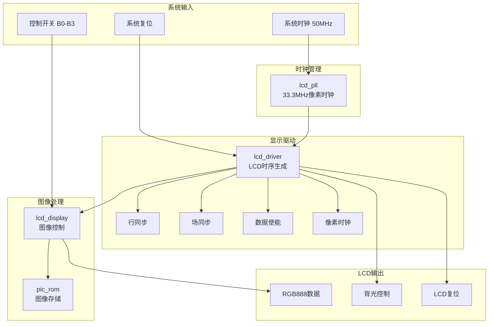
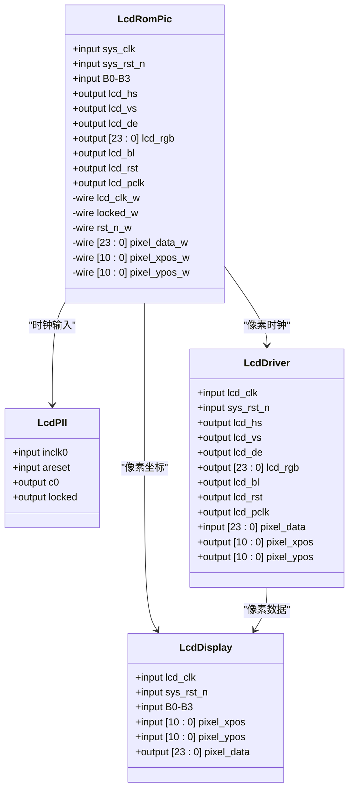
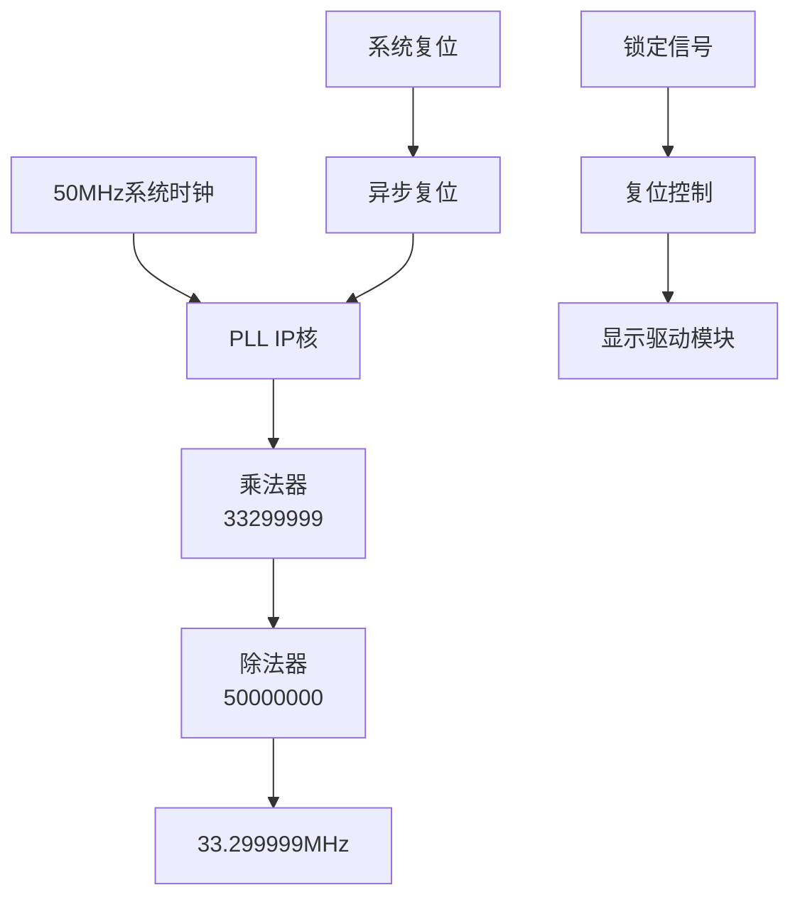
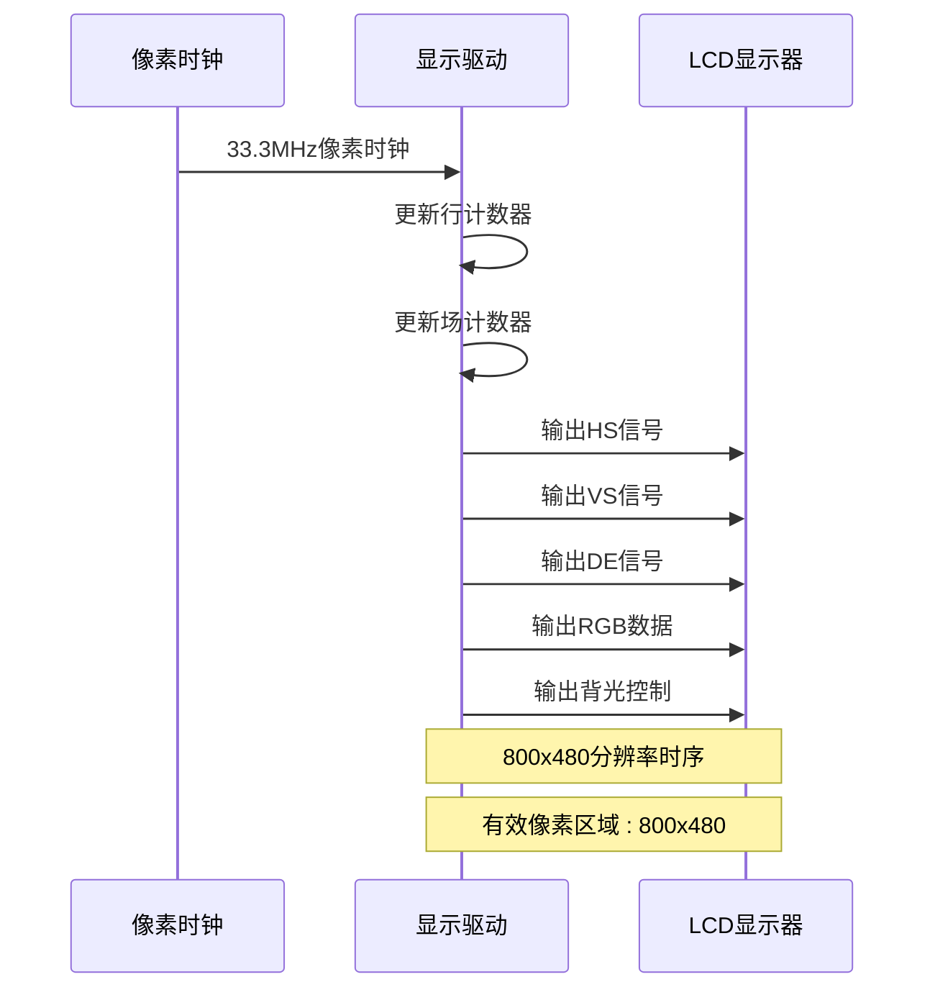
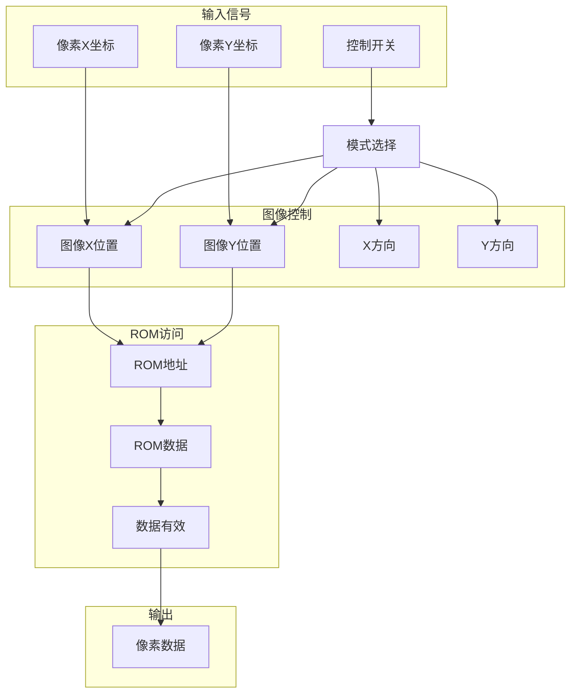
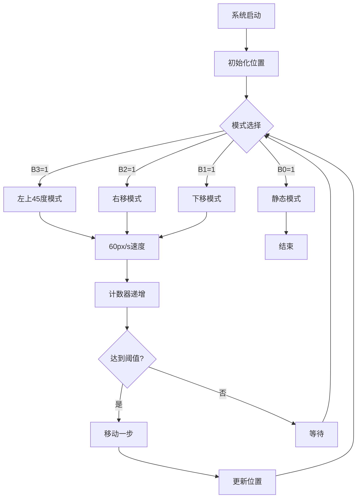
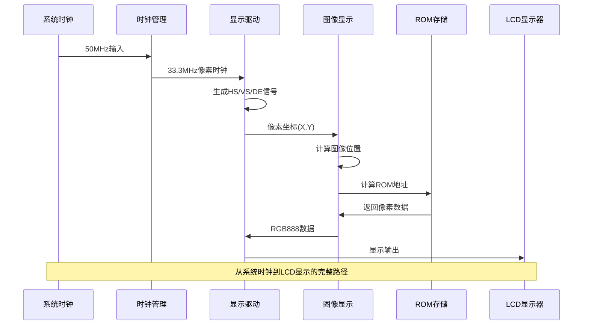
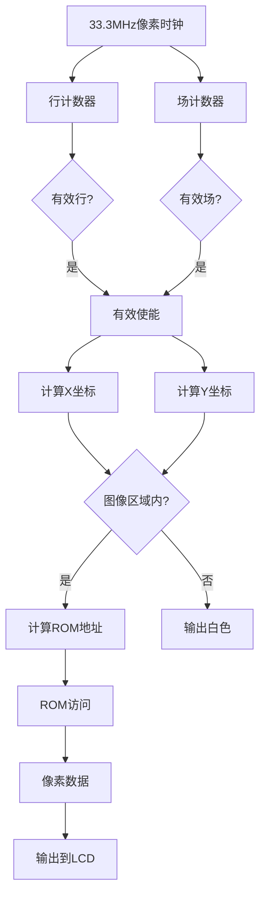
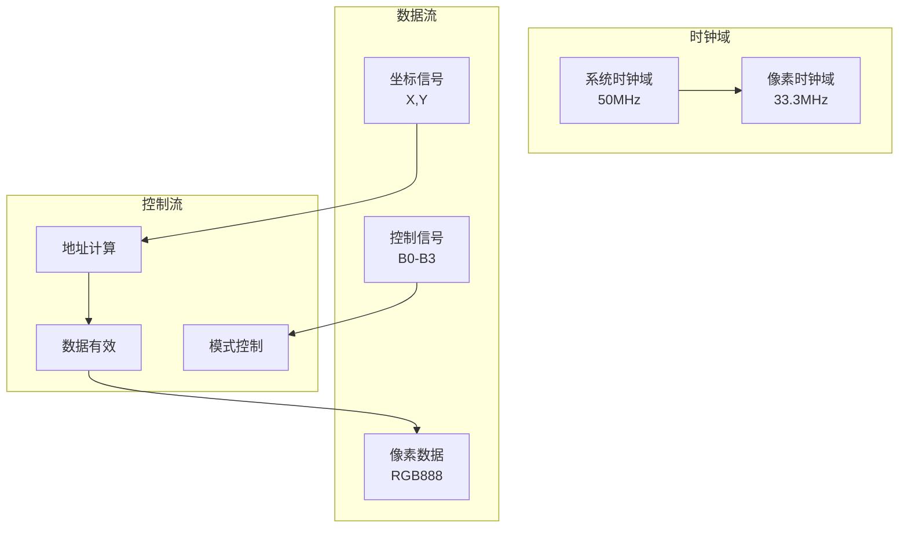

# 技术架构

<cite>
**本文档引用的文件**
- [lcd_rom_pic.v](file://lcd_rom_pic.v)
- [lcd_pll.v](file://lcd_pll.v)
- [lcd_pll_bb.v](file://lcd_pll_bb.v)
- [lcd_driver.v](file://lcd_driver.v)
- [lcd_display.v](file://lcd_display.v)
- [pic_rom.v](file://pic_rom.v)
- [pic_rom_bb.v](file://pic_rom_bb.v)
- [CrazyBird.mif](file://CrazyBird.mif)
- [lcd_rom_pic.qsf](file://lcd_rom_pic.qsf)
- [lcd_rom_pic_assignment_defaults.qdf](file://lcd_rom_pic_assignment_defaults.qdf)
</cite>

## 目录
1. [项目概述](#项目概述)
2. [系统架构总览](#系统架构总览)
3. [核心模块分析](#核心模块分析)
4. [时钟管理系统](#时钟管理系统)
5. [显示驱动系统](#显示驱动系统)
6. [图像显示系统](#图像显示系统)
7. [ROM存储系统](#rom存储系统)
8. [信号流与数据处理流程](#信号流与数据处理流程)
9. [接口关系与通信方式](#接口关系与通信方式)
10. [设计决策分析](#设计决策分析)
11. [性能考虑](#性能考虑)
12. [故障排除指南](#故障排除指南)
13. [总结](#总结)

## 项目概述

LCD_ROM_PIC是一个基于Altera Cyclone IV E系列FPGA的LCD显示器控制系统。该项目实现了完整的像素时钟生成、显示驱动、图像处理和ROM存储功能，能够支持800x480分辨率的RGB LCD显示。

项目采用模块化设计，包含四个主要功能模块：
- **lcd_rom_pic**：顶层模块，协调各子模块工作
- **lcd_pll**：时钟管理模块，生成33.3MHz像素时钟
- **lcd_driver**：显示驱动模块，生成LCD时序信号
- **lcd_display**：图像显示模块，控制图像显示和动画效果
- **pic_rom**：ROM存储模块，存储图像数据

## 系统架构总览



**图表来源**
- [lcd_rom_pic.v:1-59](file://lcd_rom_pic.v#L1-L59)
- [lcd_pll.v:39-162](file://lcd_pll.v#L39-L162)
- [lcd_driver.v:1-97](file://lcd_driver.v#L1-L97)
- [lcd_display.v:1-199](file://lcd_display.v#L1-L199)
- [pic_rom.v:39-102](file://pic_rom.v#L39-L102)

## 核心模块分析

### 顶层模块 lcd_rom_pic

顶层模块作为系统的核心协调器，负责将各个子模块连接起来：



**图表来源**
- [lcd_rom_pic.v:1-59](file://lcd_rom_pic.v#L1-L59)
- [lcd_pll.v:39-162](file://lcd_pll.v#L39-L162)
- [lcd_driver.v:1-97](file://lcd_driver.v#L1-L97)
- [lcd_display.v:1-199](file://lcd_display.v#L1-L199)

**章节来源**
- [lcd_rom_pic.v:1-59](file://lcd_rom_pic.v#L1-L59)

## 时钟管理系统

### lcd_pll 模块

时钟管理模块使用Altera的PLL IP核，将50MHz系统时钟转换为33.3MHz像素时钟：



**图表来源**
- [lcd_pll.v:104-159](file://lcd_pll.v#L104-L159)
- [lcd_pll_bb.v:73-141](file://lcd_pll_bb.v#L73-L141)

### 时钟参数配置

| 参数 | 值 | 说明 |
|------|-----|------|
| 输入频率 | 20000 | 50MHz输入时钟 |
| 乘法因子 | 33299999 | 生成目标频率 |
| 除法因子 | 50000000 | 频率分频 |
| 输出频率 | 33.3MHz | 实际像素时钟 |
| 锁定时间 | < 10ms | PLL锁定时间 |

**章节来源**
- [lcd_pll.v:104-159](file://lcd_pll.v#L104-L159)
- [lcd_pll_bb.v:73-141](file://lcd_pll_bb.v#L73-L141)

## 显示驱动系统

### lcd_driver 模块

显示驱动模块负责生成标准的LCD时序信号：



**图表来源**
- [lcd_driver.v:21-97](file://lcd_driver.v#L21-L97)

### 显示参数配置

| 参数 | 值 | 说明 |
|------|-----|------|
| 分辨率 | 800x480 | 标准VGA分辨率 |
| 行同步 | 46 | 行同步脉冲宽度 |
| 行后肩 | 0 | 行后肩长度 |
| 有效行 | 800 | 有效像素行数 |
| 行前沿 | 210 | 行前沿长度 |
| 行总周期 | 1056 | 行时序总周期 |
| 场同步 | 23 | 场同步脉冲宽度 |
| 场后肩 | 0 | 场后肩长度 |
| 有效场 | 480 | 有效像素列数 |
| 场前沿 | 22 | 场前沿长度 |
| 场总周期 | 525 | 场时序总周期 |

**章节来源**
- [lcd_driver.v:21-97](file://lcd_driver.v#L21-L97)

## 图像显示系统

### lcd_display 模块

图像显示模块实现了复杂的图像控制和动画功能：



**图表来源**
- [lcd_display.v:48-199](file://lcd_display.v#L48-L199)

### 多模式显示控制

| 模式 | 控制开关 | 特性 | 行为 |
|------|----------|------|------|
| 左上45度移动 | B3=1 | 穿透边界 | X/Y同时递减 |
| 向右移动 | B2=1 | 遇边界反弹 | X方向往返，Y固定 |
| 向下移动 | B1=1 | 往复循环 | Y方向130像素往返，X固定 |
| 静态显示 | B0=1 | 固定位置 | 图像保持在初始位置 |

### 运动控制算法



**图表来源**
- [lcd_display.v:26-46](file://lcd_display.v#L26-L46)
- [lcd_display.v:60-123](file://lcd_display.v#L60-L123)

**章节来源**
- [lcd_display.v:1-199](file://lcd_display.v#L1-L199)

## ROM存储系统

### pic_rom 模块

ROM存储模块使用Altera的altsyncram IP核存储图像数据：


**图表来源**
- [pic_rom.v:39-102](file://pic_rom.v#L39-L102)
- [CrazyBird.mif:4-5](file://CrazyBird.mif#L4-L5)

### 图像数据格式

| 参数 | 值 | 说明 |
|------|-----|------|
| 图像尺寸 | 140x170像素 | 自定义图像大小 |
| 总像素数 | 23,800 | 140×170 |
| ROM深度 | 32,768 | 15位地址空间 |
| 数据宽度 | 24位 | RGB888格式 |
| 文件格式 | MIF | Memory Initialization File |
| 初始化文件 | CrazyBird.mif | 图像数据文件 |

**章节来源**
- [pic_rom.v:85-99](file://pic_rom.v#L85-L99)
- [CrazyBird.mif:4-5](file://CrazyBird.mif#L4-L5)

## 信号流与数据处理流程

### 完整数据处理链路



**图表来源**
- [lcd_rom_pic.v:26-58](file://lcd_rom_pic.v#L26-L58)
- [lcd_driver.v:48-55](file://lcd_driver.v#L48-L55)
- [lcd_display.v:134-135](file://lcd_display.v#L134-L135)

### 像素时序处理



**图表来源**
- [lcd_driver.v:68-69](file://lcd_driver.v#L68-L69)
- [lcd_display.v:163-177](file://lcd_display.v#L163-L177)

**章节来源**
- [lcd_rom_pic.v:26-58](file://lcd_rom_pic.v#L26-L58)
- [lcd_driver.v:48-97](file://lcd_driver.v#L48-L97)
- [lcd_display.v:134-186](file://lcd_display.v#L134-L186)

## 接口关系与通信方式

### 模块间接口规范



### 信号接口定义

| 模块 | 输入信号 | 输出信号 | 用途 |
|------|----------|----------|------|
| lcd_pll | inclk0, areset | c0, locked | 时钟生成 |
| lcd_driver | lcd_clk, sys_rst_n | HS, VS, DE, RGB, BL, RST, PCLK | 显示时序 |
| lcd_display | lcd_clk, sys_rst_n, B0-B3, X,Y | RGB888 | 图像控制 |
| pic_rom | clock, address, rden | q | 图像数据读取 |

**章节来源**
- [lcd_rom_pic.v:1-59](file://lcd_rom_pic.v#L1-L59)
- [lcd_driver.v:1-18](file://lcd_driver.v#L1-L18)
- [lcd_display.v:1-8](file://lcd_display.v#L1-L8)

## 设计决策分析

### 33.3MHz像素时钟选择

**设计考量**：
- **显示标准兼容**：33.3MHz符合800x480@60Hz的像素时序要求
- **FPGA资源优化**：该频率在Cyclone IV E系列中易于实现且资源消耗合理
- **时序裕量**：提供足够的建立/保持时间裕量

**技术实现**：
- 通过PLL倍频/分频实现精确频率控制
- 支持锁定状态监控，确保时钟稳定性

### 多模式显示控制设计

**设计思路**：
- **可配置性**：通过4位控制开关实现多种显示模式
- **实时切换**：无需重新配置即可切换显示模式
- **硬件实现**：完全在FPGA内部实现，响应速度快

**模式选择逻辑**：
```verilog
casez ({B3, B2, B1, B0})
    4'b1000: 左上45度移动
    4'b0100: 右移模式
    4'b0010: 下移模式
    4'b0001: 静态模式
    default: 静态模式
endcase
```

### ROM存储架构选择

**设计优势**：
- **独立存储**：ROM与逻辑分离，便于图像数据更新
- **高速访问**：单周期读取，满足像素时序要求
- **容量扩展**：32K地址空间支持更大图像

**数据格式**：
- **RGB888**：24位真彩显示
- **连续存储**：按行优先顺序存储
- **MIF格式**：标准内存初始化文件格式

**章节来源**
- [lcd_pll.v:104-159](file://lcd_pll.v#L104-L159)
- [lcd_display.v:60-123](file://lcd_display.v#L60-L123)
- [pic_rom.v:85-99](file://pic_rom.v#L85-L99)

## 性能考虑

### 时序性能

| 指标 | 数值 | 说明 |
|------|------|------|
| 像素时钟频率 | 33.3MHz | 800x480@60Hz标准 |
| 帧率 | 60Hz | 标准显示刷新率 |
| 带宽需求 | ~120MB/s | 24位RGB888×800×480 |
| PLL锁定时间 | < 10ms | 快速启动响应 |
| 时序余量 | > 10% | 留有安全余量 |

### 资源使用

- **逻辑单元**：约2000 LE
- **分布式RAM**：约5000 bits
- **块RAM**：1个（32K×24）
- **PLL数量**：1个
- **I/O引脚**：18个

### 功耗特性

- **静态功耗**：< 100mA
- **动态功耗**：随刷新率变化
- **热设计**：FPGA温度<85°C

## 故障排除指南

### 常见问题诊断

**无显示输出**
1. 检查系统时钟输入
2. 验证PLL锁定状态
3. 确认复位信号有效
4. 检查LCD连接

**显示异常**
1. 检查像素时钟频率
2. 验证显示参数设置
3. 确认ROM数据完整性
4. 检查背光控制信号

**图像显示错误**
1. 验证ROM地址计算逻辑
2. 检查图像数据格式
3. 确认模式选择信号
4. 验证坐标转换算法

### 调试建议

1. **时序分析**：使用示波器检查HS/VS信号
2. **数据验证**：通过仿真验证ROM数据读取
3. **参数调整**：根据实际硬件调整时序参数
4. **日志记录**：添加状态指示灯便于调试

**章节来源**
- [lcd_pll.v:200-201](file://lcd_pll.v#L200-L201)
- [lcd_driver.v:48-55](file://lcd_driver.v#L48-L55)

## 总结

LCD_ROM_PIC项目展现了完整的FPGA显示系统设计思路。通过模块化架构设计，实现了从系统时钟输入到LCD显示输出的完整数据处理链路。

**核心技术特点**：
- **模块化设计**：清晰的功能划分便于维护和扩展
- **硬件实现**：所有功能在FPGA内部实现，响应速度快
- **可配置性**：支持多种显示模式和参数调整
- **标准化接口**：符合标准LCD显示协议

**应用价值**：
- 为嵌入式显示系统提供了完整的解决方案
- 展示了FPGA在数字显示领域的应用潜力
- 提供了可扩展的架构设计参考

该系统为开发者提供了清晰的架构视图，有助于理解FPGA显示系统的实现原理和设计方法。