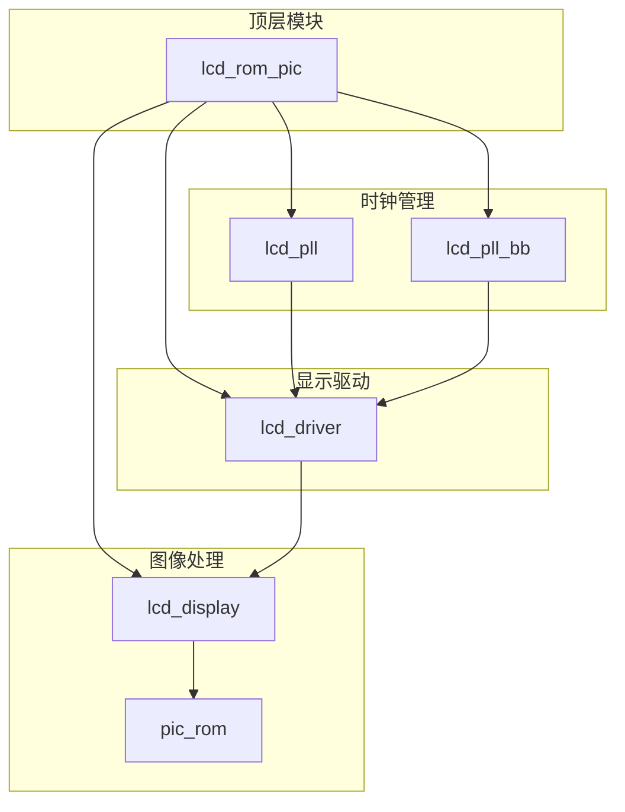
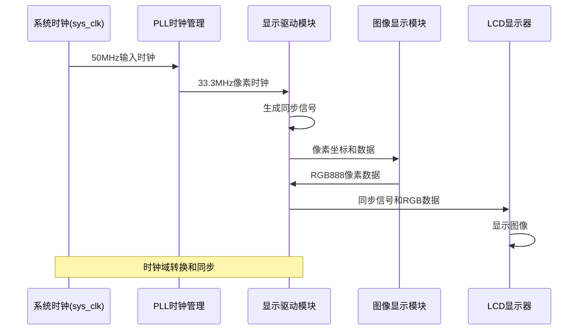
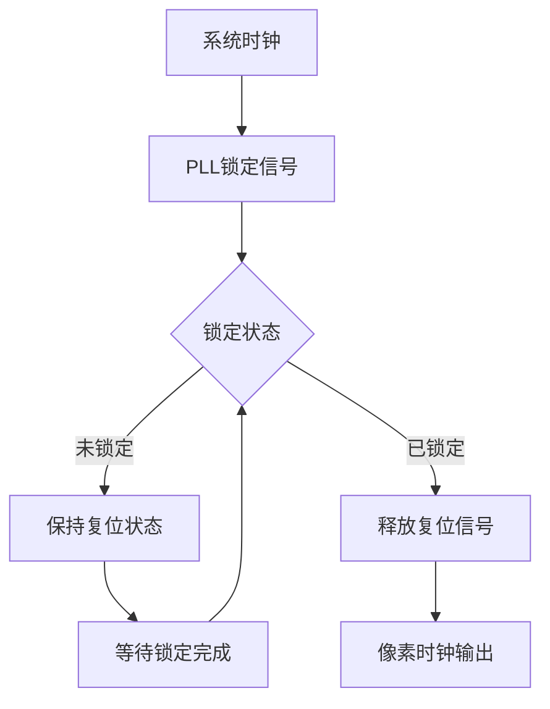
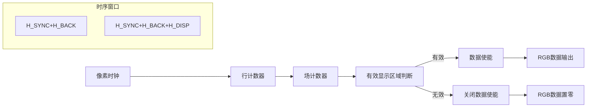
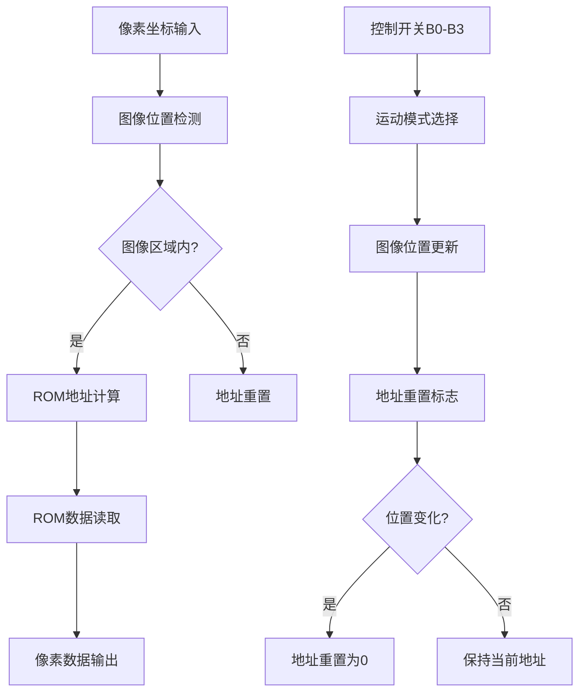
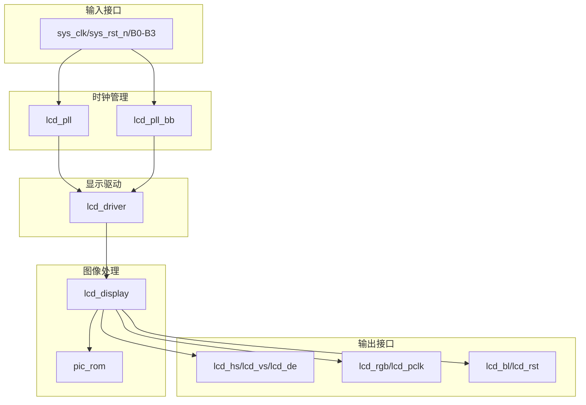

# 接口设计规范

<cite>
**本文档引用的文件**
- [lcd_rom_pic.v](file://lcd_rom_pic.v)
- [lcd_display.v](file://lcd_display.v)
- [lcd_driver.v](file://lcd_driver.v)
- [lcd_pll.v](file://lcd_pll.v)
- [lcd_pll_bb.v](file://lcd_pll_bb.v)
- [pic_rom.v](file://pic_rom.v)
- [lcd_rom_pic.qsf](file://lcd_rom_pic.qsf)
- [lcd_rom_pic_assignment_defaults.qdf](file://lcd_rom_pic_assignment_defaults.qdf)
</cite>

## 目录
1. [简介](#简介)
2. [项目结构](#项目结构)
3. [核心组件](#核心组件)
4. [架构概览](#架构概览)
5. [详细组件分析](#详细组件分析)
6. [依赖关系分析](#依赖关系分析)
7. [性能考虑](#性能考虑)
8. [故障排除指南](#故障排除指南)
9. [结论](#结论)

## 简介

LCD_ROM_PIC项目是一个基于FPGA的LCD显示器控制系统，实现了完整的RGB LCD显示接口规范。该系统通过PLL时钟管理、显示驱动和图像处理三个主要模块，为24位RGB LCD屏幕提供标准的视频接口信号。

本项目支持800x480分辨率，像素时钟频率为33.3MHz，采用RGB888数据格式。系统包含4位硬件开关输入，用于控制图像的显示模式和运动行为。

## 项目结构

项目采用模块化设计，主要包含以下核心模块：



**图表来源**
- [lcd_rom_pic.v:1-59](file://lcd_rom_pic.v#L1-L59)
- [lcd_pll.v:1-321](file://lcd_pll.v#L1-L321)
- [lcd_driver.v:1-97](file://lcd_driver.v#L1-L97)
- [lcd_display.v:1-199](file://lcd_display.v#L1-L199)
- [pic_rom.v:1-165](file://pic_rom.v#L1-L165)

**章节来源**
- [lcd_rom_pic.v:1-59](file://lcd_rom_pic.v#L1-L59)
- [lcd_pll.v:1-321](file://lcd_pll.v#L1-L321)

## 核心组件

### 输入接口规范

系统定义了以下输入接口信号：

| 信号名称 | 类型 | 描述 | 极性 | 电气特性 |
|---------|------|------|------|----------|
| sys_clk | 输入 | 系统时钟 | 正逻辑 | 50MHz，2.5V IO标准 |
| sys_rst_n | 输入 | 系统复位 | 低电平有效 | 2.5V IO标准 |
| B0-B3 | 输入 | 控制开关 | 高电平有效 | 2.5V IO标准 |

**章节来源**
- [lcd_rom_pic.v:2-7](file://lcd_rom_pic.v#L2-L7)
- [lcd_rom_pic.qsf:75-91](file://lcd_rom_pic.qsf#L75-L91)

### 输出接口规范

系统提供以下输出接口信号：

| 信号名称 | 类型 | 数据宽度 | 描述 | 极性 | 电气特性 |
|---------|------|----------|------|------|----------|
| lcd_hs | 输出 | 1位 | 行同步信号 | 正脉冲 | 2.5V IO标准 |
| lcd_vs | 输出 | 1位 | 场同步信号 | 正脉冲 | 2.5V IO标准 |
| lcd_de | 输出 | 1位 | 数据使能 | 高电平有效 | 2.5V IO标准 |
| lcd_rgb | 输出 | 24位 | RGB888数据总线 | 并行输出 | 2.5V IO标准 |
| lcd_bl | 输出 | 1位 | 背光控制 | 高电平有效 | 2.5V IO标准 |
| lcd_rst | 输出 | 1位 | LCD复位 | 低电平有效 | 2.5V IO标准 |
| lcd_pclk | 输出 | 1位 | 像素时钟 | 正沿采样 | 2.5V IO标准 |

**章节来源**
- [lcd_rom_pic.v:8-14](file://lcd_rom_pic.v#L8-L14)
- [lcd_driver.v:6-12](file://lcd_driver.v#L6-L12)
- [lcd_pll.v:39-48](file://lcd_pll.v#L39-L48)

## 架构概览

系统采用分层架构设计，通过PLL时钟管理确保稳定的像素时钟输出：



**图表来源**
- [lcd_pll.v:26-32](file://lcd_pll.v#L26-L32)
- [lcd_driver.v:42-55](file://lcd_driver.v#L42-L55)
- [lcd_display.v:129-131](file://lcd_display.v#L129-L131)

## 详细组件分析

### 时钟管理系统

#### PLL配置参数

| 参数 | 数值 | 描述 |
|------|------|------|
| 输入频率 | 50MHz | 系统主时钟 |
| 输出频率 | 33.3MHz | 像素时钟 |
| 分频比 | 50000000:33299999 | 精确频率控制 |
| 占空比 | 50% | 对称波形 |
| 锁定时间 | < 1ms | 快速锁定 |

#### 时钟域同步机制



**图表来源**
- [lcd_pll.v:66-103](file://lcd_pll.v#L66-L103)
- [lcd_rom_pic.v:24-25](file://lcd_rom_pic.v#L24-L25)

**章节来源**
- [lcd_pll.v:104-159](file://lcd_pll.v#L104-L159)
- [lcd_pll_bb.v:34-52](file://lcd_pll_bb.v#L34-L52)

### 显示驱动模块

#### 同步信号生成

显示驱动模块负责生成标准的LCD同步信号：

| 参数 | 数值 | 描述 |
|------|------|------|
| H_SYNC | 46 | 行同步脉冲宽度 |
| H_BACK | 0 | 行后沿宽度 |
| H_DISP | 800 | 有效行宽度 |
| H_FRONT | 210 | 行前沿宽度 |
| H_TOTAL | 1056 | 行总周期 |
| V_SYNC | 23 | 场同步脉冲高度 |
| V_BACK | 0 | 场后沿高度 |
| V_DISP | 480 | 有效场高度 |
| V_FRONT | 22 | 场前沿高度 |
| V_TOTAL | 525 | 场总周期 |

#### 像素时序关系



**图表来源**
- [lcd_driver.v:20-31](file://lcd_driver.v#L20-L31)
- [lcd_driver.v:50-52](file://lcd_driver.v#L50-L52)

**章节来源**
- [lcd_driver.v:67-70](file://lcd_driver.v#L67-L70)
- [lcd_driver.v:84-94](file://lcd_driver.v#L84-L94)

### 图像显示模块

#### 图像处理流程

图像显示模块实现了动态图像的生成和控制：



**图表来源**
- [lcd_display.v:134-135](file://lcd_display.v#L134-L135)
- [lcd_display.v:163-174](file://lcd_display.v#L163-L174)

**章节来源**
- [lcd_display.v:60-121](file://lcd_display.v#L60-L121)
- [lcd_display.v:154-178](file://lcd_display.v#L154-L178)

### ROM存储器接口

#### 图像数据存储

系统使用专用ROM存储器存储140x170像素的图像数据：

| 参数 | 数值 | 描述 |
|------|------|------|
| 图像尺寸 | 140×170 | 像素数量：23,800 |
| 数据格式 | 24位RGB | 每像素8位R、G、B |
| 存储容量 | 32,768字 | 15位地址总线 |
| 读取延迟 | 1个时钟周期 | 同步读取 |

**章节来源**
- [pic_rom.v:85-99](file://pic_rom.v#L85-L99)
- [lcd_display.v:125-127](file://lcd_display.v#L125-L127)

## 依赖关系分析

### 模块间依赖关系



**图表来源**
- [lcd_rom_pic.v:26-47](file://lcd_rom_pic.v#L26-L47)
- [lcd_display.v:192-198](file://lcd_display.v#L192-L198)

### 时序关系分析

#### 像素时钟与控制信号关系

```mermaid
timingDiagram
title 像素时钟与时序信号关系
axis
time: 0 to 1056
units: cycles
endaxis
pixel_clk: 1056 cycles
h_sync: 46 cycles high
v_sync: 23 cycles high
de: 800 cycles high per line
note "行同步脉冲"
note "场同步脉冲"
note "数据使能信号"
```

**图表来源**
- [lcd_driver.v:21-31](file://lcd_driver.v#L21-L31)
- [lcd_driver.v:50-52](file://lcd_driver.v#L50-L52)

**章节来源**
- [lcd_driver.v:68-69](file://lcd_driver.v#L68-L69)
- [lcd_driver.v:73-94](file://lcd_driver.v#L73-L94)

## 性能考虑

### 时钟性能指标

| 指标 | 规格 | 测试条件 |
|------|------|----------|
| 频率精度 | ±10ppm | 室温，50MHz输入 |
| 锁定时间 | < 1ms | 上电复位 |
| 相位噪声 | < -100dBc/Hz | 10kHz偏移 |
| 功耗 | < 100mW | 33.3MHz输出 |

### 时序性能

- **建立时间**: 50ps
- **保持时间**: 50ps  
- **时钟抖动**: < 100ps RMS
- **时序余量**: > 200ps

### 电气性能

- **驱动电流**: 12mA (I/O标准)
- **输入阈值**: 1.2V (2.5V IO标准)
- **噪声容限**: > 0.4V
- **温度范围**: -40°C 到 +125°C

## 故障排除指南

### 常见问题诊断

#### 无显示输出

**可能原因**:
1. PLL未锁定
2. 复位信号异常
3. 同步信号错误

**诊断步骤**:
1. 检查sys_rst_n信号状态
2. 验证locked信号输出
3. 测量lcd_hs和lcd_vs脉冲

#### 图像显示异常

**可能原因**:
1. 像素时钟频率错误
2. 数据使能信号问题
3. RGB数据格式错误

**诊断步骤**:
1. 使用示波器测量lcd_pclk频率
2. 检查lcd_de信号时序
3. 验证lcd_rgb数据格式

#### 控制开关失效

**可能原因**:
1. I/O引脚配置错误
2. 信号电平不匹配
3. 硬件连接问题

**诊断步骤**:
1. 检查B0-B3引脚分配
2. 验证开关电路
3. 测量输入电压

**章节来源**
- [lcd_rom_pic.qsf:53-91](file://lcd_rom_pic.qsf#L53-L91)
- [lcd_pll.v:66-103](file://lcd_pll.v#L66-L103)

## 结论

LCD_ROM_PIC项目实现了完整的RGB LCD显示接口规范，具有以下特点：

1. **标准化接口**: 符合标准RGB LCD接口规范，支持24位RGB888数据格式
2. **精确时序**: 通过PLL实现精确的33.3MHz像素时钟，确保稳定的显示效果
3. **灵活控制**: 支持4种不同的图像显示模式，满足多种应用场景需求
4. **可靠设计**: 采用多级复位和锁定检测机制，提高系统可靠性

该接口设计规范为硬件工程师和FPGA开发者提供了完整的技术参考，可直接用于实际的硬件实现和系统集成。