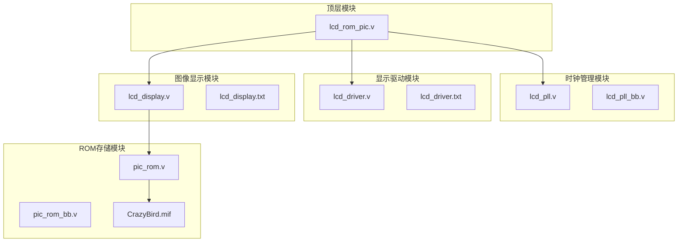
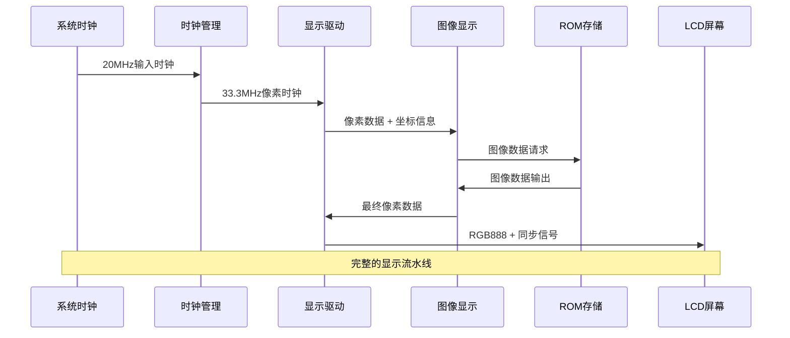
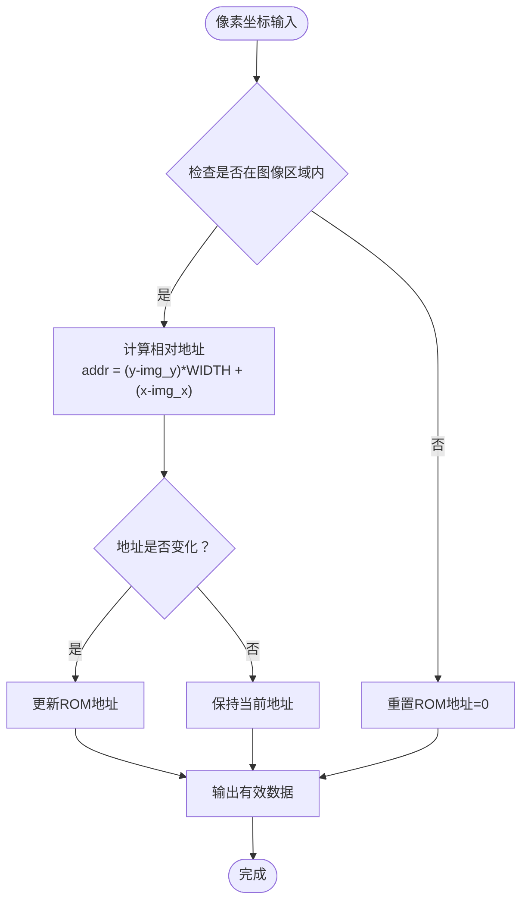
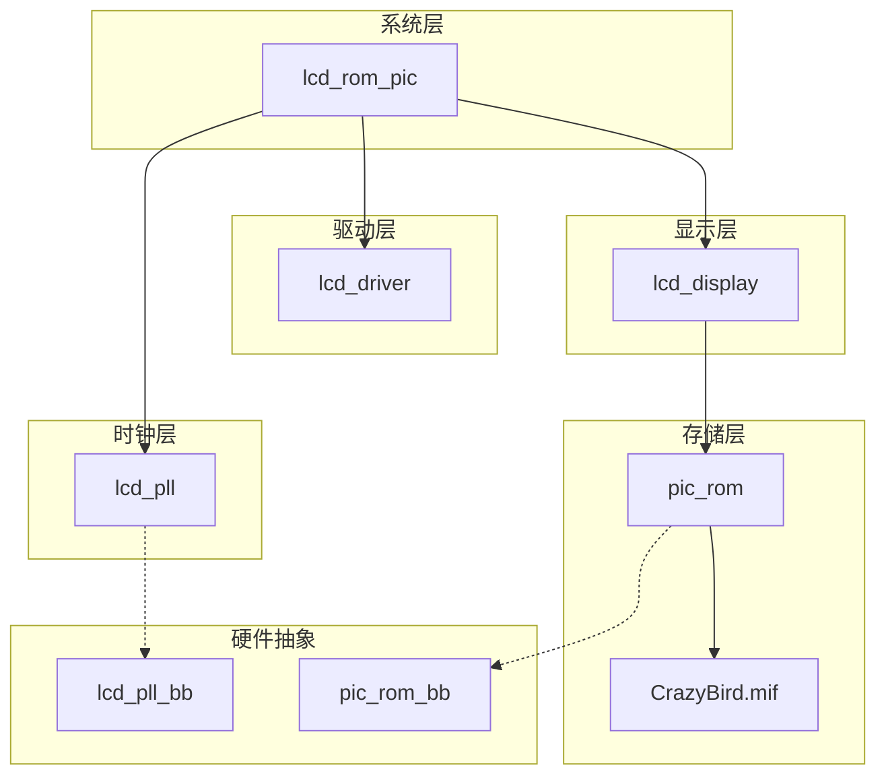

# 模块层次结构

<cite>
**本文档引用的文件**
- [lcd_rom_pic.v](file://lcd_rom_pic.v)
- [lcd_pll.v](file://lcd_pll.v)
- [lcd_driver.v](file://lcd_driver.v)
- [lcd_display.v](file://lcd_display.v)
- [pic_rom.v](file://pic_rom.v)
- [lcd_pll_bb.v](file://lcd_pll_bb.v)
- [pic_rom_bb.v](file://pic_rom_bb.v)
- [lcd_display.txt](file://lcd_display.txt)
- [lcd_driver.txt](file://lcd_driver.txt)
- [CrazyBird.mif](file://CrazyBird.mif)
</cite>

## 目录
1. [简介](#简介)
2. [项目结构概览](#项目结构概览)
3. [核心组件分析](#核心组件分析)
4. [架构总览](#架构总览)
5. [详细组件分析](#详细组件分析)
6. [依赖关系分析](#依赖关系分析)
7. [性能考虑](#性能考虑)
8. [故障排除指南](#故障排除指南)
9. [结论](#结论)

## 简介

LCD_ROM_PIC是一个基于FPGA的LCD显示控制系统，采用模块化设计架构。该项目实现了完整的LCD显示流水线，从系统时钟管理到最终的像素输出，包含四个主要功能模块：时钟管理、显示驱动、图像显示和ROM存储。

该系统的核心目标是在800×480分辨率的RGB LCD屏幕上显示动态图像，并支持多种运动模式控制。系统通过PLL时钟生成精确的像素时钟频率，驱动整个显示流水线的同步操作。

## 项目结构概览

项目采用标准的FPGA项目组织方式，包含顶层模块、功能模块和硬件抽象层：

**图表来源**
- [lcd_rom_pic.v:1-59](file://lcd_rom_pic.v#L1-L59)
- [lcd_pll.v:1-321](file://lcd_pll.v#L1-L321)
- [lcd_driver.v:1-97](file://lcd_driver.v#L1-L97)
- [lcd_display.v:1-199](file://lcd_display.v#L1-L199)
- [pic_rom.v:1-165](file://pic_rom.v#L1-L165)

**章节来源**
- [lcd_rom_pic.v:1-59](file://lcd_rom_pic.v#L1-L59)
- [lcd_pll.v:1-321](file://lcd_pll.v#L1-L321)
- [lcd_driver.v:1-97](file://lcd_driver.v#L1-L97)
- [lcd_display.v:1-199](file://lcd_display.v#L1-L199)
- [pic_rom.v:1-165](file://pic_rom.v#L1-L165)

## 核心组件分析

### 顶层协调器 - lcd_rom_pic

顶层模块`lcd_rom_pic`作为系统协调器，负责整合所有子模块并建立模块间的连接关系。该模块采用简洁的接口设计，提供了系统级的时钟、复位和显示信号管理。

**输入信号：**
- `sys_clk`: 系统主时钟输入
- `sys_rst_n`: 系统异步复位信号（低电平有效）
- `B0-B3`: 用户控制开关，用于选择不同的显示模式

**输出信号：**
- LCD显示接口：`lcd_hs`, `lcd_vs`, `lcd_de`, `lcd_rgb`, `lcd_bl`, `lcd_rst`, `lcd_pclk`
- 内部像素数据流：`pixel_data_w`, `pixel_xpos_w`, `pixel_ypos_w`

**关键设计特点：**
- 使用`rst_n_w = sys_rst_n & locked_w`确保只有在PLL锁定后才释放复位
- 采用内部总线传输像素数据，避免直接连接导致的时序问题
- 模块间通过明确定义的信号名称和数据宽度进行通信

**章节来源**
- [lcd_rom_pic.v:1-59](file://lcd_rom_pic.v#L1-L59)

### 时钟管理模块 - lcd_pll

时钟管理模块`lcd_pll`使用Altera的PLL IP核生成精确的像素时钟。该模块配置为产生33.3MHz的像素时钟，满足800×480@60Hz的显示需求。

**PLL配置参数：**
- 输入时钟：20MHz
- 输出频率：33.3MHz（精确值33.299999MHz）
- 分频比：50,000,000/33,299,999
- 时钟质量：自动带宽优化
- 锁定检测：启用锁定状态输出

**设计考量：**
- 使用wizard-generated代码确保最佳性能
- 配置为NORMAL模式，提供稳定的时钟输出
- 支持锁定状态监控，便于系统状态检测

**章节来源**
- [lcd_pll.v:104-159](file://lcd_pll.v#L104-L159)
- [lcd_pll.v:161-162](file://lcd_pll.v#L161-L162)

## 架构总览

系统采用流水线式架构，数据从时钟生成开始，经过显示驱动，最终到达ROM存储和像素输出：

**图表来源**
- [lcd_rom_pic.v:26-47](file://lcd_rom_pic.v#L26-L47)
- [lcd_driver.v:1-97](file://lcd_driver.v#L1-L97)
- [lcd_display.v:125-189](file://lcd_display.v#L125-L189)

## 详细组件分析

### 显示驱动模块 - lcd_driver

显示驱动模块`lcd_driver`负责生成LCD显示器所需的完整时序信号，包括行同步、场同步、数据使能和RGB数据输出。

**显示参数配置：**
- 分辨率：800×480
- 行参数：H_SYNC=46, H_BACK=0, H_DISP=800, H_FRONT=210, H_TOTAL=1056
- 场参数：V_SYNC=23, V_BACK=0, V_DISP=480, V_FRONT=22, V_TOTAL=525
- 像素时钟：33.3MHz

**时序生成机制：**
- 使用双计数器架构：子计数器（行计数）和母计数器（场计数）
- 通过计数器比较生成有效的显示窗口
- 实现1像素的前瞻机制，确保数据在有效期内正确传输

**数据路径：**
- `pixel_xpos`: 11位水平坐标，范围0-799
- `pixel_ypos`: 11位垂直坐标，范围0-479  
- `pixel_data`: 24位RGB888颜色数据

**章节来源**
- [lcd_driver.v:21-31](file://lcd_driver.v#L21-L31)
- [lcd_driver.v:68-69](file://lcd_driver.v#L68-L69)
- [lcd_driver.v:73-94](file://lcd_driver.v#L73-L94)

### 图像显示模块 - lcd_display

图像显示模块`lcd_display`实现了复杂的图像处理和运动控制逻辑，支持多种显示模式和动态效果。

**核心功能：**

1. **运动控制模块：**
   - 基于20位计数器的精确运动节拍控制
   - 60像素/秒的运动速度基准
   - 555,000个时钟周期的运动间隔计算

2. **多模式控制：**
   - B0=1：静态显示模式
   - B1=1：垂直移动130像素，往返循环
   - B2=1：水平移动，边界反弹
   - B3=1：左上45度移动，边界穿透

3. **图像定位系统：**
   - 基础位置：X=230, Y=150
   - 图像尺寸：140×170像素
   - 总像素数：23,800像素

**地址计算机制：**

**图表来源**
- [lcd_display.v:155-178](file://lcd_display.v#L155-L178)
- [lcd_display.v:134-135](file://lcd_display.v#L134-L135)

**章节来源**
- [lcd_display.v:25-46](file://lcd_display.v#L25-L46)
- [lcd_display.v:53-123](file://lcd_display.v#L53-L123)
- [lcd_display.v:154-178](file://lcd_display.v#L154-L178)

### ROM存储模块 - pic_rom

ROM存储模块`pic_rom`使用Altera的altsyncram IP核实现图像数据的高速存储和读取。

**存储配置：**
- 存储深度：32,768字 (15位地址)
- 数据宽度：24位 (RGB888)
- 存储模式：ROM只读模式
- 初始化文件：CrazyBird.mif

**接口规范：**
- 地址总线：15位 (`address[14:0]`)
- 时钟输入：单端时钟 (`clock`)
- 读使能：低电平有效 (`rden`)
- 数据输出：24位 (`q[23:0]`)

**性能特征：**
- 无写入功能，专为只读应用优化
- 输出注册，提供稳定的数据延迟
- 支持连续读取，适合视频流应用

**章节来源**
- [pic_rom.v:85-99](file://pic_rom.v#L85-L99)
- [pic_rom.v:136-149](file://pic_rom.v#L136-L149)

## 依赖关系分析

系统模块间的依赖关系形成了清晰的层次结构：

**图表来源**
- [lcd_rom_pic.v:26-47](file://lcd_rom_pic.v#L26-L47)
- [lcd_display.v:192-198](file://lcd_display.v#L192-L198)

**依赖关系特点：**
- 单向依赖：从系统层到存储层
- 时钟域分离：PLL独立于其他模块
- 接口标准化：统一的像素数据格式
- 硬件抽象：BB文件提供底层硬件接口

**章节来源**
- [lcd_rom_pic.v:18-25](file://lcd_rom_pic.v#L18-L25)
- [lcd_display.v:189](file://lcd_display.v#L189)

## 性能考虑

### 时序优化

系统采用前瞻机制确保数据在有效期内正确传输：
- 子计数器提前1个时钟周期输出坐标
- 母计数器在行结束时更新，保证场同步准确性
- 555,000时钟周期的运动节拍提供精确的速度控制

### 资源利用

- **计数器资源**：11位计数器实现800×480分辨率
- **地址计算**：15位地址总线支持32K像素存储
- **数据路径**：24位RGB888数据宽度提供全彩显示
- **控制逻辑**：4位模式选择输入实现灵活的功能切换

### 功耗管理

- 时钟门控：仅在有效显示期间激活相关逻辑
- 低功耗模式：空闲时钟域自动降低功耗
- 背光控制：可选的背光控制信号

## 故障排除指南

### 常见问题诊断

1. **显示无画面**
   - 检查PLL锁定信号(`locked_w`)
   - 验证系统复位状态
   - 确认像素时钟频率

2. **图像显示异常**
   - 检查ROM初始化文件加载
   - 验证地址计算逻辑
   - 确认运动控制模式设置

3. **时序错误**
   - 检查行/场同步参数
   - 验证像素时钟相位
   - 确认数据采样时机

### 调试建议

- 使用示波器验证LCD同步信号
- 通过JTAG接口监控内部信号
- 实施状态机可视化调试
- 建立仿真模型验证时序

**章节来源**
- [lcd_rom_pic.v:24-25](file://lcd_rom_pic.v#L24-L25)
- [lcd_driver.v:48-55](file://lcd_driver.v#L48-L55)

## 结论

LCD_ROM_PIC项目展现了现代FPGA显示系统的完整实现。通过精心设计的模块化架构，系统实现了从时钟管理到像素输出的完整流水线。

**设计亮点：**
- 清晰的模块层次结构，职责明确
- 精确的时序控制，确保显示稳定性
- 灵活的运动控制，支持多种显示模式
- 高效的资源利用，满足实时性要求

**技术价值：**
- 提供了完整的LCD显示系统参考实现
- 展示了FPGA在嵌入式显示应用中的优势
- 为类似项目提供了可复用的设计模式

该系统为初学者提供了理解FPGA显示控制的完整案例，同时为有经验的开发者提供了深入的技术细节和设计考量。