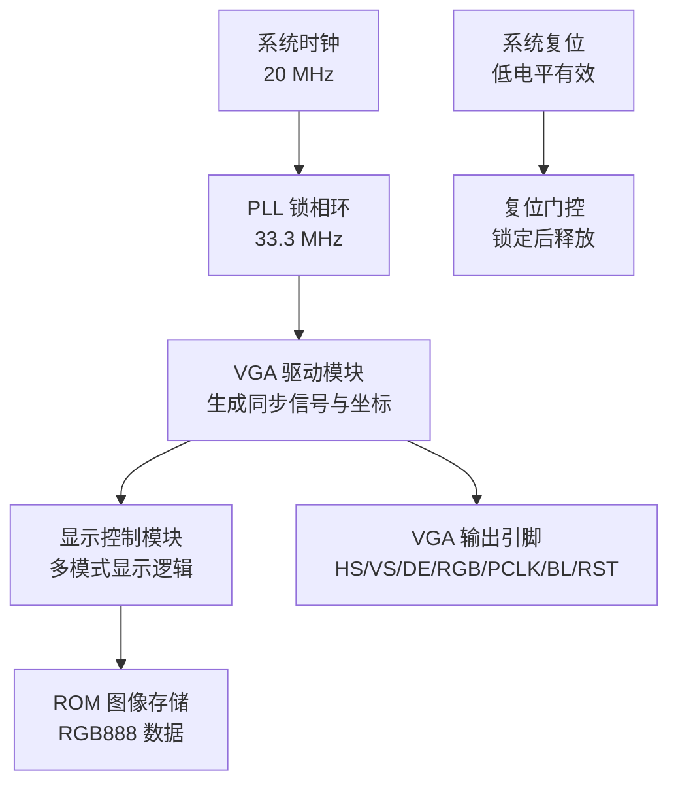
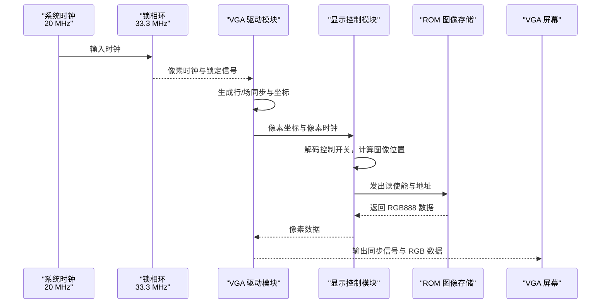
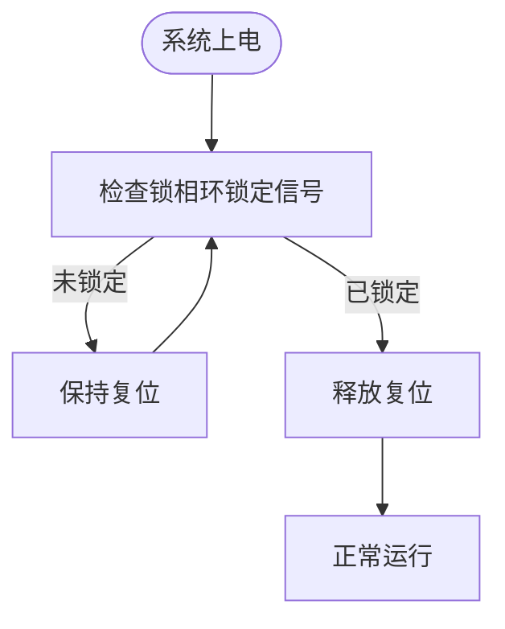
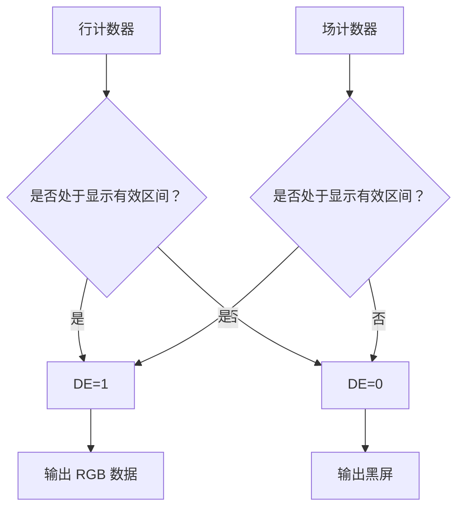
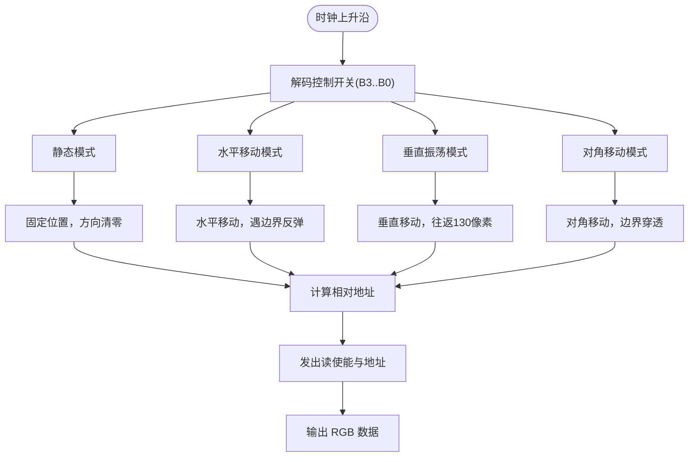
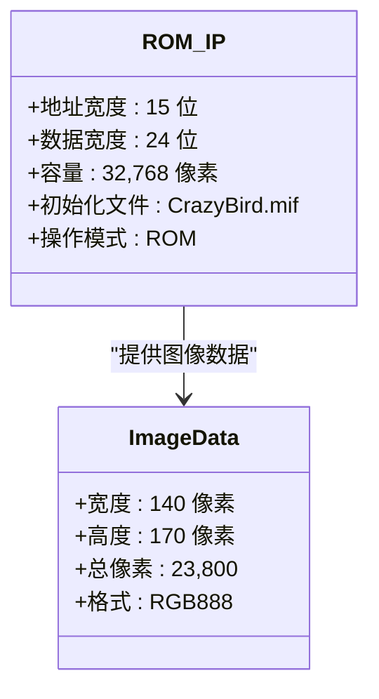
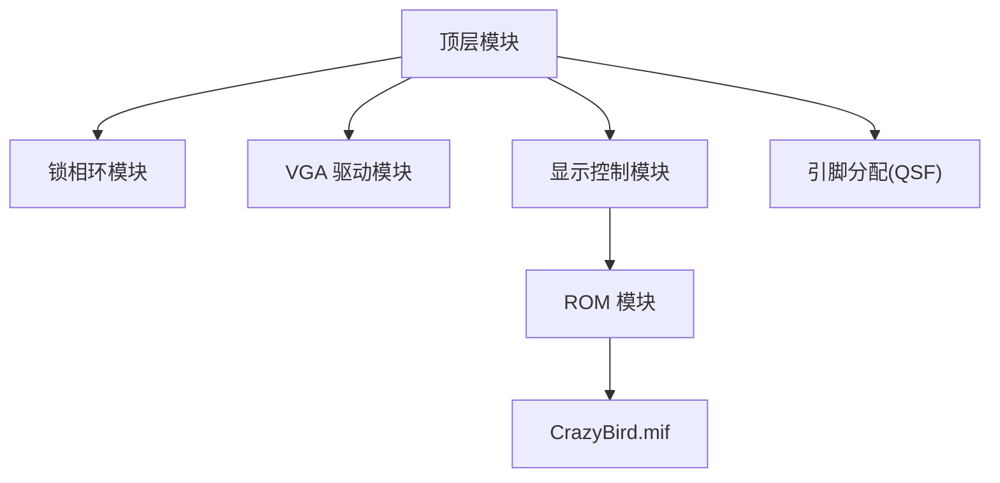

# 设计决策说明

<cite>
**本文档引用的文件**
- [lcd_rom_pic.v](file://lcd_rom_pic.v)
- [lcd_pll.v](file://lcd_pll.v)
- [pic_rom.v](file://pic_rom.v)
- [lcd_display.v](file://lcd_display.v)
- [lcd_driver.v](file://lcd_driver.v)
- [lcd_pll_bb.v](file://lcd_pll_bb.v)
- [pic_rom_bb.v](file://pic_rom_bb.v)
- [CrazyBird.mif](file://CrazyBird.mif)
- [lcd_rom_pic.qsf](file://lcd_rom_pic.qsf)
- [CLAUDE.md](file://CLAUDE.md)
</cite>

## 目录
1. [简介](#简介)
2. [项目结构](#项目结构)
3. [核心组件](#核心组件)
4. [架构概览](#架构概览)
5. [详细组件分析](#详细组件分析)
6. [依赖关系分析](#依赖关系分析)
7. [性能考虑](#性能考虑)
8. [故障排查指南](#故障排查指南)
9. [结论](#结论)
10. [附录](#附录)

## 简介
本文件针对 LCD_ROM_PIC 项目的设计决策进行系统性技术说明，重点围绕以下关键问题展开：
- 为什么选择 33.3MHz 像素时钟频率以匹配 800×480@60Hz 的 VGA 标准；
- 为什么采用 PLL 锁相环确保时钟稳定性；
- 如何设计多模式显示控制逻辑（静态、水平移动、垂直振荡、对角移动）；
- ROM 地址总线宽度选择（15 位）及其对存储容量的影响；
- 这些设计决策对系统性能、功耗、成本和实现复杂度的影响；
- 替代方案与可能的改进方向；
- 为项目评估和后续扩展提供技术依据。

## 项目结构
该项目采用自顶向下的模块化设计，顶层模块负责系统级时钟管理、驱动与显示控制的协调。主要模块包括：
- 顶层模块：系统时钟输入、复位、VGA 输出引脚与内部信号分配；
- 时钟模块：基于 ALTERA ALTPLL IP 的锁相环，提供稳定的像素时钟；
- 驱动模块：生成 VGA 同步信号与像素坐标，驱动 RGB 显示；
- 显示模块：根据控制开关选择显示模式，从 ROM 中读取图像数据并输出到像素缓冲；
- ROM 模块：使用 ALTERA ALTSYNCROM IP 提供图像数据存储。

**图表来源**
- [lcd_rom_pic.v:1-59](file://lcd_rom_pic.v#L1-L59)
- [lcd_pll.v:39-162](file://lcd_pll.v#L39-L162)
- [lcd_driver.v:1-97](file://lcd_driver.v#L1-L97)
- [lcd_display.v:1-199](file://lcd_display.v#L1-L199)
- [pic_rom.v:39-102](file://pic_rom.v#L39-L102)

**章节来源**
- [lcd_rom_pic.v:1-59](file://lcd_rom_pic.v#L1-L59)
- [lcd_pll.v:39-162](file://lcd_pll.v#L39-L162)
- [lcd_driver.v:1-97](file://lcd_driver.v#L1-L97)
- [lcd_display.v:1-199](file://lcd_display.v#L1-L199)
- [pic_rom.v:39-102](file://pic_rom.v#L39-L102)

## 核心组件
- 顶层模块：负责系统级时钟、复位与 VGA 引脚的连接，以及各子模块的实例化与信号分配。
- 锁相环模块：通过 ALTERA ALTPLL IP 将 20 MHz 输入转换为 33.3 MHz 的像素时钟，并提供锁定信号用于复位门控。
- VGA 驱动模块：根据 800×480@60Hz 的 VGA 参数生成行/场同步信号、数据使能与像素坐标。
- 显示控制模块：根据外部控制开关选择显示模式，计算图像位置，管理 ROM 地址与读使能，实现静态、水平移动、垂直振荡与对角移动等模式。
- ROM 模块：使用 ALTERA ALTSYNCROM IP 提供图像数据存储，支持 15 位地址总线与 24 位数据宽度。

**章节来源**
- [lcd_rom_pic.v:1-59](file://lcd_rom_pic.v#L1-L59)
- [lcd_pll.v:39-162](file://lcd_pll.v#L39-L162)
- [lcd_driver.v:1-97](file://lcd_driver.v#L1-L97)
- [lcd_display.v:1-199](file://lcd_display.v#L1-L199)
- [pic_rom.v:39-102](file://pic_rom.v#L39-L102)

## 架构概览
系统采用“时钟—驱动—显示—存储”的流水线式架构。顶层模块将系统时钟送入锁相环，生成稳定的像素时钟；VGA 驱动模块基于像素时钟生成同步信号与像素坐标；显示控制模块根据控制开关选择模式，计算图像位置并在有效区域内从 ROM 读取数据；ROM 模块提供 RGB888 的图像数据。

**图表来源**
- [lcd_pll.v:39-162](file://lcd_pll.v#L39-L162)
- [lcd_driver.v:1-97](file://lcd_driver.v#L1-L97)
- [lcd_display.v:1-199](file://lcd_display.v#L1-L199)
- [pic_rom.v:39-102](file://pic_rom.v#L39-L102)

## 详细组件分析

### 时钟系统与像素时钟频率选择
- 设计目标：满足 800×480@60Hz 的 VGA 标准，像素时钟频率为 33.3 MHz。
- 实现方式：使用 ALTERA ALTPLL IP，将 20 MHz 输入时钟转换为 33.3 MHz 输出，同时提供锁定信号。
- 复位策略：仅在锁相环锁定后释放系统复位，确保显示时序的稳定性。
- 时序考虑：VGA 驱动模块将像素时钟直接作为 PCLK 输出，简化了时序路径。

**图表来源**
- [lcd_pll.v:39-162](file://lcd_pll.v#L39-L162)
- [lcd_pll_bb.v:99-100](file://lcd_pll_bb.v#L99-L100)
- [lcd_rom_pic.v:24-25](file://lcd_rom_pic.v#L24-L25)

**章节来源**
- [lcd_pll.v:104-117](file://lcd_pll.v#L104-L117)
- [lcd_pll_bb.v:99-100](file://lcd_pll_bb.v#L99-L100)
- [lcd_rom_pic.v:24-25](file://lcd_rom_pic.v#L24-L25)

### VGA 驱动模块与时序参数
- VGA 参数：行同步、后肩、显示区、前沿与总周期分别为 46、0、800、210、1056；场同步、后肩、显示区、前沿与总周期分别为 23、0、480、22、525。
- 坐标生成：在数据请求窗口内提前一个像素时钟周期输出坐标，保证数据在有效期内到达。
- 同步信号：HS、VS、DE、PCLK、BL、RST 等引脚按设计要求连接至屏幕。

**图表来源**
- [lcd_driver.v:21-31](file://lcd_driver.v#L21-L31)
- [lcd_driver.v:48-55](file://lcd_driver.v#L48-L55)
- [lcd_driver.v:63-70](file://lcd_driver.v#L63-L70)
- [lcd_driver.v:72-94](file://lcd_driver.v#L72-L94)

**章节来源**
- [lcd_driver.v:21-31](file://lcd_driver.v#L21-L31)
- [lcd_driver.v:48-55](file://lcd_driver.v#L48-L55)
- [lcd_driver.v:63-70](file://lcd_driver.v#L63-L70)
- [lcd_driver.v:72-94](file://lcd_driver.v#L72-L94)

### 显示控制模块与多模式显示逻辑
- 模式选择：通过 B0–B3 控制开关选择四种模式：静态、水平移动、垂直振荡、对角移动。
- 运动控制：基于 33.3 MHz 像素时钟，使用计数器将时钟频率分频为 60 步/秒的移动节拍（约 555,000 个时钟周期）。
- 图像位置：根据当前模式更新图像左上角坐标，处理边界条件（反弹或穿透）。
- 地址管理：在图像区域内计算相对地址，利用“位置变化”标志重置 ROM 地址，避免地址漂移。
- 数据输出：在有效区域内从 ROM 读取 RGB888 数据，否则输出白色背景。

**图表来源**
- [lcd_display.v:60-123](file://lcd_display.v#L60-L123)
- [lcd_display.v:154-178](file://lcd_display.v#L154-L178)
- [lcd_display.v:189-198](file://lcd_display.v#L189-L198)

**章节来源**
- [lcd_display.v:25-28](file://lcd_display.v#L25-L28)
- [lcd_display.v:60-123](file://lcd_display.v#L60-L123)
- [lcd_display.v:154-178](file://lcd_display.v#L154-L178)
- [lcd_display.v:189-198](file://lcd_display.v#L189-L198)

### ROM 地址总线宽度与存储容量
- 地址总线宽度：15 位，可寻址 32,768 个字（2^15）。
- 数据宽度：24 位（RGB888），每个像素占用 3 字节。
- 图像尺寸：140×170 像素，总像素数为 23,800，小于 32,768，满足容量需求。
- 初始化文件：CrazyBird.mif，深度为 23,800，宽度为 24，内容为 RGB888 数据。
- IP 参数：ALTSYNCROM 设置为 ROM 模式，地址宽度 15，数据宽度 24，初始化文件为 CrazyBird.mif。

**图表来源**
- [pic_rom.v:89-99](file://pic_rom.v#L89-L99)
- [CrazyBird.mif:4-5](file://CrazyBird.mif#L4-L5)
- [pic_rom_bb.v:75-84](file://pic_rom_bb.v#L75-L84)

**章节来源**
- [pic_rom.v:89-99](file://pic_rom.v#L89-L99)
- [CrazyBird.mif:4-5](file://CrazyBird.mif#L4-L5)
- [pic_rom_bb.v:75-84](file://pic_rom_bb.v#L75-L84)

## 依赖关系分析
- 顶层模块依赖于锁相环模块提供的像素时钟与锁定信号，以及驱动模块生成的同步信号与坐标。
- 显示控制模块依赖于驱动模块提供的像素坐标与像素时钟，以及 ROM 模块提供的图像数据。
- ROM 模块依赖于初始化文件 CrazyBird.mif，其参数由 IP 配置决定。
- 系统引脚分配由 QSF 文件定义，确保硬件连接正确。

**图表来源**
- [lcd_rom_pic.v:1-59](file://lcd_rom_pic.v#L1-L59)
- [lcd_pll.v:39-162](file://lcd_pll.v#L39-L162)
- [lcd_driver.v:1-97](file://lcd_driver.v#L1-L97)
- [lcd_display.v:1-199](file://lcd_display.v#L1-L199)
- [pic_rom.v:39-102](file://pic_rom.v#L39-L102)
- [CrazyBird.mif:1-200](file://CrazyBird.mif#L1-L200)
- [lcd_rom_pic.qsf:53-91](file://lcd_rom_pic.qsf#L53-L91)

**章节来源**
- [lcd_rom_pic.v:1-59](file://lcd_rom_pic.v#L1-L59)
- [lcd_pll.v:39-162](file://lcd_pll.v#L39-L162)
- [lcd_driver.v:1-97](file://lcd_driver.v#L1-L97)
- [lcd_display.v:1-199](file://lcd_display.v#L1-L199)
- [pic_rom.v:39-102](file://pic_rom.v#L39-L102)
- [CrazyBird.mif:1-200](file://CrazyBird.mif#L1-L200)
- [lcd_rom_pic.qsf:53-91](file://lcd_rom_pic.qsf#L53-L91)

## 性能考虑
- 像素时钟频率：33.3 MHz 满足 800×480@60Hz 的带宽需求，确保每行像素数据在有效时间内完成传输。
- 锁相环稳定性：锁定信号用于复位门控，避免上电抖动导致的显示异常。
- 地址管理优化：通过“位置变化”标志重置 ROM 地址，减少地址漂移带来的访问开销。
- 数据通路：ROM 输出与像素时钟同频，配合驱动模块的提前一个时钟周期输出坐标，保证数据在有效期内到达屏幕。
- 功耗与成本：使用片上 ROM IP 减少外部存储器成本，但需注意初始化文件大小与资源占用；锁相环会引入一定功耗，可通过关闭非必要功能降低。

[本节为通用性能讨论，无需特定文件来源]

## 故障排查指南
- 无画面或画面闪烁：检查锁相环锁定信号是否有效，确认复位门控逻辑；检查 VGA 驱动模块的同步参数与像素时钟连接。
- 显示异常或颜色错误：检查像素坐标生成逻辑，确认数据请求窗口设置；检查 ROM 初始化文件与地址计算。
- 模式切换无效：检查控制开关连接与解码逻辑，确认模式选择分支执行路径。
- ROM 读取错误：检查 ROM 地址总线宽度与初始化文件深度，确认地址计算公式与边界条件。

**章节来源**
- [lcd_pll.v:39-162](file://lcd_pll.v#L39-L162)
- [lcd_driver.v:63-70](file://lcd_driver.v#L63-L70)
- [lcd_display.v:154-178](file://lcd_display.v#L154-L178)
- [pic_rom.v:89-99](file://pic_rom.v#L89-L99)

## 结论
本项目通过精心设计的时钟系统、VGA 驱动与显示控制逻辑，实现了对 800×480@60Hz 的稳定显示。33.3MHz 像素时钟频率与锁相环的使用确保了时序稳定性；多模式显示逻辑提供了灵活的演示能力；15 位地址总线与 24 位数据宽度的 ROM 配置满足了图像容量需求。整体设计在性能、功耗、成本与实现复杂度之间取得了平衡，为后续扩展提供了清晰的技术基础。

[本节为总结性内容，无需特定文件来源]

## 附录

### 设计决策与替代方案对比
- 像素时钟频率：选择 33.3MHz 以匹配 800×480@60Hz 标准；替代方案可考虑更高分辨率或更低刷新率，但需重新计算带宽与时序。
- 锁相环：采用 ALTERA ALTPLL IP 提供稳定时钟；替代方案可考虑外部晶振或更复杂的时钟管理电路，但会增加成本与复杂度。
- 显示模式：通过控制开关实现多种模式；替代方案可引入按键或串口命令进行动态切换。
- ROM 容量：15 位地址总线提供 32,768 像素容量；替代方案可使用更大容量 ROM 或外部存储器，但需评估接口与带宽。

**章节来源**
- [lcd_pll.v:104-117](file://lcd_pll.v#L104-L117)
- [lcd_display.v:60-123](file://lcd_display.v#L60-L123)
- [pic_rom.v:89-99](file://pic_rom.v#L89-L99)