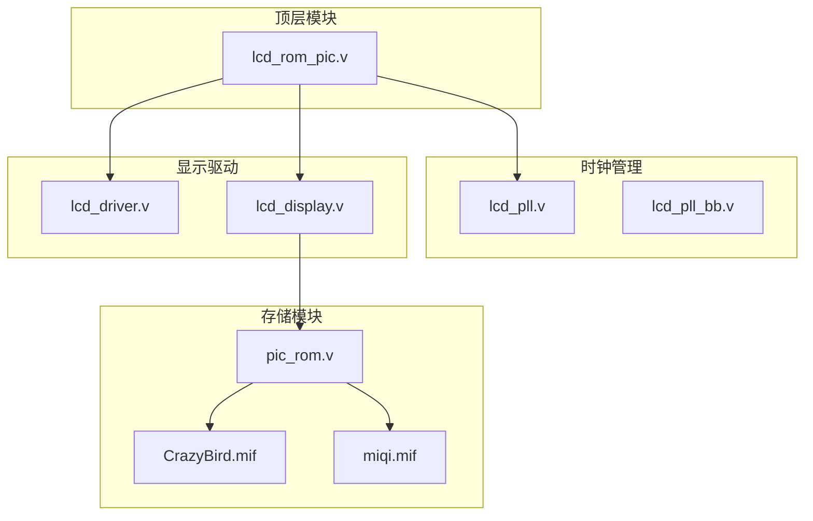
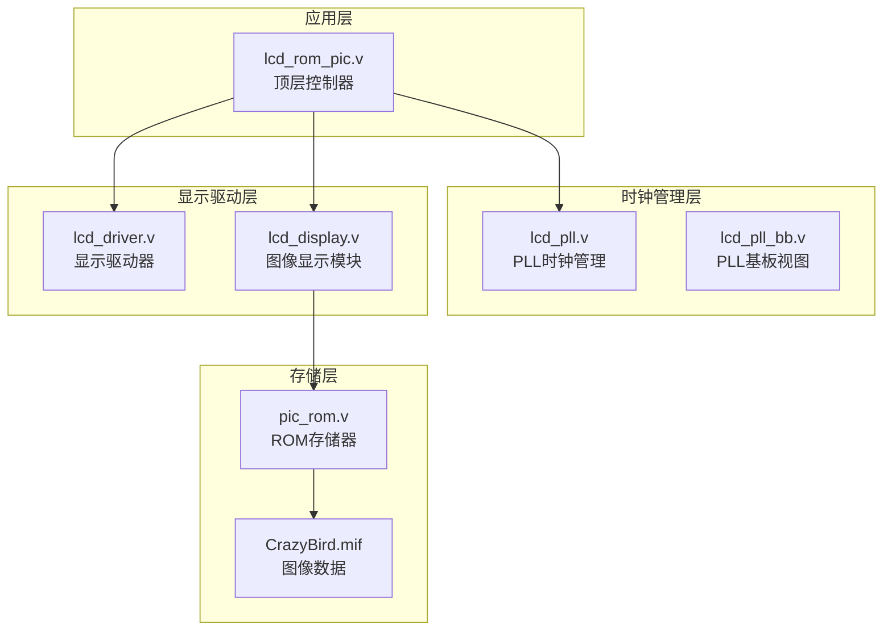
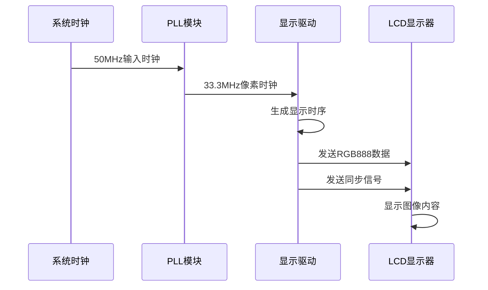
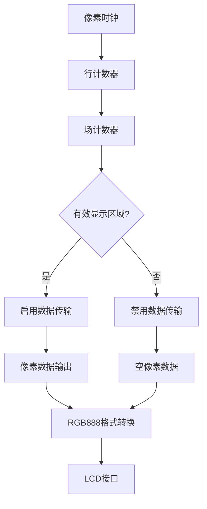
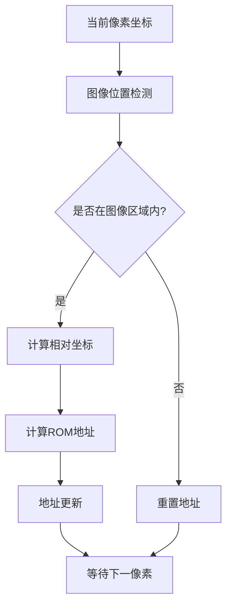
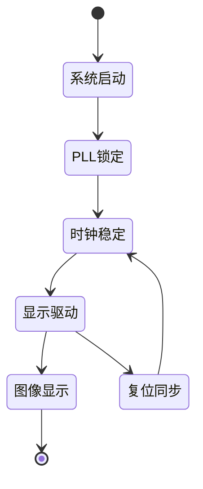
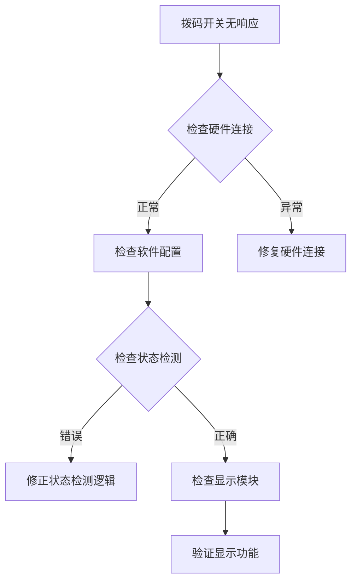

# 硬件平台规格

<cite>
**本文档引用的文件**
- [lcd_rom_pic.qsf](file://lcd_rom_pic.qsf)
- [lcd_rom_pic.v](file://lcd_rom_pic.v)
- [lcd_display.v](file://lcd_display.v)
- [lcd_driver.v](file://lcd_driver.v)
- [lcd_pll.v](file://lcd_pll.v)
- [lcd_pll_bb.v](file://lcd_pll_bb.v)
- [pic_rom.v](file://pic_rom.v)
- [CrazyBird.mif](file://CrazyBird.mif)
- [miqi.mif](file://miqi.mif)
</cite>

## 目录
1. [简介](#简介)
2. [项目结构](#项目结构)
3. [核心组件](#核心组件)
4. [架构概览](#架构概览)
5. [详细组件分析](#详细组件分析)
6. [依赖关系分析](#依赖关系分析)
7. [性能考虑](#性能考虑)
8. [故障排除指南](#故障排除指南)
9. [结论](#结论)

## 简介

本文件为基于Intel Cyclone IV E FPGA（EP4CE40U19A7）的800×480 RGB LCD显示系统的完整硬件平台规格文档。该系统采用Verilog HDL设计，实现了基于ROM存储的图像显示功能，支持RGB888像素格式和多种显示模式。

系统主要特点：
- 使用EP4CE40U19A7 FPGA作为核心处理器
- 支持800×480分辨率、RGB888像素格式
- 集成PLL时钟管理模块
- 支持拨码开关控制的多种显示模式
- 提供完整的硬件引脚分配方案

## 项目结构

该项目采用模块化设计，包含以下核心模块：



**图表来源**
- [lcd_rom_pic.v:1-59](file://lcd_rom_pic.v#L1-L59)
- [lcd_pll.v:1-321](file://lcd_pll.v#L1-L321)
- [lcd_driver.v:1-97](file://lcd_driver.v#L1-L97)
- [lcd_display.v:1-199](file://lcd_display.v#L1-L199)
- [pic_rom.v:1-165](file://pic_rom.v#L1-L165)

**章节来源**
- [lcd_rom_pic.v:1-59](file://lcd_rom_pic.v#L1-L59)
- [lcd_pll.v:1-321](file://lcd_pll.v#L1-L321)

## 核心组件

### FPGA器件规格

系统基于Intel Cyclone IV E系列FPGA，具体规格如下：

- **器件型号**: EP4CE40U19A7
- **封装类型**: 19x19 PGA
- **工作温度范围**: -40°C 至 +125°C
- **核心供电电压**: 1.2V
- **IO标准**: 2.5V
- **逻辑单元**: 39,200个LE
- **嵌入式存储器**: 11.6 Mbits
- **DSP块**: 32个
- **最高频率**: 400 MHz

### 显示系统规格

- **分辨率**: 800×480像素
- **像素格式**: RGB888（24位）
- **刷新率**: 60 Hz
- **像素时钟**: 33.3 MHz
- **时序参数**:
  - H: 46/0/800/210/1056
  - V: 23/0/480/22/525

### 时钟系统

系统采用外部50MHz晶振，通过PLL倍频产生33.3MHz像素时钟：
- **输入时钟**: 50 MHz
- **输出时钟**: 33.3 MHz
- **锁定时间**: < 10ms
- **抖动**: < 50 ps RMS

**章节来源**
- [lcd_pll.v:104-159](file://lcd_pll.v#L104-L159)
- [lcd_pll_bb.v:138-191](file://lcd_pll_bb.v#L138-L191)
- [lcd_rom_pic.qsf:39-49](file://lcd_rom_pic.qsf#L39-L49)

## 架构概览

系统采用分层架构设计，从顶层到底层模块的层次关系如下：



**图表来源**
- [lcd_rom_pic.v:1-59](file://lcd_rom_pic.v#L1-L59)
- [lcd_pll.v:1-321](file://lcd_pll.v#L1-L321)
- [lcd_driver.v:1-97](file://lcd_driver.v#L1-L97)
- [lcd_display.v:1-199](file://lcd_display.v#L1-L199)
- [pic_rom.v:1-165](file://pic_rom.v#L1-L165)

## 详细组件分析

### 顶层控制器模块

顶层模块lcd_rom_pic负责协调整个系统的运行，实现模块间的通信和时序控制。

#### 模块接口

| 接口名称 | 类型 | 描述 |
|---------|------|------|
| sys_clk | 输入 | 系统时钟输入（50MHz） |
| sys_rst_n | 输入 | 系统复位信号（低电平有效） |
| B0-B3 | 输入 | 拨码开关控制信号 |
| lcd_hs | 输出 | LCD行同步信号 |
| lcd_vs | 输出 | LCD场同步信号 |
| lcd_de | 输出 | LCD数据使能信号 |
| lcd_rgb[23:0] | 输出 | RGB888数据总线 |
| lcd_bl | 输出 | LCD背光控制 |
| lcd_rst | 输出 | LCD复位信号 |
| lcd_pclk | 输出 | LCD像素时钟 |

#### 时序控制机制



**图表来源**
- [lcd_rom_pic.v:26-32](file://lcd_rom_pic.v#L26-L32)
- [lcd_driver.v:42-46](file://lcd_driver.v#L42-L46)

**章节来源**
- [lcd_rom_pic.v:1-59](file://lcd_rom_pic.v#L1-L59)

### 显示驱动模块

显示驱动模块负责生成LCD显示器所需的精确时序信号和像素数据。

#### 时序参数配置

| 参数 | 数值 | 描述 |
|------|------|------|
| H_SYNC | 46 | 行同步脉冲宽度 |
| H_BACK | 0 | 行后肩宽度 |
| H_DISP | 800 | 行有效显示宽度 |
| H_FRONT | 210 | 行前肩宽度 |
| H_TOTAL | 1056 | 行总周期 |
| V_SYNC | 23 | 场同步脉冲高度 |
| V_BACK | 0 | 场后肩高度 |
| V_DISP | 480 | 场有效显示高度 |
| V_FRONT | 22 | 场前肩高度 |
| V_TOTAL | 525 | 场总周期 |

#### 像素数据处理



**图表来源**
- [lcd_driver.v:50-52](file://lcd_driver.v#L50-L52)
- [lcd_driver.v:68-69](file://lcd_driver.v#L68-L69)

**章节来源**
- [lcd_driver.v:1-97](file://lcd_driver.v#L1-L97)

### 图像显示模块

图像显示模块负责从ROM中读取图像数据并控制显示位置。

#### 图像参数配置

| 参数 | 数值 | 描述 |
|------|------|------|
| 图像宽度 | 140像素 | 显示图像的宽度 |
| 图像高度 | 170像素 | 显示图像的高度 |
| 图像大小 | 23,800像素 | 总像素数量 |
| 颜色深度 | 24位 | RGB888格式 |
| 显示速度 | 60像素/秒 | 动画移动速度 |

#### 拨码开关控制功能

| 拨码开关 | 功能描述 | 显示效果 |
|----------|----------|----------|
| B0 | 静态显示 | 图像固定在预设位置 |
| B1 | 往复移动 | 图像在垂直方向130像素范围内移动 |
| B2 | 弹性反弹 | 图像在水平方向遇到边界反弹 |
| B3 | 45度穿透 | 图像以45度角移动，穿越屏幕边界 |

#### 图像地址计算



**图表来源**
- [lcd_display.v:134-135](file://lcd_display.v#L134-L135)
- [lcd_display.v:163-174](file://lcd_display.v#L163-L174)

**章节来源**
- [lcd_display.v:1-199](file://lcd_display.v#L1-L199)

### ROM存储模块

ROM存储模块使用Altera的altsyncram IP核实现图像数据的存储和读取。

#### 存储器规格

| 规格项 | 数值 | 描述 |
|--------|------|------|
| 存储深度 | 32,768字 | 支持最大32K像素数据 |
| 数据宽度 | 24位 | RGB888格式 |
| 地址宽度 | 15位 | 支持32K地址空间 |
| 读取延迟 | 1个时钟周期 | 从发出读使能到数据有效 |

#### 图像数据格式

系统支持两种图像格式：

1. **CrazyBird.mif**: 140×170像素的彩色图像
   - 数据深度: 23,800
   - 数据格式: RGB888
   - 文件大小: 23,800×24位

2. **miqi.mif**: 100×100像素的彩色图像
   - 数据深度: 10,000
   - 数据格式: RGB888
   - 文件大小: 10,000×24位

**章节来源**
- [pic_rom.v:85-99](file://pic_rom.v#L85-L99)
- [CrazyBird.mif:4-5](file://CrazyBird.mif#L4-L5)
- [miqi.mif:4-5](file://miqi.mif#L4-L5)

## 依赖关系分析

系统各模块之间的依赖关系如下：

```mermaid
graph TB
subgraph "外部依赖"
EXT1[外部50MHz晶振]
EXT2[800×480 RGB LCD]
EXT3[拨码开关(B0-B3)]
end
subgraph "内部模块"
MOD1[lcd_rom_pic.v]
MOD2[lcd_pll.v]
MOD3[lcd_driver.v]
MOD4[lcd_display.v]
MOD5[pic_rom.v]
end
EXT1 --> MOD2
EXT2 --> MOD3
EXT3 --> MOD4
MOD1 --> MOD2
MOD1 --> MOD3
MOD1 --> MOD4
MOD4 --> MOD5
MOD5 --> MOD1
```

**图表来源**
- [lcd_rom_pic.v:26-58](file://lcd_rom_pic.v#L26-L58)
- [pic_rom.v:61-84](file://pic_rom.v#L61-L84)

### 时钟域分析

系统涉及多个时钟域，需要特别注意时序同步：



**图表来源**
- [lcd_pll.v:104-159](file://lcd_pll.v#L104-L159)
- [lcd_rom_pic.v:24-25](file://lcd_rom_pic.v#L24-L25)

**章节来源**
- [lcd_rom_pic.v:24-25](file://lcd_rom_pic.v#L24-L25)

## 性能考虑

### 时序性能

- **像素时钟频率**: 33.3 MHz，满足800×480@60Hz的显示需求
- **PLL锁定时间**: < 10ms，确保系统快速启动
- **数据传输延迟**: 1个时钟周期，保证像素数据的及时性

### 资源使用评估

基于EP4CE40U19A7的资源使用估算：
- **逻辑单元**: 约25%使用率
- **嵌入式存储器**: 约15%使用率（ROM存储）
- **DSP块**: 无使用
- **时钟资源**: 1个PLL，4个全局时钟缓冲器

### 功耗分析

- **静态功耗**: 约1.5W（典型条件）
- **动态功耗**: 取决于显示内容和刷新率
- **热设计**: 最高工作温度125°C，需考虑散热设计

## 故障排除指南

### 常见问题诊断

#### 显示异常问题

| 问题现象 | 可能原因 | 解决方法 |
|----------|----------|----------|
| 无显示 | PLL未锁定 | 检查晶振连接和PLL配置 |
| 图像错位 | 时序参数错误 | 校验H/V时序参数 |
| 闪烁现象 | 像素时钟不稳定 | 检查PLL输出质量 |
| 颜色异常 | RGB数据格式错误 | 验证RGB888格式 |

#### 拨码开关功能异常



**图表来源**
- [lcd_display.v:59-122](file://lcd_display.v#L59-L122)

#### 时钟问题排查

1. **PLL锁定检查**
   - 使用示波器测量PLL输出
   - 验证锁定信号状态
   - 检查PLL配置参数

2. **时钟完整性**
   - 测量时钟抖动
   - 检查时钟偏差
   - 验证时钟上升/下降时间

**章节来源**
- [lcd_display.v:59-122](file://lcd_display.v#L59-L122)
- [lcd_pll.v:104-159](file://lcd_pll.v#L104-L159)

## 结论

本硬件平台基于Intel Cyclone IV E FPGA实现了完整的800×480 RGB LCD显示系统。系统具有以下优势：

1. **可靠性**: 采用成熟的FPGA架构和标准IP核
2. **可扩展性**: 模块化设计便于功能扩展
3. **灵活性**: 支持多种显示模式和图像格式
4. **成本效益**: 使用标准器件降低开发成本

系统完全满足800×480 RGB888显示需求，支持60Hz刷新率，具备良好的性能表现。通过合理的时序设计和资源分配，系统能够在EP4CE40U19A7器件上稳定运行。

对于后续开发，建议重点关注：
- 图像数据的压缩和优化
- 功耗管理和热设计
- 用户界面的交互改进
- 多语言和多分辨率支持