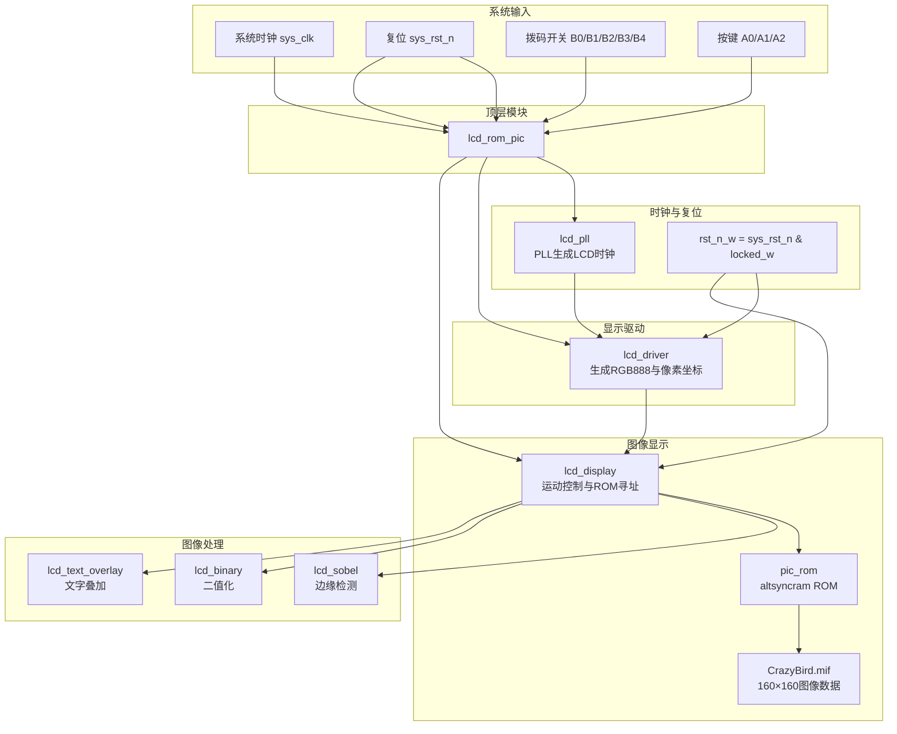
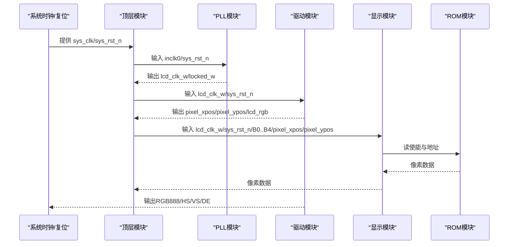
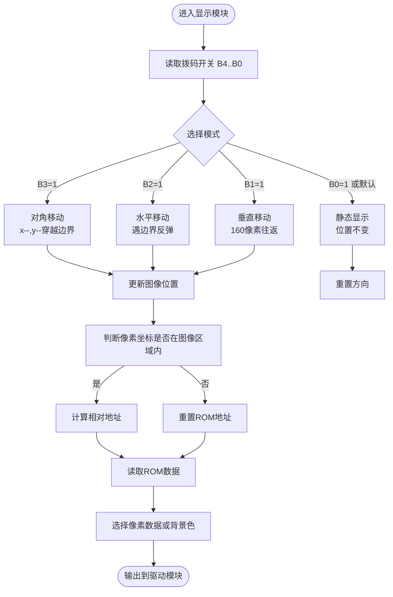
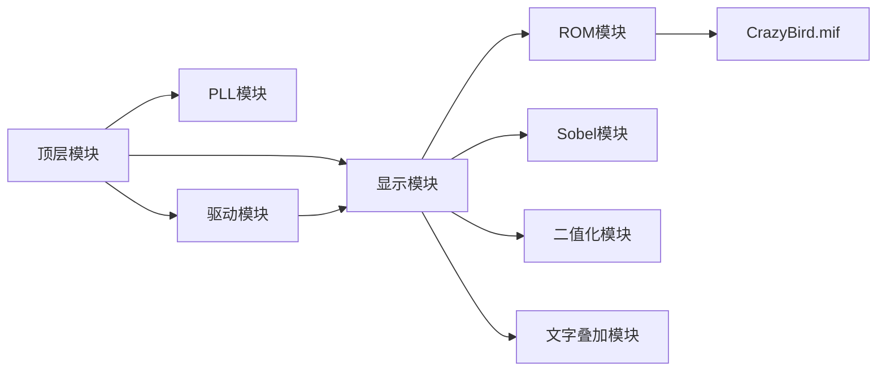

# 项目介绍

<cite>
**本文引用的文件**
- [lcd_rom_pic.v](file://lcd_rom_pic.v)
- [lcd_display.v](file://lcd_display.v)
- [lcd_driver.v](file://lcd_driver.v)
- [pic_rom.v](file://pic_rom.v)
- [lcd_pll.v](file://lcd_pll.v)
- [lcd_pll_bb.v](file://lcd_pll_bb.v)
- [pic_rom_bb.v](file://pic_rom_bb.v)
- [lcd_rom_pic.qsf](file://lcd_rom_pic.qsf)
- [CrazyBird.mif](file://CrazyBird.mif)
- [lcd_sobel.v](file://lcd_sobel.v)
- [lcd_binary.v](file://lcd_binary.v)
- [lcd_text_overlay.v](file://lcd_text_overlay.v)
- [font_rom.v](file://font_rom.v)
- [gen_font.py](file://gen_font.py)
- [lcd_display.txt](file://lcd_display.txt)
- [lcd_driver.txt](file://lcd_driver.txt)
</cite>

## 更新摘要
**变更内容**
- 更新了图像数据源说明，反映CrazyBird.mif成为唯一图像数据源
- 新增了图像尺寸规格说明（160×160像素）
- 更新了显示模式和功能按键的详细说明
- 新增了图像处理功能模块的介绍
- 更新了字体显示系统的说明

## 目录
1. [引言](#引言)
2. [项目结构](#项目结构)
3. [核心组件](#核心组件)
4. [架构总览](#架构总览)
5. [详细组件分析](#详细组件分析)
6. [依赖关系分析](#依赖关系分析)
7. [性能考虑](#性能考虑)
8. [故障排查指南](#故障排查指南)
9. [结论](#结论)
10. [附录](#附录)

## 引言
本项目面向Intel Cyclone IV E系列FPGA，实现一个800×480分辨率RGB LCD显示器的控制系统，核心目标是从片上ROM中读取并显示一幅160×160像素的彩色图像，并通过四个拨码开关（B0/B1/B2/B3/B4）和三个按键（A0/A1/A2）选择多种显示模式：
- 静态显示：图像固定在屏幕上的基准位置
- 水平移动：图像在水平方向往返移动，遇边界反弹
- 垂直移动：图像在垂直方向按固定步长往返移动，形成160像素的移动区间
- 对角移动：图像以左上方向移动，穿越屏幕边界后从对侧出现
- 拉伸模式：支持左右或上下方向的图像拉伸显示
- 图像处理模式：支持原图显示、二值化处理和边缘检测处理

项目还展示了从Quartus II 13.1到Quartus Prime 18.1 Lite的迁移过程，确保IP核（PLL与ROM）在新工具链下的兼容性。

## 项目结构
项目采用模块化设计，顶层模块负责系统时钟、复位与模块间互联；驱动模块生成RGB LCD的时序与像素坐标；显示模块负责图像的运动控制、ROM寻址与数据读取；ROM模块使用MIF文件作为只读存储初始化数据。

**图示来源**
- [lcd_rom_pic.v:1-67](file://lcd_rom_pic.v#L1-L67)
- [lcd_pll.v:1-321](file://lcd_pll.v#L1-L321)
- [lcd_driver.v:1-97](file://lcd_driver.v#L1-L97)
- [lcd_display.v:1-296](file://lcd_display.v#L1-L296)
- [pic_rom.v:1-165](file://pic_rom.v#L1-L165)
- [CrazyBird.mif:1-200](file://CrazyBird.mif#L1-L200)
- [lcd_sobel.v:1-131](file://lcd_sobel.v#L1-L131)
- [lcd_binary.v:1-40](file://lcd_binary.v#L1-L40)
- [lcd_text_overlay.v:1-241](file://lcd_text_overlay.v#L1-L241)

**章节来源**
- [lcd_rom_pic.v:1-67](file://lcd_rom_pic.v#L1-L67)
- [lcd_pll.v:1-321](file://lcd_pll.v#L1-L321)
- [lcd_driver.v:1-97](file://lcd_driver.v#L1-L97)
- [lcd_display.v:1-296](file://lcd_display.v#L1-L296)
- [pic_rom.v:1-165](file://pic_rom.v#L1-L165)
- [CrazyBird.mif:1-200](file://CrazyBird.mif#L1-L200)

## 核心组件
- 顶层模块：负责系统时钟、复位、拨码开关输入与各子模块的实例化与互联。
- PLL模块：生成LCD所需的像素时钟，保证输出频率满足800×480@60Hz的时序需求。
- 驱动模块：生成RGB888像素数据、行/场同步信号以及像素坐标，供显示模块使用。
- 显示模块：根据拨码开关选择显示模式，控制图像在屏幕上的位置变化；在图像区域内计算ROM地址并读取像素数据。
- ROM模块：使用Altera IP核altsyncram，从MIF文件加载图像数据，提供只读访问。
- 图像处理模块：提供边缘检测、二值化等图像处理功能。
- 文字叠加模块：在屏幕右上角显示当前模式和功能的文字信息。

**章节来源**
- [lcd_rom_pic.v:1-67](file://lcd_rom_pic.v#L1-L67)
- [lcd_pll.v:1-321](file://lcd_pll.v#L1-L321)
- [lcd_driver.v:1-97](file://lcd_driver.v#L1-L97)
- [lcd_display.v:1-296](file://lcd_display.v#L1-L296)
- [pic_rom.v:1-165](file://pic_rom.v#L1-L165)

## 架构总览
系统工作流程如下：
- 顶层模块接收外部时钟与复位信号，经PLL稳定后输出LCD像素时钟。
- 驱动模块根据像素时钟生成RGB888与同步信号，并输出当前像素坐标。
- 显示模块根据拨码开关状态，决定图像的运动方式与速度，计算图像左上角在屏幕上的位置。
- 显示模块在像素坐标落入图像区域内时，计算相对图像左上角的地址，从ROM中读取对应像素数据。
- 驱动模块在有效显示期内将像素数据输出至RGB LCD。

**图示来源**
- [lcd_rom_pic.v:1-67](file://lcd_rom_pic.v#L1-L67)
- [lcd_pll.v:1-321](file://lcd_pll.v#L1-L321)
- [lcd_driver.v:1-97](file://lcd_driver.v#L1-L97)
- [lcd_display.v:1-296](file://lcd_display.v#L1-L296)
- [pic_rom.v:1-165](file://pic_rom.v#L1-L165)

## 详细组件分析

### 顶层模块（lcd_rom_pic）
- 功能：整合系统时钟、复位、拨码开关输入，实例化PLL、驱动与显示模块，并完成信号互联。
- 关键点：使用PLL锁定信号与外部复位信号合成内部复位，确保LCD时序稳定后再解除复位。

**章节来源**
- [lcd_rom_pic.v:1-67](file://lcd_rom_pic.v#L1-L67)

### PLL模块（lcd_pll）
- 功能：将外部参考时钟转换为LCD像素时钟，提供稳定的时钟源与锁定信号。
- 关键点：配置参数确保输出频率满足RGB LCD的像素时钟需求；锁定信号参与顶层复位逻辑。

**章节来源**
- [lcd_pll.v:1-321](file://lcd_pll.v#L1-L321)
- [lcd_pll_bb.v:1-211](file://lcd_pll_bb.v#L1-L211)

### 驱动模块（lcd_driver）
- 功能：生成RGB888像素数据、行/场同步信号与像素坐标，适配800×480@60Hz的时序参数。
- 关键点：通过两层计数器（行/场）生成有效显示窗口；在有效期内将像素数据输出到RGB总线；坐标输出需提前一个时钟周期以补偿触发器延迟。

**章节来源**
- [lcd_driver.v:1-97](file://lcd_driver.v#L1-L97)
- [lcd_driver.txt:1-97](file://lcd_driver.txt#L1-L97)

### 显示模块（lcd_display）
- 功能：根据拨码开关选择显示模式，控制图像在屏幕上的位置变化；在图像区域内计算ROM地址并读取像素数据。
- 关键点：
  - 使用计数器与比较器生成60像素/秒的移动节拍。
  - 根据拨码开关状态执行静态、水平移动、垂直移动或对角移动。
  - 支持左右拉伸（B4）和上下拉伸（B3）模式。
  - 在图像区域内计算相对地址，避免重复寻址；当图像位置变化时重置ROM地址。
  - 将ROM读取的有效数据与背景色（白色）进行选择输出。

**图示来源**
- [lcd_display.v:1-296](file://lcd_display.v#L1-L296)

**章节来源**
- [lcd_display.v:1-296](file://lcd_display.v#L1-L296)

### ROM模块（pic_rom）
- 功能：使用Altera IP核altsyncram从MIF文件加载图像数据，提供只读访问。
- 关键点：初始化文件指向CrazyBird.mif；地址宽度与数据宽度符合24位RGB像素与32768深度的要求；仅使用单端口模式。

**章节来源**
- [pic_rom.v:1-165](file://pic_rom.v#L1-L165)
- [pic_rom_bb.v:1-116](file://pic_rom_bb.v#L1-L116)
- [CrazyBird.mif:1-200](file://CrazyBird.mif#L1-L200)

### 图像处理模块
- Sobel边缘检测模块：对输入的RGB888像素流进行Sobel边缘检测，使用2行行缓冲和3×3窗口实现流式处理。
- 二值化模块：对输入的RGB888像素进行二值化处理，灰度值大于阈值显示为黑色，小于等于阈值显示为白色。
- 文字叠加模块：在屏幕右上角叠加显示当前模式和功能文字，使用48×48点阵汉字字模。

**章节来源**
- [lcd_sobel.v:1-131](file://lcd_sobel.v#L1-L131)
- [lcd_binary.v:1-40](file://lcd_binary.v#L1-L40)
- [lcd_text_overlay.v:1-241](file://lcd_text_overlay.v#L1-L241)

### 拨码开关与显示模式映射
- B4=1：左右拉伸模式，图像在水平方向拉伸显示
- B3=1：上下拉伸模式，图像在垂直方向拉伸显示
- B2=1：水平移动，遇右边界反弹向左，遇左边界反弹向右
- B1=1：垂直移动，以固定步长在160像素区间内往返
- B0=1：静态显示，图像位置固定
- 默认：静态显示

**章节来源**
- [lcd_display.v:60-122](file://lcd_display.v#L60-L122)

### 按键与图像处理模式映射
- A2按键：边缘检测模式，显示Sobel边缘检测结果
- A1按键：二值化模式，显示二值化处理结果
- A0按键：原图模式，显示原始图像数据
- 默认：原图模式

**章节来源**
- [lcd_display.v:112-146](file://lcd_display.v#L112-L146)

## 依赖关系分析
- 顶层模块依赖PLL、驱动与显示模块。
- 驱动模块依赖显示模块提供的像素数据与坐标。
- 显示模块依赖ROM模块提供的像素数据，并受拨码开关控制。
- ROM模块依赖MIF文件中的图像数据。
- 显示模块依赖图像处理模块和文字叠加模块。

**图示来源**
- [lcd_rom_pic.v:1-67](file://lcd_rom_pic.v#L1-L67)
- [lcd_display.v:1-296](file://lcd_display.v#L1-L296)
- [pic_rom.v:1-165](file://pic_rom.v#L1-L165)
- [CrazyBird.mif:1-200](file://CrazyBird.mif#L1-L200)

**章节来源**
- [lcd_rom_pic.v:1-67](file://lcd_rom_pic.v#L1-L67)
- [lcd_display.v:1-296](file://lcd_display.v#L1-L296)
- [pic_rom.v:1-165](file://pic_rom.v#L1-L165)
- [CrazyBird.mif:1-200](file://CrazyBird.mif#L1-L200)

## 性能考虑
- 像素时钟频率：PLL模块配置输出频率满足800×480@60Hz的时序要求，确保LCD稳定显示。
- 地址计算优化：仅在图像区域内计算相对地址，避免无效寻址；图像位置变化时重置地址，减少ROM访问开销。
- 读使能与延迟：ROM读使能与数据有效之间存在一个时钟周期的延迟，显示模块通过状态机合理安排地址更新与数据读取。
- 背景色处理：非图像区域输出白色背景，提升视觉一致性。
- 图像处理性能：Sobel边缘检测和二值化处理采用流水线设计，确保实时处理能力。

[本节为通用性能讨论，无需特定文件引用]

## 故障排查指南
- 无画面或画面闪烁
  - 检查PLL锁定信号是否有效，顶层复位是否在锁定后释放。
  - 确认驱动模块的RGB输出与同步信号是否正确连接至LCD接口。
- 图像不显示或显示异常
  - 检查拨码开关设置是否正确，确保至少有一个模式被选中。
  - 确认显示模块的图像位置与有效显示窗口匹配。
- ROM数据错误
  - 检查MIF文件是否正确加载，地址与数据宽度是否符合预期。
  - 确认ROM模块的初始化文件路径与深度配置。
- 图像处理功能异常
  - 检查按键输入是否正确，确认图像处理模块的使能信号。
  - 验证图像处理算法的参数设置是否合理。

**章节来源**
- [lcd_pll.v:1-321](file://lcd_pll.v#L1-L321)
- [lcd_driver.v:1-97](file://lcd_driver.v#L1-L97)
- [lcd_display.v:1-296](file://lcd_display.v#L1-L296)
- [pic_rom.v:1-165](file://pic_rom.v#L1-L165)
- [CrazyBird.mif:1-200](file://CrazyBird.mif#L1-L200)

## 结论
本项目通过模块化设计实现了基于Cyclone IV E的RGB LCD控制器，能够稳定地从片上ROM读取并显示160×160像素的彩色图像，并支持多种显示模式和图像处理功能。项目展示了从Quartus II到Quartus Prime的迁移经验，确保IP核在新工具链下的可用性。对于初学者而言，该工程提供了FPGA开发的完整实践路径：从时序生成、模块设计到IP核使用与仿真验证。

[本节为总结性内容，无需特定文件引用]

## 附录

### 开发历史与版本演进
- 工具链版本
  - 项目最初在Quartus II 13.1环境下创建，设备为Cyclone IV E EP4CE40U19A7。
  - 最终在Quartus Prime 18.1 Lite下完成编译与配置，保持IP核与引脚分配的兼容性。
- 版本信息
  - 顶层实体名称：lcd_rom_pic
  - 设备家族：Cyclone IV E
  - 项目输出目录：output_files
  - 引脚分配集中在QSF文件中，覆盖RGB、背光、同步信号与拨码开关。

**章节来源**
- [lcd_rom_pic.qsf:19-97](file://lcd_rom_pic.qsf#L19-L97)

### FPGA与Verilog基础概念
- FPGA（现场可编程门阵列）
  - 一种可由用户编程配置的集成电路，内部包含可配置的逻辑单元、存储单元与I/O单元，适合实现并行处理与高速接口。
- Verilog HDL（硬件描述语言）
  - 用于描述数字电路行为与结构的语言，支持行为级、RTL级与门级建模，广泛应用于FPGA开发。
- IP核（Intellectual Property core）
  - 预设计的功能模块，如DSP、存储器、时钟管理等，可在项目中直接例化使用，提高开发效率与可靠性。

[本节为概念性介绍，无需特定文件引用]

### 数据文件与图像资源
- 主要图像数据文件
  - CrazyBird.mif：160×160像素的24位RGB图像数据，深度为25600。
- 文件格式
  - MIF（Memory Initialization File）：用于初始化RAM/ROM的数据文件，定义深度、宽度与初始值。

**章节来源**
- [CrazyBird.mif:1-200](file://CrazyBird.mif#L1-L200)

### 字体系统与文字显示
- 字体生成
  - font_rom.v使用Python脚本gen_font.py生成48×48点阵字模，支持中文字符显示。
- 文字叠加
  - lcd_text_overlay模块在屏幕右上角显示当前模式和功能文字，支持动态颜色切换。
- 字符集
  - 支持"静态显示"、"左右移动"、"上下移动"、"对角移动"、"左右拉伸"、"上下拉伸"、"原图"、"二值化"、"边缘检测"等文本显示。

**章节来源**
- [font_rom.v:1-800](file://font_rom.v#L1-L800)
- [gen_font.py](file://gen_font.py)
- [lcd_text_overlay.v:1-241](file://lcd_text_overlay.v#L1-L241)

### 图像处理功能
- Sobel边缘检测
  - 实现3×3卷积运算，检测图像中的边缘特征。
  - 使用行缓冲技术实现流式处理，减少内存占用。
- 二值化处理
  - 基于灰度值阈值进行二值化，支持自定义阈值调整。
  - 采用流水线设计，确保实时处理性能。

**章节来源**
- [lcd_sobel.v:1-131](file://lcd_sobel.v#L1-L131)
- [lcd_binary.v:1-40](file://lcd_binary.v#L1-L40)