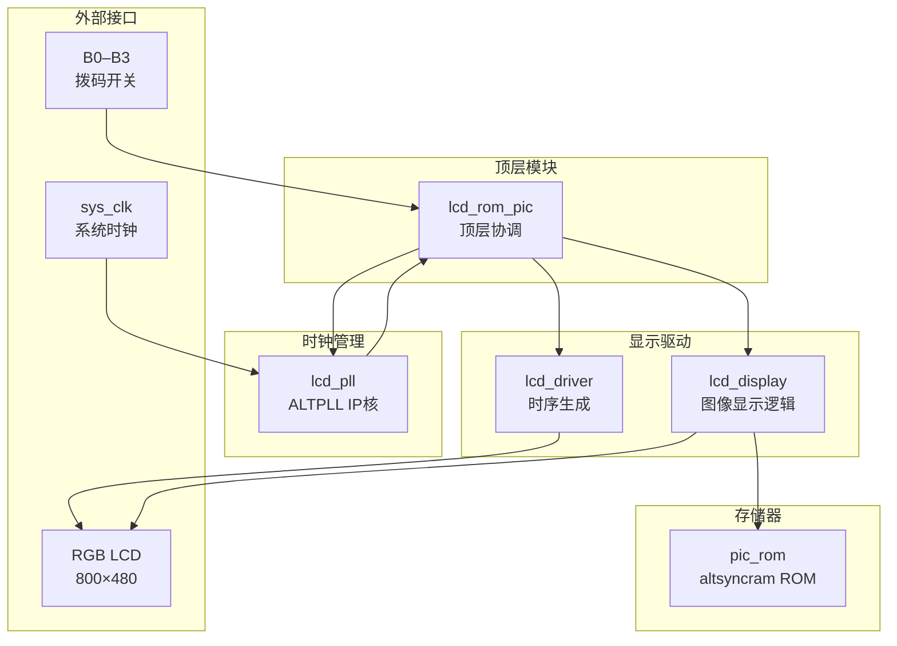
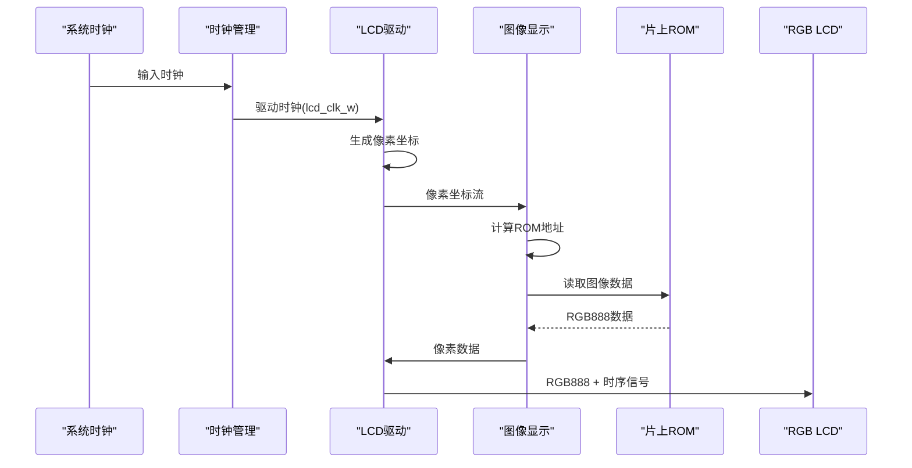
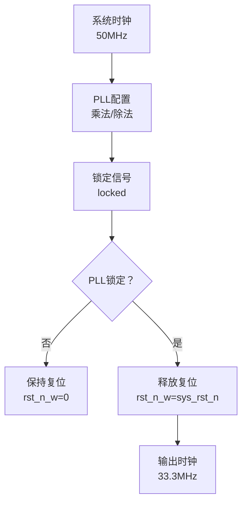
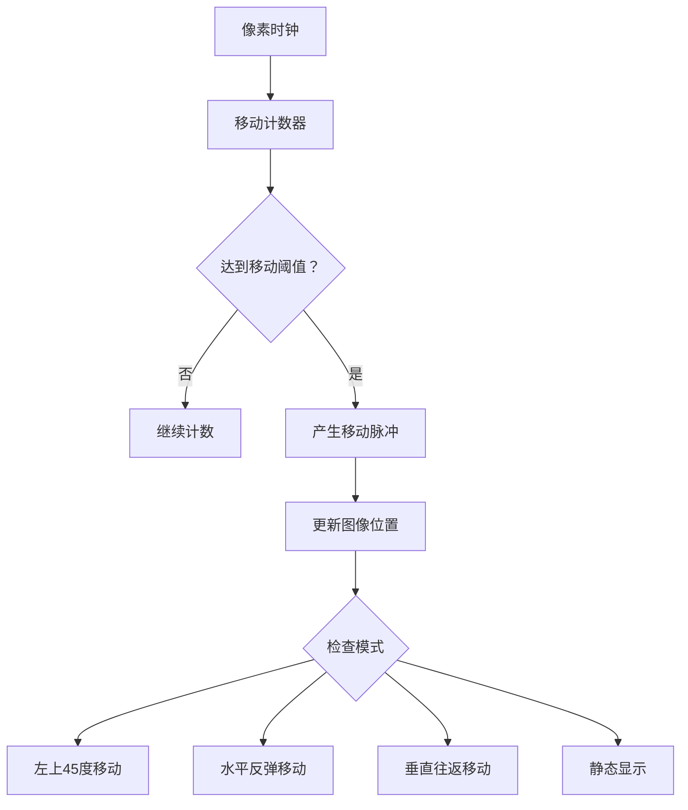
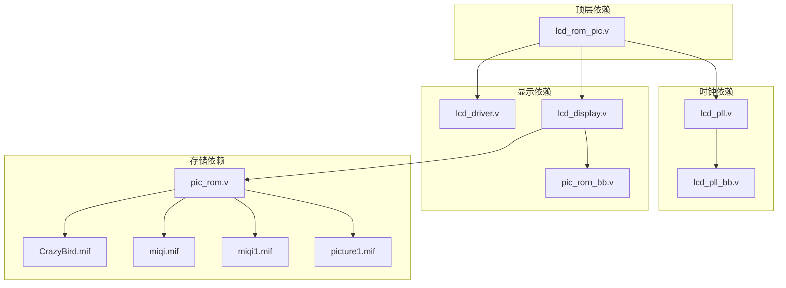

# 项目概述

<cite>
**本文档引用的文件**
- [lcd_rom_pic.v](file://lcd_rom_pic.v)
- [pic_rom.v](file://pic_rom.v)
- [lcd_display.v](file://lcd_display.v)
- [lcd_driver.v](file://lcd_driver.v)
- [lcd_pll.v](file://lcd_pll.v)
- [lcd_pll_bb.v](file://lcd_pll_bb.v)
- [pic_rom_bb.v](file://pic_rom_bb.v)
- [lcd_rom_pic.qsf](file://lcd_rom_pic.qsf)
- [CrazyBird.mif](file://CrazyBird.mif)
- [miqi.mif](file://miqi.mif)
- [miqi1.mif](file://miqi1.mif)
- [picture1.mif](file://picture1.mif)
- [CLAUDE.md](file://CLAUDE.md)
</cite>

## 目录
1. [简介](#简介)
2. [项目结构](#项目结构)
3. [核心组件](#核心组件)
4. [架构总览](#架构总览)
5. [详细组件分析](#详细组件分析)
6. [依赖关系分析](#依赖关系分析)
7. [性能考虑](#性能考虑)
8. [故障排除指南](#故障排除指南)
9. [结论](#结论)
10. [附录](#附录)

## 简介
本项目是一个基于Intel Cyclone IV E FPGA的800×480 RGB LCD显示器控制系统，核心目标是在RGB LCD屏幕上从片上ROM中读取并显示140×170像素的彩色图像，并通过四个拨码开关(B0–B3)控制四种不同的显示模式。系统采用RGB888色彩深度，支持静态显示、水平反弹移动、垂直往返移动以及左上45度边界穿透移动等模式。项目使用Quartus Prime 18.1 Lite作为开发工具链，ModelSim-Altera作为仿真工具，整体设计理念强调模块化、可扩展性和硬件加速。

## 项目结构
项目采用自顶向下的模块化设计，顶层实体lcd_rom_pic协调时钟管理、LCD驱动和图像显示逻辑。主要文件组织如下：
- 顶层模块：lcd_rom_pic.v
- 时钟管理：lcd_pll.v（ALTPLL IP核）
- LCD驱动：lcd_driver.v（生成时序和像素坐标）
- 图像显示：lcd_display.v（ROM读取、地址映射、运动控制）
- 片上ROM：pic_rom.v（altsyncram 1-port ROM IP核）
- 配置文件：lcd_rom_pic.qsf（引脚分配、工具链设置）
- 图像数据：CrazyBird.mif（主图像）、miqi.mif、miqi1.mif、picture1.mif（备用图像）
- 文档：CLAUDE.md（项目说明）

**图表来源**
- [lcd_rom_pic.v:1-59](file://lcd_rom_pic.v#L1-L59)
- [lcd_pll.v:39-162](file://lcd_pll.v#L39-L162)
- [lcd_driver.v:1-97](file://lcd_driver.v#L1-L97)
- [lcd_display.v:1-199](file://lcd_display.v#L1-L199)
- [pic_rom.v:39-102](file://pic_rom.v#L39-L102)

**章节来源**
- [lcd_rom_pic.v:1-59](file://lcd_rom_pic.v#L1-L59)
- [lcd_pll.v:39-162](file://lcd_pll.v#L39-L162)
- [lcd_driver.v:1-97](file://lcd_driver.v#L1-L97)
- [lcd_display.v:1-199](file://lcd_display.v#L1-L199)
- [pic_rom.v:39-102](file://pic_rom.v#L39-L102)

## 核心组件
本项目包含以下核心组件，每个组件都有明确的职责和接口定义：

### 1. 顶层协调模块
- 负责整合时钟、驱动和显示模块
- 提供RGB888输出接口
- 接收拨码开关输入进行模式选择

### 2. 时钟管理模块
- 使用ALTPLL IP核将系统时钟转换为LCD驱动时钟
- 提供锁定信号控制全局复位释放
- 输出稳定的33.3MHz像素时钟

### 3. LCD驱动模块
- 生成标准RGB LCD时序信号
- 生成像素坐标流(xpos, ypos)
- 控制数据使能和背光

### 4. 图像显示模块
- 从ROM读取图像数据
- 实现多种运动控制算法
- 支持四种拨码开关模式

### 5. 片上ROM模块
- altsyncram 1-port ROM IP核
- 支持32768×24位存储
- 从MIF文件初始化图像数据

**章节来源**
- [lcd_rom_pic.v:1-59](file://lcd_rom_pic.v#L1-L59)
- [lcd_pll.v:39-162](file://lcd_pll.v#L39-L162)
- [lcd_driver.v:1-97](file://lcd_driver.v#L1-L97)
- [lcd_display.v:1-199](file://lcd_display.v#L1-L199)
- [pic_rom.v:39-102](file://pic_rom.v#L39-L102)

## 架构总览
系统采用流水线式架构，数据流从时钟管理开始，经过驱动模块生成像素坐标，最终由显示模块完成图像渲染。整个系统的关键路径如下：

**图表来源**
- [lcd_pll.v:39-162](file://lcd_pll.v#L39-L162)
- [lcd_driver.v:1-97](file://lcd_driver.v#L1-L97)
- [lcd_display.v:1-199](file://lcd_display.v#L1-L199)
- [pic_rom.v:39-102](file://pic_rom.v#L39-L102)

## 详细组件分析

### 时钟管理系统
时钟管理模块使用ALTPLL IP核实现精确的频率转换，将50MHz输入时钟转换为33.3MHz输出时钟。PLL配置具有以下特点：
- 输入频率：50MHz
- 输出频率：33.3MHz
- 锁定信号：用于控制全局复位释放
- 时钟分频系数：乘法33299999，除法50000000

**图表来源**
- [lcd_pll.v:104-159](file://lcd_pll.v#L104-L159)
- [lcd_rom_pic.v:24-32](file://lcd_rom_pic.v#L24-L32)

**章节来源**
- [lcd_pll.v:39-162](file://lcd_pll.v#L39-L162)
- [lcd_pll_bb.v:1-321](file://lcd_pll_bb.v#L1-L321)

### LCD驱动模块
LCD驱动模块负责生成标准RGB LCD时序信号，包括：
- 行同步信号(HSYNC)
- 场同步信号(VSYNC)
- 数据使能信号(DE)
- 像素时钟(PCLK)
- 背光控制(LCD_BL)

驱动模块还生成精确的像素坐标流，为图像显示提供基础：
- 水平分辨率：800像素
- 垂直分辨率：480像素
- 同步脉冲宽度：行46像素，场23像素
- 前沿和后沿：行210像素，场22像素

**章节来源**
- [lcd_driver.v:1-97](file://lcd_driver.v#L1-L97)

### 图像显示模块
图像显示模块是系统的核心，负责实现复杂的运动控制算法：

#### 模式选择逻辑
四种拨码开关模式按优先级执行，使用casez语句实现：
- B3=1：左上45度移动，边界穿透
- B2=1：水平移动，遇边界反弹
- B1=1：垂直往返移动，幅度130像素
- B0=1：静态显示
- 默认：静态显示

#### 运动控制算法
系统使用定时器驱动实现60像素/秒的运动速度：
- 基于20位计数器的节拍生成
- 555,000个时钟周期产生一次移动脉冲
- 支持多方向运动和边界处理

**图表来源**
- [lcd_display.v:30-46](file://lcd_display.v#L30-L46)
- [lcd_display.v:52-123](file://lcd_display.v#L52-L123)

**章节来源**
- [lcd_display.v:1-199](file://lcd_display.v#L1-L199)

### 片上ROM模块
片上ROM模块使用altsyncram IP核实现高性能图像存储：
- 存储容量：32768×24位
- 地址总线：15位
- 数据总线：24位(RGB888)
- 初始化文件：CrazyBird.mif
- 存储类型：单端口只读存储器

ROM模块支持动态地址重置，确保图像位置变化时正确刷新显示。

**章节来源**
- [pic_rom.v:39-102](file://pic_rom.v#L39-L102)
- [pic_rom_bb.v:1-165](file://pic_rom_bb.v#L1-L165)

## 依赖关系分析

**图表来源**
- [lcd_rom_pic.v:26-58](file://lcd_rom_pic.v#L26-L58)
- [pic_rom.v:89-99](file://pic_rom.v#L89-L99)
- [CrazyBird.mif:4-5](file://CrazyBird.mif#L4-L5)

系统的主要依赖关系包括：
- 顶层模块依赖所有子模块
- 显示模块依赖ROM模块
- ROM模块依赖MIF初始化文件
- 时钟模块提供系统时钟源

**章节来源**
- [lcd_rom_pic.v:1-59](file://lcd_rom_pic.v#L1-L59)
- [pic_rom.v:89-99](file://pic_rom.v#L89-L99)

## 性能考虑
系统性能优化主要体现在以下几个方面：

### 1. 时钟域设计
- 使用专用像素时钟驱动显示逻辑
- 通过PLL锁定信号避免亚稳态问题
- 时钟分频比确保稳定的显示时序

### 2. 存储器访问优化
- ROM地址计算采用直接映射方式
- 支持地址重置以提高切换效率
- 24位数据总线提供高速数据传输

### 3. 流水线设计
- 像素坐标生成与图像渲染并行
- 地址计算与数据读取重叠
- 减少关键路径延迟

### 4. 资源利用
- Cyclone IV E系列FPGA资源充足
- ROM使用专用存储器块
- 时序约束合理

## 故障排除指南

### 常见问题诊断
1. **无显示输出**
   - 检查PLL锁定信号
   - 验证RGB LCD连接
   - 确认背光和复位信号

2. **图像显示异常**
   - 检查ROM初始化文件
   - 验证拨码开关配置
   - 确认像素时钟频率

3. **运动控制失效**
   - 检查运动计数器配置
   - 验证模式选择逻辑
   - 确认边界条件处理

### 调试建议
- 使用ModelSim-Altera进行功能仿真
- 检查关键信号波形
- 验证时序约束设置
- 分模块进行单元测试

**章节来源**
- [CLAUDE.md:9-16](file://CLAUDE.md#L9-L16)
- [lcd_pll.v:104-159](file://lcd_pll.v#L104-L159)

## 结论
本项目成功实现了基于Cyclone IV E FPGA的800×480 RGB LCD显示器控制系统，具备以下特点：
- 模块化设计，易于维护和扩展
- 支持多种运动模式，满足不同应用需求
- 使用IP核实现高性能存储和时钟管理
- 完善的工具链支持，便于开发和调试

项目为初学者提供了清晰的FPGA开发示例，为有经验的开发者提供了实用的技术参考。通过合理的架构设计和性能优化，系统能够稳定运行并满足实时显示需求。

## 附录

### 开发工具链
- **Quartus Prime 18.1 Lite**：主要开发环境
- **ModelSim-Altera**：仿真工具
- **ALTPLL IP核**：时钟管理
- **altsyncram IP核**：存储器

### 历史版本信息
项目包含两个主要版本：
- **lcd_rom_pic**：当前版本，使用RGB888 24位色彩
- **vga_rom_pic**：历史版本，使用RGB565 16位色彩
- 对应的.txt文件为早期设计快照

### 引脚分配
- RGB数据线分布在两个I/O银行
- 拨码开关连接到特定FPGA引脚
- 所有引脚分配在QSF文件中定义

**章节来源**
- [CLAUDE.md:70-73](file://CLAUDE.md#L70-L73)
- [lcd_rom_pic.qsf:53-91](file://lcd_rom_pic.qsf#L53-L91)